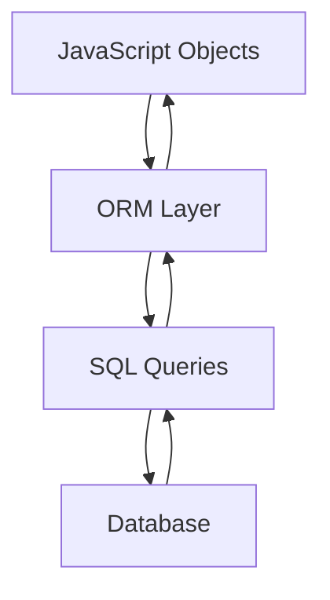
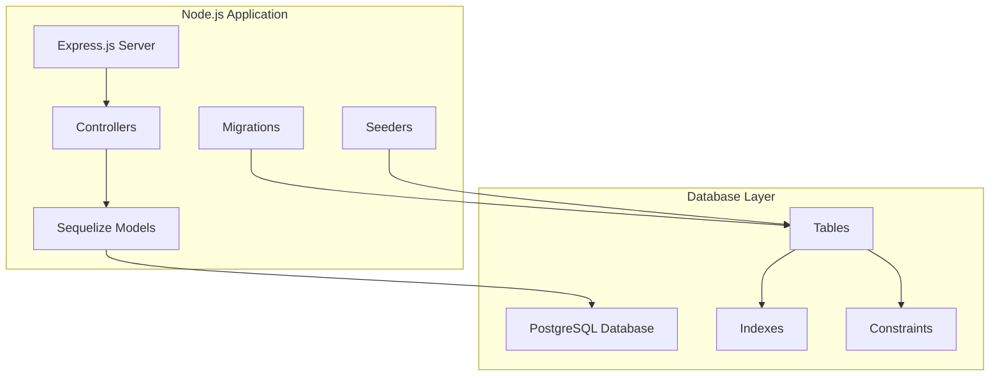
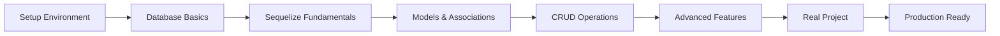

# Introduction to PostgreSQL, Sequelize & Node.js

## 🎯 What You'll Learn

By the end of this guide, you'll master:
- PostgreSQL database fundamentals
- Sequelize ORM for Node.js
- Building scalable web applications
- Best practices and real-world patterns

## 🗃️ What is PostgreSQL?

**PostgreSQL** (often called "Postgres") is a powerful, open-source relational database management system.

### Key Features
- **ACID Compliance**: Ensures data integrity
- **SQL Standard**: Follows SQL standards closely
- **Extensible**: Supports custom functions and data types
- **Scalable**: Handles large datasets efficiently
- **JSON Support**: Native JSON and JSONB data types

### PostgreSQL vs Other Databases

| Feature        | PostgreSQL | MySQL      | SQLite     | MongoDB   |
| -------------- | ---------- | ---------- | ---------- | --------- |
| Type           | Relational | Relational | Relational | NoSQL     |
| ACID           | ✅ Full     | ✅ Full     | ✅ Limited  | ❌ Limited |
| JSON Support   | ✅ Native   | ✅ Basic    | ❌ No       | ✅ Native  |
| Scalability    | ✅ High     | ✅ High     | ❌ Limited  | ✅ High    |
| Learning Curve | Medium     | Easy       | Easy       | Medium    |

## 🔗 What is Sequelize?

**Sequelize** is a popular Object-Relational Mapping (ORM) library for Node.js.

### What is an ORM?



**ORM Benefits:**
- Write JavaScript instead of SQL
- Database-agnostic code
- Built-in validations and relationships
- Migration and seeding support
- Protection against SQL injection

### Sequelize Features

```javascript
// Instead of writing SQL like this:
const sql = `
  SELECT users.name, posts.title 
  FROM users 
  JOIN posts ON users.id = posts.user_id 
  WHERE users.active = true
`;

// You write JavaScript like this:
const result = await User.findAll({
  where: { active: true },
  include: [{
    model: Post,
    attributes: ['title']
  }]
});
```

## 🏗️ Architecture Overview



## 🎯 Why This Technology Stack?

### Node.js Advantages
- **JavaScript Everywhere**: Same language for frontend and backend
- **NPM Ecosystem**: Huge package repository
- **Event-Driven**: Excellent for I/O operations
- **Fast Development**: Rapid prototyping and deployment

### PostgreSQL + Sequelize Benefits
- **Type Safety**: Strong typing and validation
- **Relationship Management**: Easy associations between tables
- **Migration System**: Version control for database schema
- **Performance**: Built-in query optimization
- **Community**: Large, active community support

## 📊 Real-World Use Cases

### E-commerce Platform
```javascript
// Models you'll learn to create
User -> Orders -> OrderItems -> Products
     -> Reviews -> Products
     -> ShoppingCart -> CartItems -> Products
```

### Social Media App
```javascript
// Complex relationships made simple
User -> Posts -> Comments -> Likes
     -> Followers/Following (Many-to-Many)
     -> Messages (Self-referencing)
```

### Blog Management System (Our Project)
```javascript
// What we'll build together
User -> Posts -> Comments
     -> Categories (Many-to-Many through PostCategories)
     -> Tags (Many-to-Many)
```

## 🛣️ Learning Roadmap



### Phase 1: Foundation (Days 1-3)
- [[02-Setup-Installation|Environment Setup]]
- [[03-Database-Basics|Database Concepts]]
- [[04-Sequelize-Introduction|Sequelize Basics]]

### Phase 2: Core Skills (Days 4-7)
- [[05-Models-Basics|Creating Models]]
- [[06-Associations|Table Relationships]]
- [[09-CRUD-Operations|Data Operations]]

### Phase 3: Advanced (Days 8-12)
- [[12-Validations|Data Validation]]
- [[14-Transactions|Data Integrity]]
- [[15-Indexes-Performance|Performance]]

### Phase 4: Production (Days 13-15)
- [[17-API-Development|API Development]]
- [[18-Testing|Testing]]
- [[19-Production-Deployment|Deployment]]

## 🎓 Prerequisites

### Required Knowledge
- **JavaScript Fundamentals**: Variables, functions, promises, async/await
- **Node.js Basics**: NPM, modules, basic server creation
- **Basic SQL**: Understanding of tables, rows, columns

### Nice to Have
- **Express.js**: Web framework knowledge
- **Git**: Version control
- **Terminal/Command Line**: Basic commands

## 🚀 Quick Start Preview

Here's a taste of what you'll be able to do:

```javascript
// Define a User model
const User = sequelize.define('User', {
  firstName: DataTypes.STRING,
  lastName: DataTypes.STRING,
  email: {
    type: DataTypes.STRING,
    unique: true,
    validate: { isEmail: true }
  }
});

// Create a user
const user = await User.create({
  firstName: 'John',
  lastName: 'Doe',
  email: 'john@example.com'
});

// Find all users with their posts
const usersWithPosts = await User.findAll({
  include: [{ model: Post }]
});
```

## 📚 What's Next?

Ready to dive in? Let's start with [[02-Setup-Installation|setting up your development environment]]!

---

## 🔗 Related Topics
- [[04-Sequelize-Introduction|Sequelize ORM Basics]]
- [[03-Database-Basics|Database Fundamentals]]
- [[20-Quick-Reference|Quick Reference Guide]]
