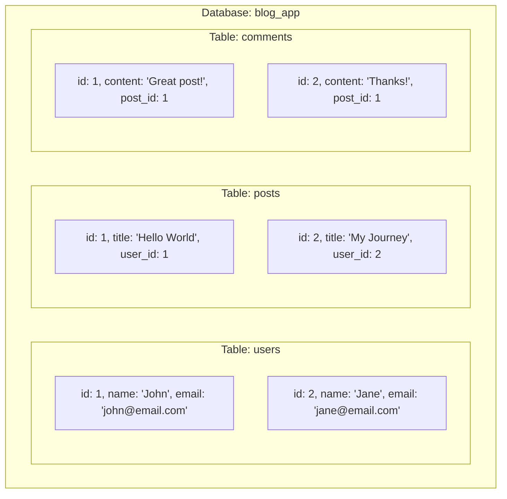
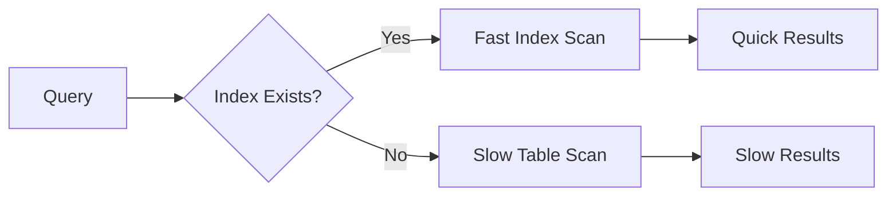
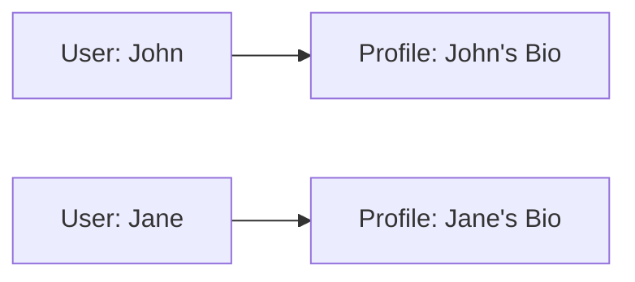
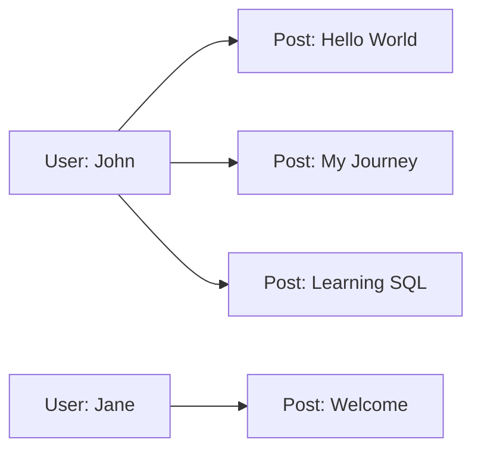
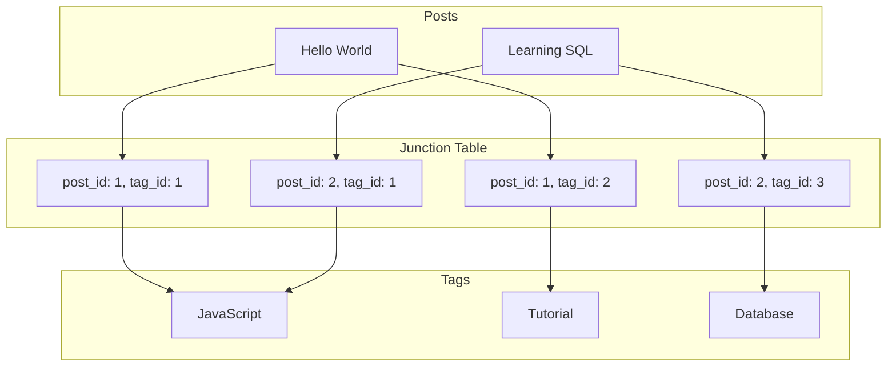

# Database Fundamentals

## 🎯 Understanding Databases

Before diving into Sequelize, let's build a solid foundation of database concepts that will make everything else easier to understand.

## 📊 What is a Database?

A **database** is an organized collection of structured information stored electronically. Think of it as a digital filing cabinet with multiple drawers (tables) containing organized folders (rows) with labeled documents (columns).



## 🏗️ Database Structure Hierarchy

```
Database
└── Schemas (PostgreSQL feature)
    └── Tables
        ├── Columns (Fields)
        ├── Rows (Records)
        ├── Indexes
        └── Constraints
```

### Real-World Analogy

| Database Concept | Real-World Equivalent |
|------------------|----------------------|
| Database | Office Building |
| Schema | Floor/Department |
| Table | Filing Cabinet |
| Column | Label on Folder |
| Row | Individual Document |
| Primary Key | Document ID Number |
| Foreign Key | Reference to Another Document |

## 📋 Tables: The Foundation

### What is a Table?

A table is a collection of related data organized in rows and columns.

```sql
-- Example: users table
CREATE TABLE users (
    id SERIAL PRIMARY KEY,
    first_name VARCHAR(50) NOT NULL,
    last_name VARCHAR(50) NOT NULL,
    email VARCHAR(100) UNIQUE NOT NULL,
    created_at TIMESTAMP DEFAULT CURRENT_TIMESTAMP,
    updated_at TIMESTAMP DEFAULT CURRENT_TIMESTAMP
);
```

### Anatomy of a Table

```
users table:
┌────┬────────────┬───────────┬─────────────────────┬─────────────────────┐
│ id │ first_name │ last_name │        email        │     created_at      │
├────┼────────────┼───────────┼─────────────────────┼─────────────────────┤
│  1 │ John       │ Doe       │ john@example.com    │ 2025-01-01 10:00:00 │
│  2 │ Jane       │ Smith     │ jane@example.com    │ 2025-01-01 11:00:00 │
│  3 │ Bob        │ Johnson   │ bob@example.com     │ 2025-01-01 12:00:00 │
└────┴────────────┴───────────┴─────────────────────┴─────────────────────┘

Components:
- Columns: id, first_name, last_name, email, created_at
- Rows: Each user record
- Cells: Individual data points
```

## 🔧 Data Types in PostgreSQL

Understanding data types is crucial for efficient database design.

### Numeric Types

| Type | Range | Use Case | Example |
|------|-------|----------|---------|
| `SMALLINT` | -32,768 to 32,767 | Small numbers | Age, quantity |
| `INTEGER` | -2B to 2B | Standard integers | IDs, counts |
| `BIGINT` | -9E18 to 9E18 | Large numbers | Big counters |
| `DECIMAL(p,s)` | Variable precision | Money, precise calculations | Price: 19.99 |
| `REAL` | 6 decimal digits | Scientific data | Temperature |
| `DOUBLE PRECISION` | 15 decimal digits | High precision | Coordinates |

```sql
-- Examples of numeric types
CREATE TABLE products (
    id SERIAL PRIMARY KEY,                    -- Auto-incrementing integer
    price DECIMAL(10,2),                     -- Price: 99999999.99
    quantity INTEGER,                        -- Whole numbers
    weight REAL,                            -- Floating point
    latitude DOUBLE PRECISION               -- High precision coordinates
);
```

### String Types

| Type | Description | Use Case | Example |
|------|-------------|----------|---------|
| `CHAR(n)` | Fixed length | Codes, IDs | Country code: 'US' |
| `VARCHAR(n)` | Variable length | Names, emails | 'John Doe' |
| `TEXT` | Unlimited length | Articles, descriptions | Blog post content |

```sql
-- Examples of string types
CREATE TABLE articles (
    id SERIAL PRIMARY KEY,
    title VARCHAR(200) NOT NULL,             -- Limited title length
    slug VARCHAR(200) UNIQUE,                -- URL-friendly version
    content TEXT,                           -- Unlimited article content
    status CHAR(1) DEFAULT 'D'              -- D=Draft, P=Published
);
```

### Date and Time Types

| Type | Description | Example |
|------|-------------|---------|
| `DATE` | Date only | '2025-01-06' |
| `TIME` | Time only | '14:30:00' |
| `TIMESTAMP` | Date and time | '2025-01-06 14:30:00' |
| `TIMESTAMPTZ` | With timezone | '2025-01-06 14:30:00+00' |
| `INTERVAL` | Time interval | '2 days 3 hours' |

```sql
-- Examples of date/time types
CREATE TABLE events (
    id SERIAL PRIMARY KEY,
    title VARCHAR(100),
    event_date DATE,                        -- Just the date
    start_time TIME,                        -- Just the time
    created_at TIMESTAMP DEFAULT NOW(),     -- Creation timestamp
    published_at TIMESTAMPTZ,              -- With timezone info
    duration INTERVAL                       -- How long the event lasts
);
```

### Boolean and Special Types

```sql
-- Boolean and JSON examples
CREATE TABLE user_preferences (
    id SERIAL PRIMARY KEY,
    user_id INTEGER,
    email_notifications BOOLEAN DEFAULT true,
    settings JSONB,                         -- Flexible JSON data
    tags TEXT[],                           -- Array of text values
    created_at TIMESTAMP DEFAULT NOW()
);

-- Insert example
INSERT INTO user_preferences (user_id, settings, tags) VALUES 
(1, '{"theme": "dark", "language": "en"}', ARRAY['developer', 'nodejs']);
```

## 🔑 Primary Keys and Indexes

### Primary Keys

A **primary key** uniquely identifies each row in a table.

```sql
-- Different ways to define primary keys
CREATE TABLE users (
    -- Method 1: SERIAL (auto-incrementing)
    id SERIAL PRIMARY KEY,
    email VARCHAR(100) UNIQUE
);

-- Method 2: UUID (universally unique)
CREATE TABLE sessions (
    id UUID PRIMARY KEY DEFAULT gen_random_uuid(),
    user_id INTEGER,
    expires_at TIMESTAMP
);

-- Method 3: Composite primary key
CREATE TABLE user_roles (
    user_id INTEGER,
    role_id INTEGER,
    assigned_at TIMESTAMP DEFAULT NOW(),
    PRIMARY KEY (user_id, role_id)
);
```

### Indexes

Indexes speed up data retrieval but slow down writes.

```sql
-- Create indexes for faster queries
CREATE INDEX idx_users_email ON users(email);
CREATE INDEX idx_posts_user_id ON posts(user_id);
CREATE INDEX idx_posts_created_at ON posts(created_at);

-- Composite index for multiple columns
CREATE INDEX idx_posts_user_status ON posts(user_id, status);

-- Partial index (with condition)
CREATE INDEX idx_active_users ON users(email) WHERE active = true;
```

### Index Strategy



## 🔗 Relationships Between Tables

### Types of Relationships

#### 1. One-to-One (1:1)
One record in Table A relates to exactly one record in Table B.

```sql
-- User has one profile
CREATE TABLE users (
    id SERIAL PRIMARY KEY,
    email VARCHAR(100) UNIQUE
);

CREATE TABLE user_profiles (
    id SERIAL PRIMARY KEY,
    user_id INTEGER UNIQUE REFERENCES users(id),  -- One-to-one
    bio TEXT,
    avatar_url VARCHAR(255)
);
```



#### 2. One-to-Many (1:N)
One record in Table A can relate to many records in Table B.

```sql
-- User has many posts
CREATE TABLE users (
    id SERIAL PRIMARY KEY,
    name VARCHAR(100)
);

CREATE TABLE posts (
    id SERIAL PRIMARY KEY,
    user_id INTEGER REFERENCES users(id),  -- Foreign key
    title VARCHAR(200),
    content TEXT
);
```



#### 3. Many-to-Many (M:N)
Many records in Table A can relate to many records in Table B.

```sql
-- Posts have many tags, tags belong to many posts
CREATE TABLE posts (
    id SERIAL PRIMARY KEY,
    title VARCHAR(200)
);

CREATE TABLE tags (
    id SERIAL PRIMARY KEY,
    name VARCHAR(50) UNIQUE
);

-- Junction table (bridge table)
CREATE TABLE post_tags (
    id SERIAL PRIMARY KEY,
    post_id INTEGER REFERENCES posts(id) ON DELETE CASCADE,
    tag_id INTEGER REFERENCES tags(id) ON DELETE CASCADE,
    UNIQUE(post_id, tag_id)  -- Prevent duplicates
);
```



## 🛡️ Constraints: Data Integrity

Constraints ensure data quality and consistency.

### Types of Constraints

```sql
CREATE TABLE users (
    -- PRIMARY KEY constraint
    id SERIAL PRIMARY KEY,
    
    -- NOT NULL constraint
    email VARCHAR(100) NOT NULL,
    
    -- UNIQUE constraint
    username VARCHAR(50) UNIQUE,
    
    -- CHECK constraint
    age INTEGER CHECK (age >= 18 AND age <= 120),
    
    -- DEFAULT constraint
    created_at TIMESTAMP DEFAULT CURRENT_TIMESTAMP,
    
    -- FOREIGN KEY constraint
    country_id INTEGER REFERENCES countries(id)
);

-- Add constraints after table creation
ALTER TABLE users ADD CONSTRAINT valid_email 
    CHECK (email ~* '^[A-Za-z0-9._%-]+@[A-Za-z0-9.-]+[.][A-Za-z]+$');
```

### Constraint Benefits

| Constraint | Purpose | Example |
|------------|---------|---------|
| PRIMARY KEY | Uniquely identify rows | User ID |
| FOREIGN KEY | Maintain referential integrity | Post belongs to User |
| UNIQUE | Prevent duplicates | Email addresses |
| NOT NULL | Require values | Required fields |
| CHECK | Validate data | Age must be positive |
| DEFAULT | Provide default values | Creation timestamp |

## 📈 Normalization: Organizing Data

Normalization reduces data redundancy and improves integrity.

### Before Normalization (Problems)

```
orders table:
┌────┬─────────────┬──────────────┬─────────────┬─────────────┐
│ id │ customer    │ customer     │ product     │ product     │
│    │ _name       │ _email       │ _name       │ _price      │
├────┼─────────────┼──────────────┼─────────────┼─────────────┤
│ 1  │ John Doe    │ john@e.com   │ Laptop      │ 999.99      │
│ 2  │ John Doe    │ john@e.com   │ Mouse       │ 29.99       │
│ 3  │ Jane Smith  │ jane@e.com   │ Laptop      │ 999.99      │
└────┴─────────────┴──────────────┴─────────────┴─────────────┘
```

**Problems:**
- Data duplication (John Doe's info repeated)
- Update anomalies (change email in multiple places)
- Storage waste

### After Normalization (Solution)

```sql
-- Customers table
CREATE TABLE customers (
    id SERIAL PRIMARY KEY,
    name VARCHAR(100),
    email VARCHAR(100) UNIQUE
);

-- Products table
CREATE TABLE products (
    id SERIAL PRIMARY KEY,
    name VARCHAR(100),
    price DECIMAL(10,2)
);

-- Orders table (references other tables)
CREATE TABLE orders (
    id SERIAL PRIMARY KEY,
    customer_id INTEGER REFERENCES customers(id),
    product_id INTEGER REFERENCES products(id),
    quantity INTEGER DEFAULT 1,
    order_date TIMESTAMP DEFAULT NOW()
);
```

```
customers:                products:               orders:
┌────┬───────────┐        ┌────┬─────────┐        ┌────┬─────────────┬────────────┐
│ id │ name      │        │ id │ name    │        │ id │ customer_id │ product_id │
├────┼───────────┤        ├────┼─────────┤        ├────┼─────────────┼────────────┤
│ 1  │ John Doe  │        │ 1  │ Laptop  │        │ 1  │ 1           │ 1          │
│ 2  │ Jane Smith│        │ 2  │ Mouse   │        │ 2  │ 1           │ 2          │
└────┴───────────┘        └────┴─────────┘        │ 3  │ 2           │ 1          │
                                                   └────┴─────────────┴────────────┘
```

## 🔍 Basic SQL Operations

### CREATE: Making Tables

```sql
-- Create a comprehensive users table
CREATE TABLE users (
    id SERIAL PRIMARY KEY,
    username VARCHAR(50) UNIQUE NOT NULL,
    email VARCHAR(100) UNIQUE NOT NULL,
    password_hash VARCHAR(255) NOT NULL,
    first_name VARCHAR(50),
    last_name VARCHAR(50),
    is_active BOOLEAN DEFAULT true,
    email_verified BOOLEAN DEFAULT false,
    created_at TIMESTAMP DEFAULT CURRENT_TIMESTAMP,
    updated_at TIMESTAMP DEFAULT CURRENT_TIMESTAMP
);
```

### INSERT: Adding Data

```sql
-- Insert single record
INSERT INTO users (username, email, password_hash, first_name, last_name) 
VALUES ('johndoe', 'john@example.com', 'hashed_password', 'John', 'Doe');

-- Insert multiple records
INSERT INTO users (username, email, password_hash, first_name, last_name) VALUES 
('janedoe', 'jane@example.com', 'hashed_password', 'Jane', 'Doe'),
('bobsmith', 'bob@example.com', 'hashed_password', 'Bob', 'Smith'),
('alicejones', 'alice@example.com', 'hashed_password', 'Alice', 'Jones');
```

### SELECT: Retrieving Data

```sql
-- Basic select
SELECT * FROM users;

-- Select specific columns
SELECT username, email, created_at FROM users;

-- With conditions
SELECT * FROM users WHERE is_active = true;

-- Sorting
SELECT * FROM users ORDER BY created_at DESC;

-- Limiting results
SELECT * FROM users ORDER BY created_at DESC LIMIT 10;

-- Counting
SELECT COUNT(*) as total_users FROM users WHERE is_active = true;
```

### UPDATE: Modifying Data

```sql
-- Update single field
UPDATE users SET email_verified = true WHERE id = 1;

-- Update multiple fields
UPDATE users 
SET first_name = 'Jonathan', 
    updated_at = CURRENT_TIMESTAMP 
WHERE username = 'johndoe';

-- Conditional update
UPDATE users 
SET is_active = false 
WHERE created_at < '2024-01-01' AND email_verified = false;
```

### DELETE: Removing Data

```sql
-- Delete specific record
DELETE FROM users WHERE id = 1;

-- Delete with conditions
DELETE FROM users WHERE is_active = false AND email_verified = false;

-- Be careful! This deletes everything:
-- DELETE FROM users;  -- DON'T DO THIS without WHERE clause
```

## 🎯 PostgreSQL Specific Features

### 1. Arrays

```sql
-- Using arrays
CREATE TABLE posts (
    id SERIAL PRIMARY KEY,
    title VARCHAR(200),
    tags TEXT[],  -- Array of strings
    view_counts INTEGER[]  -- Array of numbers
);

-- Insert with arrays
INSERT INTO posts (title, tags, view_counts) VALUES 
('Hello World', ARRAY['intro', 'programming'], ARRAY[100, 150, 200]);

-- Query arrays
SELECT * FROM posts WHERE 'programming' = ANY(tags);
SELECT * FROM posts WHERE tags @> ARRAY['intro'];  -- Contains
```

### 2. JSON/JSONB

```sql
-- JSON data storage
CREATE TABLE user_settings (
    id SERIAL PRIMARY KEY,
    user_id INTEGER,
    preferences JSONB  -- Binary JSON (faster)
);

-- Insert JSON
INSERT INTO user_settings (user_id, preferences) VALUES 
(1, '{"theme": "dark", "notifications": {"email": true, "push": false}}');

-- Query JSON
SELECT * FROM user_settings 
WHERE preferences->>'theme' = 'dark';

SELECT * FROM user_settings 
WHERE preferences->'notifications'->>'email' = 'true';
```

### 3. Full-Text Search

```sql
-- Add text search column
ALTER TABLE posts ADD COLUMN search_vector tsvector;

-- Update search vector
UPDATE posts SET search_vector = to_tsvector('english', title || ' ' || content);

-- Search
SELECT * FROM posts 
WHERE search_vector @@ to_tsquery('english', 'programming & tutorial');
```

## 📊 Query Performance Tips

### 1. Use EXPLAIN to Analyze Queries

```sql
-- See query execution plan
EXPLAIN ANALYZE SELECT * FROM users WHERE email = 'john@example.com';

-- Output shows:
-- - Seq Scan vs Index Scan
-- - Cost estimates
-- - Actual execution time
```

### 2. Index Best Practices

```sql
-- Good: Index on frequently queried columns
CREATE INDEX idx_users_email ON users(email);
CREATE INDEX idx_posts_published_at ON posts(published_at);

-- Good: Composite index for multi-column queries
CREATE INDEX idx_posts_user_status ON posts(user_id, status);

-- Avoid: Too many indexes (slow writes)
-- Avoid: Indexes on small tables
-- Avoid: Indexes on frequently updated columns
```

### 3. Query Optimization

```sql
-- Inefficient: Using functions in WHERE clause
SELECT * FROM users WHERE UPPER(email) = 'JOHN@EXAMPLE.COM';

-- Better: Use proper indexing and comparison
SELECT * FROM users WHERE email = 'john@example.com';

-- Inefficient: SELECT *
SELECT * FROM users JOIN posts ON users.id = posts.user_id;

-- Better: Select only needed columns
SELECT users.name, posts.title 
FROM users JOIN posts ON users.id = posts.user_id;
```

## 🎓 Practice Exercises

### Exercise 1: Design a Blog Database

Create tables for a blog system with these requirements:
- Users can write multiple posts
- Posts can have multiple categories
- Posts can have multiple comments
- Users can like posts and comments

<details>
<summary>Solution</summary>

```sql
-- Users table
CREATE TABLE users (
    id SERIAL PRIMARY KEY,
    username VARCHAR(50) UNIQUE NOT NULL,
    email VARCHAR(100) UNIQUE NOT NULL,
    password_hash VARCHAR(255) NOT NULL,
    created_at TIMESTAMP DEFAULT CURRENT_TIMESTAMP
);

-- Categories table
CREATE TABLE categories (
    id SERIAL PRIMARY KEY,
    name VARCHAR(50) UNIQUE NOT NULL,
    slug VARCHAR(50) UNIQUE NOT NULL
);

-- Posts table
CREATE TABLE posts (
    id SERIAL PRIMARY KEY,
    user_id INTEGER REFERENCES users(id),
    title VARCHAR(200) NOT NULL,
    content TEXT,
    published_at TIMESTAMP,
    created_at TIMESTAMP DEFAULT CURRENT_TIMESTAMP,
    updated_at TIMESTAMP DEFAULT CURRENT_TIMESTAMP
);

-- Post categories (many-to-many)
CREATE TABLE post_categories (
    post_id INTEGER REFERENCES posts(id) ON DELETE CASCADE,
    category_id INTEGER REFERENCES categories(id) ON DELETE CASCADE,
    PRIMARY KEY (post_id, category_id)
);

-- Comments table
CREATE TABLE comments (
    id SERIAL PRIMARY KEY,
    post_id INTEGER REFERENCES posts(id) ON DELETE CASCADE,
    user_id INTEGER REFERENCES users(id),
    content TEXT NOT NULL,
    created_at TIMESTAMP DEFAULT CURRENT_TIMESTAMP
);

-- Likes table
CREATE TABLE likes (
    id SERIAL PRIMARY KEY,
    user_id INTEGER REFERENCES users(id),
    post_id INTEGER REFERENCES posts(id),
    comment_id INTEGER REFERENCES comments(id),
    created_at TIMESTAMP DEFAULT CURRENT_TIMESTAMP,
    CHECK ((post_id IS NOT NULL) != (comment_id IS NOT NULL)) -- XOR: either post or comment
);
```
</details>

## 🎯 Key Takeaways

1. **Tables**: Store related data in rows and columns
2. **Data Types**: Choose appropriate types for efficiency
3. **Primary Keys**: Uniquely identify each record
4. **Foreign Keys**: Link tables together
5. **Constraints**: Ensure data quality
6. **Indexes**: Speed up queries but slow writes
7. **Normalization**: Reduce redundancy
8. **Relationships**: One-to-One, One-to-Many, Many-to-Many

## 🚀 What's Next?

Now that you understand database fundamentals, let's explore how [[04-Sequelize-Introduction|Sequelize ORM]] makes working with PostgreSQL easier and more intuitive!

---

## 🔗 Related Topics
- [[04-Sequelize-Introduction|Sequelize ORM Basics]]
- [[05-Models-Basics|Models & Data Types]]
- [[15-Indexes-Performance|Performance Optimization]]
