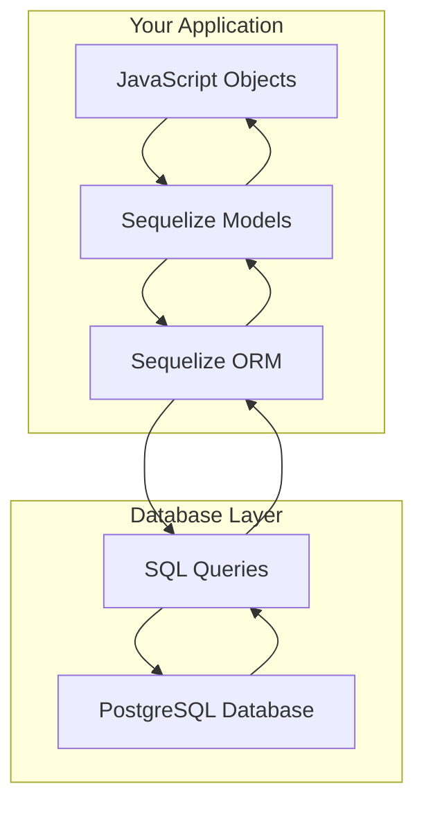
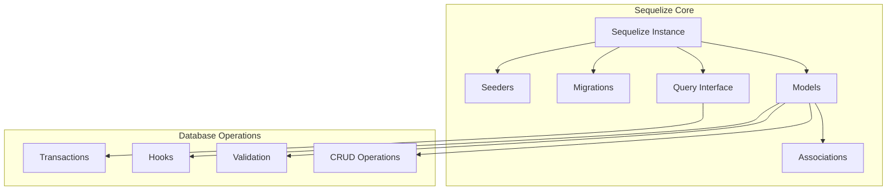

# Sequelize ORM Introduction

## 🎯 What is Sequelize?

**Sequelize** is a promise-based Node.js ORM (Object-Relational Mapping) library that provides an abstraction layer between JavaScript objects and SQL databases.



## 🤔 Why Use an ORM?

### Without ORM (Raw SQL)
```javascript
// Complex, error-prone, database-specific
const query = `
    SELECT u.name, p.title, p.created_at 
    FROM users u 
    JOIN posts p ON u.id = p.user_id 
    WHERE u.active = $1 
    ORDER BY p.created_at DESC 
    LIMIT $2
`;
const result = await client.query(query, [true, 10]);
const users = result.rows.map(row => ({
    name: row.name,
    title: row.title,
    createdAt: new Date(row.created_at)
}));
```

### With Sequelize ORM
```javascript
// Clean, intuitive, database-agnostic
const users = await User.findAll({
    where: { active: true },
    include: [{
        model: Post,
        attributes: ['title', 'createdAt']
    }],
    order: [['Post', 'createdAt', 'DESC']],
    limit: 10
});
```

## 🏗️ Sequelize Architecture

### Core Components



### Component Overview

| Component | Purpose | Example |
|-----------|---------|---------|
| **Sequelize Instance** | Database connection | `new Sequelize()` |
| **Models** | Table representation | `User`, `Post` models |
| **Associations** | Table relationships | `User.hasMany(Post)` |
| **Migrations** | Schema versioning | Create/alter tables |
| **Seeders** | Sample data | Initial data population |
| **Hooks** | Lifecycle events | Before/after operations |

## 🚀 Setting Up Sequelize

### 1. Basic Sequelize Instance

```javascript
// models/index.js
const { Sequelize } = require('sequelize');
require('dotenv').config();

// Create Sequelize instance
const sequelize = new Sequelize({
    database: process.env.DB_NAME,
    username: process.env.DB_USER,
    password: process.env.DB_PASSWORD,
    host: process.env.DB_HOST,
    port: process.env.DB_PORT,
    dialect: 'postgres',
    
    // Connection pool settings
    pool: {
        max: 5,        // Maximum connections
        min: 0,        // Minimum connections
        acquire: 30000, // Maximum time to get connection
        idle: 10000    // Maximum idle time
    },
    
    // Logging
    logging: console.log, // Set to false in production
    
    // Timezone
    timezone: '+00:00',
    
    // Define global model options
    define: {
        // Automatically add createdAt and updatedAt
        timestamps: true,
        
        // Use snake_case for database columns
        underscored: true,
        
        // Prevent Sequelize from pluralizing table names
        freezeTableName: false,
        
        // Delete records instead of setting deletedAt
        paranoid: false
    }
});

module.exports = sequelize;
```

### 2. Testing the Connection

```javascript
// utils/database.js
const sequelize = require('../models/index');

const testConnection = async () => {
    try {
        await sequelize.authenticate();
        console.log('✅ Database connection established successfully.');
        
        // Test a simple query
        const [results, metadata] = await sequelize.query('SELECT NOW() as current_time');
        console.log('🕒 Database time:', results[0].current_time);
        
    } catch (error) {
        console.error('❌ Unable to connect to database:', error.message);
        process.exit(1);
    }
};

module.exports = { testConnection };
```

### 3. Environment-Specific Configuration

```javascript
// config/database.js
require('dotenv').config();

const config = {
    development: {
        username: process.env.DB_USER,
        password: process.env.DB_PASSWORD,
        database: process.env.DB_NAME,
        host: process.env.DB_HOST,
        port: process.env.DB_PORT,
        dialect: 'postgres',
        logging: console.log,
        pool: {
            max: 5,
            min: 0,
            acquire: 30000,
            idle: 10000
        }
    },
    
    test: {
        username: process.env.DB_USER,
        password: process.env.DB_PASSWORD,
        database: process.env.TEST_DB_NAME,
        host: process.env.DB_HOST,
        port: process.env.DB_PORT,
        dialect: 'postgres',
        logging: false, // Disable logging in tests
        pool: {
            max: 5,
            min: 0,
            acquire: 30000,
            idle: 10000
        }
    },
    
    production: {
        use_env_variable: 'DATABASE_URL', // For Heroku-style deployments
        dialect: 'postgres',
        logging: false,
        pool: {
            max: 20,
            min: 5,
            acquire: 30000,
            idle: 10000
        },
        dialectOptions: {
            ssl: {
                require: true,
                rejectUnauthorized: false
            }
        }
    }
};

module.exports = config;
```

## 📊 First Model: Understanding the Basics

### 1. Creating Your First Model

```javascript
// models/User.js
const { DataTypes } = require('sequelize');
const sequelize = require('./index');

const User = sequelize.define('User', {
    // Attributes definition
    id: {
        type: DataTypes.INTEGER,
        primaryKey: true,
        autoIncrement: true
    },
    
    firstName: {
        type: DataTypes.STRING(50),
        allowNull: false,
        field: 'first_name' // Database column name
    },
    
    lastName: {
        type: DataTypes.STRING(50),
        allowNull: false,
        field: 'last_name'
    },
    
    email: {
        type: DataTypes.STRING(100),
        allowNull: false,
        unique: true,
        validate: {
            isEmail: true
        }
    },
    
    passwordHash: {
        type: DataTypes.STRING(255),
        allowNull: false,
        field: 'password_hash'
    },
    
    isActive: {
        type: DataTypes.BOOLEAN,
        defaultValue: true,
        field: 'is_active'
    },
    
    lastLoginAt: {
        type: DataTypes.DATE,
        allowNull: true,
        field: 'last_login_at'
    }
}, {
    // Model options
    tableName: 'users',
    timestamps: true, // Adds createdAt and updatedAt
    underscored: true, // Use snake_case in database
    
    // Indexes
    indexes: [
        {
            unique: true,
            fields: ['email']
        },
        {
            fields: ['is_active']
        }
    ]
});

module.exports = User;
```

### 2. Model Registration System

```javascript
// models/index.js
const { Sequelize } = require('sequelize');
const path = require('path');
const fs = require('fs');

// Create Sequelize instance
const sequelize = new Sequelize(/* config */);

// Container for all models
const db = {};

// Automatically load all model files
const modelFiles = fs.readdirSync(__dirname)
    .filter(file => 
        file.indexOf('.') !== 0 && 
        file !== 'index.js' && 
        file.slice(-3) === '.js'
    );

// Import all models
modelFiles.forEach(file => {
    const model = require(path.join(__dirname, file));
    db[model.name] = model;
});

// Set up associations
Object.keys(db).forEach(modelName => {
    if (db[modelName].associate) {
        db[modelName].associate(db);
    }
});

// Add sequelize instance and Sequelize constructor
db.sequelize = sequelize;
db.Sequelize = Sequelize;

module.exports = db;
```

## 🔧 Data Types Deep Dive

### Sequelize vs PostgreSQL Types

| Sequelize Type | PostgreSQL Type | JavaScript Type | Example |
|----------------|-----------------|-----------------|---------|
| `DataTypes.STRING` | `VARCHAR` | `string` | 'Hello World' |
| `DataTypes.TEXT` | `TEXT` | `string` | 'Long content...' |
| `DataTypes.INTEGER` | `INTEGER` | `number` | 42 |
| `DataTypes.BIGINT` | `BIGINT` | `string` | '9223372036854775807' |
| `DataTypes.FLOAT` | `REAL` | `number` | 3.14159 |
| `DataTypes.DOUBLE` | `DOUBLE PRECISION` | `number` | 3.141592653589793 |
| `DataTypes.DECIMAL` | `DECIMAL` | `string` | '19.99' |
| `DataTypes.DATE` | `TIMESTAMP` | `Date` | new Date() |
| `DataTypes.BOOLEAN` | `BOOLEAN` | `boolean` | true/false |
| `DataTypes.JSON` | `JSON` | `object` | {key: 'value'} |
| `DataTypes.JSONB` | `JSONB` | `object` | {key: 'value'} |
| `DataTypes.ARRAY(DataTypes.STRING)` | `TEXT[]` | `Array` | ['a', 'b', 'c'] |
| `DataTypes.UUID` | `UUID` | `string` | 'f47ac10b-58cc-4372...' |

### Advanced Data Type Examples

```javascript
// models/Product.js
const Product = sequelize.define('Product', {
    // Basic types
    name: DataTypes.STRING(100),
    description: DataTypes.TEXT,
    
    // Numeric types
    price: DataTypes.DECIMAL(10, 2), // 99999999.99
    quantity: DataTypes.INTEGER,
    weight: DataTypes.FLOAT,
    
    // Date types
    manufacturedAt: DataTypes.DATEONLY, // Date without time
    expiresAt: DataTypes.DATE, // Full timestamp
    
    // Boolean
    isAvailable: DataTypes.BOOLEAN,
    
    // JSON data
    specifications: DataTypes.JSONB, // Binary JSON (faster)
    metadata: DataTypes.JSON, // Regular JSON
    
    // Arrays
    tags: DataTypes.ARRAY(DataTypes.STRING),
    sizes: DataTypes.ARRAY(DataTypes.INTEGER),
    
    // UUID
    publicId: {
        type: DataTypes.UUID,
        defaultValue: DataTypes.UUIDV4
    },
    
    // Enum-like behavior
    status: {
        type: DataTypes.ENUM('draft', 'published', 'archived'),
        defaultValue: 'draft'
    },
    
    // Virtual fields (not stored in database)
    fullTitle: {
        type: DataTypes.VIRTUAL,
        get() {
            return `${this.name} - ${this.status}`;
        }
    }
});
```

## 🎯 Basic CRUD Operations

### Create (INSERT)

```javascript
// Create single record
const user = await User.create({
    firstName: 'John',
    lastName: 'Doe',
    email: 'john@example.com',
    passwordHash: 'hashed_password'
});

console.log('Created user:', user.toJSON());

// Create multiple records
const users = await User.bulkCreate([
    {
        firstName: 'Jane',
        lastName: 'Smith',
        email: 'jane@example.com',
        passwordHash: 'hashed_password'
    },
    {
        firstName: 'Bob',
        lastName: 'Johnson',
        email: 'bob@example.com',
        passwordHash: 'hashed_password'
    }
]);

// Create with validation
try {
    const user = await User.create({
        firstName: 'Invalid',
        lastName: 'User',
        email: 'invalid-email', // Will fail validation
        passwordHash: 'password'
    });
} catch (error) {
    console.error('Validation error:', error.errors);
}
```

### Read (SELECT)

```javascript
// Find all users
const allUsers = await User.findAll();

// Find with conditions
const activeUsers = await User.findAll({
    where: {
        isActive: true
    }
});

// Find by primary key
const user = await User.findByPk(1);

// Find one record
const user = await User.findOne({
    where: {
        email: 'john@example.com'
    }
});

// Find or create
const [user, created] = await User.findOrCreate({
    where: { email: 'new@example.com' },
    defaults: {
        firstName: 'New',
        lastName: 'User',
        passwordHash: 'password'
    }
});

console.log('User:', user.toJSON());
console.log('Was created:', created);

// Count records
const userCount = await User.count({
    where: {
        isActive: true
    }
});

// Find with pagination
const users = await User.findAndCountAll({
    limit: 10,
    offset: 20,
    order: [['createdAt', 'DESC']]
});

console.log('Total users:', users.count);
console.log('Current page users:', users.rows.length);
```

### Update (UPDATE)

```javascript
// Update single record
const user = await User.findByPk(1);
user.lastName = 'Updated';
user.lastLoginAt = new Date();
await user.save();

// Update with instance method
await user.update({
    lastName: 'New Last Name',
    lastLoginAt: new Date()
});

// Bulk update
const [affectedRows] = await User.update(
    { isActive: false },
    {
        where: {
            lastLoginAt: {
                [Op.lt]: new Date(Date.now() - 30 * 24 * 60 * 60 * 1000) // 30 days ago
            }
        }
    }
);

console.log('Updated rows:', affectedRows);

// Update or create
const [user, created] = await User.upsert({
    id: 1,
    firstName: 'John',
    lastName: 'Updated',
    email: 'john@example.com',
    passwordHash: 'new_hash'
});
```

### Delete (DELETE)

```javascript
// Delete single record
const user = await User.findByPk(1);
await user.destroy();

// Bulk delete
const deletedRows = await User.destroy({
    where: {
        isActive: false,
        createdAt: {
            [Op.lt]: new Date(Date.now() - 365 * 24 * 60 * 60 * 1000) // 1 year ago
        }
    }
});

console.log('Deleted rows:', deletedRows);

// Soft delete (if paranoid: true in model)
const user = await User.findByPk(1);
await user.destroy(); // Sets deletedAt timestamp

// Restore soft deleted
await user.restore();

// Force delete (permanent)
await user.destroy({ force: true });
```

## 🔍 Query Operators

Sequelize provides powerful operators for complex queries:

```javascript
const { Op } = require('sequelize');

// Comparison operators
const users = await User.findAll({
    where: {
        // Equal
        isActive: true,
        
        // Not equal
        status: {
            [Op.ne]: 'banned'
        },
        
        // Greater than
        createdAt: {
            [Op.gt]: new Date('2024-01-01')
        },
        
        // Greater than or equal
        age: {
            [Op.gte]: 18
        },
        
        // Less than
        lastLoginAt: {
            [Op.lt]: new Date()
        },
        
        // Between
        createdAt: {
            [Op.between]: ['2024-01-01', '2024-12-31']
        },
        
        // In array
        status: {
            [Op.in]: ['active', 'pending']
        },
        
        // Not in array
        role: {
            [Op.notIn]: ['admin', 'moderator']
        },
        
        // Like (case sensitive)
        firstName: {
            [Op.like]: 'John%'
        },
        
        // iLike (case insensitive, PostgreSQL only)
        email: {
            [Op.iLike]: '%gmail.com'
        },
        
        // Regular expression (PostgreSQL only)
        email: {
            [Op.regexp]: '^[a-zA-Z0-9._%+-]+@[a-zA-Z0-9.-]+\.[a-zA-Z]{2,}$'
        }
    }
});

// Logical operators
const users = await User.findAll({
    where: {
        [Op.and]: [
            { isActive: true },
            { emailVerified: true }
        ],
        [Op.or]: [
            { role: 'admin' },
            { role: 'moderator' }
        ]
    }
});

// Complex nested conditions
const users = await User.findAll({
    where: {
        [Op.or]: [
            {
                [Op.and]: [
                    { role: 'user' },
                    { isActive: true }
                ]
            },
            {
                role: 'admin'
            }
        ]
    }
});
```

## 🎛️ Model Options and Features

### 1. Timestamps

```javascript
const User = sequelize.define('User', {
    // ... attributes
}, {
    // Automatic timestamps
    timestamps: true, // Adds createdAt and updatedAt
    
    // Custom timestamp names
    createdAt: 'created_at',
    updatedAt: 'updated_at',
    
    // Only createdAt
    updatedAt: false,
    
    // Paranoid mode (soft deletes)
    paranoid: true, // Adds deletedAt
    deletedAt: 'deleted_at'
});
```

### 2. Table and Column Naming

```javascript
const User = sequelize.define('User', {
    firstName: {
        type: DataTypes.STRING,
        field: 'first_name' // Custom column name
    }
}, {
    tableName: 'users', // Custom table name
    underscored: true,  // Convert camelCase to snake_case
    freezeTableName: true // Don't pluralize table name
});
```

### 3. Scopes (Predefined Queries)

```javascript
const User = sequelize.define('User', {
    // ... attributes
}, {
    scopes: {
        // Default scope (always applied)
        defaultScope: {
            where: {
                isActive: true
            }
        },
        
        // Named scopes
        active: {
            where: {
                isActive: true
            }
        },
        
        admin: {
            where: {
                role: 'admin'
            }
        },
        
        recent: {
            where: {
                createdAt: {
                    [Op.gte]: new Date(Date.now() - 7 * 24 * 60 * 60 * 1000)
                }
            }
        },
        
        withPosts: {
            include: [{
                model: Post
            }]
        }
    }
});

// Using scopes
const activeUsers = await User.scope('active').findAll();
const adminUsers = await User.scope('admin').findAll();
const recentActiveUsers = await User.scope(['active', 'recent']).findAll();
const usersWithPosts = await User.scope('withPosts').findAll();

// Removing default scope
const allUsers = await User.unscoped().findAll();
```

## 🚀 Synchronization and Development

### 1. Database Synchronization

```javascript
// Sync all models (creates tables if they don't exist)
await sequelize.sync();

// Force sync (drops and recreates all tables)
await sequelize.sync({ force: true });

// Alter sync (updates existing tables to match models)
await sequelize.sync({ alter: true });

// Sync specific model
await User.sync();
await User.sync({ force: true });
await User.sync({ alter: true });
```

### 2. Development Workflow

```javascript
// server.js
const { testConnection } = require('./utils/database');
const db = require('./models');

const startServer = async () => {
    try {
        // Test connection
        await testConnection();
        
        // Sync database (development only)
        if (process.env.NODE_ENV === 'development') {
            await db.sequelize.sync({ alter: true });
            console.log('✅ Database synchronized');
        }
        
        // Start server
        app.listen(PORT, () => {
            console.log(`🚀 Server running on port ${PORT}`);
        });
        
    } catch (error) {
        console.error('❌ Failed to start server:', error);
        process.exit(1);
    }
};

startServer();
```

## 🎯 Best Practices

### 1. Model Organization

```javascript
// Good: Keep models focused and single-purpose
// models/User.js
const User = sequelize.define('User', {
    // Core user attributes only
    firstName: DataTypes.STRING,
    lastName: DataTypes.STRING,
    email: DataTypes.STRING
});

// models/UserProfile.js
const UserProfile = sequelize.define('UserProfile', {
    // Extended profile information
    bio: DataTypes.TEXT,
    avatar: DataTypes.STRING,
    dateOfBirth: DataTypes.DATE
});
```

### 2. Validation and Security

```javascript
const User = sequelize.define('User', {
    email: {
        type: DataTypes.STRING,
        allowNull: false,
        unique: true,
        validate: {
            isEmail: true,
            notEmpty: true
        }
    },
    
    passwordHash: {
        type: DataTypes.STRING,
        allowNull: false,
        validate: {
            notEmpty: true,
            len: [60, 255] // bcrypt hash length
        }
    },
    
    age: {
        type: DataTypes.INTEGER,
        validate: {
            min: 13,
            max: 120,
            isInt: true
        }
    }
});
```

### 3. Performance Considerations

```javascript
// Good: Select only needed attributes
const users = await User.findAll({
    attributes: ['id', 'firstName', 'lastName', 'email']
});

// Good: Use indexes for frequently queried columns
const User = sequelize.define('User', {
    // ... attributes
}, {
    indexes: [
        { fields: ['email'] },
        { fields: ['isActive'] },
        { fields: ['createdAt'] }
    ]
});

// Good: Use limits for large datasets
const users = await User.findAll({
    limit: 20,
    offset: 0,
    order: [['createdAt', 'DESC']]
});
```

## 🎓 Practice Exercise

Create a complete User model with the following requirements:

1. Required fields: firstName, lastName, email, passwordHash
2. Optional fields: phone, dateOfBirth, bio
3. Automatic timestamps
4. Email validation
5. Unique email constraint
6. Active scope for active users
7. Proper indexes

<details>
<summary>Solution</summary>

```javascript
// models/User.js
const { DataTypes, Op } = require('sequelize');
const sequelize = require('./index');

const User = sequelize.define('User', {
    id: {
        type: DataTypes.INTEGER,
        primaryKey: true,
        autoIncrement: true
    },
    
    firstName: {
        type: DataTypes.STRING(50),
        allowNull: false,
        field: 'first_name',
        validate: {
            notEmpty: true,
            len: [2, 50]
        }
    },
    
    lastName: {
        type: DataTypes.STRING(50),
        allowNull: false,
        field: 'last_name',
        validate: {
            notEmpty: true,
            len: [2, 50]
        }
    },
    
    email: {
        type: DataTypes.STRING(100),
        allowNull: false,
        unique: true,
        validate: {
            isEmail: true,
            notEmpty: true
        }
    },
    
    passwordHash: {
        type: DataTypes.STRING(255),
        allowNull: false,
        field: 'password_hash',
        validate: {
            notEmpty: true,
            len: [60, 255]
        }
    },
    
    phone: {
        type: DataTypes.STRING(20),
        allowNull: true,
        validate: {
            is: /^[\+]?[1-9][\d]{0,15}$/
        }
    },
    
    dateOfBirth: {
        type: DataTypes.DATEONLY,
        allowNull: true,
        field: 'date_of_birth',
        validate: {
            isDate: true,
            isBefore: new Date().toISOString().split('T')[0]
        }
    },
    
    bio: {
        type: DataTypes.TEXT,
        allowNull: true,
        validate: {
            len: [0, 1000]
        }
    },
    
    isActive: {
        type: DataTypes.BOOLEAN,
        defaultValue: true,
        field: 'is_active'
    },
    
    // Virtual field
    fullName: {
        type: DataTypes.VIRTUAL,
        get() {
            return `${this.firstName} ${this.lastName}`;
        }
    }
}, {
    tableName: 'users',
    timestamps: true,
    underscored: true,
    
    scopes: {
        active: {
            where: {
                isActive: true
            }
        }
    },
    
    indexes: [
        {
            unique: true,
            fields: ['email']
        },
        {
            fields: ['is_active']
        },
        {
            fields: ['created_at']
        }
    ]
});

module.exports = User;
```
</details>

## 🎯 Key Takeaways

1. **Sequelize** bridges JavaScript objects and SQL databases
2. **Models** represent database tables as JavaScript classes
3. **Data Types** map JavaScript types to SQL types
4. **CRUD Operations** are simplified with intuitive methods
5. **Operators** provide powerful query capabilities
6. **Scopes** allow reusable query patterns
7. **Validation** ensures data integrity at the application level

## 🚀 What's Next?

Now that you understand Sequelize fundamentals, let's dive deeper into [[05-Models-Basics|Models & Data Types]] to explore advanced model features and data type handling!

---

## 🔗 Related Topics
- [[05-Models-Basics|Models & Data Types]]
- [[06-Associations|Associations & Relationships]]
- [[09-CRUD-Operations|CRUD Operations in Detail]]
