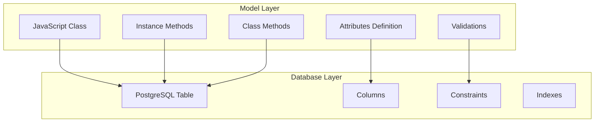

# Models & Data Types

## 🎯 Understanding Sequelize Models

Models are the heart of Sequelize - they represent tables in your database and provide an object-oriented interface for interacting with your data.



## 📊 Complete Data Types Guide

### String Types

```javascript
const User = sequelize.define('User', {
    // VARCHAR with length limit
    username: {
        type: DataTypes.STRING(50),
        allowNull: false,
        unique: true
    },
    
    // VARCHAR with default length (255)
    firstName: DataTypes.STRING,
    
    // TEXT for long content
    bio: DataTypes.TEXT,
    
    // CHAR for fixed-length strings
    countryCode: {
        type: DataTypes.CHAR(2), // Always 2 characters
        allowNull: false
    },
    
    // STRING with validation
    email: {
        type: DataTypes.STRING(100),
        allowNull: false,
        unique: true,
        validate: {
            isEmail: true,
            len: [5, 100]
        }
    }
});
```

### Numeric Types

```javascript
const Product = sequelize.define('Product', {
    // Integer types
    id: {
        type: DataTypes.INTEGER,
        primaryKey: true,
        autoIncrement: true
    },
    
    quantity: DataTypes.INTEGER, // -2,147,483,648 to 2,147,483,647
    smallCount: DataTypes.SMALLINT, // -32,768 to 32,767
    bigNumber: DataTypes.BIGINT, // Very large numbers (returned as string)
    
    // Decimal types for precise calculations
    price: {
        type: DataTypes.DECIMAL(10, 2), // 99999999.99
        allowNull: false,
        validate: {
            min: 0
        }
    },
    
    // Floating point types
    weight: DataTypes.FLOAT, // Single precision
    dimensions: DataTypes.DOUBLE, // Double precision
    
    // Real type (alias for FLOAT)
    density: DataTypes.REAL
});

// Usage examples
const product = await Product.create({
    quantity: 100,
    price: '19.99', // Use string for DECIMAL to avoid floating-point issues
    weight: 1.5,
    dimensions: 10.25
});
```

### Date and Time Types

```javascript
const Event = sequelize.define('Event', {
    // Full date and time
    eventDateTime: {
        type: DataTypes.DATE,
        allowNull: false,
        defaultValue: DataTypes.NOW
    },
    
    // Date only (no time)
    eventDate: {
        type: DataTypes.DATEONLY,
        allowNull: false
    },
    
    // Time only (no date)
    startTime: DataTypes.TIME,
    
    // Custom date formats
    createdAt: {
        type: DataTypes.DATE,
        defaultValue: DataTypes.NOW,
        get() {
            // Custom getter to format date
            const date = this.getDataValue('createdAt');
            return date ? date.toISOString() : null;
        }
    }
});

// Working with dates
const event = await Event.create({
    eventDateTime: new Date(),
    eventDate: '2025-12-25',
    startTime: '14:30:00'
});

console.log('Event date:', event.eventDate); // 2025-12-25
console.log('Start time:', event.startTime); // 14:30:00
```

### Boolean Type

```javascript
const User = sequelize.define('User', {
    isActive: {
        type: DataTypes.BOOLEAN,
        defaultValue: true
    },
    
    emailVerified: {
        type: DataTypes.BOOLEAN,
        defaultValue: false,
        allowNull: false
    },
    
    // Boolean with custom getter
    isAdmin: {
        type: DataTypes.BOOLEAN,
        get() {
            const value = this.getDataValue('isAdmin');
            return value === true; // Ensure it's always boolean
        }
    }
});
```

### JSON and JSONB Types

```javascript
const UserSettings = sequelize.define('UserSettings', {
    // Regular JSON
    preferences: {
        type: DataTypes.JSON,
        defaultValue: {}
    },
    
    // Binary JSON (PostgreSQL specific, faster)
    metadata: {
        type: DataTypes.JSONB,
        defaultValue: {},
        validate: {
            isValidJSON(value) {
                try {
                    JSON.stringify(value);
                } catch (error) {
                    throw new Error('Invalid JSON format');
                }
            }
        }
    }
});

// Working with JSON data
const settings = await UserSettings.create({
    preferences: {
        theme: 'dark',
        language: 'en',
        notifications: {
            email: true,
            push: false,
            sms: true
        }
    },
    metadata: {
        lastLogin: new Date(),
        browserInfo: 'Chrome 119',
        features: ['beta-tester', 'premium-user']
    }
});

// Querying JSON fields
const darkThemeUsers = await UserSettings.findAll({
    where: {
        preferences: {
            theme: 'dark'
        }
    }
});

// PostgreSQL JSON operators
const emailNotificationUsers = await UserSettings.findAll({
    where: sequelize.where(
        sequelize.cast(sequelize.col('preferences'), 'jsonb'),
        '@>',
        JSON.stringify({ notifications: { email: true } })
    )
});
```

### Array Types

```javascript
const Post = sequelize.define('Post', {
    // Array of strings
    tags: {
        type: DataTypes.ARRAY(DataTypes.STRING),
        defaultValue: []
    },
    
    // Array of integers
    viewCounts: {
        type: DataTypes.ARRAY(DataTypes.INTEGER),
        defaultValue: []
    },
    
    // Array with validation
    categories: {
        type: DataTypes.ARRAY(DataTypes.STRING),
        validate: {
            notEmpty: true,
            maxLength(value) {
                if (value && value.length > 5) {
                    throw new Error('Maximum 5 categories allowed');
                }
            }
        }
    }
});

// Working with arrays
const post = await Post.create({
    title: 'Learning Arrays',
    tags: ['javascript', 'postgresql', 'sequelize'],
    viewCounts: [10, 25, 50, 75],
    categories: ['technology', 'tutorial']
});

// Querying arrays
const jsRelatedPosts = await Post.findAll({
    where: {
        tags: {
            [Op.contains]: ['javascript']
        }
    }
});

// Array operations
const postsWithTag = await Post.findAll({
    where: sequelize.where(
        sequelize.fn('array_length', sequelize.col('tags'), 1),
        {
            [Op.gt]: 2
        }
    )
});
```

### UUID Type

```javascript
const Session = sequelize.define('Session', {
    // UUID primary key
    id: {
        type: DataTypes.UUID,
        primaryKey: true,
        defaultValue: DataTypes.UUIDV4
    },
    
    // UUID foreign key
    userId: {
        type: DataTypes.UUID,
        allowNull: false,
        references: {
            model: 'users',
            key: 'id'
        }
    },
    
    // Custom UUID
    publicId: {
        type: DataTypes.UUID,
        defaultValue: DataTypes.UUIDV4,
        unique: true
    }
});

// Usage
const session = await Session.create({
    userId: 'f47ac10b-58cc-4372-a567-0e02b2c3d479'
});

console.log('Session ID:', session.id); // Auto-generated UUID
```

### Enum Types

```javascript
const Order = sequelize.define('Order', {
    status: {
        type: DataTypes.ENUM('pending', 'processing', 'shipped', 'delivered', 'cancelled'),
        defaultValue: 'pending',
        allowNull: false
    },
    
    priority: {
        type: DataTypes.ENUM,
        values: ['low', 'medium', 'high', 'urgent'],
        defaultValue: 'medium'
    }
});

// Usage
const order = await Order.create({
    status: 'processing',
    priority: 'high'
});

// Invalid enum value will throw error
try {
    await Order.create({
        status: 'invalid_status' // Will fail
    });
} catch (error) {
    console.error('Invalid enum value:', error.message);
}
```

## 🎯 Advanced Model Features

### Virtual Fields

Virtual fields exist only in JavaScript and aren't stored in the database.

```javascript
const User = sequelize.define('User', {
    firstName: DataTypes.STRING,
    lastName: DataTypes.STRING,
    email: DataTypes.STRING,
    
    // Virtual field - computed from other fields
    fullName: {
        type: DataTypes.VIRTUAL,
        get() {
            return `${this.firstName} ${this.lastName}`;
        },
        set(value) {
            // Optional setter
            const names = value.split(' ');
            this.setDataValue('firstName', names[0]);
            this.setDataValue('lastName', names.slice(1).join(' '));
        }
    },
    
    // Virtual field with dependencies
    displayName: {
        type: DataTypes.VIRTUAL,
        get() {
            const fullName = this.fullName;
            const email = this.email;
            return fullName || email.split('@')[0];
        }
    },
    
    // Virtual field for computed values
    accountAge: {
        type: DataTypes.VIRTUAL,
        get() {
            const created = this.createdAt;
            if (!created) return null;
            
            const now = new Date();
            const diffTime = Math.abs(now - created);
            const diffDays = Math.ceil(diffTime / (1000 * 60 * 60 * 24));
            return diffDays;
        }
    }
});

// Usage
const user = await User.create({
    firstName: 'John',
    lastName: 'Doe',
    email: 'john.doe@example.com'
});

console.log('Full name:', user.fullName); // "John Doe"
console.log('Display name:', user.displayName); // "John Doe"
console.log('Account age:', user.accountAge); // Number of days

// Using setter
user.fullName = 'Jane Smith Wilson';
console.log('First name:', user.firstName); // "Jane"
console.log('Last name:', user.lastName); // "Smith Wilson"
```

### Getters and Setters

```javascript
const User = sequelize.define('User', {
    email: {
        type: DataTypes.STRING,
        allowNull: false,
        // Getter - transforms data when reading
        get() {
            const email = this.getDataValue('email');
            return email ? email.toLowerCase() : null;
        },
        // Setter - transforms data when writing
        set(value) {
            this.setDataValue('email', value ? value.toLowerCase().trim() : null);
        }
    },
    
    passwordHash: {
        type: DataTypes.STRING,
        // Setter with custom logic
        set(value) {
            if (value) {
                // In real app, use bcrypt here
                const hash = require('crypto')
                    .createHash('sha256')
                    .update(value)
                    .digest('hex');
                this.setDataValue('passwordHash', hash);
            }
        }
    },
    
    phoneNumber: {
        type: DataTypes.STRING,
        get() {
            const phone = this.getDataValue('phoneNumber');
            if (!phone) return null;
            
            // Format phone number for display
            const cleaned = phone.replace(/\D/g, '');
            if (cleaned.length === 10) {
                return `(${cleaned.slice(0,3)}) ${cleaned.slice(3,6)}-${cleaned.slice(6)}`;
            }
            return phone;
        },
        set(value) {
            if (value) {
                // Store only digits
                const cleaned = value.replace(/\D/g, '');
                this.setDataValue('phoneNumber', cleaned);
            }
        }
    }
});

// Usage
const user = await User.create({
    email: '  JOHN@EXAMPLE.COM  ', // Will be stored as 'john@example.com'
    passwordHash: 'plaintext_password', // Will be hashed
    phoneNumber: '(555) 123-4567' // Will be stored as '5551234567'
});

console.log('Email:', user.email); // 'john@example.com'
console.log('Phone:', user.phoneNumber); // '(555) 123-4567'
```

### Model Validation

```javascript
const User = sequelize.define('User', {
    username: {
        type: DataTypes.STRING(30),
        allowNull: false,
        unique: true,
        validate: {
            // Built-in validators
            len: [3, 30],
            isAlphanumeric: true,
            notEmpty: true,
            
            // Custom validator
            async isUniqueIgnoreCase(value) {
                if (value) {
                    const existing = await User.findOne({
                        where: sequelize.where(
                            sequelize.fn('LOWER', sequelize.col('username')),
                            value.toLowerCase()
                        )
                    });
                    if (existing && existing.id !== this.id) {
                        throw new Error('Username already exists (case-insensitive)');
                    }
                }
            }
        }
    },
    
    email: {
        type: DataTypes.STRING,
        allowNull: false,
        unique: true,
        validate: {
            isEmail: true,
            notEmpty: true,
            
            // Custom email domain validation
            allowedDomains(value) {
                const allowedDomains = ['example.com', 'company.com', 'gmail.com'];
                const domain = value.split('@')[1];
                if (!allowedDomains.includes(domain)) {
                    throw new Error(`Email domain ${domain} is not allowed`);
                }
            }
        }
    },
    
    age: {
        type: DataTypes.INTEGER,
        validate: {
            min: 13,
            max: 120,
            isInt: true,
            
            // Custom age validation
            isReasonableAge(value) {
                if (value < 13) {
                    throw new Error('User must be at least 13 years old');
                }
                if (value > 120) {
                    throw new Error('Please enter a valid age');
                }
            }
        }
    },
    
    website: {
        type: DataTypes.STRING,
        validate: {
            isUrl: true,
            
            // Custom URL validation
            isSecureUrl(value) {
                if (value && !value.startsWith('https://')) {
                    throw new Error('Website must use HTTPS');
                }
            }
        }
    }
}, {
    // Model-level validation
    validate: {
        // Cross-field validation
        emailUsernameMatch() {
            if (this.email && this.username) {
                const emailPrefix = this.email.split('@')[0];
                if (emailPrefix === this.username) {
                    throw new Error('Username cannot be the same as email prefix');
                }
            }
        },
        
        // Async model validation
        async checkBusinessRules() {
            if (this.role === 'admin' && this.age < 18) {
                throw new Error('Admin users must be at least 18 years old');
            }
        }
    }
});
```

### Built-in Validators Reference

| Validator | Description | Example |
|-----------|-------------|---------|
| `isEmail` | Valid email format | `user@example.com` |
| `isUrl` | Valid URL format | `https://example.com` |
| `isIP` | Valid IP address | `192.168.1.1` |
| `isAlpha` | Only letters | `abcdef` |
| `isAlphanumeric` | Letters and numbers | `abc123` |
| `isNumeric` | Only numbers | `12345` |
| `isInt` | Integer number | `42` |
| `isFloat` | Floating point | `3.14` |
| `isDecimal` | Decimal number | `19.99` |
| `isDate` | Valid date | `2025-01-06` |
| `isCreditCard` | Credit card format | `4111111111111111` |
| `len: [min, max]` | String length | `len: [3, 50]` |
| `min: n` | Minimum value | `min: 0` |
| `max: n` | Maximum value | `max: 100` |
| `notEmpty` | Not empty string | `'hello'` |
| `notNull` | Not null value | Any non-null |
| `is: /regex/` | Regex pattern | `is: /^[a-zA-Z]+$/` |
| `not: /regex/` | Not matching regex | `not: /[^a-zA-Z]/` |
| `contains: 'text'` | Contains substring | `contains: 'hello'` |
| `notContains: 'text'` | Doesn't contain | `notContains: 'spam'` |
| `isIn: [array]` | Value in array | `isIn: ['red', 'blue']` |
| `notIn: [array]` | Value not in array | `notIn: ['banned']` |

## 🏗️ Model Relationships Preview

### Defining Associations in Models

```javascript
// models/User.js
const User = sequelize.define('User', {
    // ... user attributes
});

User.associate = function(models) {
    // User has many posts
    User.hasMany(models.Post, {
        foreignKey: 'userId',
        as: 'posts'
    });
    
    // User has one profile
    User.hasOne(models.UserProfile, {
        foreignKey: 'userId',
        as: 'profile'
    });
    
    // User belongs to many roles
    User.belongsToMany(models.Role, {
        through: 'UserRoles',
        foreignKey: 'userId',
        as: 'roles'
    });
};

// models/Post.js
const Post = sequelize.define('Post', {
    // ... post attributes
});

Post.associate = function(models) {
    // Post belongs to user
    Post.belongsTo(models.User, {
        foreignKey: 'userId',
        as: 'author'
    });
    
    // Post has many comments
    Post.hasMany(models.Comment, {
        foreignKey: 'postId',
        as: 'comments'
    });
};
```

## 🎯 Model Instance Methods

### Built-in Instance Methods

```javascript
// Create a user
const user = await User.create({
    firstName: 'John',
    lastName: 'Doe',
    email: 'john@example.com'
});

// Instance methods
await user.save(); // Save changes
await user.reload(); // Refresh from database
await user.update({ firstName: 'Johnny' }); // Update fields
await user.destroy(); // Delete record
await user.restore(); // Restore soft-deleted (if paranoid)

// Data access
const data = user.toJSON(); // Get plain object
const previous = user._previousDataValues; // Previous values
const changed = user.changed(); // Array of changed fields
const isChanged = user.changed('firstName'); // Check specific field

// Validation
try {
    await user.validate();
} catch (error) {
    console.log('Validation errors:', error.errors);
}
```

### Custom Instance Methods

```javascript
const User = sequelize.define('User', {
    firstName: DataTypes.STRING,
    lastName: DataTypes.STRING,
    email: DataTypes.STRING,
    isActive: DataTypes.BOOLEAN
});

// Add custom instance methods
User.prototype.getFullName = function() {
    return `${this.firstName} ${this.lastName}`;
};

User.prototype.deactivate = async function() {
    this.isActive = false;
    return await this.save();
};

User.prototype.sendWelcomeEmail = async function() {
    // Custom logic to send email
    console.log(`Sending welcome email to ${this.email}`);
    // Integrate with email service
};

User.prototype.hasPermission = function(permission) {
    // Check user permissions
    return this.roles && this.roles.some(role => 
        role.permissions.includes(permission)
    );
};

// Usage
const user = await User.findByPk(1);
console.log('Full name:', user.getFullName());
await user.deactivate();
await user.sendWelcomeEmail();
```

## 🏛️ Model Class Methods

### Built-in Class Methods

```javascript
// Finding records
const users = await User.findAll();
const user = await User.findByPk(1);
const user = await User.findOne({ where: { email: 'john@example.com' } });

// Creating records
const user = await User.create({ firstName: 'John', email: 'john@example.com' });
const users = await User.bulkCreate([...userData]);

// Updating records
const [affectedRows] = await User.update({ isActive: false }, { where: { id: 1 } });

// Deleting records
await User.destroy({ where: { id: 1 } });

// Counting
const count = await User.count({ where: { isActive: true } });

// Aggregation
const result = await User.findAll({
    attributes: [
        'role',
        [sequelize.fn('COUNT', sequelize.col('id')), 'count']
    ],
    group: ['role']
});
```

### Custom Class Methods

```javascript
// Add custom class methods
User.findActiveUsers = async function() {
    return await this.findAll({
        where: { isActive: true },
        order: [['createdAt', 'DESC']]
    });
};

User.findByEmail = async function(email) {
    return await this.findOne({
        where: { email: email.toLowerCase() }
    });
};

User.createWithProfile = async function(userData, profileData) {
    const transaction = await sequelize.transaction();
    
    try {
        const user = await this.create(userData, { transaction });
        const profile = await UserProfile.create({
            ...profileData,
            userId: user.id
        }, { transaction });
        
        await transaction.commit();
        return { user, profile };
    } catch (error) {
        await transaction.rollback();
        throw error;
    }
};

User.getStatistics = async function() {
    const total = await this.count();
    const active = await this.count({ where: { isActive: true } });
    const recent = await this.count({
        where: {
            createdAt: {
                [Op.gte]: new Date(Date.now() - 30 * 24 * 60 * 60 * 1000)
            }
        }
    });
    
    return { total, active, recent };
};

// Usage
const activeUsers = await User.findActiveUsers();
const user = await User.findByEmail('john@example.com');
const { user, profile } = await User.createWithProfile(userData, profileData);
const stats = await User.getStatistics();
```

## 🔧 Model Configuration Options

### Complete Model Definition

```javascript
const User = sequelize.define('User', {
    // Attributes
    id: {
        type: DataTypes.INTEGER,
        primaryKey: true,
        autoIncrement: true
    },
    firstName: DataTypes.STRING,
    lastName: DataTypes.STRING
}, {
    // Table name options
    tableName: 'users',
    freezeTableName: true, // Don't pluralize table name
    
    // Timestamp options
    timestamps: true,
    createdAt: 'created_at',
    updatedAt: 'updated_at',
    
    // Soft delete
    paranoid: true,
    deletedAt: 'deleted_at',
    
    // Field naming
    underscored: true, // Use snake_case
    
    // Sequelize options
    sequelize,
    modelName: 'User',
    
    // Default scope
    defaultScope: {
        where: {
            isActive: true
        }
    },
    
    // Named scopes
    scopes: {
        active: { where: { isActive: true } },
        inactive: { where: { isActive: false } }
    },
    
    // Indexes
    indexes: [
        { fields: ['email'] },
        { fields: ['firstName', 'lastName'] }
    ],
    
    // Hooks
    hooks: {
        beforeCreate: (user, options) => {
            console.log('Creating user:', user.email);
        },
        afterCreate: (user, options) => {
            console.log('User created:', user.id);
        }
    },
    
    // Model validation
    validate: {
        emailRequired() {
            if (!this.email) {
                throw new Error('Email is required');
            }
        }
    }
});
```

## 🎓 Practice Exercise

Create a comprehensive Product model with the following requirements:

1. **Required fields**: name, price, category
2. **Optional fields**: description, tags (array), specifications (JSON)
3. **Computed fields**: slug (from name), priceWithTax
4. **Validations**: price > 0, name length 3-100 characters
5. **Custom methods**: findByCategory, markAsOutOfStock
6. **Scopes**: available, expensive (price > 100)

<details>
<summary>Solution</summary>

```javascript
// models/Product.js
const { DataTypes, Op } = require('sequelize');
const sequelize = require('./index');

const Product = sequelize.define('Product', {
    id: {
        type: DataTypes.INTEGER,
        primaryKey: true,
        autoIncrement: true
    },
    
    name: {
        type: DataTypes.STRING(100),
        allowNull: false,
        validate: {
            len: [3, 100],
            notEmpty: true
        }
    },
    
    price: {
        type: DataTypes.DECIMAL(10, 2),
        allowNull: false,
        validate: {
            min: 0.01,
            isDecimal: true
        }
    },
    
    category: {
        type: DataTypes.STRING(50),
        allowNull: false,
        validate: {
            isIn: [['electronics', 'clothing', 'books', 'home', 'sports']]
        }
    },
    
    description: {
        type: DataTypes.TEXT,
        allowNull: true
    },
    
    tags: {
        type: DataTypes.ARRAY(DataTypes.STRING),
        defaultValue: []
    },
    
    specifications: {
        type: DataTypes.JSONB,
        defaultValue: {}
    },
    
    isAvailable: {
        type: DataTypes.BOOLEAN,
        defaultValue: true
    },
    
    // Virtual field - slug
    slug: {
        type: DataTypes.VIRTUAL,
        get() {
            return this.name
                .toLowerCase()
                .replace(/[^a-z0-9]/g, '-')
                .replace(/-+/g, '-')
                .replace(/^-|-$/g, '');
        }
    },
    
    // Virtual field - price with tax
    priceWithTax: {
        type: DataTypes.VIRTUAL,
        get() {
            const price = parseFloat(this.price);
            const tax = price * 0.1; // 10% tax
            return (price + tax).toFixed(2);
        }
    }
}, {
    tableName: 'products',
    timestamps: true,
    underscored: true,
    
    // Default scope
    defaultScope: {
        where: {
            isAvailable: true
        }
    },
    
    // Named scopes
    scopes: {
        available: {
            where: { isAvailable: true }
        },
        expensive: {
            where: {
                price: {
                    [Op.gt]: 100
                }
            }
        }
    },
    
    // Indexes
    indexes: [
        { fields: ['category'] },
        { fields: ['price'] },
        { fields: ['is_available'] }
    ]
});

// Custom class methods
Product.findByCategory = async function(category) {
    return await this.findAll({
        where: { category },
        order: [['price', 'ASC']]
    });
};

// Custom instance methods
Product.prototype.markAsOutOfStock = async function() {
    this.isAvailable = false;
    return await this.save();
};

Product.prototype.addTag = async function(tag) {
    if (!this.tags.includes(tag)) {
        this.tags = [...this.tags, tag];
        return await this.save();
    }
};

module.exports = Product;
```
</details>

## 🎯 Key Takeaways

1. **Data Types**: Choose appropriate types for your data
2. **Virtual Fields**: Computed values that don't take database space
3. **Getters/Setters**: Transform data on read/write
4. **Validations**: Ensure data quality at the model level
5. **Instance Methods**: Add behavior to individual records
6. **Class Methods**: Add behavior to the model itself
7. **Scopes**: Create reusable query patterns

## 🚀 What's Next?

Now that you've mastered models and data types, let's explore how to connect models together with [[06-Associations|Associations & Relationships]]!

---

## 🔗 Related Topics
- [[06-Associations|Associations & Relationships]]
- [[12-Validations|Validations & Constraints]]
- [[13-Hooks-Lifecycle|Hooks & Lifecycle Events]]
