# Associations & Relationships

## 🎯 Understanding Database Relationships

Associations define how tables relate to each other, enabling you to query related data efficiently and maintain data integrity.

```mermaid
graph TB
    subgraph "Relationship Types"
        A[One-to-One] --> A1[User ↔ Profile]
        B[One-to-Many] --> B1[User → Posts]
        C[Many-to-Many] --> C1[Posts ↔ Tags]
        D[Self-Reference] --> D1[User → Manager]
    end
```



## 🔗 The Four Types of Associations

### 1. One-to-One (hasOne / belongsTo)

One record in Table A relates to exactly one record in Table B.

```javascript
// User has one Profile
// Profile belongs to User

// models/User.js
const User = sequelize.define('User', {
    id: {
        type: DataTypes.INTEGER,
        primaryKey: true,
        autoIncrement: true
    },
    firstName: DataTypes.STRING,
    lastName: DataTypes.STRING,
    email: DataTypes.STRING
});

// models/UserProfile.js
const UserProfile = sequelize.define('UserProfile', {
    id: {
        type: DataTypes.INTEGER,
        primaryKey: true,
        autoIncrement: true
    },
    userId: {
        type: DataTypes.INTEGER,
        references: {
            model: User,
            key: 'id'
        }
    },
    bio: DataTypes.TEXT,
    dateOfBirth: DataTypes.DATE,
    website: DataTypes.STRING
});

// Define associations
User.hasOne(UserProfile, {
    foreignKey: 'userId',
    as: 'profile'
});

UserProfile.belongsTo(User, {
    foreignKey: 'userId',
    as: 'user'
});
```

**Usage:**
```javascript
// Create user with profile
const user = await User.create({
    firstName: 'John',
    lastName: 'Doe',
    email: 'john@example.com'
});

const profile = await UserProfile.create({
    userId: user.id,
    bio: 'Software developer passionate about Node.js',
    dateOfBirth: '1990-01-01'
});

// Query with associations
const userWithProfile = await User.findOne({
    where: { email: 'john@example.com' },
    include: [{
        model: UserProfile,
        as: 'profile'
    }]
});

console.log('Bio:', userWithProfile.profile.bio);

// Query from profile side
const profileWithUser = await UserProfile.findOne({
    where: { id: 1 },
    include: [{
        model: User,
        as: 'user'
    }]
});

console.log('User name:', profileWithUser.user.firstName);
```

### 2. One-to-Many (hasMany / belongsTo)

One record in Table A can relate to many records in Table B.

```javascript
// User has many Posts
// Post belongs to User

// models/User.js (already defined above)

// models/Post.js
const Post = sequelize.define('Post', {
    id: {
        type: DataTypes.INTEGER,
        primaryKey: true,
        autoIncrement: true
    },
    userId: {
        type: DataTypes.INTEGER,
        allowNull: false,
        references: {
            model: User,
            key: 'id'
        }
    },
    title: {
        type: DataTypes.STRING(200),
        allowNull: false
    },
    content: DataTypes.TEXT,
    publishedAt: DataTypes.DATE,
    status: {
        type: DataTypes.ENUM('draft', 'published', 'archived'),
        defaultValue: 'draft'
    }
});

// Define associations
User.hasMany(Post, {
    foreignKey: 'userId',
    as: 'posts'
});

Post.belongsTo(User, {
    foreignKey: 'userId',
    as: 'author'
});
```

**Usage:**
```javascript
// Create posts for a user
const user = await User.findByPk(1);
const posts = await user.createPost({
    title: 'My First Blog Post',
    content: 'This is the content of my first post...',
    status: 'published'
});

// Alternative creation method
const post = await Post.create({
    userId: user.id,
    title: 'Another Post',
    content: 'More content...'
});

// Query user with all posts
const userWithPosts = await User.findOne({
    where: { id: 1 },
    include: [{
        model: Post,
        as: 'posts',
        where: { status: 'published' }, // Filter posts
        order: [['publishedAt', 'DESC']]
    }]
});

console.log(`${userWithPosts.firstName} has ${userWithPosts.posts.length} published posts`);

// Query posts with author information
const postsWithAuthors = await Post.findAll({
    include: [{
        model: User,
        as: 'author',
        attributes: ['firstName', 'lastName', 'email']
    }],
    order: [['publishedAt', 'DESC']]
});

postsWithAuthors.forEach(post => {
    console.log(`"${post.title}" by ${post.author.firstName} ${post.author.lastName}`);
});
```

### 3. Many-to-Many (belongsToMany)

Many records in Table A can relate to many records in Table B through a junction table.

```javascript
// Posts belong to many Tags
// Tags belong to many Posts
// Through PostTags junction table

// models/Post.js (already defined above)

// models/Tag.js
const Tag = sequelize.define('Tag', {
    id: {
        type: DataTypes.INTEGER,
        primaryKey: true,
        autoIncrement: true
    },
    name: {
        type: DataTypes.STRING(50),
        allowNull: false,
        unique: true
    },
    slug: {
        type: DataTypes.STRING(50),
        allowNull: false,
        unique: true
    },
    description: DataTypes.TEXT
});

// models/PostTag.js (Junction table)
const PostTag = sequelize.define('PostTag', {
    id: {
        type: DataTypes.INTEGER,
        primaryKey: true,
        autoIncrement: true
    },
    postId: {
        type: DataTypes.INTEGER,
        references: {
            model: Post,
            key: 'id'
        }
    },
    tagId: {
        type: DataTypes.INTEGER,
        references: {
            model: Tag,
            key: 'id'
        }
    },
    // Additional fields in junction table
    relevanceScore: {
        type: DataTypes.INTEGER,
        defaultValue: 1,
        validate: { min: 1, max: 10 }
    },
    addedAt: {
        type: DataTypes.DATE,
        defaultValue: DataTypes.NOW
    }
}, {
    // Prevent duplicate associations
    indexes: [
        {
            unique: true,
            fields: ['postId', 'tagId']
        }
    ]
});

// Define Many-to-Many associations
Post.belongsToMany(Tag, {
    through: PostTag,
    foreignKey: 'postId',
    otherKey: 'tagId',
    as: 'tags'
});

Tag.belongsToMany(Post, {
    through: PostTag,
    foreignKey: 'tagId',
    otherKey: 'postId',
    as: 'posts'
});

// Optional: Direct associations to junction table
Post.hasMany(PostTag, { foreignKey: 'postId' });
Tag.hasMany(PostTag, { foreignKey: 'tagId' });
PostTag.belongsTo(Post, { foreignKey: 'postId' });
PostTag.belongsTo(Tag, { foreignKey: 'tagId' });
```

**Usage:**
```javascript
// Create tags
const tags = await Tag.bulkCreate([
    { name: 'JavaScript', slug: 'javascript', description: 'JavaScript programming' },
    { name: 'Node.js', slug: 'nodejs', description: 'Node.js runtime' },
    { name: 'Tutorial', slug: 'tutorial', description: 'Educational content' }
]);

// Associate post with tags
const post = await Post.findByPk(1);
const jsTag = await Tag.findOne({ where: { slug: 'javascript' } });
const nodeTag = await Tag.findOne({ where: { slug: 'nodejs' } });

// Method 1: Using association methods
await post.addTag(jsTag, { through: { relevanceScore: 10 } });
await post.addTags([nodeTag], { through: { relevanceScore: 8 } });

// Method 2: Using setTags (replaces all associations)
await post.setTags([jsTag, nodeTag], {
    through: { relevanceScore: 9 }
});

// Method 3: Direct junction table creation
await PostTag.create({
    postId: post.id,
    tagId: jsTag.id,
    relevanceScore: 10
});

// Query posts with tags
const postsWithTags = await Post.findAll({
    include: [{
        model: Tag,
        as: 'tags',
        through: {
            attributes: ['relevanceScore', 'addedAt'] // Include junction table fields
        }
    }]
});

postsWithTags.forEach(post => {
    console.log(`Post: ${post.title}`);
    post.tags.forEach(tag => {
        console.log(`  Tag: ${tag.name} (relevance: ${tag.PostTag.relevanceScore})`);
    });
});

// Query tags with posts
const tagsWithPosts = await Tag.findAll({
    include: [{
        model: Post,
        as: 'posts',
        through: { attributes: [] }, // Exclude junction table data
        where: { status: 'published' }
    }]
});

// Association helper methods
const post = await Post.findByPk(1);

// Check associations
const hasTag = await post.hasTag(jsTag);
const hasTags = await post.hasTags([jsTag, nodeTag]);

// Count associations
const tagCount = await post.countTags();

// Remove associations
await post.removeTag(jsTag);
await post.removeTags([jsTag, nodeTag]);
```

### 4. Self-Referencing Associations

Tables that reference themselves, useful for hierarchical data.

```javascript
// User can have a manager (who is also a User)
// User can manage multiple users

// models/User.js (extend existing User model)
User.hasMany(User, {
    as: 'subordinates',
    foreignKey: 'managerId'
});

User.belongsTo(User, {
    as: 'manager',
    foreignKey: 'managerId'
});

// Add managerId field to User model
User.addAttribute('managerId', {
    type: DataTypes.INTEGER,
    allowNull: true,
    references: {
        model: User,
        key: 'id'
    }
});

// Category tree structure example
const Category = sequelize.define('Category', {
    id: {
        type: DataTypes.INTEGER,
        primaryKey: true,
        autoIncrement: true
    },
    name: DataTypes.STRING,
    parentId: {
        type: DataTypes.INTEGER,
        allowNull: true,
        references: {
            model: 'categories',
            key: 'id'
        }
    }
});

Category.hasMany(Category, {
    as: 'children',
    foreignKey: 'parentId'
});

Category.belongsTo(Category, {
    as: 'parent',
    foreignKey: 'parentId'
});
```

**Usage:**
```javascript
// Create organizational hierarchy
const ceo = await User.create({
    firstName: 'John',
    lastName: 'CEO',
    email: 'ceo@company.com'
});

const manager = await User.create({
    firstName: 'Jane',
    lastName: 'Manager',
    email: 'manager@company.com',
    managerId: ceo.id
});

const employee = await User.create({
    firstName: 'Bob',
    lastName: 'Employee',
    email: 'employee@company.com',
    managerId: manager.id
});

// Query with hierarchy
const managerWithTeam = await User.findOne({
    where: { id: manager.id },
    include: [
        {
            model: User,
            as: 'subordinates'
        },
        {
            model: User,
            as: 'manager'
        }
    ]
});

console.log(`${managerWithTeam.firstName} manages ${managerWithTeam.subordinates.length} people`);
console.log(`Reports to: ${managerWithTeam.manager.firstName}`);

// Category tree example
const electronics = await Category.create({ name: 'Electronics' });
const computers = await Category.create({ name: 'Computers', parentId: electronics.id });
const laptops = await Category.create({ name: 'Laptops', parentId: computers.id });

const categoryTree = await Category.findAll({
    where: { parentId: null }, // Root categories
    include: [{
        model: Category,
        as: 'children',
        include: [{
            model: Category,
            as: 'children'
        }]
    }]
});
```

## 🔧 Advanced Association Options

### Association Aliases

```javascript
// Multiple associations between same models
const User = sequelize.define('User', { /* ... */ });
const Post = sequelize.define('Post', { /* ... */ });

// User can be author and editor of posts
User.hasMany(Post, {
    foreignKey: 'authorId',
    as: 'authoredPosts'
});

User.hasMany(Post, {
    foreignKey: 'editorId',
    as: 'editedPosts'
});

Post.belongsTo(User, {
    foreignKey: 'authorId',
    as: 'author'
});

Post.belongsTo(User, {
    foreignKey: 'editorId',
    as: 'editor'
});

// Usage
const userWithPosts = await User.findOne({
    include: [
        { model: Post, as: 'authoredPosts' },
        { model: Post, as: 'editedPosts' }
    ]
});
```

### Association Constraints

```javascript
// Cascade operations
User.hasMany(Post, {
    foreignKey: 'userId',
    onDelete: 'CASCADE', // Delete posts when user is deleted
    onUpdate: 'CASCADE'  // Update foreign keys when user ID changes
});

// Other constraint options:
// - 'RESTRICT': Prevent deletion if references exist
// - 'SET NULL': Set foreign key to NULL
// - 'SET DEFAULT': Set foreign key to default value
// - 'NO ACTION': Database default behavior

Post.belongsTo(User, {
    foreignKey: {
        name: 'userId',
        allowNull: false // Ensure every post has an author
    }
});
```

### Custom Junction Tables

```javascript
// Advanced many-to-many with custom junction table
const UserProject = sequelize.define('UserProject', {
    userId: {
        type: DataTypes.INTEGER,
        primaryKey: true
    },
    projectId: {
        type: DataTypes.INTEGER,
        primaryKey: true
    },
    role: {
        type: DataTypes.ENUM('owner', 'admin', 'contributor', 'viewer'),
        defaultValue: 'contributor'
    },
    joinedAt: {
        type: DataTypes.DATE,
        defaultValue: DataTypes.NOW
    },
    isActive: {
        type: DataTypes.BOOLEAN,
        defaultValue: true
    }
}, {
    timestamps: true
});

User.belongsToMany(Project, {
    through: UserProject,
    foreignKey: 'userId',
    otherKey: 'projectId'
});

Project.belongsToMany(User, {
    through: UserProject,
    foreignKey: 'projectId',
    otherKey: 'userId'
});

// Query with junction table conditions
const projectsWithContributors = await Project.findAll({
    include: [{
        model: User,
        through: {
            where: { role: 'contributor', isActive: true }
        }
    }]
});
```

## 🔍 Querying Associations

### Basic Include Queries

```javascript
// Simple include
const users = await User.findAll({
    include: [Post]
});

// Include with alias
const users = await User.findAll({
    include: [{
        model: Post,
        as: 'posts'
    }]
});

// Multiple includes
const users = await User.findAll({
    include: [
        { model: UserProfile, as: 'profile' },
        { model: Post, as: 'posts' }
    ]
});

// Nested includes
const users = await User.findAll({
    include: [{
        model: Post,
        as: 'posts',
        include: [{
            model: Tag,
            as: 'tags'
        }]
    }]
});
```

### Filtering Associations

```javascript
// Filter associated data
const users = await User.findAll({
    include: [{
        model: Post,
        as: 'posts',
        where: { 
            status: 'published',
            publishedAt: {
                [Op.gte]: new Date('2024-01-01')
            }
        }
    }]
});

// Include with specific attributes
const users = await User.findAll({
    attributes: ['id', 'firstName', 'lastName'],
    include: [{
        model: Post,
        as: 'posts',
        attributes: ['id', 'title', 'publishedAt']
    }]
});

// Required vs optional includes
const users = await User.findAll({
    include: [{
        model: Post,
        as: 'posts',
        required: true // INNER JOIN (only users with posts)
    }]
});

const users = await User.findAll({
    include: [{
        model: Post,
        as: 'posts',
        required: false // LEFT OUTER JOIN (all users, posts if available)
    }]
});
```

### Ordering Associations

```javascript
// Order by associated field
const users = await User.findAll({
    include: [{
        model: Post,
        as: 'posts'
    }],
    order: [
        ['firstName', 'ASC'],
        [{ model: Post, as: 'posts' }, 'publishedAt', 'DESC']
    ]
});

// Separate queries for associations
const users = await User.findAll({
    include: [{
        model: Post,
        as: 'posts',
        separate: true, // Separate query for posts
        order: [['publishedAt', 'DESC']]
    }]
});
```

## 🎯 Association Helper Methods

When you define associations, Sequelize automatically creates helper methods:

### hasOne/belongsTo Methods

```javascript
// User hasOne Profile
const user = await User.findByPk(1);

// Getter methods
const profile = await user.getProfile();

// Setter methods
await user.setProfile(profileInstance);

// Creator methods
const newProfile = await user.createProfile({
    bio: 'New bio',
    website: 'https://example.com'
});

// Check association
const hasProfile = await user.getProfile() !== null;
```

### hasMany Methods

```javascript
// User hasMany Posts
const user = await User.findByPk(1);

// Getter methods
const posts = await user.getPosts();
const publishedPosts = await user.getPosts({
    where: { status: 'published' }
});

// Count methods
const postCount = await user.countPosts();

// Check methods
const hasPost = await user.hasPost(postInstance);
const hasPosts = await user.hasPosts([post1, post2]);

// Setter methods (replaces all)
await user.setPosts([post1, post2]);

// Add methods (appends)
await user.addPost(postInstance);
await user.addPosts([post1, post2]);

// Remove methods
await user.removePost(postInstance);
await user.removePosts([post1, post2]);

// Creator methods
const newPost = await user.createPost({
    title: 'New Post',
    content: 'Post content'
});
```

### belongsToMany Methods

```javascript
// Post belongsToMany Tags
const post = await Post.findByPk(1);

// Similar methods as hasMany, but with junction table support
const tags = await post.getTags();
await post.addTag(tagInstance, { through: { relevanceScore: 10 } });
await post.setTags([tag1, tag2], { through: { relevanceScore: 5 } });
```

## 🏗️ Complete Blog Example

Let's build a complete blog system with all relationship types:

```javascript
// models/User.js
const User = sequelize.define('User', {
    id: { type: DataTypes.INTEGER, primaryKey: true, autoIncrement: true },
    firstName: DataTypes.STRING,
    lastName: DataTypes.STRING,
    email: { type: DataTypes.STRING, unique: true },
    role: { type: DataTypes.ENUM('admin', 'author', 'reader'), defaultValue: 'reader' }
});

// models/UserProfile.js
const UserProfile = sequelize.define('UserProfile', {
    id: { type: DataTypes.INTEGER, primaryKey: true, autoIncrement: true },
    userId: DataTypes.INTEGER,
    bio: DataTypes.TEXT,
    avatar: DataTypes.STRING,
    website: DataTypes.STRING
});

// models/Post.js
const Post = sequelize.define('Post', {
    id: { type: DataTypes.INTEGER, primaryKey: true, autoIncrement: true },
    authorId: DataTypes.INTEGER,
    title: DataTypes.STRING,
    content: DataTypes.TEXT,
    status: { type: DataTypes.ENUM('draft', 'published'), defaultValue: 'draft' },
    publishedAt: DataTypes.DATE
});

// models/Category.js
const Category = sequelize.define('Category', {
    id: { type: DataTypes.INTEGER, primaryKey: true, autoIncrement: true },
    name: DataTypes.STRING,
    slug: DataTypes.STRING
});

// models/Tag.js
const Tag = sequelize.define('Tag', {
    id: { type: DataTypes.INTEGER, primaryKey: true, autoIncrement: true },
    name: DataTypes.STRING,
    slug: DataTypes.STRING
});

// models/Comment.js
const Comment = sequelize.define('Comment', {
    id: { type: DataTypes.INTEGER, primaryKey: true, autoIncrement: true },
    postId: DataTypes.INTEGER,
    authorId: DataTypes.INTEGER,
    content: DataTypes.TEXT,
    parentId: DataTypes.INTEGER // For nested comments
});

// Junction tables
const PostCategory = sequelize.define('PostCategory', {
    postId: DataTypes.INTEGER,
    categoryId: DataTypes.INTEGER
});

const PostTag = sequelize.define('PostTag', {
    postId: DataTypes.INTEGER,
    tagId: DataTypes.INTEGER,
    relevance: { type: DataTypes.INTEGER, defaultValue: 1 }
});

// Define all associations
function defineAssociations() {
    // User associations
    User.hasOne(UserProfile, { foreignKey: 'userId', as: 'profile' });
    User.hasMany(Post, { foreignKey: 'authorId', as: 'posts' });
    User.hasMany(Comment, { foreignKey: 'authorId', as: 'comments' });
    
    // Profile associations
    UserProfile.belongsTo(User, { foreignKey: 'userId', as: 'user' });
    
    // Post associations
    Post.belongsTo(User, { foreignKey: 'authorId', as: 'author' });
    Post.hasMany(Comment, { foreignKey: 'postId', as: 'comments' });
    Post.belongsToMany(Category, { 
        through: PostCategory, 
        foreignKey: 'postId', 
        as: 'categories' 
    });
    Post.belongsToMany(Tag, { 
        through: PostTag, 
        foreignKey: 'postId', 
        as: 'tags' 
    });
    
    // Category associations
    Category.belongsToMany(Post, { 
        through: PostCategory, 
        foreignKey: 'categoryId', 
        as: 'posts' 
    });
    
    // Tag associations
    Tag.belongsToMany(Post, { 
        through: PostTag, 
        foreignKey: 'tagId', 
        as: 'posts' 
    });
    
    // Comment associations
    Comment.belongsTo(Post, { foreignKey: 'postId', as: 'post' });
    Comment.belongsTo(User, { foreignKey: 'authorId', as: 'author' });
    
    // Self-referencing comment associations (for replies)
    Comment.hasMany(Comment, { foreignKey: 'parentId', as: 'replies' });
    Comment.belongsTo(Comment, { foreignKey: 'parentId', as: 'parent' });
}

defineAssociations();

// Usage example
async function createBlogPost() {
    // Create author
    const author = await User.create({
        firstName: 'John',
        lastName: 'Doe',
        email: 'john@example.com',
        role: 'author'
    });
    
    // Create profile
    await author.createProfile({
        bio: 'Passionate blogger',
        website: 'https://johndoe.com'
    });
    
    // Create categories and tags
    const techCategory = await Category.create({ name: 'Technology', slug: 'technology' });
    const jsTag = await Tag.create({ name: 'JavaScript', slug: 'javascript' });
    const nodeTag = await Tag.create({ name: 'Node.js', slug: 'nodejs' });
    
    // Create post
    const post = await author.createPost({
        title: 'Getting Started with Node.js',
        content: 'Node.js is a powerful runtime...',
        status: 'published',
        publishedAt: new Date()
    });
    
    // Associate with categories and tags
    await post.addCategory(techCategory);
    await post.addTags([jsTag, nodeTag], { 
        through: { relevance: 10 } 
    });
    
    // Create comment
    const reader = await User.create({
        firstName: 'Jane',
        lastName: 'Reader',
        email: 'jane@example.com'
    });
    
    const comment = await Comment.create({
        postId: post.id,
        authorId: reader.id,
        content: 'Great post! Very helpful.'
    });
    
    // Create reply to comment
    await Comment.create({
        postId: post.id,
        authorId: author.id,
        content: 'Thanks for reading!',
        parentId: comment.id
    });
    
    return post;
}

// Query the complete blog post
async function getBlogPostWithEverything(postId) {
    return await Post.findByPk(postId, {
        include: [
            {
                model: User,
                as: 'author',
                include: [{ model: UserProfile, as: 'profile' }]
            },
            { model: Category, as: 'categories' },
            { 
                model: Tag, 
                as: 'tags',
                through: { attributes: ['relevance'] }
            },
            {
                model: Comment,
                as: 'comments',
                include: [
                    { model: User, as: 'author' },
                    { 
                        model: Comment, 
                        as: 'replies',
                        include: [{ model: User, as: 'author' }]
                    }
                ]
            }
        ]
    });
}
```

## 🎯 Best Practices

### 1. Naming Conventions

```javascript
// Good: Clear, descriptive aliases
User.hasMany(Post, { as: 'posts', foreignKey: 'authorId' });
Post.belongsTo(User, { as: 'author', foreignKey: 'authorId' });

// Good: Consistent foreign key naming
User.hasMany(Comment, { as: 'comments', foreignKey: 'userId' });
Post.hasMany(Comment, { as: 'comments', foreignKey: 'postId' });
```

### 2. Performance Optimization

```javascript
// Good: Limit associated data
const posts = await Post.findAll({
    include: [{
        model: User,
        as: 'author',
        attributes: ['id', 'firstName', 'lastName'] // Only needed fields
    }],
    limit: 10
});

// Good: Use separate queries for large associations
const users = await User.findAll({
    include: [{
        model: Post,
        as: 'posts',
        separate: true, // Separate query
        limit: 5 // Limit per user
    }]
});
```

### 3. Error Handling

```javascript
// Handle association creation with transactions
async function createUserWithProfile(userData, profileData) {
    const transaction = await sequelize.transaction();
    
    try {
        const user = await User.create(userData, { transaction });
        const profile = await user.createProfile(profileData, { transaction });
        
        await transaction.commit();
        return { user, profile };
    } catch (error) {
        await transaction.rollback();
        throw error;
    }
}
```

## 🎯 Key Takeaways

1. **One-to-One**: Use `hasOne` and `belongsTo`
2. **One-to-Many**: Use `hasMany` and `belongsTo`
3. **Many-to-Many**: Use `belongsToMany` with junction tables
4. **Self-Reference**: Models can reference themselves
5. **Helper Methods**: Sequelize auto-generates association methods
6. **Includes**: Use `include` for eager loading
7. **Performance**: Be mindful of N+1 queries and data size

## 🚀 What's Next?

Now that you understand associations, let's learn about [[07-Migrations|Migrations & Schema Management]] to version control your database structure!

---

## 🔗 Related Topics
- [[07-Migrations|Migrations & Schema Management]]
- [[11-Advanced-Queries|Advanced Queries & Joins]]
- [[15-Indexes-Performance|Performance Optimization]]
