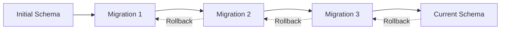

# Migrations & Schema Management

## 🎯 Understanding Migrations

Migrations are version control for your database schema. They allow you to evolve your database structure over time while keeping track of changes and enabling rollbacks.



## 🏗️ Migration Basics

### What are Migrations?

Migrations are JavaScript files that contain instructions for:
- **Up**: Changes to apply (create tables, add columns, etc.)
- **Down**: How to undo those changes (drop tables, remove columns, etc.)

### Benefits of Migrations

| Benefit | Description |
|---------|-------------|
| **Version Control** | Track database schema changes over time |
| **Team Collaboration** | Share schema changes across team members |
| **Environment Consistency** | Same schema across dev, test, and production |
| **Rollback Capability** | Undo changes if something goes wrong |
| **Automated Deployment** | Include in CI/CD pipelines |

## 🚀 Setting Up Migrations

### Initialize Sequelize CLI

```bash
# Install Sequelize CLI globally
npm install -g sequelize-cli

# Or use locally
npm install --save-dev sequelize-cli

# Initialize Sequelize structure
npx sequelize-cli init
```

This creates:
```
project/
├── config/
│   └── config.json
├── migrations/
├── models/
│   └── index.js
├── seeders/
└── package.json
```

### Configure Database Connection

```javascript
// config/config.json
{
  "development": {
    "username": "blog_user",
    "password": "your_password",
    "database": "blog_app_dev",
    "host": "localhost",
    "port": 5432,
    "dialect": "postgres"
  },
  "test": {
    "username": "blog_user",
    "password": "your_password",
    "database": "blog_app_test",
    "host": "localhost",
    "port": 5432,
    "dialect": "postgres"
  },
  "production": {
    "use_env_variable": "DATABASE_URL",
    "dialect": "postgres",
    "dialectOptions": {
      "ssl": {
        "require": true,
        "rejectUnauthorized": false
      }
    }
  }
}
```

## 📝 Creating Migrations

### Generate Migration Files

```bash
# Create a new migration
npx sequelize-cli migration:generate --name create-users-table

# Generate model with migration
npx sequelize-cli model:generate --name User --attributes firstName:string,lastName:string,email:string

# Add column migration
npx sequelize-cli migration:generate --name add-phone-to-users

# Remove column migration
npx sequelize-cli migration:generate --name remove-unused-columns
```

### Basic Migration Structure

```javascript
// migrations/20231201000000-create-users-table.js
'use strict';

module.exports = {
  up: async (queryInterface, Sequelize) => {
    await queryInterface.createTable('users', {
      id: {
        allowNull: false,
        autoIncrement: true,
        primaryKey: true,
        type: Sequelize.INTEGER
      },
      firstName: {
        type: Sequelize.STRING(50),
        allowNull: false,
        field: 'first_name'
      },
      lastName: {
        type: Sequelize.STRING(50),
        allowNull: false,
        field: 'last_name'
      },
      email: {
        type: Sequelize.STRING(100),
        allowNull: false,
        unique: true
      },
      passwordHash: {
        type: Sequelize.STRING(255),
        allowNull: false,
        field: 'password_hash'
      },
      isActive: {
        type: Sequelize.BOOLEAN,
        defaultValue: true,
        field: 'is_active'
      },
      createdAt: {
        allowNull: false,
        type: Sequelize.DATE,
        field: 'created_at'
      },
      updatedAt: {
        allowNull: false,
        type: Sequelize.DATE,
        field: 'updated_at'
      }
    });
  },

  down: async (queryInterface, Sequelize) => {
    await queryInterface.dropTable('users');
  }
};
```

## 🔧 Migration Operations

### Creating Tables

```javascript
// Complete table creation with all options
module.exports = {
  up: async (queryInterface, Sequelize) => {
    await queryInterface.createTable('posts', {
      id: {
        allowNull: false,
        autoIncrement: true,
        primaryKey: true,
        type: Sequelize.INTEGER
      },
      userId: {
        type: Sequelize.INTEGER,
        allowNull: false,
        references: {
          model: 'users',
          key: 'id'
        },
        onUpdate: 'CASCADE',
        onDelete: 'CASCADE',
        field: 'user_id'
      },
      title: {
        type: Sequelize.STRING(200),
        allowNull: false
      },
      slug: {
        type: Sequelize.STRING(200),
        allowNull: false,
        unique: true
      },
      content: {
        type: Sequelize.TEXT,
        allowNull: true
      },
      excerpt: {
        type: Sequelize.TEXT,
        allowNull: true
      },
      status: {
        type: Sequelize.ENUM('draft', 'published', 'archived'),
        defaultValue: 'draft',
        allowNull: false
      },
      publishedAt: {
        type: Sequelize.DATE,
        allowNull: true,
        field: 'published_at'
      },
      viewCount: {
        type: Sequelize.INTEGER,
        defaultValue: 0,
        field: 'view_count'
      },
      metadata: {
        type: Sequelize.JSONB,
        defaultValue: {}
      },
      tags: {
        type: Sequelize.ARRAY(Sequelize.STRING),
        defaultValue: []
      },
      createdAt: {
        allowNull: false,
        type: Sequelize.DATE,
        field: 'created_at'
      },
      updatedAt: {
        allowNull: false,
        type: Sequelize.DATE,
        field: 'updated_at'
      }
    });
  },

  down: async (queryInterface, Sequelize) => {
    await queryInterface.dropTable('posts');
  }
};
```

### Adding Columns

```javascript
// migrations/20231202000000-add-phone-to-users.js
module.exports = {
  up: async (queryInterface, Sequelize) => {
    await queryInterface.addColumn('users', 'phone', {
      type: Sequelize.STRING(20),
      allowNull: true,
      validate: {
        is: /^[\+]?[1-9][\d]{0,15}$/
      }
    });
    
    await queryInterface.addColumn('users', 'dateOfBirth', {
      type: Sequelize.DATEONLY,
      allowNull: true,
      field: 'date_of_birth'
    });
  },

  down: async (queryInterface, Sequelize) => {
    await queryInterface.removeColumn('users', 'phone');
    await queryInterface.removeColumn('users', 'dateOfBirth');
  }
};
```

### Modifying Columns

```javascript
// migrations/20231203000000-modify-user-email-length.js
module.exports = {
  up: async (queryInterface, Sequelize) => {
    // Change column type
    await queryInterface.changeColumn('users', 'email', {
      type: Sequelize.STRING(150), // Changed from 100 to 150
      allowNull: false,
      unique: true
    });
    
    // Rename column
    await queryInterface.renameColumn('users', 'isActive', 'is_active');
  },

  down: async (queryInterface, Sequelize) => {
    await queryInterface.changeColumn('users', 'email', {
      type: Sequelize.STRING(100),
      allowNull: false,
      unique: true
    });
    
    await queryInterface.renameColumn('users', 'is_active', 'isActive');
  }
};
```

### Creating Indexes

```javascript
// migrations/20231204000000-add-indexes.js
module.exports = {
  up: async (queryInterface, Sequelize) => {
    // Single column index
    await queryInterface.addIndex('users', ['email'], {
      name: 'users_email_idx',
      unique: true
    });
    
    // Composite index
    await queryInterface.addIndex('posts', ['user_id', 'status'], {
      name: 'posts_user_status_idx'
    });
    
    // Partial index
    await queryInterface.addIndex('posts', ['published_at'], {
      name: 'posts_published_at_idx',
      where: {
        status: 'published'
      }
    });
    
    // JSON index (PostgreSQL specific)
    await queryInterface.addIndex('posts', [
      queryInterface.sequelize.literal("((metadata->>'category'))")
    ], {
      name: 'posts_metadata_category_idx'
    });
  },

  down: async (queryInterface, Sequelize) => {
    await queryInterface.removeIndex('users', 'users_email_idx');
    await queryInterface.removeIndex('posts', 'posts_user_status_idx');
    await queryInterface.removeIndex('posts', 'posts_published_at_idx');
    await queryInterface.removeIndex('posts', 'posts_metadata_category_idx');
  }
};
```

### Adding Constraints

```javascript
// migrations/20231205000000-add-constraints.js
module.exports = {
  up: async (queryInterface, Sequelize) => {
    // Foreign key constraint
    await queryInterface.addConstraint('posts', {
      fields: ['user_id'],
      type: 'foreign key',
      name: 'posts_user_id_fkey',
      references: {
        table: 'users',
        field: 'id'
      },
      onDelete: 'CASCADE',
      onUpdate: 'CASCADE'
    });
    
    // Check constraint
    await queryInterface.addConstraint('posts', {
      fields: ['view_count'],
      type: 'check',
      name: 'posts_view_count_positive',
      where: {
        view_count: {
          [Sequelize.Op.gte]: 0
        }
      }
    });
    
    // Unique constraint
    await queryInterface.addConstraint('posts', {
      fields: ['slug'],
      type: 'unique',
      name: 'posts_slug_unique'
    });
  },

  down: async (queryInterface, Sequelize) => {
    await queryInterface.removeConstraint('posts', 'posts_user_id_fkey');
    await queryInterface.removeConstraint('posts', 'posts_view_count_positive');
    await queryInterface.removeConstraint('posts', 'posts_slug_unique');
  }
};
```

## 🔗 Junction Table Migrations

### Many-to-Many Relationships

```javascript
// migrations/20231206000000-create-post-categories.js
module.exports = {
  up: async (queryInterface, Sequelize) => {
    // Create categories table first
    await queryInterface.createTable('categories', {
      id: {
        allowNull: false,
        autoIncrement: true,
        primaryKey: true,
        type: Sequelize.INTEGER
      },
      name: {
        type: Sequelize.STRING(50),
        allowNull: false,
        unique: true
      },
      slug: {
        type: Sequelize.STRING(50),
        allowNull: false,
        unique: true
      },
      description: {
        type: Sequelize.TEXT,
        allowNull: true
      },
      createdAt: {
        allowNull: false,
        type: Sequelize.DATE,
        field: 'created_at'
      },
      updatedAt: {
        allowNull: false,
        type: Sequelize.DATE,
        field: 'updated_at'
      }
    });
    
    // Create junction table
    await queryInterface.createTable('post_categories', {
      id: {
        allowNull: false,
        autoIncrement: true,
        primaryKey: true,
        type: Sequelize.INTEGER
      },
      postId: {
        type: Sequelize.INTEGER,
        allowNull: false,
        references: {
          model: 'posts',
          key: 'id'
        },
        onUpdate: 'CASCADE',
        onDelete: 'CASCADE',
        field: 'post_id'
      },
      categoryId: {
        type: Sequelize.INTEGER,
        allowNull: false,
        references: {
          model: 'categories',
          key: 'id'
        },
        onUpdate: 'CASCADE',
        onDelete: 'CASCADE',
        field: 'category_id'
      },
      isPrimary: {
        type: Sequelize.BOOLEAN,
        defaultValue: false,
        field: 'is_primary'
      },
      createdAt: {
        allowNull: false,
        type: Sequelize.DATE,
        field: 'created_at'
      },
      updatedAt: {
        allowNull: false,
        type: Sequelize.DATE,
        field: 'updated_at'
      }
    });
    
    // Add unique constraint to prevent duplicates
    await queryInterface.addConstraint('post_categories', {
      fields: ['post_id', 'category_id'],
      type: 'unique',
      name: 'post_categories_post_category_unique'
    });
  },

  down: async (queryInterface, Sequelize) => {
    await queryInterface.dropTable('post_categories');
    await queryInterface.dropTable('categories');
  }
};
```

## 🔄 Running Migrations

### Basic Migration Commands

```bash
# Run all pending migrations
npx sequelize-cli db:migrate

# Run migrations up to a specific file
npx sequelize-cli db:migrate --to 20231205000000-add-constraints.js

# Check migration status
npx sequelize-cli db:migrate:status

# Undo last migration
npx sequelize-cli db:migrate:undo

# Undo specific migration
npx sequelize-cli db:migrate:undo --to 20231204000000-add-indexes.js

# Undo all migrations (careful!)
npx sequelize-cli db:migrate:undo:all
```

### Migration Status Output

```bash
$ npx sequelize-cli db:migrate:status

Sequelize CLI [Node: 18.x.x, CLI: 6.x.x, ORM: 6.x.x]

up   20231201000000-create-users-table.js
up   20231202000000-add-phone-to-users.js
up   20231203000000-modify-user-email-length.js
down 20231204000000-add-indexes.js
down 20231205000000-add-constraints.js
```

## 🛡️ Safe Migration Practices

### 1. Backup Before Migration

```bash
# Create database backup before migration
pg_dump blog_app_production > backup_before_migration.sql

# Run migration
npx sequelize-cli db:migrate

# If something goes wrong, restore
psql blog_app_production < backup_before_migration.sql
```

### 2. Test Migrations Thoroughly

```javascript
// Test migration script
const { exec } = require('child_process');
const util = require('util');
const execPromise = util.promisify(exec);

async function testMigration() {
    try {
        // Create test database
        await execPromise('createdb test_migration_db');
        
        // Set test environment
        process.env.NODE_ENV = 'test';
        process.env.DB_NAME = 'test_migration_db';
        
        // Run migrations
        console.log('Running migrations...');
        await execPromise('npx sequelize-cli db:migrate');
        
        // Run some tests
        console.log('Testing schema...');
        const { sequelize } = require('../models');
        await sequelize.authenticate();
        
        // Test rollback
        console.log('Testing rollback...');
        await execPromise('npx sequelize-cli db:migrate:undo');
        
        console.log('Migration test passed!');
        
    } catch (error) {
        console.error('Migration test failed:', error);
        process.exit(1);
    } finally {
        // Cleanup
        await execPromise('dropdb test_migration_db');
    }
}

testMigration();
```

### 3. Conditional Migrations

```javascript
// migrations/20231207000000-safe-add-column.js
module.exports = {
  up: async (queryInterface, Sequelize) => {
    // Check if column already exists
    const tableDescription = await queryInterface.describeTable('users');
    
    if (!tableDescription.middleName) {
      await queryInterface.addColumn('users', 'middleName', {
        type: Sequelize.STRING(50),
        allowNull: true,
        field: 'middle_name'
      });
      console.log('Added middleName column to users table');
    } else {
      console.log('middleName column already exists, skipping');
    }
  },

  down: async (queryInterface, Sequelize) => {
    const tableDescription = await queryInterface.describeTable('users');
    
    if (tableDescription.middleName) {
      await queryInterface.removeColumn('users', 'middleName');
      console.log('Removed middleName column from users table');
    }
  }
};
```

### 4. Data Migration

```javascript
// migrations/20231208000000-migrate-user-names.js
module.exports = {
  up: async (queryInterface, Sequelize) => {
    // Add new column
    await queryInterface.addColumn('users', 'fullName', {
      type: Sequelize.STRING(100),
      allowNull: true,
      field: 'full_name'
    });
    
    // Migrate existing data
    await queryInterface.sequelize.query(`
      UPDATE users 
      SET full_name = CONCAT(first_name, ' ', last_name) 
      WHERE first_name IS NOT NULL AND last_name IS NOT NULL
    `);
    
    // Add not null constraint after data migration
    await queryInterface.changeColumn('users', 'fullName', {
      type: Sequelize.STRING(100),
      allowNull: false,
      field: 'full_name'
    });
  },

  down: async (queryInterface, Sequelize) => {
    await queryInterface.removeColumn('users', 'fullName');
  }
};
```

## 🔧 Advanced Migration Techniques

### 1. Custom Functions and Triggers

```javascript
// migrations/20231209000000-add-audit-triggers.js
module.exports = {
  up: async (queryInterface, Sequelize) => {
    // Create audit function
    await queryInterface.sequelize.query(`
      CREATE OR REPLACE FUNCTION audit_trigger_function()
      RETURNS TRIGGER AS $$
      BEGIN
        IF TG_OP = 'UPDATE' THEN
          INSERT INTO audit_log (table_name, operation, old_values, new_values, changed_by, changed_at)
          VALUES (TG_TABLE_NAME, TG_OP, row_to_json(OLD), row_to_json(NEW), current_user, NOW());
          RETURN NEW;
        ELSIF TG_OP = 'DELETE' THEN
          INSERT INTO audit_log (table_name, operation, old_values, changed_by, changed_at)
          VALUES (TG_TABLE_NAME, TG_OP, row_to_json(OLD), current_user, NOW());
          RETURN OLD;
        END IF;
        RETURN NULL;
      END;
      $$ LANGUAGE plpgsql;
    `);
    
    // Create audit log table
    await queryInterface.createTable('audit_log', {
      id: {
        type: Sequelize.INTEGER,
        primaryKey: true,
        autoIncrement: true
      },
      tableName: {
        type: Sequelize.STRING,
        allowNull: false,
        field: 'table_name'
      },
      operation: {
        type: Sequelize.STRING,
        allowNull: false
      },
      oldValues: {
        type: Sequelize.JSONB,
        field: 'old_values'
      },
      newValues: {
        type: Sequelize.JSONB,
        field: 'new_values'
      },
      changedBy: {
        type: Sequelize.STRING,
        field: 'changed_by'
      },
      changedAt: {
        type: Sequelize.DATE,
        field: 'changed_at'
      }
    });
    
    // Add triggers to tables
    const tables = ['users', 'posts', 'categories'];
    for (const table of tables) {
      await queryInterface.sequelize.query(`
        CREATE TRIGGER ${table}_audit_trigger
        AFTER UPDATE OR DELETE ON ${table}
        FOR EACH ROW EXECUTE FUNCTION audit_trigger_function();
      `);
    }
  },

  down: async (queryInterface, Sequelize) => {
    // Remove triggers
    const tables = ['users', 'posts', 'categories'];
    for (const table of tables) {
      await queryInterface.sequelize.query(`
        DROP TRIGGER IF EXISTS ${table}_audit_trigger ON ${table};
      `);
    }
    
    // Drop function and table
    await queryInterface.sequelize.query('DROP FUNCTION IF EXISTS audit_trigger_function();');
    await queryInterface.dropTable('audit_log');
  }
};
```

### 2. Large Data Migrations

```javascript
// migrations/20231210000000-migrate-large-dataset.js
module.exports = {
  up: async (queryInterface, Sequelize) => {
    const batchSize = 1000;
    let offset = 0;
    let hasMore = true;
    
    console.log('Starting large data migration...');
    
    while (hasMore) {
      const [results] = await queryInterface.sequelize.query(`
        SELECT id, old_format_data 
        FROM legacy_table 
        ORDER BY id 
        LIMIT ${batchSize} OFFSET ${offset}
      `);
      
      if (results.length === 0) {
        hasMore = false;
        break;
      }
      
      // Process batch
      const updates = results.map(row => {
        const newData = transformData(row.old_format_data);
        return `UPDATE legacy_table SET new_format_data = '${JSON.stringify(newData)}' WHERE id = ${row.id}`;
      }).join(';');
      
      await queryInterface.sequelize.query(updates);
      
      offset += batchSize;
      console.log(`Processed ${offset} records...`);
      
      // Small delay to prevent overwhelming the database
      await new Promise(resolve => setTimeout(resolve, 100));
    }
    
    console.log('Data migration completed');
  },

  down: async (queryInterface, Sequelize) => {
    // Implement reverse transformation if possible
    console.log('Reversing data migration...');
    await queryInterface.sequelize.query(`
      UPDATE legacy_table SET new_format_data = NULL
    `);
  }
};

function transformData(oldData) {
  // Implement your data transformation logic
  return {
    transformed: true,
    originalData: oldData
  };
}
```

## 📊 Migration Best Practices

### 1. Naming Conventions

```
Format: YYYYMMDDHHMMSS-descriptive-name.js

Examples:
- 20231201120000-create-users-table.js
- 20231201120100-add-email-index-to-users.js
- 20231201120200-migrate-user-preferences.js
- 20231201120300-add-foreign-key-constraints.js
```

### 2. Migration Checklist

```javascript
// migration-checklist.md
/*
Before writing migration:
□ Plan the change thoroughly
□ Consider impact on existing data
□ Think about rollback strategy
□ Check for dependent migrations

Writing migration:
□ Include both up and down methods
□ Handle edge cases (null values, existing data)
□ Use transactions for multiple operations
□ Add appropriate indexes
□ Include data validation

Testing migration:
□ Test on copy of production data
□ Test rollback functionality
□ Check performance impact
□ Verify data integrity

Before deployment:
□ Review migration with team
□ Plan maintenance window if needed
□ Prepare rollback plan
□ Monitor database during migration
*/
```

### 3. Transaction Usage

```javascript
// migrations/20231211000000-complex-migration.js
module.exports = {
  up: async (queryInterface, Sequelize) => {
    const transaction = await queryInterface.sequelize.transaction();
    
    try {
      // All operations in single transaction
      await queryInterface.createTable('new_table', {
        // table definition
      }, { transaction });
      
      await queryInterface.addColumn('existing_table', 'new_column', {
        type: Sequelize.STRING
      }, { transaction });
      
      await queryInterface.sequelize.query(`
        UPDATE existing_table SET new_column = 'default_value'
      `, { transaction });
      
      await transaction.commit();
      console.log('Migration completed successfully');
      
    } catch (error) {
      await transaction.rollback();
      console.error('Migration failed, rolled back:', error);
      throw error;
    }
  },

  down: async (queryInterface, Sequelize) => {
    const transaction = await queryInterface.sequelize.transaction();
    
    try {
      await queryInterface.removeColumn('existing_table', 'new_column', { transaction });
      await queryInterface.dropTable('new_table', { transaction });
      
      await transaction.commit();
    } catch (error) {
      await transaction.rollback();
      throw error;
    }
  }
};
```

## 🚀 Production Migration Strategy

### 1. Zero-Downtime Migrations

```javascript
// Strategy for adding new required column without downtime

// Migration 1: Add column as nullable
module.exports = {
  up: async (queryInterface, Sequelize) => {
    await queryInterface.addColumn('users', 'newRequiredField', {
      type: Sequelize.STRING,
      allowNull: true // Start as nullable
    });
  }
};

// Deploy application code that populates new field for new records

// Migration 2: Populate existing records
module.exports = {
  up: async (queryInterface, Sequelize) => {
    await queryInterface.sequelize.query(`
      UPDATE users 
      SET new_required_field = 'default_value' 
      WHERE new_required_field IS NULL
    `);
  }
};

// Migration 3: Make field required
module.exports = {
  up: async (queryInterface, Sequelize) => {
    await queryInterface.changeColumn('users', 'newRequiredField', {
      type: Sequelize.STRING,
      allowNull: false
    });
  }
};
```

### 2. Migration Monitoring

```javascript
// utils/migration-monitor.js
const { EventEmitter } = require('events');

class MigrationMonitor extends EventEmitter {
  constructor(sequelize) {
    super();
    this.sequelize = sequelize;
    this.startTime = null;
  }
  
  async runWithMonitoring(migrationFunction) {
    this.startTime = Date.now();
    this.emit('started');
    
    try {
      // Monitor database connections
      const monitorInterval = setInterval(() => {
        this.checkDatabaseHealth();
      }, 5000);
      
      const result = await migrationFunction();
      
      clearInterval(monitorInterval);
      this.emit('completed', {
        duration: Date.now() - this.startTime,
        result
      });
      
      return result;
    } catch (error) {
      this.emit('failed', {
        duration: Date.now() - this.startTime,
        error
      });
      throw error;
    }
  }
  
  async checkDatabaseHealth() {
    try {
      const [result] = await this.sequelize.query(`
        SELECT 
          count(*) as active_connections,
          (SELECT setting FROM pg_settings WHERE name = 'max_connections') as max_connections
        FROM pg_stat_activity 
        WHERE state = 'active'
      `);
      
      this.emit('health', result[0]);
    } catch (error) {
      this.emit('health_error', error);
    }
  }
}

module.exports = MigrationMonitor;
```

## 🎯 Key Takeaways

1. **Version Control**: Migrations provide database schema version control
2. **Team Collaboration**: Share schema changes safely across team
3. **Rollback Safety**: Always implement down methods for rollbacks
4. **Testing**: Test migrations thoroughly before production
5. **Data Safety**: Use transactions for complex migrations
6. **Performance**: Consider impact on large tables
7. **Zero Downtime**: Plan migrations to minimize service disruption

## 🚀 What's Next?

Now that you understand migrations, let's learn about [[08-Seeders|Seeders & Sample Data]] to populate your database with initial data!

---

## 🔗 Related Topics
- [[08-Seeders|Seeders & Sample Data]]
- [[05-Models-Basics|Models & Data Types]]
- [[19-Production-Deployment|Production Deployment]]
