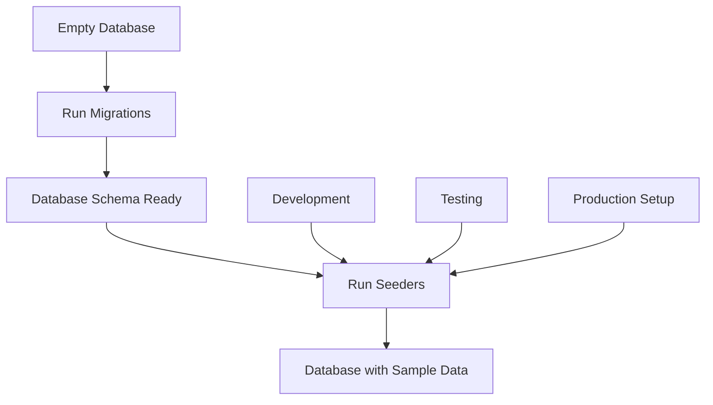

# Seeders & Sample Data

## 🎯 Understanding Seeders

Seeders are scripts that populate your database with initial or sample data. They're essential for development, testing, and setting up initial production data.



## 🌱 Why Use Seeders?

| Use Case | Description | Example |
|----------|-------------|---------|
| **Development** | Consistent test data across team | User accounts, sample posts |
| **Testing** | Predictable data for test cases | Known users, specific scenarios |
| **Demo Data** | Showcase application features | Complete blog with content |
| **Initial Setup** | Production reference data | Admin users, default categories |
| **Performance Testing** | Large datasets for optimization | Thousands of records |

## 🚀 Setting Up Seeders

### Generate Seeder Files

```bash
# Create a new seeder
npx sequelize-cli seed:generate --name demo-users

# Create specific seeders
npx sequelize-cli seed:generate --name admin-users
npx sequelize-cli seed:generate --name sample-posts
npx sequelize-cli seed:generate --name categories
npx sequelize-cli seed:generate --name user-profiles
```

Generated files appear in `seeders/` directory:
```
seeders/
├── 20231201000000-demo-users.js
├── 20231201000001-admin-users.js
├── 20231201000002-sample-posts.js
├── 20231201000003-categories.js
└── 20231201000004-user-profiles.js
```

### Basic Seeder Structure

```javascript
// seeders/20231201000000-demo-users.js
'use strict';

module.exports = {
  up: async (queryInterface, Sequelize) => {
    await queryInterface.bulkInsert('users', [
      {
        first_name: 'John',
        last_name: 'Doe',
        email: 'john.doe@example.com',
        password_hash: '$2b$10$...',
        is_active: true,
        created_at: new Date(),
        updated_at: new Date()
      },
      {
        first_name: 'Jane',
        last_name: 'Smith',
        email: 'jane.smith@example.com',
        password_hash: '$2b$10$...',
        is_active: true,
        created_at: new Date(),
        updated_at: new Date()
      }
    ]);
  },

  down: async (queryInterface, Sequelize) => {
    await queryInterface.bulkDelete('users', null, {});
  }
};
```

## 📝 Creating Comprehensive Seeders

### 1. Users Seeder

```javascript
// seeders/20231201000000-demo-users.js
'use strict';
const bcrypt = require('bcrypt');

module.exports = {
  up: async (queryInterface, Sequelize) => {
    const users = [];
    const saltRounds = 10;
    
    // Admin users
    users.push({
      first_name: 'Admin',
      last_name: 'User',
      email: 'admin@blogapp.com',
      password_hash: await bcrypt.hash('admin123', saltRounds),
      is_active: true,
      role: 'admin',
      email_verified: true,
      created_at: new Date(),
      updated_at: new Date()
    });
    
    // Regular users with variety
    const sampleUsers = [
      { firstName: 'John', lastName: 'Doe', email: 'john.doe@example.com' },
      { firstName: 'Jane', lastName: 'Smith', email: 'jane.smith@example.com' },
      { firstName: 'Mike', lastName: 'Johnson', email: 'mike.johnson@example.com' },
      { firstName: 'Sarah', lastName: 'Williams', email: 'sarah.williams@example.com' },
      { firstName: 'David', lastName: 'Brown', email: 'david.brown@example.com' },
      { firstName: 'Emily', lastName: 'Davis', email: 'emily.davis@example.com' },
      { firstName: 'Chris', lastName: 'Miller', email: 'chris.miller@example.com' },
      { firstName: 'Lisa', lastName: 'Wilson', email: 'lisa.wilson@example.com' },
      { firstName: 'Robert', lastName: 'Moore', email: 'robert.moore@example.com' },
      { firstName: 'Jessica', lastName: 'Taylor', email: 'jessica.taylor@example.com' }
    ];
    
    for (const user of sampleUsers) {
      users.push({
        first_name: user.firstName,
        last_name: user.lastName,
        email: user.email,
        password_hash: await bcrypt.hash('password123', saltRounds),
        is_active: Math.random() > 0.1, // 90% active
        role: 'user',
        email_verified: Math.random() > 0.2, // 80% verified
        created_at: randomDate(new Date(2023, 0, 1), new Date()),
        updated_at: new Date()
      });
    }
    
    await queryInterface.bulkInsert('users', users);
  },

  down: async (queryInterface, Sequelize) => {
    await queryInterface.bulkDelete('users', null, {});
  }
};

// Helper function for random dates
function randomDate(start, end) {
  return new Date(start.getTime() + Math.random() * (end.getTime() - start.getTime()));
}
```

### 2. Categories Seeder

```javascript
// seeders/20231201000001-categories.js
'use strict';

module.exports = {
  up: async (queryInterface, Sequelize) => {
    const categories = [
      {
        name: 'Technology',
        slug: 'technology',
        description: 'Latest tech trends, programming, and digital innovation',
        color: '#3B82F6',
        is_featured: true,
        created_at: new Date(),
        updated_at: new Date()
      },
      {
        name: 'Lifestyle',
        slug: 'lifestyle',
        description: 'Health, wellness, and daily life tips',
        color: '#10B981',
        is_featured: true,
        created_at: new Date(),
        updated_at: new Date()
      },
      {
        name: 'Business',
        slug: 'business',
        description: 'Entrepreneurship, finance, and career advice',
        color: '#F59E0B',
        is_featured: true,
        created_at: new Date(),
        updated_at: new Date()
      },
      {
        name: 'Travel',
        slug: 'travel',
        description: 'Travel guides, tips, and adventure stories',
        color: '#EF4444',
        is_featured: false,
        created_at: new Date(),
        updated_at: new Date()
      },
      {
        name: 'Food & Cooking',
        slug: 'food-cooking',
        description: 'Recipes, cooking tips, and culinary adventures',
        color: '#8B5CF6',
        is_featured: false,
        created_at: new Date(),
        updated_at: new Date()
      },
      {
        name: 'Sports',
        slug: 'sports',
        description: 'Sports news, analysis, and fitness tips',
        color: '#06B6D4',
        is_featured: false,
        created_at: new Date(),
        updated_at: new Date()
      },
      {
        name: 'Education',
        slug: 'education',
        description: 'Learning resources, tutorials, and academic insights',
        color: '#84CC16',
        is_featured: false,
        created_at: new Date(),
        updated_at: new Date()
      },
      {
        name: 'Entertainment',
        slug: 'entertainment',
        description: 'Movies, music, games, and pop culture',
        color: '#F97316',
        is_featured: false,
        created_at: new Date(),
        updated_at: new Date()
      }
    ];

    await queryInterface.bulkInsert('categories', categories);
  },

  down: async (queryInterface, Sequelize) => {
    await queryInterface.bulkDelete('categories', null, {});
  }
};
```

### 3. Posts Seeder with Realistic Content

```javascript
// seeders/20231201000002-sample-posts.js
'use strict';

module.exports = {
  up: async (queryInterface, Sequelize) => {
    // First get user IDs
    const users = await queryInterface.sequelize.query(
      'SELECT id FROM users ORDER BY created_at',
      { type: Sequelize.QueryTypes.SELECT }
    );
    
    // Get category IDs
    const categories = await queryInterface.sequelize.query(
      'SELECT id, slug FROM categories',
      { type: Sequelize.QueryTypes.SELECT }
    );
    
    const posts = [];
    
    // Technology posts
    const techPosts = [
      {
        title: 'The Future of Web Development in 2024',
        slug: 'future-web-development-2024',
        excerpt: 'Exploring emerging trends and technologies shaping web development',
        content: generateLongContent('web development', 'future trends', 'JavaScript frameworks'),
        status: 'published',
        category: 'technology'
      },
      {
        title: 'Mastering PostgreSQL: Advanced Tips and Tricks',
        slug: 'mastering-postgresql-advanced-tips',
        excerpt: 'Deep dive into PostgreSQL optimization and advanced features',
        content: generateLongContent('PostgreSQL', 'database optimization', 'performance tuning'),
        status: 'published',
        category: 'technology'
      },
      {
        title: 'Building Scalable Node.js Applications',
        slug: 'building-scalable-nodejs-applications',
        excerpt: 'Best practices for creating maintainable and scalable Node.js apps',
        content: generateLongContent('Node.js', 'scalability', 'microservices'),
        status: 'published',
        category: 'technology'
      }
    ];
    
    // Lifestyle posts
    const lifestylePosts = [
      {
        title: 'Morning Routines That Transform Your Day',
        slug: 'morning-routines-transform-day',
        excerpt: 'How the right morning routine can boost productivity and happiness',
        content: generateLongContent('morning routine', 'productivity', 'wellness'),
        status: 'published',
        category: 'lifestyle'
      },
      {
        title: 'Minimalism in the Digital Age',
        slug: 'minimalism-digital-age',
        excerpt: 'Finding balance between technology and simple living',
        content: generateLongContent('minimalism', 'digital wellness', 'simple living'),
        status: 'published',
        category: 'lifestyle'
      }
    ];
    
    // Business posts
    const businessPosts = [
      {
        title: 'Remote Work: Best Practices for Teams',
        slug: 'remote-work-best-practices-teams',
        excerpt: 'Strategies for successful remote team collaboration',
        content: generateLongContent('remote work', 'team management', 'collaboration'),
        status: 'published',
        category: 'business'
      },
      {
        title: 'Startup Funding: A Complete Guide',
        slug: 'startup-funding-complete-guide',
        excerpt: 'Everything you need to know about raising funds for your startup',
        content: generateLongContent('startup funding', 'venture capital', 'entrepreneurship'),
        status: 'draft',
        category: 'business'
      }
    ];
    
    const allPosts = [...techPosts, ...lifestylePosts, ...businessPosts];
    
    // Generate posts with metadata
    for (let i = 0; i < allPosts.length; i++) {
      const post = allPosts[i];
      const randomUser = users[Math.floor(Math.random() * users.length)];
      const publishedDate = randomDate(new Date(2023, 6, 1), new Date());
      
      posts.push({
        user_id: randomUser.id,
        title: post.title,
        slug: post.slug,
        excerpt: post.excerpt,
        content: post.content,
        status: post.status,
        published_at: post.status === 'published' ? publishedDate : null,
        view_count: post.status === 'published' ? Math.floor(Math.random() * 1000) + 50 : 0,
        metadata: JSON.stringify({
          category: post.category,
          readingTime: Math.floor(Math.random() * 10) + 3,
          featured: Math.random() > 0.7,
          tags: generateTags(post.category)
        }),
        tags: generateTags(post.category),
        created_at: publishedDate,
        updated_at: publishedDate
      });
    }
    
    await queryInterface.bulkInsert('posts', posts);
  },

  down: async (queryInterface, Sequelize) => {
    await queryInterface.bulkDelete('posts', null, {});
  }
};

function generateLongContent(topic1, topic2, topic3) {
  return `
# Introduction

This comprehensive guide explores ${topic1} in detail, covering essential concepts and practical applications.

## What is ${topic1}?

${topic1} represents a crucial aspect of modern development. Understanding ${topic2} is essential for anyone working in this field.

### Key Benefits

1. **Improved Performance**: ${topic1} offers significant performance improvements
2. **Better Scalability**: Handle more users and data efficiently  
3. **Enhanced Security**: Built-in security features protect your application
4. **Developer Experience**: Streamlined development process

## Deep Dive into ${topic2}

When working with ${topic2}, consider these important factors:

- **Best Practices**: Follow industry standards and conventions
- **Common Pitfalls**: Avoid these frequent mistakes
- **Optimization Strategies**: Techniques for better performance

### Implementation Example

\`\`\`javascript
// Example implementation
const example = {
  topic: '${topic1}',
  features: ['${topic2}', '${topic3}'],
  implementation: function() {
    return 'Detailed implementation here';
  }
};
\`\`\`

## Advanced ${topic3} Techniques

For experienced developers, ${topic3} provides advanced capabilities:

- Advanced querying and filtering
- Performance optimization techniques
- Integration with other systems
- Monitoring and debugging

## Conclusion

${topic1} continues to evolve, with ${topic2} and ${topic3} playing crucial roles in its development. Stay updated with the latest trends and best practices.

## Further Reading

- Official documentation
- Community resources
- Advanced tutorials
- Case studies

---

*This article covers fundamental to advanced concepts in ${topic1}. For more detailed information, refer to the official documentation.*
  `.trim();
}

function generateTags(category) {
  const tagOptions = {
    technology: ['javascript', 'node.js', 'postgresql', 'web-dev', 'programming', 'tutorial'],
    lifestyle: ['wellness', 'productivity', 'health', 'mindfulness', 'habits', 'balance'],
    business: ['entrepreneurship', 'startup', 'management', 'strategy', 'leadership', 'growth'],
    travel: ['adventure', 'culture', 'guide', 'photography', 'backpacking', 'destinations'],
    'food-cooking': ['recipe', 'cooking', 'nutrition', 'kitchen', 'ingredients', 'chef']
  };
  
  const tags = tagOptions[category] || ['general', 'blog', 'article'];
  const selectedTags = [];
  const numTags = Math.floor(Math.random() * 4) + 2; // 2-5 tags
  
  for (let i = 0; i < numTags; i++) {
    const randomTag = tags[Math.floor(Math.random() * tags.length)];
    if (!selectedTags.includes(randomTag)) {
      selectedTags.push(randomTag);
    }
  }
  
  return selectedTags;
}

function randomDate(start, end) {
  return new Date(start.getTime() + Math.random() * (end.getTime() - start.getTime()));
}
```

### 4. Comments Seeder

```javascript
// seeders/20231201000003-comments.js
'use strict';

module.exports = {
  up: async (queryInterface, Sequelize) => {
    // Get users and posts
    const users = await queryInterface.sequelize.query(
      'SELECT id FROM users ORDER BY created_at',
      { type: Sequelize.QueryTypes.SELECT }
    );
    
    const posts = await queryInterface.sequelize.query(
      'SELECT id, created_at FROM posts WHERE status = \'published\'',
      { type: Sequelize.QueryTypes.SELECT }
    );
    
    const comments = [];
    
    // Sample comment templates
    const commentTemplates = [
      "Great article! This really helped me understand {topic} better.",
      "Thanks for sharing this. I've been struggling with {topic} and this clarifies a lot.",
      "Excellent explanation of {topic}. Looking forward to more content like this.",
      "I have a question about {topic}. Could you elaborate on the implementation details?",
      "This is exactly what I was looking for. The examples really make {topic} clear.",
      "Fantastic post! I've bookmarked this for future reference.",
      "Well written and informative. The section on {topic} was particularly helpful.",
      "Amazing content! I'd love to see a follow-up post diving deeper into {topic}.",
      "Clear and concise explanation. This will definitely help me in my projects.",
      "Thank you for this tutorial. It's one of the best explanations of {topic} I've found."
    ];
    
    // Generate comments for each post
    for (const post of posts) {
      const numComments = Math.floor(Math.random() * 8) + 2; // 2-9 comments per post
      
      for (let i = 0; i < numComments; i++) {
        const randomUser = users[Math.floor(Math.random() * users.length)];
        const template = commentTemplates[Math.floor(Math.random() * commentTemplates.length)];
        const commentDate = randomDate(new Date(post.created_at), new Date());
        
        comments.push({
          post_id: post.id,
          user_id: randomUser.id,
          content: template.replace('{topic}', getTopicFromComment()),
          status: Math.random() > 0.05 ? 'approved' : 'pending', // 95% approved
          is_highlighted: Math.random() > 0.9, // 10% highlighted
          created_at: commentDate,
          updated_at: commentDate
        });
      }
    }
    
    // Add some nested replies
    const parentComments = comments.slice(0, Math.floor(comments.length * 0.3));
    
    for (const parentComment of parentComments) {
      if (Math.random() > 0.6) { // 40% chance of reply
        const randomUser = users[Math.floor(Math.random() * users.length)];
        const replyDate = new Date(parentComment.created_at.getTime() + Math.random() * 7 * 24 * 60 * 60 * 1000);
        
        comments.push({
          post_id: parentComment.post_id,
          user_id: randomUser.id,
          parent_comment_id: parentComment.id,
          content: generateReply(),
          status: 'approved',
          is_highlighted: false,
          created_at: replyDate,
          updated_at: replyDate
        });
      }
    }
    
    await queryInterface.bulkInsert('comments', comments);
  },

  down: async (queryInterface, Sequelize) => {
    await queryInterface.bulkDelete('comments', null, {});
  }
};

function getTopicFromComment() {
  const topics = [
    'this concept', 'the implementation', 'the examples', 'these techniques',
    'the approach', 'this method', 'the solution', 'these insights'
  ];
  return topics[Math.floor(Math.random() * topics.length)];
}

function generateReply() {
  const replies = [
    "Thanks for the feedback! I'm glad you found it helpful.",
    "Great question! Let me elaborate on that point.",
    "I appreciate your comment. You raise a good point.",
    "Exactly! That's a crucial aspect I should have emphasized more.",
    "Thanks for reading! Feel free to ask if you have more questions.",
    "I'm happy this was useful to you. Good luck with your project!",
    "You're absolutely right. That's an important consideration.",
    "Thanks for sharing your experience with this approach."
  ];
  return replies[Math.floor(Math.random() * replies.length)];
}

function randomDate(start, end) {
  return new Date(start.getTime() + Math.random() * (end.getTime() - start.getTime()));
}
```

### 5. Post-Categories Junction Seeder

```javascript
// seeders/20231201000004-post-categories.js
'use strict';

module.exports = {
  up: async (queryInterface, Sequelize) => {
    // Get posts and categories
    const posts = await queryInterface.sequelize.query(
      'SELECT id, metadata FROM posts',
      { type: Sequelize.QueryTypes.SELECT }
    );
    
    const categories = await queryInterface.sequelize.query(
      'SELECT id, slug FROM categories',
      { type: Sequelize.QueryTypes.SELECT }
    );
    
    const postCategories = [];
    
    for (const post of posts) {
      let metadata;
      try {
        metadata = JSON.parse(post.metadata || '{}');
      } catch (e) {
        metadata = {};
      }
      
      // Find primary category
      const primaryCategory = categories.find(cat => cat.slug === metadata.category);
      if (primaryCategory) {
        postCategories.push({
          post_id: post.id,
          category_id: primaryCategory.id,
          is_primary: true,
          created_at: new Date(),
          updated_at: new Date()
        });
      }
      
      // Add secondary categories (20% chance)
      if (Math.random() > 0.8) {
        const secondaryCategory = categories.find(cat => 
          cat.id !== primaryCategory?.id && Math.random() > 0.5
        );
        
        if (secondaryCategory) {
          postCategories.push({
            post_id: post.id,
            category_id: secondaryCategory.id,
            is_primary: false,
            created_at: new Date(),
            updated_at: new Date()
          });
        }
      }
    }
    
    await queryInterface.bulkInsert('post_categories', postCategories);
  },

  down: async (queryInterface, Sequelize) => {
    await queryInterface.bulkDelete('post_categories', null, {});
  }
};
```

## 🔄 Running Seeders

### Basic Seeder Commands

```bash
# Run all seeders
npx sequelize-cli db:seed:all

# Run specific seeder
npx sequelize-cli db:seed --seed 20231201000000-demo-users.js

# Undo all seeders
npx sequelize-cli db:seed:undo:all

# Undo specific seeder
npx sequelize-cli db:seed:undo --seed 20231201000000-demo-users.js

# Check seeder status
npx sequelize-cli db:seed:status
```

### Environment-Specific Seeding

```javascript
// seeders/20231201000005-environment-specific.js
'use strict';

module.exports = {
  up: async (queryInterface, Sequelize) => {
    const environment = process.env.NODE_ENV || 'development';
    
    switch (environment) {
      case 'development':
        await seedDevelopmentData(queryInterface);
        break;
      case 'test':
        await seedTestData(queryInterface);
        break;
      case 'production':
        await seedProductionData(queryInterface);
        break;
      default:
        console.log('No seeding for environment:', environment);
    }
  },

  down: async (queryInterface, Sequelize) => {
    // Environment-specific cleanup
    const environment = process.env.NODE_ENV || 'development';
    
    if (environment !== 'production') {
      await queryInterface.bulkDelete('posts', null, {});
      await queryInterface.bulkDelete('users', null, {});
    }
  }
};

async function seedDevelopmentData(queryInterface) {
  // Rich development data
  console.log('Seeding development data...');
  // ... comprehensive seed data
}

async function seedTestData(queryInterface) {
  // Minimal, predictable test data
  console.log('Seeding test data...');
  // ... specific test scenarios
}

async function seedProductionData(queryInterface) {
  // Only essential production data
  console.log('Seeding production data...');
  // ... admin users, essential categories only
}
```

## 🏭 Production-Safe Seeders

### 1. Conditional Seeding

```javascript
// seeders/20231201000006-admin-user.js
'use strict';
const bcrypt = require('bcrypt');

module.exports = {
  up: async (queryInterface, Sequelize) => {
    // Check if admin user already exists
    const [existingAdmin] = await queryInterface.sequelize.query(
      "SELECT id FROM users WHERE email = 'admin@blogapp.com' LIMIT 1",
      { type: Sequelize.QueryTypes.SELECT }
    );
    
    if (existingAdmin) {
      console.log('Admin user already exists, skipping...');
      return;
    }
    
    // Create admin user only if it doesn't exist
    const hashedPassword = await bcrypt.hash(
      process.env.ADMIN_PASSWORD || 'defaultAdmin123',
      10
    );
    
    await queryInterface.bulkInsert('users', [{
      first_name: 'System',
      last_name: 'Administrator',
      email: 'admin@blogapp.com',
      password_hash: hashedPassword,
      role: 'admin',
      is_active: true,
      email_verified: true,
      created_at: new Date(),
      updated_at: new Date()
    }]);
    
    console.log('Admin user created successfully');
  },

  down: async (queryInterface, Sequelize) => {
    await queryInterface.bulkDelete('users', {
      email: 'admin@blogapp.com'
    });
  }
};
```

### 2. Data Validation Seeders

```javascript
// seeders/20231201000007-validate-and-seed.js
'use strict';

module.exports = {
  up: async (queryInterface, Sequelize) => {
    try {
      // Validate database state before seeding
      await validateDatabaseState(queryInterface, Sequelize);
      
      // Proceed with seeding
      await performSeeding(queryInterface, Sequelize);
      
      // Verify seeding results
      await verifySeeding(queryInterface, Sequelize);
      
      console.log('Seeding completed successfully');
    } catch (error) {
      console.error('Seeding failed:', error);
      throw error;
    }
  },

  down: async (queryInterface, Sequelize) => {
    // Safe cleanup
    await queryInterface.bulkDelete('sample_data', null, {});
  }
};

async function validateDatabaseState(queryInterface, Sequelize) {
  // Check required tables exist
  const tables = ['users', 'posts', 'categories'];
  for (const table of tables) {
    try {
      await queryInterface.describeTable(table);
    } catch (error) {
      throw new Error(`Required table '${table}' does not exist`);
    }
  }
  
  // Check for conflicting data
  const [userCount] = await queryInterface.sequelize.query(
    'SELECT COUNT(*) as count FROM users',
    { type: Sequelize.QueryTypes.SELECT }
  );
  
  if (userCount.count > 1000) {
    throw new Error('Database already contains substantial data');
  }
}

async function performSeeding(queryInterface, Sequelize) {
  // Your seeding logic here
  console.log('Performing seeding operations...');
}

async function verifySeeding(queryInterface, Sequelize) {
  // Verify seeding was successful
  const [result] = await queryInterface.sequelize.query(
    'SELECT COUNT(*) as count FROM users WHERE role = \'admin\'',
    { type: Sequelize.QueryTypes.SELECT }
  );
  
  if (result.count === 0) {
    throw new Error('Admin user was not created');
  }
}
```

## 🧪 Testing Seeders

### 1. Seeder Test Suite

```javascript
// tests/seeders.test.js
const { sequelize } = require('../models');
const { exec } = require('child_process');
const util = require('util');
const execPromise = util.promisify(exec);

describe('Seeders', () => {
  beforeEach(async () => {
    // Clean database before each test
    await sequelize.sync({ force: true });
  });
  
  afterAll(async () => {
    await sequelize.close();
  });
  
  test('should create admin user', async () => {
    await execPromise('npx sequelize-cli db:seed --seed 20231201000006-admin-user.js');
    
    const admin = await sequelize.models.User.findOne({
      where: { email: 'admin@blogapp.com' }
    });
    
    expect(admin).toBeTruthy();
    expect(admin.role).toBe('admin');
    expect(admin.isActive).toBe(true);
  });
  
  test('should create sample categories', async () => {
    await execPromise('npx sequelize-cli db:seed --seed 20231201000001-categories.js');
    
    const categories = await sequelize.models.Category.findAll();
    expect(categories.length).toBeGreaterThan(0);
    
    const techCategory = categories.find(cat => cat.slug === 'technology');
    expect(techCategory).toBeTruthy();
  });
  
  test('should create posts with proper associations', async () => {
    // Seed dependencies first
    await execPromise('npx sequelize-cli db:seed --seed 20231201000000-demo-users.js');
    await execPromise('npx sequelize-cli db:seed --seed 20231201000001-categories.js');
    await execPromise('npx sequelize-cli db:seed --seed 20231201000002-sample-posts.js');
    
    const posts = await sequelize.models.Post.findAll({
      include: [
        { model: sequelize.models.User },
        { model: sequelize.models.Category }
      ]
    });
    
    expect(posts.length).toBeGreaterThan(0);
    
    // Verify associations
    const postWithUser = posts.find(post => post.User);
    expect(postWithUser).toBeTruthy();
  });
});
```

### 2. Performance Testing Seeders

```javascript
// seeders/20231201000008-performance-test-data.js
'use strict';

module.exports = {
  up: async (queryInterface, Sequelize) => {
    if (process.env.NODE_ENV !== 'test') {
      console.log('Performance seeder only runs in test environment');
      return;
    }
    
    console.log('Creating large dataset for performance testing...');
    
    const batchSize = 1000;
    const totalUsers = 10000;
    const totalPosts = 50000;
    
    // Create users in batches
    for (let i = 0; i < totalUsers; i += batchSize) {
      const users = [];
      for (let j = 0; j < batchSize && (i + j) < totalUsers; j++) {
        users.push({
          first_name: `User${i + j}`,
          last_name: `Test`,
          email: `user${i + j}@test.com`,
          password_hash: '$2b$10$defaulthash',
          is_active: true,
          created_at: new Date(),
          updated_at: new Date()
        });
      }
      
      await queryInterface.bulkInsert('users', users);
      console.log(`Created ${i + users.length} users...`);
    }
    
    // Create posts in batches
    const userIds = await queryInterface.sequelize.query(
      'SELECT id FROM users ORDER BY id',
      { type: Sequelize.QueryTypes.SELECT }
    );
    
    for (let i = 0; i < totalPosts; i += batchSize) {
      const posts = [];
      for (let j = 0; j < batchSize && (i + j) < totalPosts; j++) {
        const randomUser = userIds[Math.floor(Math.random() * userIds.length)];
        posts.push({
          user_id: randomUser.id,
          title: `Performance Test Post ${i + j}`,
          slug: `performance-test-post-${i + j}`,
          content: 'This is a test post for performance testing.',
          status: 'published',
          view_count: Math.floor(Math.random() * 1000),
          created_at: new Date(),
          updated_at: new Date()
        });
      }
      
      await queryInterface.bulkInsert('posts', posts);
      console.log(`Created ${i + posts.length} posts...`);
    }
    
    console.log('Performance test data creation completed');
  },

  down: async (queryInterface, Sequelize) => {
    await queryInterface.bulkDelete('posts', {
      title: { [Sequelize.Op.like]: 'Performance Test Post%' }
    });
    await queryInterface.bulkDelete('users', {
      email: { [Sequelize.Op.like]: 'user%@test.com' }
    });
  }
};
```

## 🛠️ Advanced Seeding Techniques

### 1. Dynamic Data Generation

```javascript
// utils/data-generators.js
const faker = require('faker');

class DataGenerator {
  static generateUser() {
    return {
      first_name: faker.name.firstName(),
      last_name: faker.name.lastName(),
      email: faker.internet.email(),
      password_hash: '$2b$10$defaulthash',
      phone: faker.phone.phoneNumber(),
      date_of_birth: faker.date.past(50),
      bio: faker.lorem.paragraph(),
      avatar_url: faker.image.avatar(),
      is_active: faker.random.boolean(),
      created_at: faker.date.past(2),
      updated_at: new Date()
    };
  }
  
  static generatePost(userId, categoryId) {
    const title = faker.lorem.sentence();
    return {
      user_id: userId,
      title: title,
      slug: title.toLowerCase().replace(/[^a-z0-9]/g, '-').replace(/-+/g, '-'),
      excerpt: faker.lorem.paragraph(),
      content: this.generateLongContent(),
      status: faker.random.arrayElement(['draft', 'published', 'archived']),
      view_count: faker.random.number({ min: 0, max: 10000 }),
      metadata: JSON.stringify({
        readingTime: faker.random.number({ min: 1, max: 15 }),
        featured: faker.random.boolean(),
        seoTitle: title,
        seoDescription: faker.lorem.sentence()
      }),
      created_at: faker.date.past(1),
      updated_at: new Date()
    };
  }
  
  static generateLongContent() {
    const paragraphs = [];
    const numParagraphs = faker.random.number({ min: 3, max: 10 });
    
    for (let i = 0; i < numParagraphs; i++) {
      paragraphs.push(faker.lorem.paragraphs(faker.random.number({ min: 2, max: 5 })));
    }
    
    return paragraphs.join('\n\n');
  }
  
  static generateComment(postId, userId) {
    return {
      post_id: postId,
      user_id: userId,
      content: faker.lorem.sentences(faker.random.number({ min: 1, max: 4 })),
      status: faker.random.arrayElement(['pending', 'approved', 'rejected']),
      created_at: faker.date.recent(30),
      updated_at: new Date()
    };
  }
}

module.exports = DataGenerator;
```

### 2. Relationship-Aware Seeding

```javascript
// seeders/20231201000009-realistic-blog-data.js
'use strict';
const DataGenerator = require('../utils/data-generators');

module.exports = {
  up: async (queryInterface, Sequelize) => {
    const transaction = await queryInterface.sequelize.transaction();
    
    try {
      console.log('Starting realistic blog data seeding...');
      
      // 1. Create users
      const users = [];
      for (let i = 0; i < 50; i++) {
        users.push(DataGenerator.generateUser());
      }
      await queryInterface.bulkInsert('users', users, { transaction });
      
      // 2. Get created user IDs
      const createdUsers = await queryInterface.sequelize.query(
        'SELECT id FROM users ORDER BY created_at DESC LIMIT 50',
        { type: Sequelize.QueryTypes.SELECT, transaction }
      );
      
      // 3. Get categories
      const categories = await queryInterface.sequelize.query(
        'SELECT id FROM categories',
        { type: Sequelize.QueryTypes.SELECT, transaction }
      );
      
      // 4. Create posts with realistic distribution
      const posts = [];
      const authorsActivity = createdUsers.map(user => ({
        userId: user.id,
        postCount: Math.floor(Math.random() * 10) + 1 // 1-10 posts per author
      }));
      
      for (const author of authorsActivity) {
        for (let i = 0; i < author.postCount; i++) {
          const randomCategory = categories[Math.floor(Math.random() * categories.length)];
          posts.push(DataGenerator.generatePost(author.userId, randomCategory.id));
        }
      }
      
      await queryInterface.bulkInsert('posts', posts, { transaction });
      
      // 5. Get created posts
      const createdPosts = await queryInterface.sequelize.query(
        'SELECT id, user_id FROM posts WHERE status = \'published\'',
        { type: Sequelize.QueryTypes.SELECT, transaction }
      );
      
      // 6. Create comments with realistic patterns
      const comments = [];
      for (const post of createdPosts) {
        const commentCount = Math.floor(Math.random() * 8); // 0-7 comments per post
        
        for (let i = 0; i < commentCount; i++) {
          // Comments from different users (not post author)
          const commenters = createdUsers.filter(user => user.id !== post.user_id);
          const randomCommenter = commenters[Math.floor(Math.random() * commenters.length)];
          
          comments.push(DataGenerator.generateComment(post.id, randomCommenter.id));
        }
      }
      
      if (comments.length > 0) {
        await queryInterface.bulkInsert('comments', comments, { transaction });
      }
      
      await transaction.commit();
      console.log(`Seeded ${users.length} users, ${posts.length} posts, ${comments.length} comments`);
      
    } catch (error) {
      await transaction.rollback();
      console.error('Seeding failed:', error);
      throw error;
    }
  },

  down: async (queryInterface, Sequelize) => {
    const transaction = await queryInterface.sequelize.transaction();
    
    try {
      await queryInterface.bulkDelete('comments', null, { transaction });
      await queryInterface.bulkDelete('posts', null, { transaction });
      await queryInterface.bulkDelete('users', {
        email: { [Sequelize.Op.like]: '%@%' }
      }, { transaction });
      
      await transaction.commit();
    } catch (error) {
      await transaction.rollback();
      throw error;
    }
  }
};
```

## 📊 Seeder Best Practices

### 1. Seeding Strategy

```javascript
// seeding-strategy.md
/*
1. Order Dependencies
   - Users first (no dependencies)
   - Categories second (no dependencies)
   - Posts third (depends on users, categories)
   - Comments last (depends on posts, users)

2. Data Consistency
   - Use consistent naming conventions
   - Maintain referential integrity
   - Include realistic data volumes

3. Environment Awareness
   - Development: Rich, diverse data
   - Test: Minimal, predictable data
   - Production: Essential data only

4. Performance Considerations
   - Batch insertions for large datasets
   - Use transactions for consistency
   - Monitor memory usage

5. Maintenance
   - Version control seeder files
   - Document seeding procedures
   - Test seeders regularly
*/
```

### 2. Error Handling

```javascript
// seeders/20231201000010-robust-seeding.js
'use strict';

module.exports = {
  up: async (queryInterface, Sequelize) => {
    const errors = [];
    
    try {
      await seedWithErrorHandling(queryInterface, Sequelize, errors);
      
      if (errors.length > 0) {
        console.warn('Seeding completed with warnings:', errors);
      } else {
        console.log('Seeding completed successfully');
      }
    } catch (error) {
      console.error('Critical seeding error:', error);
      throw error;
    }
  },

  down: async (queryInterface, Sequelize) => {
    // Robust cleanup
    try {
      await queryInterface.bulkDelete('posts', null, {});
      console.log('Cleanup completed');
    } catch (error) {
      console.warn('Cleanup warning:', error.message);
    }
  }
};

async function seedWithErrorHandling(queryInterface, Sequelize, errors) {
  const operations = [
    () => seedUsers(queryInterface, errors),
    () => seedCategories(queryInterface, errors),
    () => seedPosts(queryInterface, errors)
  ];
  
  for (const operation of operations) {
    try {
      await operation();
    } catch (error) {
      errors.push(error.message);
      console.warn('Operation failed:', error.message);
    }
  }
}

async function seedUsers(queryInterface, errors) {
  try {
    // Check if users already exist
    const [userCount] = await queryInterface.sequelize.query(
      'SELECT COUNT(*) as count FROM users',
      { type: Sequelize.QueryTypes.SELECT }
    );
    
    if (userCount.count > 0) {
      errors.push('Users already exist, skipping user seeding');
      return;
    }
    
    // Proceed with user seeding
    await queryInterface.bulkInsert('users', [
      // user data
    ]);
    
  } catch (error) {
    throw new Error(`User seeding failed: ${error.message}`);
  }
}
```

## 🎯 Key Takeaways

1. **Data Consistency**: Seeders provide consistent data across environments
2. **Development Efficiency**: Speed up development with realistic test data
3. **Testing Support**: Predictable data for automated tests
4. **Production Safety**: Conditional seeding prevents data conflicts
5. **Relationship Management**: Maintain referential integrity
6. **Performance Awareness**: Use batching for large datasets
7. **Error Handling**: Robust error handling for reliable seeding

## 🚀 What's Next?

Now that you have sample data, let's dive into [[09-CRUD-Operations|CRUD Operations in Detail]] to learn how to manipulate this data effectively!

---

## 🔗 Related Topics
- [[07-Migrations|Migrations & Schema Management]]
- [[09-CRUD-Operations|CRUD Operations in Detail]]
- [[18-Testing|Testing Strategies]]
