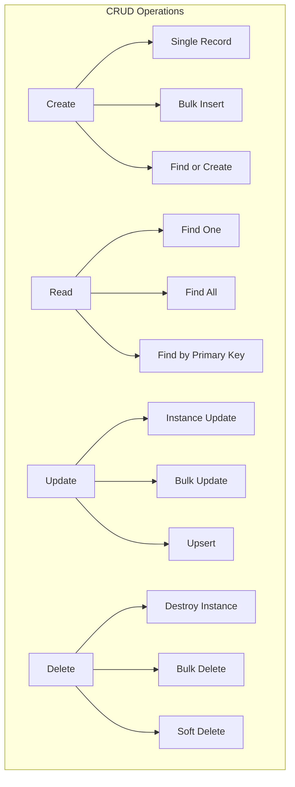

# CRUD Operations in Detail

## 🎯 Mastering Data Operations

CRUD (Create, Read, Update, Delete) operations are the foundation of any database application. This guide covers every aspect of data manipulation in Sequelize.



## 🆕 CREATE Operations

### Single Record Creation

```javascript
// Basic creation
const user = await User.create({
    firstName: 'John',
    lastName: 'Doe',
    email: 'john@example.com',
    age: 30
});

console.log('Created user:', user.id);

// Creation with validation
try {
    const user = await User.create({
        firstName: 'Jane',
        lastName: 'Smith',
        email: 'invalid-email', // Will trigger validation error
        age: 25
    });
} catch (error) {
    if (error.name === 'SequelizeValidationError') {
        console.error('Validation errors:', error.errors.map(e => e.message));
    }
}

// Creation with specific fields only
const user = await User.create({
    firstName: 'Bob',
    lastName: 'Johnson',
    email: 'bob@example.com',
    age: 35,
    internalNote: 'This should not be saved' // Won't be saved if not in fields
}, {
    fields: ['firstName', 'lastName', 'email', 'age'] // Only these fields
});

// Creation in transaction
const transaction = await sequelize.transaction();
try {
    const user = await User.create({
        firstName: 'Alice',
        lastName: 'Wilson',
        email: 'alice@example.com'
    }, { transaction });
    
    await transaction.commit();
    console.log('User created successfully');
} catch (error) {
    await transaction.rollback();
    console.error('Failed to create user:', error.message);
}
```

### Bulk Creation

```javascript
// Bulk create multiple records
const users = await User.bulkCreate([
    {
        firstName: 'User1',
        lastName: 'Test',
        email: 'user1@example.com'
    },
    {
        firstName: 'User2',
        lastName: 'Test',
        email: 'user2@example.com'
    },
    {
        firstName: 'User3',
        lastName: 'Test',
        email: 'user3@example.com'
    }
]);

console.log(`Created ${users.length} users`);

// Bulk create with validation
const users = await User.bulkCreate([
    { firstName: 'Valid', lastName: 'User', email: 'valid@example.com' },
    { firstName: 'Invalid', lastName: 'User', email: 'invalid-email' }
], {
    validate: true, // Enable validation for each record
    ignoreDuplicates: true // Skip duplicate records instead of failing
});

// Bulk create with individual validation errors
const users = await User.bulkCreate([
    { firstName: 'John', email: 'john@example.com' },
    { firstName: 'Jane', email: 'invalid-email' },
    { firstName: 'Bob', email: 'bob@example.com' }
], {
    validate: true,
    individualHooks: true, // Run beforeCreate/afterCreate hooks for each record
    returning: true // Return created instances (PostgreSQL)
});

// Handle bulk creation with partial failures
async function safeBulkCreate(data) {
    const results = { success: [], failed: [] };
    
    for (const item of data) {
        try {
            const created = await User.create(item);
            results.success.push(created);
        } catch (error) {
            results.failed.push({ data: item, error: error.message });
        }
    }
    
    return results;
}
```

### Advanced Creation Patterns

```javascript
// Find or Create pattern
const [user, created] = await User.findOrCreate({
    where: { email: 'john@example.com' },
    defaults: {
        firstName: 'John',
        lastName: 'Doe',
        age: 30
    }
});

if (created) {
    console.log('User was created:', user.email);
} else {
    console.log('User already existed:', user.email);
}

// Create with nested associations
const userWithProfile = await User.create({
    firstName: 'John',
    lastName: 'Doe',
    email: 'john@example.com',
    profile: {
        bio: 'Software developer',
        website: 'https://johndoe.com'
    }
}, {
    include: [{
        model: UserProfile,
        as: 'profile'
    }]
});

// Create with many-to-many associations
const post = await Post.create({
    title: 'New Blog Post',
    content: 'This is the content...',
    tags: [
        { name: 'JavaScript', slug: 'javascript' },
        { name: 'Tutorial', slug: 'tutorial' }
    ]
}, {
    include: [{
        model: Tag,
        as: 'tags'
    }]
});
```

## 🔍 READ Operations

### Basic Finding

```javascript
// Find all records
const users = await User.findAll();

// Find with conditions
const activeUsers = await User.findAll({
    where: {
        isActive: true
    }
});

// Find one record
const user = await User.findOne({
    where: {
        email: 'john@example.com'
    }
});

// Find by primary key
const user = await User.findByPk(1);

// Find by primary key with associations
const user = await User.findByPk(1, {
    include: [{
        model: UserProfile,
        as: 'profile'
    }]
});
```

### Advanced Querying

```javascript
const { Op } = require('sequelize');

// Complex where conditions
const users = await User.findAll({
    where: {
        [Op.and]: [
            { isActive: true },
            {
                [Op.or]: [
                    { role: 'admin' },
                    { role: 'moderator' }
                ]
            }
        ],
        age: {
            [Op.between]: [18, 65]
        },
        email: {
            [Op.iLike]: '%@gmail.com' // Case-insensitive LIKE
        },
        createdAt: {
            [Op.gte]: new Date(Date.now() - 30 * 24 * 60 * 60 * 1000) // Last 30 days
        }
    }
});

// Selecting specific attributes
const users = await User.findAll({
    attributes: ['id', 'firstName', 'lastName', 'email'],
    where: { isActive: true }
});

// Calculated attributes
const users = await User.findAll({
    attributes: [
        'id',
        'firstName',
        'lastName',
        [sequelize.fn('CONCAT', sequelize.col('firstName'), ' ', sequelize.col('lastName')), 'fullName'],
        [sequelize.fn('DATE_PART', 'year', sequelize.fn('AGE', sequelize.col('dateOfBirth'))), 'age']
    ]
});

// Excluding attributes
const users = await User.findAll({
    attributes: {
        exclude: ['passwordHash', 'deletedAt']
    }
});
```

### Ordering and Pagination

```javascript
// Simple ordering
const users = await User.findAll({
    order: [['createdAt', 'DESC']]
});

// Multiple order criteria
const users = await User.findAll({
    order: [
        ['lastName', 'ASC'],
        ['firstName', 'ASC'],
        ['createdAt', 'DESC']
    ]
});

// Ordering by associated model
const users = await User.findAll({
    include: [{
        model: Post,
        as: 'posts'
    }],
    order: [
        ['firstName', 'ASC'],
        [{ model: Post, as: 'posts' }, 'publishedAt', 'DESC']
    ]
});

// Pagination
const limit = 10;
const offset = 20; // Skip first 20 records
const users = await User.findAll({
    limit: limit,
    offset: offset,
    order: [['createdAt', 'DESC']]
});

// Find and count all (for pagination info)
const { count, rows } = await User.findAndCountAll({
    where: { isActive: true },
    limit: 10,
    offset: 0,
    order: [['createdAt', 'DESC']]
});

console.log(`Found ${count} total users, showing ${rows.length} on this page`);

// Pagination helper function
async function getPaginatedUsers(page = 1, pageSize = 10, filters = {}) {
    const offset = (page - 1) * pageSize;
    
    const { count, rows } = await User.findAndCountAll({
        where: filters,
        limit: pageSize,
        offset: offset,
        order: [['createdAt', 'DESC']],
        distinct: true // Important when using includes
    });
    
    return {
        users: rows,
        pagination: {
            currentPage: page,
            pageSize: pageSize,
            totalItems: count,
            totalPages: Math.ceil(count / pageSize),
            hasNext: page * pageSize < count,
            hasPrev: page > 1
        }
    };
}
```

### Aggregation and Grouping

```javascript
// Count records
const userCount = await User.count();
const activeUserCount = await User.count({
    where: { isActive: true }
});

// Find max/min values
const stats = await User.findAll({
    attributes: [
        [sequelize.fn('COUNT', sequelize.col('id')), 'totalUsers'],
        [sequelize.fn('MAX', sequelize.col('age')), 'maxAge'],
        [sequelize.fn('MIN', sequelize.col('age')), 'minAge'],
        [sequelize.fn('AVG', sequelize.col('age')), 'avgAge']
    ]
});

// Group by with aggregation
const usersByRole = await User.findAll({
    attributes: [
        'role',
        [sequelize.fn('COUNT', sequelize.col('id')), 'count']
    ],
    group: ['role'],
    order: [[sequelize.fn('COUNT', sequelize.col('id')), 'DESC']]
});

// Having clause (filter groups)
const popularTags = await Tag.findAll({
    attributes: [
        'id',
        'name',
        [sequelize.fn('COUNT', sequelize.col('posts.id')), 'postCount']
    ],
    include: [{
        model: Post,
        as: 'posts',
        attributes: []
    }],
    group: ['Tag.id', 'Tag.name'],
    having: sequelize.where(
        sequelize.fn('COUNT', sequelize.col('posts.id')),
        {
            [Op.gte]: 5 // Tags with at least 5 posts
        }
    ),
    order: [[sequelize.fn('COUNT', sequelize.col('posts.id')), 'DESC']]
});
```

### Raw Queries

```javascript
// Simple raw query
const [results, metadata] = await sequelize.query(
    'SELECT * FROM users WHERE age > :age',
    {
        replacements: { age: 18 },
        type: QueryTypes.SELECT
    }
);

// Raw query with model mapping
const users = await sequelize.query(
    'SELECT * FROM users WHERE is_active = true',
    {
        model: User,
        mapToModel: true // Maps results to User instances
    }
);

// Complex analytical query
const monthlyStats = await sequelize.query(`
    SELECT 
        DATE_TRUNC('month', created_at) as month,
        COUNT(*) as new_users,
        COUNT(*) FILTER (WHERE is_active = true) as active_users
    FROM users 
    WHERE created_at >= NOW() - INTERVAL '12 months'
    GROUP BY DATE_TRUNC('month', created_at)
    ORDER BY month DESC
`, {
    type: QueryTypes.SELECT
});
```

## 🔄 UPDATE Operations

### Instance Updates

```javascript
// Find and update instance
const user = await User.findByPk(1);
user.firstName = 'Updated Name';
user.lastLoginAt = new Date();
await user.save();

// Update with save options
await user.save({
    fields: ['firstName', 'lastLoginAt'], // Only save specific fields
    transaction: transaction
});

// Update method (more convenient)
const user = await User.findByPk(1);
await user.update({
    firstName: 'New Name',
    email: 'newemail@example.com'
});

// Increment/Decrement
const user = await User.findByPk(1);
await user.increment('loginCount'); // Increment by 1
await user.increment('loginCount', { by: 5 }); // Increment by 5
await user.decrement('credits', { by: 10 }); // Decrement by 10

// Multiple field increment
await user.increment({
    loginCount: 1,
    viewCount: 5
});
```

### Bulk Updates

```javascript
// Update multiple records
const [affectedRows] = await User.update(
    { isActive: false }, // What to update
    {
        where: {
            lastLoginAt: {
                [Op.lt]: new Date(Date.now() - 365 * 24 * 60 * 60 * 1000) // 1 year ago
            }
        }
    }
);

console.log(`Updated ${affectedRows} users`);

// Conditional update with returning
const [affectedRows, affectedInstances] = await User.update(
    { 
        role: 'premium',
        upgradeDate: new Date()
    },
    {
        where: {
            credits: {
                [Op.gte]: 1000
            }
        },
        returning: true // Return updated instances (PostgreSQL)
    }
);

// Update with joins
await sequelize.query(`
    UPDATE users 
    SET role = 'author' 
    WHERE id IN (
        SELECT DISTINCT user_id 
        FROM posts 
        WHERE status = 'published'
        GROUP BY user_id 
        HAVING COUNT(*) >= 5
    )
`);
```

### Upsert Operations

```javascript
// Upsert (Insert or Update)
const [user, created] = await User.upsert({
    id: 1, // If record with id=1 exists, update it
    firstName: 'John',
    lastName: 'Doe',
    email: 'john@example.com',
    age: 30
});

if (created) {
    console.log('User was created');
} else {
    console.log('User was updated');
}

// Upsert with specific conflict fields
const [user, created] = await User.upsert({
    email: 'unique@example.com', // Conflict field
    firstName: 'Jane',
    lastName: 'Smith',
    age: 25
}, {
    conflictFields: ['email'] // Specify which fields define uniqueness
});

// Bulk upsert using bulkCreate
const users = await User.bulkCreate([
    { id: 1, firstName: 'John', email: 'john@example.com' },
    { id: 2, firstName: 'Jane', email: 'jane@example.com' },
    { firstName: 'Bob', email: 'bob@example.com' } // New user
], {
    updateOnDuplicate: ['firstName', 'email'] // Fields to update on conflict
});
```

## 🗑️ DELETE Operations

### Instance Deletion

```javascript
// Find and destroy
const user = await User.findByPk(1);
await user.destroy();

// Destroy with options
await user.destroy({
    transaction: transaction,
    force: true // Force delete even if paranoid mode is enabled
});

// Soft delete (if paranoid: true in model)
const user = await User.findByPk(1);
await user.destroy(); // Sets deletedAt timestamp

// Restore soft deleted record
await user.restore();
```

### Bulk Deletion

```javascript
// Delete multiple records
const deletedRows = await User.destroy({
    where: {
        isActive: false,
        createdAt: {
            [Op.lt]: new Date(Date.now() - 365 * 24 * 60 * 60 * 1000) // Older than 1 year
        }
    }
});

console.log(`Deleted ${deletedRows} users`);

// Force delete (bypass paranoid mode)
const deletedRows = await User.destroy({
    where: { id: [1, 2, 3] },
    force: true
});

// Delete all records (be careful!)
await User.destroy({
    where: {}, // Empty where clause = all records
    truncate: true // More efficient for deleting all
});

// Truncate table (fastest way to delete all)
await User.truncate(); // Removes all data and resets auto-increment
```

### Cascade Deletion

```javascript
// When foreign key constraints are set with onDelete: 'CASCADE'
const user = await User.findByPk(1);
await user.destroy(); // Also deletes related posts, comments, etc.

// Manual cascade deletion
async function deleteUserWithRelatedData(userId) {
    const transaction = await sequelize.transaction();
    
    try {
        // Delete in correct order to avoid foreign key violations
        await Comment.destroy({ where: { authorId: userId }, transaction });
        await Post.destroy({ where: { authorId: userId }, transaction });
        await UserProfile.destroy({ where: { userId: userId }, transaction });
        await User.destroy({ where: { id: userId }, transaction });
        
        await transaction.commit();
        console.log('User and all related data deleted successfully');
    } catch (error) {
        await transaction.rollback();
        throw error;
    }
}
```

## 🔍 Advanced CRUD Patterns

### Atomic Operations

```javascript
// Atomic counter update
async function incrementPostViews(postId) {
    const [affectedRows] = await Post.update(
        { 
            viewCount: sequelize.literal('view_count + 1'),
            lastViewedAt: new Date()
        },
        { where: { id: postId } }
    );
    
    return affectedRows > 0;
}

// Atomic inventory management
async function purchaseProduct(productId, quantity) {
    const transaction = await sequelize.transaction();
    
    try {
        const [affectedRows] = await Product.update(
            { 
                stock: sequelize.literal(`stock - ${quantity}`),
                soldCount: sequelize.literal(`sold_count + ${quantity}`)
            },
            {
                where: {
                    id: productId,
                    stock: { [Op.gte]: quantity } // Ensure sufficient stock
                },
                transaction
            }
        );
        
        if (affectedRows === 0) {
            throw new Error('Insufficient stock or product not found');
        }
        
        await transaction.commit();
        return true;
    } catch (error) {
        await transaction.rollback();
        throw error;
    }
}
```

### Batch Processing

```javascript
// Process large datasets in batches
async function processUsersInBatches(batchSize = 1000) {
    let offset = 0;
    let hasMore = true;
    
    while (hasMore) {
        const users = await User.findAll({
            limit: batchSize,
            offset: offset,
            order: [['id', 'ASC']]
        });
        
        if (users.length === 0) {
            hasMore = false;
            break;
        }
        
        // Process batch
        for (const user of users) {
            await processUser(user);
        }
        
        offset += batchSize;
        console.log(`Processed ${offset} users`);
        
        // Small delay to prevent overwhelming the database
        await new Promise(resolve => setTimeout(resolve, 100));
    }
}

// Bulk update with batching
async function bulkUpdateUserEmails(updates) {
    const batchSize = 100;
    const batches = [];
    
    for (let i = 0; i < updates.length; i += batchSize) {
        batches.push(updates.slice(i, i + batchSize));
    }
    
    for (const batch of batches) {
        const transaction = await sequelize.transaction();
        
        try {
            for (const update of batch) {
                await User.update(
                    { email: update.newEmail },
                    { 
                        where: { id: update.userId },
                        transaction 
                    }
                );
            }
            
            await transaction.commit();
        } catch (error) {
            await transaction.rollback();
            console.error('Batch failed:', error.message);
        }
    }
}
```

### Performance Optimization

```javascript
// Efficient existence check
async function userExists(email) {
    const user = await User.findOne({
        where: { email },
        attributes: ['id'] // Only fetch the ID
    });
    return !!user;
}

// Count with limit for existence check
async function hasUsers() {
    const count = await User.count({ limit: 1 });
    return count > 0;
}

// Efficient batch loading
async function getUsersWithPostCounts(userIds) {
    return await User.findAll({
        where: { id: userIds },
        attributes: [
            'id',
            'firstName',
            'lastName',
            [
                sequelize.literal(`(
                    SELECT COUNT(*) 
                    FROM posts 
                    WHERE posts.author_id = User.id
                )`),
                'postCount'
            ]
        ]
    });
}

// Optimized search with indexes
async function searchUsers(searchTerm) {
    return await User.findAll({
        where: {
            [Op.or]: [
                {
                    firstName: {
                        [Op.iLike]: `%${searchTerm}%`
                    }
                },
                {
                    lastName: {
                        [Op.iLike]: `%${searchTerm}%`
                    }
                },
                {
                    email: {
                        [Op.iLike]: `%${searchTerm}%`
                    }
                }
            ]
        },
        attributes: ['id', 'firstName', 'lastName', 'email'],
        limit: 20
    });
}
```

## 🎓 Real-World Example: User Management System

```javascript
class UserService {
    // Create user with profile
    static async createUser(userData, profileData = {}) {
        const transaction = await sequelize.transaction();
        
        try {
            const user = await User.create(userData, { transaction });
            
            if (Object.keys(profileData).length > 0) {
                await user.createProfile(profileData, { transaction });
            }
            
            await transaction.commit();
            return await this.getUserById(user.id);
        } catch (error) {
            await transaction.rollback();
            throw error;
        }
    }
    
    // Get user by ID with all related data
    static async getUserById(id) {
        return await User.findByPk(id, {
            include: [
                { model: UserProfile, as: 'profile' },
                { 
                    model: Post, 
                    as: 'posts',
                    where: { status: 'published' },
                    required: false
                }
            ]
        });
    }
    
    // Update user with optimistic locking
    static async updateUser(id, updates, expectedVersion) {
        const user = await User.findByPk(id);
        
        if (!user) {
            throw new Error('User not found');
        }
        
        if (user.version !== expectedVersion) {
            throw new Error('User was modified by another process');
        }
        
        return await user.update({
            ...updates,
            version: user.version + 1
        });
    }
    
    // Soft delete user
    static async deleteUser(id) {
        const user = await User.findByPk(id);
        if (!user) {
            throw new Error('User not found');
        }
        
        return await user.destroy();
    }
    
    // Search users with pagination
    static async searchUsers(searchTerm, page = 1, pageSize = 10) {
        const offset = (page - 1) * pageSize;
        
        const { count, rows } = await User.findAndCountAll({
            where: {
                [Op.or]: [
                    { firstName: { [Op.iLike]: `%${searchTerm}%` } },
                    { lastName: { [Op.iLike]: `%${searchTerm}%` } },
                    { email: { [Op.iLike]: `%${searchTerm}%` } }
                ]
            },
            limit: pageSize,
            offset: offset,
            order: [['firstName', 'ASC']],
            attributes: ['id', 'firstName', 'lastName', 'email', 'createdAt']
        });
        
        return {
            users: rows,
            totalCount: count,
            totalPages: Math.ceil(count / pageSize),
            currentPage: page
        };
    }
    
    // Get user statistics
    static async getUserStatistics() {
        const stats = await User.findAll({
            attributes: [
                [sequelize.fn('COUNT', sequelize.col('id')), 'totalUsers'],
                [sequelize.fn('COUNT', sequelize.literal('CASE WHEN is_active = true THEN 1 END')), 'activeUsers'],
                [sequelize.fn('COUNT', sequelize.literal('CASE WHEN created_at > NOW() - INTERVAL \'30 days\' THEN 1 END')), 'recentUsers']
            ]
        });
        
        return stats[0];
    }
}

// Usage examples
async function exampleUsage() {
    // Create user
    const user = await UserService.createUser({
        firstName: 'John',
        lastName: 'Doe',
        email: 'john@example.com'
    }, {
        bio: 'Software developer',
        website: 'https://johndoe.com'
    });
    
    // Search users
    const searchResults = await UserService.searchUsers('john', 1, 10);
    
    // Get statistics
    const stats = await UserService.getUserStatistics();
    console.log('User statistics:', stats);
}
```

## 🎯 Key Takeaways

1. **Create**: Use `create()` for single records, `bulkCreate()` for multiple
2. **Read**: Master `findAll()`, `findOne()`, and `findByPk()` with filters
3. **Update**: Use instance methods for single records, bulk operations for multiple
4. **Delete**: Understand soft vs hard deletes, cascade operations
5. **Performance**: Use pagination, select only needed fields, leverage indexes
6. **Transactions**: Ensure data consistency for complex operations
7. **Error Handling**: Always handle validation and constraint errors

## 🚀 What's Next?

Now that you've mastered CRUD operations, let's explore [[10-Querying-Data|Advanced Querying & Filtering]] to unlock more powerful data retrieval patterns!

---

## 🔗 Related Topics
- [[10-Querying-Data|Querying & Filtering Data]]
- [[11-Advanced-Queries|Advanced Queries & Joins]]
- [[14-Transactions|Transactions & Data Integrity]]
