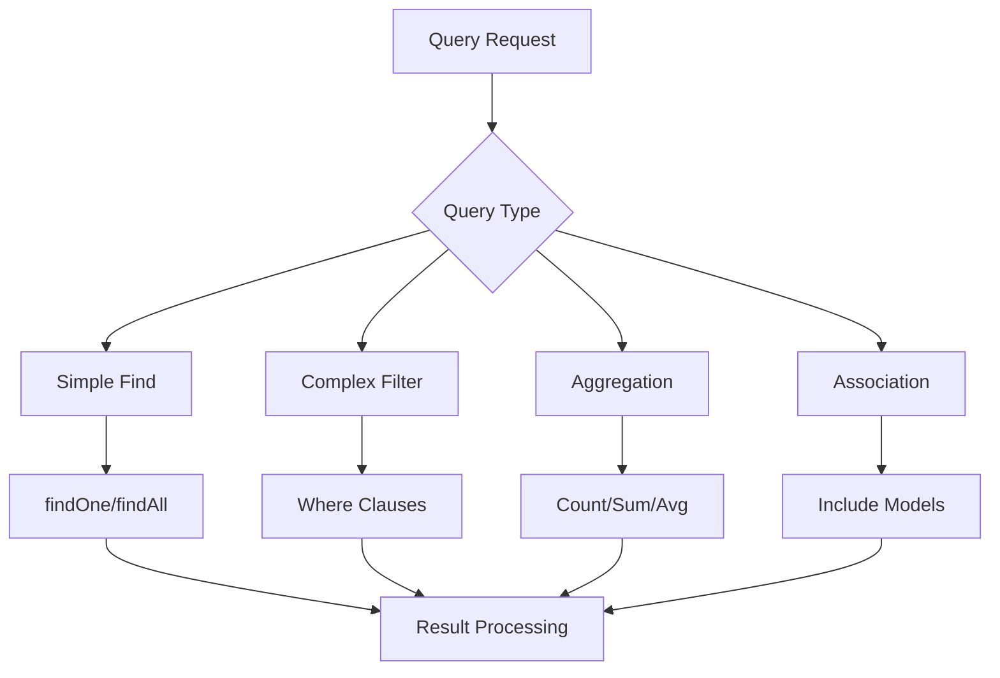

# Querying & Filtering Data

## 🎯 Understanding Sequelize Queries

Sequelize provides powerful querying capabilities that abstract SQL while offering fine-grained control over data retrieval. Master these patterns to build efficient, scalable applications.



## 🔍 Basic Query Operations

### 1. Finding Records

```javascript
// models/Post.js and usage examples
const { Model, DataTypes } = require('sequelize');

class Post extends Model {
  static associate(models) {
    Post.belongsTo(models.User, { foreignKey: 'userId' });
    Post.belongsToMany(models.Category, { 
      through: 'PostCategories', 
      foreignKey: 'postId' 
    });
    Post.hasMany(models.Comment, { foreignKey: 'postId' });
  }
}

// Basic find operations
const posts = {
  // Find all posts
  async findAll() {
    return await Post.findAll();
  },

  // Find one post
  async findById(id) {
    return await Post.findByPk(id);
  },

  // Find or create
  async findOrCreate(postData) {
    const [post, created] = await Post.findOrCreate({
      where: { slug: postData.slug },
      defaults: postData
    });
    return { post, created };
  },

  // Find and count all
  async findAndCountAll(options = {}) {
    return await Post.findAndCountAll({
      limit: options.limit || 10,
      offset: options.offset || 0,
      ...options
    });
  }
};
```

### 2. Where Conditions

```javascript
// Simple where conditions
const queries = {
  // Exact match
  async findPublishedPosts() {
    return await Post.findAll({
      where: {
        status: 'published'
      }
    });
  },

  // Multiple conditions (AND)
  async findRecentPublishedPosts() {
    return await Post.findAll({
      where: {
        status: 'published',
        createdAt: {
          [Op.gte]: new Date(Date.now() - 7 * 24 * 60 * 60 * 1000) // Last 7 days
        }
      }
    });
  },

  // OR conditions
  async findDraftOrArchived() {
    return await Post.findAll({
      where: {
        [Op.or]: [
          { status: 'draft' },
          { status: 'archived' }
        ]
      }
    });
  },

  // Complex conditions
  async findPopularRecentPosts() {
    return await Post.findAll({
      where: {
        [Op.and]: [
          { status: 'published' },
          {
            [Op.or]: [
              { viewCount: { [Op.gte]: 1000 } },
              { createdAt: { [Op.gte]: new Date(Date.now() - 3 * 24 * 60 * 60 * 1000) } }
            ]
          }
        ]
      }
    });
  }
};
```

## 🔧 Advanced Operators

### 1. Comparison Operators

```javascript
const { Op } = require('sequelize');

const advancedQueries = {
  // Numeric comparisons
  async findHighViewPosts(minViews = 500) {
    return await Post.findAll({
      where: {
        viewCount: {
          [Op.gte]: minViews,      // Greater than or equal
          [Op.lt]: 10000           // Less than
        }
      }
    });
  },

  // Range queries
  async findPostsInDateRange(startDate, endDate) {
    return await Post.findAll({
      where: {
        createdAt: {
          [Op.between]: [startDate, endDate]
        }
      }
    });
  },

  // Array operations
  async findPostsNotInIds(excludeIds) {
    return await Post.findAll({
      where: {
        id: {
          [Op.notIn]: excludeIds
        }
      }
    });
  },

  // Null checks
  async findPostsWithoutExcerpt() {
    return await Post.findAll({
      where: {
        excerpt: {
          [Op.is]: null
        }
      }
    });
  },

  // String operations
  async searchPostsByTitle(searchTerm) {
    return await Post.findAll({
      where: {
        title: {
          [Op.iLike]: `%${searchTerm}%`  // Case insensitive LIKE
        }
      }
    });
  }
};
```

### 2. Text Search Operations

```javascript
const textSearchQueries = {
  // Basic text search
  async searchPosts(query) {
    return await Post.findAll({
      where: {
        [Op.or]: [
          { title: { [Op.iLike]: `%${query}%` } },
          { content: { [Op.iLike]: `%${query}%` } },
          { excerpt: { [Op.iLike]: `%${query}%` } }
        ]
      }
    });
  },

  // PostgreSQL full-text search
  async fullTextSearch(searchTerm) {
    return await Post.findAll({
      where: Sequelize.literal(`
        to_tsvector('english', title || ' ' || COALESCE(content, '')) 
        @@ plainto_tsquery('english', :searchTerm)
      `),
      replacements: { searchTerm },
      order: [
        [Sequelize.literal(`
          ts_rank(to_tsvector('english', title || ' ' || COALESCE(content, '')), 
                  plainto_tsquery('english', '${searchTerm}'))
        `), 'DESC']
      ]
    });
  },

  // Regex search
  async findPostsWithPattern(pattern) {
    return await Post.findAll({
      where: {
        title: {
          [Op.regexp]: pattern
        }
      }
    });
  },

  // Array contains (PostgreSQL)
  async findPostsByTags(tags) {
    return await Post.findAll({
      where: {
        tags: {
          [Op.contains]: tags  // Array contains all specified tags
        }
      }
    });
  },

  // JSON field queries (PostgreSQL)
  async findPostsByMetadata(key, value) {
    return await Post.findAll({
      where: {
        [`metadata.${key}`]: value
      }
    });
  }
};
```

## 📊 Ordering and Limiting

### 1. Order Operations

```javascript
const orderingQueries = {
  // Simple ordering
  async getLatestPosts(limit = 10) {
    return await Post.findAll({
      order: [['createdAt', 'DESC']],
      limit
    });
  },

  // Multiple order fields
  async getPostsByPopularity() {
    return await Post.findAll({
      order: [
        ['viewCount', 'DESC'],
        ['createdAt', 'DESC']
      ]
    });
  },

  // Conditional ordering
  async getOrderedPosts(sortBy = 'date', direction = 'DESC') {
    const orderField = {
      'date': 'createdAt',
      'popularity': 'viewCount',
      'title': 'title'
    }[sortBy] || 'createdAt';

    return await Post.findAll({
      order: [[orderField, direction.toUpperCase()]]
    });
  },

  // Random ordering
  async getRandomPosts(count = 5) {
    return await Post.findAll({
      order: Sequelize.literal('RANDOM()'),
      limit: count
    });
  },

  // Ordering by association
  async getPostsByAuthorName() {
    return await Post.findAll({
      include: [{
        model: User,
        attributes: ['firstName', 'lastName']
      }],
      order: [
        [User, 'firstName', 'ASC'],
        [User, 'lastName', 'ASC']
      ]
    });
  }
};
```

### 2. Pagination

```javascript
const paginationQueries = {
  // Offset-based pagination
  async getPostsPage(page = 1, pageSize = 10) {
    const offset = (page - 1) * pageSize;
    
    const { count, rows } = await Post.findAndCountAll({
      where: { status: 'published' },
      limit: pageSize,
      offset,
      order: [['createdAt', 'DESC']],
      distinct: true // Important for correct count with includes
    });

    return {
      posts: rows,
      pagination: {
        currentPage: page,
        pageSize,
        totalItems: count,
        totalPages: Math.ceil(count / pageSize),
        hasNextPage: page * pageSize < count,
        hasPrevPage: page > 1
      }
    };
  },

  // Cursor-based pagination (better for large datasets)
  async getPostsCursor(cursor = null, limit = 10) {
    const whereClause = { status: 'published' };
    
    if (cursor) {
      whereClause.id = { [Op.lt]: cursor };
    }

    const posts = await Post.findAll({
      where: whereClause,
      limit: limit + 1, // Fetch one extra to check if there's more
      order: [['id', 'DESC']]
    });

    const hasNextPage = posts.length > limit;
    const items = hasNextPage ? posts.slice(0, -1) : posts;
    const nextCursor = hasNextPage ? items[items.length - 1].id : null;

    return {
      posts: items,
      pagination: {
        nextCursor,
        hasNextPage,
        pageSize: limit
      }
    };
  },

  // Advanced pagination with search
  async searchPostsPaginated(searchTerm, filters = {}, page = 1, pageSize = 10) {
    const offset = (page - 1) * pageSize;
    const whereClause = {
      status: 'published',
      ...filters
    };

    // Add search condition if provided
    if (searchTerm) {
      whereClause[Op.or] = [
        { title: { [Op.iLike]: `%${searchTerm}%` } },
        { content: { [Op.iLike]: `%${searchTerm}%` } }
      ];
    }

    const { count, rows } = await Post.findAndCountAll({
      where: whereClause,
      include: [{
        model: User,
        attributes: ['id', 'firstName', 'lastName'],
        where: filters.userId ? { id: filters.userId } : undefined
      }],
      limit: pageSize,
      offset,
      order: [['createdAt', 'DESC']],
      distinct: true
    });

    return {
      posts: rows,
      search: {
        term: searchTerm,
        filters
      },
      pagination: {
        currentPage: page,
        pageSize,
        totalItems: count,
        totalPages: Math.ceil(count / pageSize)
      }
    };
  }
};
```

## 🔗 Querying with Associations

### 1. Including Related Data

```javascript
const associationQueries = {
  // Basic include
  async getPostsWithAuthors() {
    return await Post.findAll({
      include: [{
        model: User,
        attributes: ['id', 'firstName', 'lastName', 'email']
      }]
    });
  },

  // Multiple includes
  async getCompletePost(postId) {
    return await Post.findByPk(postId, {
      include: [
        {
          model: User,
          attributes: ['id', 'firstName', 'lastName', 'avatar']
        },
        {
          model: Category,
          attributes: ['id', 'name', 'slug'],
          through: { attributes: [] } // Exclude junction table attributes
        },
        {
          model: Comment,
          include: [{
            model: User,
            attributes: ['id', 'firstName', 'lastName']
          }],
          where: { status: 'approved' },
          required: false // LEFT JOIN instead of INNER JOIN
        }
      ]
    });
  },

  // Nested includes
  async getPostsWithCommentsAndReplies() {
    return await Post.findAll({
      include: [{
        model: Comment,
        include: [
          {
            model: User,
            attributes: ['id', 'firstName', 'lastName']
          },
          {
            model: Comment,
            as: 'replies',
            include: [{
              model: User,
              attributes: ['id', 'firstName', 'lastName']
            }]
          }
        ]
      }]
    });
  },

  // Conditional includes
  async getPostsWithConditionalData(includeComments = false) {
    const includeOptions = [
      {
        model: User,
        attributes: ['id', 'firstName', 'lastName']
      }
    ];

    if (includeComments) {
      includeOptions.push({
        model: Comment,
        where: { status: 'approved' },
        required: false
      });
    }

    return await Post.findAll({
      include: includeOptions
    });
  }
};
```

### 2. Filtering by Associations

```javascript
const associationFilterQueries = {
  // Filter posts by author
  async getPostsByAuthor(authorId) {
    return await Post.findAll({
      include: [{
        model: User,
        where: { id: authorId },
        attributes: ['id', 'firstName', 'lastName']
      }]
    });
  },

  // Filter posts by category
  async getPostsByCategory(categorySlug) {
    return await Post.findAll({
      include: [{
        model: Category,
        where: { slug: categorySlug },
        attributes: ['id', 'name', 'slug']
      }]
    });
  },

  // Filter with association conditions
  async getPostsWithActiveAuthors() {
    return await Post.findAll({
      include: [{
        model: User,
        where: { isActive: true },
        attributes: ['id', 'firstName', 'lastName']
      }]
    });
  },

  // Complex association filtering
  async getPopularPostsWithComments(minComments = 5) {
    return await Post.findAll({
      include: [{
        model: Comment,
        where: { status: 'approved' },
        required: false
      }],
      having: Sequelize.literal('COUNT("Comments"."id") >= :minComments'),
      replacements: { minComments },
      group: ['Post.id'],
      order: [[Sequelize.literal('COUNT("Comments"."id")'), 'DESC']]
    });
  },

  // Subquery filtering
  async getAuthorsWithRecentPosts() {
    return await User.findAll({
      where: {
        id: {
          [Op.in]: Sequelize.literal(`
            (SELECT DISTINCT user_id 
             FROM posts 
             WHERE created_at > NOW() - INTERVAL '30 days'
             AND status = 'published')
          `)
        }
      }
    });
  }
};
```

## 📈 Aggregation Queries

### 1. Basic Aggregations

```javascript
const aggregationQueries = {
  // Count queries
  async getPostCounts() {
    return {
      total: await Post.count(),
      published: await Post.count({ where: { status: 'published' } }),
      draft: await Post.count({ where: { status: 'draft' } }),
      archived: await Post.count({ where: { status: 'archived' } })
    };
  },

  // Sum and average
  async getViewStats() {
    const stats = await Post.findAll({
      attributes: [
        [Sequelize.fn('COUNT', Sequelize.col('id')), 'totalPosts'],
        [Sequelize.fn('SUM', Sequelize.col('viewCount')), 'totalViews'],
        [Sequelize.fn('AVG', Sequelize.col('viewCount')), 'averageViews'],
        [Sequelize.fn('MAX', Sequelize.col('viewCount')), 'maxViews'],
        [Sequelize.fn('MIN', Sequelize.col('viewCount')), 'minViews']
      ],
      where: { status: 'published' },
      raw: true
    });

    return stats[0];
  },

  // Group by queries
  async getPostsByStatus() {
    return await Post.findAll({
      attributes: [
        'status',
        [Sequelize.fn('COUNT', Sequelize.col('id')), 'count']
      ],
      group: ['status'],
      raw: true
    });
  },

  // Monthly post statistics
  async getMonthlyPostStats() {
    return await Post.findAll({
      attributes: [
        [Sequelize.fn('DATE_TRUNC', 'month', Sequelize.col('createdAt')), 'month'],
        [Sequelize.fn('COUNT', Sequelize.col('id')), 'postCount'],
        [Sequelize.fn('SUM', Sequelize.col('viewCount')), 'totalViews']
      ],
      where: { status: 'published' },
      group: [Sequelize.fn('DATE_TRUNC', 'month', Sequelize.col('createdAt'))],
      order: [[Sequelize.fn('DATE_TRUNC', 'month', Sequelize.col('createdAt')), 'DESC']],
      raw: true
    });
  }
};
```

### 2. Complex Aggregations

```javascript
const complexAggregations = {
  // Author statistics
  async getAuthorStats() {
    return await User.findAll({
      attributes: [
        'id',
        'firstName', 
        'lastName',
        [Sequelize.fn('COUNT', Sequelize.col('Posts.id')), 'postCount'],
        [Sequelize.fn('SUM', Sequelize.col('Posts.viewCount')), 'totalViews'],
        [Sequelize.fn('AVG', Sequelize.col('Posts.viewCount')), 'averageViews']
      ],
      include: [{
        model: Post,
        attributes: [],
        where: { status: 'published' },
        required: false
      }],
      group: ['User.id'],
      having: Sequelize.literal('COUNT("Posts"."id") > 0'),
      order: [[Sequelize.literal('COUNT("Posts"."id")'), 'DESC']]
    });
  },

  // Category performance
  async getCategoryStats() {
    return await Category.findAll({
      attributes: [
        'id',
        'name',
        'slug',
        [Sequelize.fn('COUNT', Sequelize.col('Posts.id')), 'postCount'],
        [Sequelize.fn('AVG', Sequelize.col('Posts.viewCount')), 'averageViews']
      ],
      include: [{
        model: Post,
        attributes: [],
        where: { status: 'published' },
        through: { attributes: [] }
      }],
      group: ['Category.id'],
      order: [[Sequelize.literal('COUNT("Posts"."id")'), 'DESC']]
    });
  },

  // Engagement metrics
  async getEngagementMetrics(timeframe = 30) {
    const sinceDate = new Date(Date.now() - timeframe * 24 * 60 * 60 * 1000);
    
    return await Post.findAll({
      attributes: [
        'id',
        'title',
        'viewCount',
        [Sequelize.fn('COUNT', Sequelize.col('Comments.id')), 'commentCount'],
        [Sequelize.literal('view_count + COUNT("Comments"."id") * 5'), 'engagementScore']
      ],
      include: [{
        model: Comment,
        attributes: [],
        where: { 
          status: 'approved',
          createdAt: { [Op.gte]: sinceDate }
        },
        required: false
      }],
      where: {
        status: 'published',
        createdAt: { [Op.gte]: sinceDate }
      },
      group: ['Post.id'],
      order: [[Sequelize.literal('engagement_score'), 'DESC']],
      limit: 10
    });
  }
};
```

## 🔍 Advanced Query Patterns

### 1. Subqueries

```javascript
const subqueryPatterns = {
  // Find posts with above-average view count
  async getAboveAverageViewPosts() {
    const avgViews = await Post.findAll({
      attributes: [[Sequelize.fn('AVG', Sequelize.col('viewCount')), 'avg']],
      where: { status: 'published' },
      raw: true
    });

    return await Post.findAll({
      where: {
        viewCount: { [Op.gt]: avgViews[0].avg },
        status: 'published'
      }
    });
  },

  // Authors with most recent post
  async getAuthorsWithLatestPost() {
    return await User.findAll({
      attributes: [
        'id',
        'firstName',
        'lastName',
        [
          Sequelize.literal(`(
            SELECT MAX(created_at) 
            FROM posts 
            WHERE posts.user_id = "User".id 
            AND status = 'published'
          )`),
          'latestPostDate'
        ]
      ],
      where: {
        id: {
          [Op.in]: Sequelize.literal(`
            (SELECT DISTINCT user_id FROM posts WHERE status = 'published')
          `)
        }
      },
      order: [[Sequelize.literal('latest_post_date'), 'DESC']]
    });
  },

  // Posts with most comments
  async getPostsWithMostComments(limit = 10) {
    return await Post.findAll({
      attributes: [
        'id',
        'title',
        'slug',
        [
          Sequelize.literal(`(
            SELECT COUNT(*) 
            FROM comments 
            WHERE comments.post_id = "Post".id 
            AND status = 'approved'
          )`),
          'commentCount'
        ]
      ],
      where: { status: 'published' },
      order: [[Sequelize.literal('comment_count'), 'DESC']],
      limit
    });
  }
};
```

### 2. Raw Queries

```javascript
const rawQueryPatterns = {
  // Complex analytical query
  async getDetailedAnalytics(startDate, endDate) {
    const [results] = await sequelize.query(`
      WITH post_stats AS (
        SELECT 
          p.id,
          p.title,
          p.view_count,
          p.created_at,
          u.first_name || ' ' || u.last_name AS author_name,
          COUNT(c.id) AS comment_count,
          AVG(c.rating) AS avg_rating
        FROM posts p
        LEFT JOIN users u ON p.user_id = u.id
        LEFT JOIN comments c ON p.id = c.post_id AND c.status = 'approved'
        WHERE p.status = 'published'
          AND p.created_at BETWEEN :startDate AND :endDate
        GROUP BY p.id, u.id
      ),
      category_stats AS (
        SELECT 
          cat.name AS category_name,
          COUNT(pc.post_id) AS post_count,
          SUM(ps.view_count) AS total_views
        FROM categories cat
        LEFT JOIN post_categories pc ON cat.id = pc.category_id
        LEFT JOIN post_stats ps ON pc.post_id = ps.id
        GROUP BY cat.id
      )
      SELECT 
        ps.*,
        cs.category_name,
        cs.post_count AS category_post_count,
        cs.total_views AS category_total_views
      FROM post_stats ps
      LEFT JOIN post_categories pc ON ps.id = pc.post_id AND pc.is_primary = true
      LEFT JOIN category_stats cs ON pc.category_id = (
        SELECT id FROM categories WHERE name = cs.category_name
      )
      ORDER BY ps.view_count DESC;
    `, {
      replacements: { startDate, endDate },
      type: Sequelize.QueryTypes.SELECT
    });

    return results;
  },

  // Performance-optimized search
  async optimizedPostSearch(searchTerm, limit = 20) {
    const [results] = await sequelize.query(`
      SELECT DISTINCT
        p.id,
        p.title,
        p.slug,
        p.excerpt,
        p.view_count,
        u.first_name || ' ' || u.last_name AS author_name,
        ts_rank(
          to_tsvector('english', p.title || ' ' || COALESCE(p.content, '')),
          plainto_tsquery('english', :searchTerm)
        ) AS relevance_score
      FROM posts p
      JOIN users u ON p.user_id = u.id
      WHERE p.status = 'published'
        AND (
          to_tsvector('english', p.title || ' ' || COALESCE(p.content, ''))
          @@ plainto_tsquery('english', :searchTerm)
          OR p.tags && ARRAY[:searchTerm]
        )
      ORDER BY relevance_score DESC, p.view_count DESC
      LIMIT :limit;
    `, {
      replacements: { searchTerm, limit },
      type: Sequelize.QueryTypes.SELECT
    });

    return results;
  }
};
```

## 🚀 Query Optimization Techniques

### 1. Query Performance

```javascript
const optimizationTechniques = {
  // Efficient eager loading
  async getOptimizedPosts() {
    return await Post.findAll({
      attributes: ['id', 'title', 'slug', 'excerpt', 'viewCount'], // Only needed fields
      include: [{
        model: User,
        attributes: ['id', 'firstName', 'lastName'], // Minimal user data
        required: true // INNER JOIN instead of LEFT JOIN
      }],
      where: { status: 'published' },
      order: [['createdAt', 'DESC']],
      limit: 20
    });
  },

  // Batch loading to avoid N+1 queries
  async getPostsWithCategoriesBatch(postIds) {
    // First, get all posts
    const posts = await Post.findAll({
      where: { id: { [Op.in]: postIds } },
      attributes: ['id', 'title', 'slug']
    });

    // Then, get all categories for these posts in one query
    const postCategories = await PostCategory.findAll({
      where: { postId: { [Op.in]: postIds } },
      include: [{
        model: Category,
        attributes: ['id', 'name', 'slug']
      }]
    });

    // Map categories to posts
    const categoryMap = new Map();
    postCategories.forEach(pc => {
      if (!categoryMap.has(pc.postId)) {
        categoryMap.set(pc.postId, []);
      }
      categoryMap.get(pc.postId).push(pc.Category);
    });

    // Attach categories to posts
    return posts.map(post => ({
      ...post.toJSON(),
      categories: categoryMap.get(post.id) || []
    }));
  },

  // Indexed queries
  async getPostsByDateRange(startDate, endDate) {
    return await Post.findAll({
      where: {
        createdAt: {
          [Op.between]: [startDate, endDate] // Uses index on createdAt
        },
        status: 'published' // Uses composite index on (status, createdAt)
      },
      order: [['createdAt', 'DESC']]
    });
  }
};
```

### 2. Query Monitoring

```javascript
const queryMonitoring = {
  // Query logging and timing
  async monitoredQuery(queryFunction) {
    const startTime = Date.now();
    
    try {
      const result = await queryFunction();
      const duration = Date.now() - startTime;
      
      console.log(`Query completed in ${duration}ms`);
      
      if (duration > 1000) {
        console.warn('Slow query detected:', duration + 'ms');
      }
      
      return result;
    } catch (error) {
      console.error('Query failed:', error);
      throw error;
    }
  },

  // Query explanation
  async explainQuery(sql, replacements = {}) {
    const [explanation] = await sequelize.query(
      `EXPLAIN ANALYZE ${sql}`,
      { 
        replacements,
        type: Sequelize.QueryTypes.SELECT 
      }
    );
    
    return explanation;
  }
};
```

## 📊 Practical Query Examples

### 1. Blog Dashboard Queries

```javascript
const dashboardQueries = {
  // Dashboard summary
  async getDashboardSummary(userId = null) {
    const userFilter = userId ? { userId } : {};
    
    const [stats] = await Promise.all([
      // Post statistics
      Post.findAll({
        attributes: [
          'status',
          [Sequelize.fn('COUNT', Sequelize.col('id')), 'count']
        ],
        where: userFilter,
        group: ['status'],
        raw: true
      }),
      
      // Recent activity
      Post.findAll({
        attributes: ['id', 'title', 'status', 'createdAt'],
        where: {
          ...userFilter,
          createdAt: {
            [Op.gte]: new Date(Date.now() - 7 * 24 * 60 * 60 * 1000)
          }
        },
        order: [['createdAt', 'DESC']],
        limit: 5
      }),
      
      // Popular posts
      Post.findAll({
        attributes: ['id', 'title', 'viewCount'],
        where: {
          ...userFilter,
          status: 'published'
        },
        order: [['viewCount', 'DESC']],
        limit: 5
      })
    ]);
    
    return {
      stats: stats[0],
      recentActivity: stats[1],
      popularPosts: stats[2]
    };
  },

  // Content calendar
  async getContentCalendar(year, month) {
    const startDate = new Date(year, month - 1, 1);
    const endDate = new Date(year, month, 0);
    
    return await Post.findAll({
      attributes: [
        'id',
        'title',
        'status',
        'publishedAt',
        [Sequelize.fn('DATE', Sequelize.col('publishedAt')), 'publishDate']
      ],
      where: {
        publishedAt: {
          [Op.between]: [startDate, endDate]
        }
      },
      order: [['publishedAt', 'ASC']]
    });
  }
};
```

### 2. Search and Filter Combinations

```javascript
const searchFilterQueries = {
  // Advanced search with multiple filters
  async advancedPostSearch(filters) {
    const {
      search,
      category,
      author,
      dateFrom,
      dateTo,
      minViews,
      maxViews,
      tags,
      status = 'published',
      sortBy = 'createdAt',
      sortOrder = 'DESC',
      page = 1,
      limit = 10
    } = filters;

    // Build where clause dynamically
    const whereClause = { status };
    const includeOptions = [];

    // Text search
    if (search) {
      whereClause[Op.or] = [
        { title: { [Op.iLike]: `%${search}%` } },
        { content: { [Op.iLike]: `%${search}%` } },
        { excerpt: { [Op.iLike]: `%${search}%` } }
      ];
    }

    // Date range
    if (dateFrom || dateTo) {
      whereClause.createdAt = {};
      if (dateFrom) whereClause.createdAt[Op.gte] = new Date(dateFrom);
      if (dateTo) whereClause.createdAt[Op.lte] = new Date(dateTo);
    }

    // View count range
    if (minViews !== undefined || maxViews !== undefined) {
      whereClause.viewCount = {};
      if (minViews !== undefined) whereClause.viewCount[Op.gte] = minViews;
      if (maxViews !== undefined) whereClause.viewCount[Op.lte] = maxViews;
    }

    // Tags filter
    if (tags && tags.length > 0) {
      whereClause.tags = { [Op.contains]: tags };
    }

    // Author filter
    if (author) {
      includeOptions.push({
        model: User,
        where: {
          [Op.or]: [
            { firstName: { [Op.iLike]: `%${author}%` } },
            { lastName: { [Op.iLike]: `%${author}%` } }
          ]
        },
        attributes: ['id', 'firstName', 'lastName']
      });
    } else {
      includeOptions.push({
        model: User,
        attributes: ['id', 'firstName', 'lastName']
      });
    }

    // Category filter
    if (category) {
      includeOptions.push({
        model: Category,
        where: { slug: category },
        attributes: ['id', 'name', 'slug'],
        through: { attributes: [] }
      });
    }

    const offset = (page - 1) * limit;

    const { count, rows } = await Post.findAndCountAll({
      where: whereClause,
      include: includeOptions,
      order: [[sortBy, sortOrder]],
      limit,
      offset,
      distinct: true
    });

    return {
      posts: rows,
      pagination: {
        currentPage: page,
        pageSize: limit,
        totalItems: count,
        totalPages: Math.ceil(count / limit)
      },
      filters: filters
    };
  }
};
```

## 🎯 Key Takeaways

1. **Query Optimization**: Use indexes, limit attributes, and avoid N+1 queries
2. **Flexible Filtering**: Build dynamic where clauses for complex filters
3. **Association Management**: Understand when to use includes vs separate queries
4. **Performance Monitoring**: Track query performance and optimize slow queries
5. **Raw Queries**: Use for complex analytics that exceed ORM capabilities
6. **Pagination**: Implement efficient pagination for large datasets
7. **Search Functionality**: Leverage PostgreSQL's full-text search capabilities

## 🚀 What's Next?

Master advanced querying with [[11-Advanced-Queries|Advanced Queries & Joins]] to handle complex data relationships and aggregations!

---

## 🔗 Related Topics
- [[09-CRUD-Operations|CRUD Operations in Detail]]
- [[11-Advanced-Queries|Advanced Queries & Joins]]
- [[15-Indexes-Performance|Indexes & Performance Optimization]]
