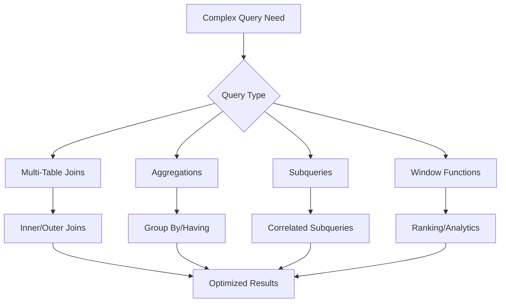

# Advanced Queries & Joins

## 🎯 Mastering Complex Queries

Advanced Sequelize queries enable sophisticated data retrieval patterns, complex joins, and analytical operations that power feature-rich applications.



## 🔗 Advanced Join Operations

### 1. Complex Multi-Table Joins

```javascript
// models/associations.js - Setup complex relationships
const setupAssociations = (models) => {
  const { User, Post, Comment, Category, PostCategory, Like, Follow } = models;

  // User associations
  User.hasMany(Post, { foreignKey: 'userId', as: 'posts' });
  User.hasMany(Comment, { foreignKey: 'userId', as: 'comments' });
  User.hasMany(Like, { foreignKey: 'userId', as: 'likes' });
  User.belongsToMany(User, { 
    through: Follow, 
    as: 'followers', 
    foreignKey: 'followedId', 
    otherKey: 'followerId' 
  });
  User.belongsToMany(User, { 
    through: Follow, 
    as: 'following', 
    foreignKey: 'followerId', 
    otherKey: 'followedId' 
  });

  // Post associations
  Post.belongsTo(User, { foreignKey: 'userId', as: 'author' });
  Post.hasMany(Comment, { foreignKey: 'postId', as: 'comments' });
  Post.hasMany(Like, { foreignKey: 'postId', as: 'likes' });
  Post.belongsToMany(Category, { 
    through: PostCategory, 
    foreignKey: 'postId', 
    otherKey: 'categoryId',
    as: 'categories' 
  });

  // Comment associations
  Comment.belongsTo(User, { foreignKey: 'userId', as: 'author' });
  Comment.belongsTo(Post, { foreignKey: 'postId', as: 'post' });
  Comment.belongsTo(Comment, { foreignKey: 'parentId', as: 'parent' });
  Comment.hasMany(Comment, { foreignKey: 'parentId', as: 'replies' });

  // Category associations
  Category.belongsToMany(Post, { 
    through: PostCategory, 
    foreignKey: 'categoryId', 
    otherKey: 'postId',
    as: 'posts' 
  });

  // Like associations
  Like.belongsTo(User, { foreignKey: 'userId', as: 'user' });
  Like.belongsTo(Post, { foreignKey: 'postId', as: 'post' });
};

// Advanced join queries
const advancedJoinQueries = {
  // Get posts with complete metadata
  async getPostsWithFullDetails() {
    return await Post.findAll({
      attributes: [
        'id', 'title', 'slug', 'excerpt', 'content', 
        'status', 'viewCount', 'createdAt'
      ],
      include: [
        {
          model: User,
          as: 'author',
          attributes: ['id', 'firstName', 'lastName', 'avatar', 'bio'],
          include: [{
            model: User,
            as: 'followers',
            attributes: ['id'],
            through: { attributes: [] }
          }]
        },
        {
          model: Category,
          as: 'categories',
          attributes: ['id', 'name', 'slug', 'color'],
          through: { 
            attributes: ['isPrimary'],
            where: { isPrimary: true },
            required: false
          }
        },
        {
          model: Comment,
          as: 'comments',
          attributes: ['id', 'content', 'createdAt'],
          where: { status: 'approved' },
          required: false,
          include: [{
            model: User,
            as: 'author',
            attributes: ['id', 'firstName', 'lastName', 'avatar']
          }]
        },
        {
          model: Like,
          as: 'likes',
          attributes: ['id', 'userId'],
          required: false
        }
      ],
      where: { status: 'published' },
      order: [
        ['createdAt', 'DESC'],
        [{ model: Comment, as: 'comments' }, 'createdAt', 'ASC']
      ]
    });
  },

  // Cross-referenced user activity
  async getUserActivitySummary(userId) {
    return await User.findByPk(userId, {
      attributes: ['id', 'firstName', 'lastName', 'createdAt'],
      include: [
        {
          model: Post,
          as: 'posts',
          attributes: [
            'id', 'title', 'viewCount', 'status',
            [Sequelize.fn('COUNT', Sequelize.col('posts->comments.id')), 'commentCount'],
            [Sequelize.fn('COUNT', Sequelize.col('posts->likes.id')), 'likeCount']
          ],
          include: [
            {
              model: Comment,
              as: 'comments',
              attributes: [],
              required: false
            },
            {
              model: Like,
              as: 'likes',
              attributes: [],
              required: false
            }
          ]
        },
        {
          model: User,
          as: 'followers',
          attributes: ['id', 'firstName', 'lastName'],
          through: { attributes: ['createdAt'] }
        },
        {
          model: User,
          as: 'following',
          attributes: ['id', 'firstName', 'lastName'],
          through: { attributes: ['createdAt'] }
        }
      ],
      group: [
        'User.id', 
        'posts.id', 
        'followers.id', 
        'followers->Follow.id',
        'following.id', 
        'following->Follow.id'
      ]
    });
  }
};
```

### 2. Self-Referencing Joins

```javascript
const selfReferencingQueries = {
  // Hierarchical comments with nested replies
  async getNestedComments(postId, maxDepth = 3) {
    const buildNestedQuery = (depth) => {
      if (depth <= 0) return null;
      
      return {
        model: Comment,
        as: 'replies',
        attributes: ['id', 'content', 'createdAt', 'parentId'],
        include: [
          {
            model: User,
            as: 'author',
            attributes: ['id', 'firstName', 'lastName', 'avatar']
          },
          ...(depth > 1 ? [buildNestedQuery(depth - 1)] : [])
        ].filter(Boolean),
        where: { status: 'approved' },
        order: [['createdAt', 'ASC']]
      };
    };

    return await Comment.findAll({
      where: { 
        postId, 
        parentId: null, // Top-level comments only
        status: 'approved' 
      },
      attributes: ['id', 'content', 'createdAt', 'parentId'],
      include: [
        {
          model: User,
          as: 'author',
          attributes: ['id', 'firstName', 'lastName', 'avatar']
        },
        buildNestedQuery(maxDepth)
      ].filter(Boolean),
      order: [['createdAt', 'ASC']]
    });
  },

  // User follower network analysis
  async getFollowerNetwork(userId, degrees = 2) {
    // Direct followers and their followers
    return await User.findByPk(userId, {
      include: [
        {
          model: User,
          as: 'followers',
          attributes: ['id', 'firstName', 'lastName'],
          through: { attributes: ['createdAt'] },
          include: degrees > 1 ? [{
            model: User,
            as: 'followers',
            attributes: ['id', 'firstName', 'lastName'],
            through: { attributes: [] },
            required: false
          }] : []
        },
        {
          model: User,
          as: 'following',
          attributes: ['id', 'firstName', 'lastName'],
          through: { attributes: ['createdAt'] },
          include: degrees > 1 ? [{
            model: User,
            as: 'following',
            attributes: ['id', 'firstName', 'lastName'],
            through: { attributes: [] },
            required: false
          }] : []
        }
      ]
    });
  },

  // Recursive category hierarchy
  async getCategoryHierarchy() {
    // For categories with parent-child relationships
    const [results] = await sequelize.query(`
      WITH RECURSIVE category_tree AS (
        -- Base case: root categories
        SELECT id, name, slug, parent_id, 0 as level, 
               ARRAY[id] as path, name as full_path
        FROM categories 
        WHERE parent_id IS NULL
        
        UNION ALL
        
        -- Recursive case: child categories
        SELECT c.id, c.name, c.slug, c.parent_id, ct.level + 1,
               ct.path || c.id, ct.full_path || ' > ' || c.name
        FROM categories c
        JOIN category_tree ct ON c.parent_id = ct.id
        WHERE ct.level < 5 -- Prevent infinite recursion
      )
      SELECT * FROM category_tree 
      ORDER BY full_path;
    `, {
      type: Sequelize.QueryTypes.SELECT
    });

    return results;
  }
};
```

## 📊 Complex Aggregations

### 1. Advanced Grouping and Aggregation

```javascript
const complexAggregations = {
  // Multi-dimensional analytics
  async getContentAnalytics(timeframe = 'month') {
    const timeFormat = {
      'day': 'YYYY-MM-DD',
      'week': 'YYYY-"W"WW',
      'month': 'YYYY-MM',
      'year': 'YYYY'
    }[timeframe] || 'YYYY-MM';

    return await Post.findAll({
      attributes: [
        [Sequelize.fn('TO_CHAR', Sequelize.col('Post.createdAt'), timeFormat), 'period'],
        'status',
        [Sequelize.fn('COUNT', Sequelize.col('Post.id')), 'postCount'],
        [Sequelize.fn('SUM', Sequelize.col('Post.viewCount')), 'totalViews'],
        [Sequelize.fn('AVG', Sequelize.col('Post.viewCount')), 'avgViews'],
        [Sequelize.fn('COUNT', Sequelize.col('comments.id')), 'totalComments'],
        [Sequelize.fn('COUNT', Sequelize.col('likes.id')), 'totalLikes']
      ],
      include: [
        {
          model: Comment,
          as: 'comments',
          attributes: [],
          where: { status: 'approved' },
          required: false
        },
        {
          model: Like,
          as: 'likes',
          attributes: [],
          required: false
        }
      ],
      group: [
        Sequelize.fn('TO_CHAR', Sequelize.col('Post.createdAt'), timeFormat),
        'Post.status'
      ],
      order: [
        [Sequelize.fn('TO_CHAR', Sequelize.col('Post.createdAt'), timeFormat), 'DESC'],
        ['status', 'ASC']
      ],
      raw: true
    });
  },

  // User engagement scoring
  async getUserEngagementScores() {
    return await User.findAll({
      attributes: [
        'id',
        'firstName',
        'lastName',
        [Sequelize.fn('COUNT', Sequelize.col('posts.id')), 'postCount'],
        [Sequelize.fn('SUM', Sequelize.col('posts.viewCount')), 'totalViews'],
        [Sequelize.fn('COUNT', Sequelize.col('comments.id')), 'commentCount'],
        [Sequelize.fn('COUNT', Sequelize.col('likes.id')), 'likeCount'],
        [Sequelize.fn('COUNT', Sequelize.col('followers.id')), 'followerCount'],
        [Sequelize.literal(`
          (COUNT("posts"."id") * 10 + 
           SUM("posts"."view_count") * 0.1 + 
           COUNT("comments"."id") * 5 + 
           COUNT("likes"."id") * 2 + 
           COUNT("followers"."id") * 3)
        `), 'engagementScore']
      ],
      include: [
        {
          model: Post,
          as: 'posts',
          attributes: [],
          where: { status: 'published' },
          required: false
        },
        {
          model: Comment,
          as: 'comments',
          attributes: [],
          where: { status: 'approved' },
          required: false
        },
        {
          model: Like,
          as: 'likes',
          attributes: [],
          required: false
        },
        {
          model: User,
          as: 'followers',
          attributes: [],
          through: { attributes: [] },
          required: false
        }
      ],
      group: ['User.id'],
      having: Sequelize.literal('COUNT("posts"."id") > 0'),
      order: [[Sequelize.literal('engagement_score'), 'DESC']],
      limit: 50
    });
  },

  // Category performance with seasonal trends
  async getCategoryTrends() {
    const [results] = await sequelize.query(`
      SELECT 
        c.name as category_name,
        c.slug as category_slug,
        EXTRACT(QUARTER FROM p.created_at) as quarter,
        EXTRACT(YEAR FROM p.created_at) as year,
        COUNT(p.id) as post_count,
        SUM(p.view_count) as total_views,
        AVG(p.view_count) as avg_views,
        COUNT(DISTINCT p.user_id) as unique_authors,
        RANK() OVER (
          PARTITION BY EXTRACT(YEAR FROM p.created_at), EXTRACT(QUARTER FROM p.created_at)
          ORDER BY SUM(p.view_count) DESC
        ) as popularity_rank
      FROM categories c
      JOIN post_categories pc ON c.id = pc.category_id
      JOIN posts p ON pc.post_id = p.id
      WHERE p.status = 'published'
        AND p.created_at >= NOW() - INTERVAL '2 years'
      GROUP BY c.id, c.name, c.slug, 
               EXTRACT(YEAR FROM p.created_at), 
               EXTRACT(QUARTER FROM p.created_at)
      ORDER BY year DESC, quarter DESC, popularity_rank ASC;
    `, {
      type: Sequelize.QueryTypes.SELECT
    });

    return results;
  }
};
```

### 2. Window Functions and Analytics

```javascript
const windowFunctionQueries = {
  // Ranking and percentile analysis
  async getPostRankings() {
    const [results] = await sequelize.query(`
      SELECT 
        p.id,
        p.title,
        p.view_count,
        p.created_at,
        u.first_name || ' ' || u.last_name as author_name,
        ROW_NUMBER() OVER (ORDER BY p.view_count DESC) as view_rank,
        RANK() OVER (ORDER BY p.view_count DESC) as view_rank_tied,
        DENSE_RANK() OVER (ORDER BY p.view_count DESC) as dense_view_rank,
        PERCENT_RANK() OVER (ORDER BY p.view_count) as view_percentile,
        NTILE(4) OVER (ORDER BY p.view_count DESC) as view_quartile,
        LAG(p.view_count) OVER (ORDER BY p.view_count DESC) as prev_views,
        LEAD(p.view_count) OVER (ORDER BY p.view_count DESC) as next_views,
        FIRST_VALUE(p.view_count) OVER (ORDER BY p.view_count DESC) as max_views,
        LAST_VALUE(p.view_count) OVER (
          ORDER BY p.view_count DESC 
          ROWS BETWEEN UNBOUNDED PRECEDING AND UNBOUNDED FOLLOWING
        ) as min_views
      FROM posts p
      JOIN users u ON p.user_id = u.id
      WHERE p.status = 'published'
      ORDER BY p.view_count DESC;
    `, {
      type: Sequelize.QueryTypes.SELECT
    });

    return results;
  },

  // Running totals and moving averages
  async getViewTrends() {
    const [results] = await sequelize.query(`
      WITH daily_stats AS (
        SELECT 
          DATE(created_at) as date,
          COUNT(*) as posts_published,
          SUM(view_count) as daily_views
        FROM posts 
        WHERE status = 'published'
          AND created_at >= NOW() - INTERVAL '90 days'
        GROUP BY DATE(created_at)
      )
      SELECT 
        date,
        posts_published,
        daily_views,
        SUM(posts_published) OVER (
          ORDER BY date 
          ROWS UNBOUNDED PRECEDING
        ) as cumulative_posts,
        SUM(daily_views) OVER (
          ORDER BY date 
          ROWS UNBOUNDED PRECEDING
        ) as cumulative_views,
        AVG(daily_views) OVER (
          ORDER BY date 
          ROWS BETWEEN 6 PRECEDING AND CURRENT ROW
        ) as seven_day_avg_views,
        LAG(daily_views, 7) OVER (ORDER BY date) as views_week_ago,
        CASE 
          WHEN LAG(daily_views, 7) OVER (ORDER BY date) > 0 
          THEN ROUND(
            ((daily_views - LAG(daily_views, 7) OVER (ORDER BY date)) * 100.0 / 
             LAG(daily_views, 7) OVER (ORDER BY date))::numeric, 2
          )
          ELSE NULL 
        END as week_over_week_change
      FROM daily_stats
      ORDER BY date DESC;
    `, {
      type: Sequelize.QueryTypes.SELECT
    });

    return results;
  },

  // Author performance comparison
  async getAuthorComparisons() {
    const [results] = await sequelize.query(`
      WITH author_stats AS (
        SELECT 
          u.id as user_id,
          u.first_name || ' ' || u.last_name as author_name,
          COUNT(p.id) as total_posts,
          SUM(p.view_count) as total_views,
          AVG(p.view_count) as avg_views_per_post,
          MAX(p.view_count) as best_post_views,
          MIN(p.view_count) as worst_post_views
        FROM users u
        JOIN posts p ON u.id = p.user_id
        WHERE p.status = 'published'
        GROUP BY u.id, u.first_name, u.last_name
        HAVING COUNT(p.id) >= 3
      )
      SELECT 
        *,
        RANK() OVER (ORDER BY total_views DESC) as total_views_rank,
        RANK() OVER (ORDER BY avg_views_per_post DESC) as avg_views_rank,
        RANK() OVER (ORDER BY total_posts DESC) as productivity_rank,
        PERCENT_RANK() OVER (ORDER BY total_views) as views_percentile,
        CASE 
          WHEN total_views > PERCENTILE_CONT(0.8) WITHIN GROUP (ORDER BY total_views) OVER ()
          THEN 'Top Performer'
          WHEN total_views > PERCENTILE_CONT(0.6) WITHIN GROUP (ORDER BY total_views) OVER ()
          THEN 'High Performer'
          WHEN total_views > PERCENTILE_CONT(0.4) WITHIN GROUP (ORDER BY total_views) OVER ()
          THEN 'Average Performer'
          ELSE 'Developing'
        END as performance_tier
      FROM author_stats
      ORDER BY total_views_rank;
    `, {
      type: Sequelize.QueryTypes.SELECT
    });

    return results;
  }
};
```

## 🔍 Advanced Subqueries

### 1. Correlated Subqueries

```javascript
const correlatedSubqueries = {
  // Posts with above-average engagement
  async getHighEngagementPosts() {
    return await Post.findAll({
      attributes: [
        'id', 'title', 'viewCount', 'createdAt',
        [
          Sequelize.literal(`(
            SELECT COUNT(*) 
            FROM comments c 
            WHERE c.post_id = "Post".id AND c.status = 'approved'
          )`),
          'commentCount'
        ],
        [
          Sequelize.literal(`(
            SELECT COUNT(*) 
            FROM likes l 
            WHERE l.post_id = "Post".id
          )`),
          'likeCount'
        ]
      ],
      where: {
        status: 'published',
        [Op.and]: [
          // Above average views for the author
          Sequelize.literal(`
            view_count > (
              SELECT AVG(view_count) 
              FROM posts p2 
              WHERE p2.user_id = "Post".user_id 
              AND p2.status = 'published'
            )
          `),
          // Has more comments than average
          Sequelize.literal(`(
            SELECT COUNT(*) 
            FROM comments c 
            WHERE c.post_id = "Post".id AND c.status = 'approved'
          ) > (
            SELECT AVG(comment_count) 
            FROM (
              SELECT COUNT(*) as comment_count 
              FROM comments c2 
              WHERE c2.status = 'approved' 
              GROUP BY c2.post_id
            ) subq
          )`)
        ]
      },
      include: [{
        model: User,
        as: 'author',
        attributes: ['id', 'firstName', 'lastName']
      }],
      order: [['viewCount', 'DESC']]
    });
  },

  // Authors with consistent publishing
  async getConsistentAuthors() {
    const [results] = await sequelize.query(`
      SELECT 
        u.id,
        u.first_name || ' ' || u.last_name as author_name,
        COUNT(p.id) as total_posts,
        COUNT(DISTINCT DATE_TRUNC('month', p.created_at)) as active_months,
        ROUND(
          COUNT(p.id)::numeric / 
          GREATEST(COUNT(DISTINCT DATE_TRUNC('month', p.created_at)), 1), 2
        ) as posts_per_month,
        MIN(p.created_at) as first_post,
        MAX(p.created_at) as latest_post
      FROM users u
      JOIN posts p ON u.id = p.user_id
      WHERE p.status = 'published'
        AND p.created_at >= NOW() - INTERVAL '12 months'
      GROUP BY u.id, u.first_name, u.last_name
      HAVING 
        COUNT(DISTINCT DATE_TRUNC('month', p.created_at)) >= 6
        AND COUNT(p.id) >= 12
        AND ROUND(
          COUNT(p.id)::numeric / 
          GREATEST(COUNT(DISTINCT DATE_TRUNC('month', p.created_at)), 1), 2
        ) >= 2.0
      ORDER BY posts_per_month DESC;
    `, {
      type: Sequelize.QueryTypes.SELECT
    });

    return results;
  },

  // Most influential posts (high engagement ratio)
  async getMostInfluentialPosts() {
    const [results] = await sequelize.query(`
      WITH post_engagement AS (
        SELECT 
          p.id,
          p.title,
          p.view_count,
          p.created_at,
          u.first_name || ' ' || u.last_name as author_name,
          (
            SELECT COUNT(*) 
            FROM comments c 
            WHERE c.post_id = p.id AND c.status = 'approved'
          ) as comment_count,
          (
            SELECT COUNT(*) 
            FROM likes l 
            WHERE l.post_id = p.id
          ) as like_count
        FROM posts p
        JOIN users u ON p.user_id = u.id
        WHERE p.status = 'published'
          AND p.view_count > 0
      ),
      engagement_metrics AS (
        SELECT 
          *,
          (comment_count * 10 + like_count * 2) as engagement_points,
          ROUND(
            ((comment_count * 10 + like_count * 2) * 100.0 / view_count)::numeric, 4
          ) as engagement_ratio
        FROM post_engagement
      )
      SELECT 
        *,
        RANK() OVER (ORDER BY engagement_ratio DESC) as influence_rank,
        CASE 
          WHEN engagement_ratio > 5.0 THEN 'Viral'
          WHEN engagement_ratio > 2.0 THEN 'High Impact'
          WHEN engagement_ratio > 1.0 THEN 'Good Engagement'
          ELSE 'Standard'
        END as influence_category
      FROM engagement_metrics
      WHERE engagement_points > 0
      ORDER BY engagement_ratio DESC
      LIMIT 50;
    `, {
      type: Sequelize.QueryTypes.SELECT
    });

    return results;
  }
};
```

### 2. Existence and Non-Existence Queries

```javascript
const existenceQueries = {
  // Users who haven't posted recently
  async getInactiveAuthors(daysSinceLastPost = 30) {
    return await User.findAll({
      where: {
        id: {
          [Op.notIn]: Sequelize.literal(`(
            SELECT DISTINCT user_id 
            FROM posts 
            WHERE created_at > NOW() - INTERVAL '${daysSinceLastPost} days'
            AND status = 'published'
          )`)
        }
      },
      include: [{
        model: Post,
        as: 'posts',
        attributes: ['id', 'title', 'createdAt'],
        where: { status: 'published' },
        required: false,
        limit: 1,
        order: [['createdAt', 'DESC']]
      }],
      attributes: ['id', 'firstName', 'lastName', 'email', 'createdAt']
    });
  },

  // Posts without any engagement
  async getPostsWithoutEngagement() {
    return await Post.findAll({
      where: {
        status: 'published',
        id: {
          [Op.notIn]: Sequelize.literal(`(
            SELECT DISTINCT post_id 
            FROM comments 
            WHERE status = 'approved'
            UNION
            SELECT DISTINCT post_id 
            FROM likes
          )`)
        }
      },
      attributes: ['id', 'title', 'slug', 'viewCount', 'createdAt'],
      include: [{
        model: User,
        as: 'author',
        attributes: ['id', 'firstName', 'lastName']
      }],
      order: [['createdAt', 'DESC']]
    });
  },

  // Categories with no recent posts
  async getUnusedCategories(daysThreshold = 90) {
    return await Category.findAll({
      where: {
        id: {
          [Op.notIn]: Sequelize.literal(`(
            SELECT DISTINCT pc.category_id 
            FROM post_categories pc
            JOIN posts p ON pc.post_id = p.id
            WHERE p.created_at > NOW() - INTERVAL '${daysThreshold} days'
            AND p.status = 'published'
          )`)
        }
      },
      attributes: [
        'id', 'name', 'slug',
        [
          Sequelize.literal(`(
            SELECT COUNT(*) 
            FROM post_categories pc2 
            WHERE pc2.category_id = "Category".id
          )`),
          'totalPostCount'
        ],
        [
          Sequelize.literal(`(
            SELECT MAX(p.created_at) 
            FROM post_categories pc3
            JOIN posts p ON pc3.post_id = p.id
            WHERE pc3.category_id = "Category".id
            AND p.status = 'published'
          )`),
          'lastPostDate'
        ]
      ]
    });
  }
};
```

## 🎛️ Dynamic Query Building

### 1. Query Builder Pattern

```javascript
class AdvancedQueryBuilder {
  constructor(model) {
    this.model = model;
    this.queryOptions = {
      where: {},
      include: [],
      attributes: null,
      order: [],
      limit: null,
      offset: null,
      group: [],
      having: null
    };
  }

  // Fluent interface for building complex queries
  select(attributes) {
    this.queryOptions.attributes = attributes;
    return this;
  }

  where(conditions) {
    this.queryOptions.where = { ...this.queryOptions.where, ...conditions };
    return this;
  }

  include(includeOptions) {
    this.queryOptions.include.push(includeOptions);
    return this;
  }

  orderBy(field, direction = 'ASC') {
    this.queryOptions.order.push([field, direction]);
    return this;
  }

  limit(count) {
    this.queryOptions.limit = count;
    return this;
  }

  offset(count) {
    this.queryOptions.offset = count;
    return this;
  }

  groupBy(fields) {
    this.queryOptions.group = Array.isArray(fields) ? fields : [fields];
    return this;
  }

  having(condition) {
    this.queryOptions.having = condition;
    return this;
  }

  // Specialized methods for common patterns
  withPagination(page, pageSize) {
    this.queryOptions.limit = pageSize;
    this.queryOptions.offset = (page - 1) * pageSize;
    return this;
  }

  withTimeRange(startDate, endDate, field = 'createdAt') {
    const timeRange = {};
    if (startDate) timeRange[Op.gte] = startDate;
    if (endDate) timeRange[Op.lte] = endDate;
    
    this.queryOptions.where[field] = timeRange;
    return this;
  }

  withSearch(searchTerm, fields) {
    if (searchTerm && fields.length > 0) {
      this.queryOptions.where[Op.or] = fields.map(field => ({
        [field]: { [Op.iLike]: `%${searchTerm}%` }
      }));
    }
    return this;
  }

  withAuthor(userId) {
    this.queryOptions.where.userId = userId;
    return this;
  }

  withStatus(status) {
    this.queryOptions.where.status = status;
    return this;
  }

  // Execute the query
  async findAll() {
    return await this.model.findAll(this.queryOptions);
  }

  async findAndCountAll() {
    return await this.model.findAndCountAll({
      ...this.queryOptions,
      distinct: true
    });
  }

  async count() {
    return await this.model.count({
      where: this.queryOptions.where,
      include: this.queryOptions.include,
      distinct: true
    });
  }

  // Get the raw query options for inspection
  getQueryOptions() {
    return { ...this.queryOptions };
  }
}

// Usage examples
const queryExamples = {
  // Complex post search with multiple filters
  async searchPosts(filters) {
    const builder = new AdvancedQueryBuilder(Post)
      .select(['id', 'title', 'slug', 'excerpt', 'viewCount', 'createdAt'])
      .withStatus('published')
      .include({
        model: User,
        as: 'author',
        attributes: ['id', 'firstName', 'lastName']
      })
      .orderBy('createdAt', 'DESC');

    if (filters.search) {
      builder.withSearch(filters.search, ['title', 'content', 'excerpt']);
    }

    if (filters.authorId) {
      builder.withAuthor(filters.authorId);
    }

    if (filters.startDate || filters.endDate) {
      builder.withTimeRange(filters.startDate, filters.endDate);
    }

    if (filters.minViews) {
      builder.where({ viewCount: { [Op.gte]: filters.minViews } });
    }

    if (filters.page && filters.pageSize) {
      builder.withPagination(filters.page, filters.pageSize);
    }

    return await builder.findAndCountAll();
  },

  // Analytics query with aggregations
  async getAuthorAnalytics(timeframe) {
    const builder = new AdvancedQueryBuilder(User)
      .select([
        'id', 'firstName', 'lastName',
        [Sequelize.fn('COUNT', Sequelize.col('posts.id')), 'postCount'],
        [Sequelize.fn('SUM', Sequelize.col('posts.viewCount')), 'totalViews'],
        [Sequelize.fn('AVG', Sequelize.col('posts.viewCount')), 'avgViews']
      ])
      .include({
        model: Post,
        as: 'posts',
        attributes: [],
        where: { status: 'published' },
        required: true
      })
      .groupBy(['User.id'])
      .having(Sequelize.literal('COUNT("posts"."id") > 0'))
      .orderBy(Sequelize.literal('total_views'), 'DESC');

    if (timeframe) {
      builder.withTimeRange(timeframe.start, timeframe.end, 'posts.createdAt');
    }

    return await builder.findAll();
  }
};
```

### 2. Performance-Optimized Queries

```javascript
const performanceOptimizations = {
  // Batch loading to prevent N+1 queries
  async batchLoadPostsWithRelations(postIds) {
    // Load all data in separate, optimized queries
    const [posts, authors, categories, comments, likes] = await Promise.all([
      // Main posts
      Post.findAll({
        where: { id: { [Op.in]: postIds } },
        attributes: ['id', 'title', 'slug', 'excerpt', 'userId', 'viewCount'],
        order: [['createdAt', 'DESC']]
      }),

      // All authors for these posts
      User.findAll({
        attributes: ['id', 'firstName', 'lastName', 'avatar'],
        include: [{
          model: Post,
          as: 'posts',
          where: { id: { [Op.in]: postIds } },
          attributes: ['id'],
          required: true
        }]
      }),

      // All categories for these posts
      Category.findAll({
        attributes: ['id', 'name', 'slug', 'color'],
        include: [{
          model: Post,
          as: 'posts',
          where: { id: { [Op.in]: postIds } },
          attributes: ['id'],
          through: { attributes: ['isPrimary'] },
          required: true
        }]
      }),

      // Comment counts
      Comment.findAll({
        attributes: [
          'postId',
          [Sequelize.fn('COUNT', Sequelize.col('id')), 'count']
        ],
        where: { 
          postId: { [Op.in]: postIds },
          status: 'approved'
        },
        group: ['postId'],
        raw: true
      }),

      // Like counts
      Like.findAll({
        attributes: [
          'postId',
          [Sequelize.fn('COUNT', Sequelize.col('id')), 'count']
        ],
        where: { postId: { [Op.in]: postIds } },
        group: ['postId'],
        raw: true
      })
    ]);

    // Create lookup maps
    const authorMap = new Map();
    authors.forEach(author => {
      author.posts.forEach(post => {
        authorMap.set(post.id, author);
      });
    });

    const categoryMap = new Map();
    categories.forEach(category => {
      category.posts.forEach(post => {
        if (!categoryMap.has(post.id)) {
          categoryMap.set(post.id, []);
        }
        categoryMap.get(post.id).push({
          ...category.toJSON(),
          isPrimary: post.PostCategory.isPrimary
        });
      });
    });

    const commentCountMap = new Map(
      comments.map(c => [c.postId, parseInt(c.count)])
    );

    const likeCountMap = new Map(
      likes.map(l => [l.postId, parseInt(l.count)])
    );

    // Combine all data
    return posts.map(post => ({
      ...post.toJSON(),
      author: authorMap.get(post.id) || null,
      categories: categoryMap.get(post.id) || [],
      commentCount: commentCountMap.get(post.id) || 0,
      likeCount: likeCountMap.get(post.id) || 0
    }));
  },

  // Efficient pagination with cursor-based approach
  async getCursorPaginatedPosts(cursor = null, limit = 20, direction = 'next') {
    const whereClause = { status: 'published' };
    
    if (cursor) {
      whereClause.id = direction === 'next' 
        ? { [Op.lt]: cursor }
        : { [Op.gt]: cursor };
    }

    const posts = await Post.findAll({
      where: whereClause,
      attributes: ['id', 'title', 'slug', 'excerpt', 'viewCount', 'createdAt'],
      include: [{
        model: User,
        as: 'author',
        attributes: ['id', 'firstName', 'lastName']
      }],
      order: [['id', direction === 'next' ? 'DESC' : 'ASC']],
      limit: limit + 1 // Fetch one extra to determine if there are more
    });

    const hasMore = posts.length > limit;
    const items = hasMore ? posts.slice(0, -1) : posts;
    
    if (direction === 'prev') {
      items.reverse();
    }

    return {
      items,
      pagination: {
        hasNextPage: direction === 'next' ? hasMore : items.length > 0,
        hasPrevPage: direction === 'prev' ? hasMore : cursor !== null,
        nextCursor: items.length > 0 ? items[items.length - 1].id : null,
        prevCursor: items.length > 0 ? items[0].id : null
      }
    };
  }
};
```

## 🎯 Key Takeaways

1. **Complex Joins**: Master multi-table relationships and nested associations
2. **Aggregation Mastery**: Use window functions and advanced aggregations for analytics
3. **Subquery Power**: Leverage correlated subqueries for complex business logic
4. **Performance Focus**: Optimize queries to prevent N+1 problems and improve speed
5. **Dynamic Building**: Create flexible query builders for dynamic requirements
6. **Window Functions**: Use PostgreSQL's advanced analytical capabilities
7. **Raw SQL Integration**: Know when to use raw SQL for complex requirements

## 🚀 What's Next?

Now that you've mastered advanced queries, let's explore [[12-Validations|Validations & Constraints]] to ensure data integrity in your complex applications!

---

## 🔗 Related Topics
- [[10-Querying-Data|Querying & Filtering Data]]
- [[15-Indexes-Performance|Indexes & Performance Optimization]]
- [[12-Validations|Validations & Constraints]]
