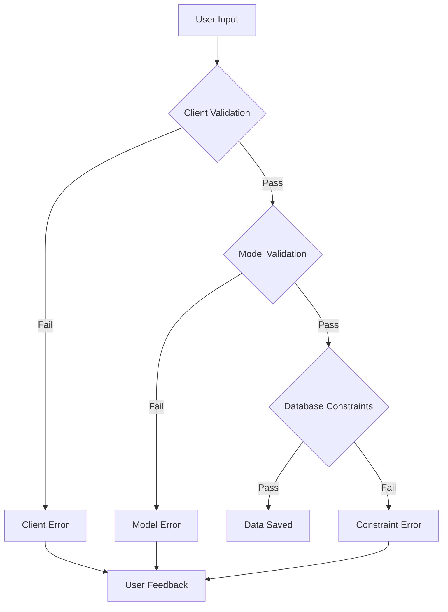

# Validations & Constraints

## 🎯 Data Integrity with Validations

Validations ensure data quality and consistency at both the application and database levels. Proper validation prevents bad data from entering your system and provides clear error messages to users.



## 🔧 Model-Level Validations

### 1. Built-in Validators

```javascript
// models/User.js - Comprehensive user validation
const { Model, DataTypes } = require('sequelize');
const bcrypt = require('bcrypt');

class User extends Model {
  static associate(models) {
    User.hasMany(models.Post, { foreignKey: 'userId' });
    User.hasMany(models.Comment, { foreignKey: 'userId' });
  }

  // Instance method for password verification
  async validatePassword(password) {
    return await bcrypt.compare(password, this.passwordHash);
  }

  // Instance method for full name
  get fullName() {
    return `${this.firstName} ${this.lastName}`;
  }
}

User.init({
  id: {
    type: DataTypes.INTEGER,
    primaryKey: true,
    autoIncrement: true
  },
  
  firstName: {
    type: DataTypes.STRING(50),
    allowNull: false,
    validate: {
      notNull: {
        msg: 'First name is required'
      },
      notEmpty: {
        msg: 'First name cannot be empty'
      },
      len: {
        args: [2, 50],
        msg: 'First name must be between 2 and 50 characters'
      },
      isAlpha: {
        msg: 'First name can only contain letters'
      }
    }
  },

  lastName: {
    type: DataTypes.STRING(50),
    allowNull: false,
    validate: {
      notNull: {
        msg: 'Last name is required'
      },
      notEmpty: {
        msg: 'Last name cannot be empty'
      },
      len: {
        args: [2, 50],
        msg: 'Last name must be between 2 and 50 characters'
      },
      isAlpha: {
        msg: 'Last name can only contain letters'
      }
    }
  },

  email: {
    type: DataTypes.STRING(150),
    allowNull: false,
    unique: {
      name: 'users_email_unique',
      msg: 'Email address is already registered'
    },
    validate: {
      notNull: {
        msg: 'Email is required'
      },
      notEmpty: {
        msg: 'Email cannot be empty'
      },
      isEmail: {
        msg: 'Please provide a valid email address'
      },
      len: {
        args: [5, 150],
        msg: 'Email must be between 5 and 150 characters'
      }
    }
  },

  username: {
    type: DataTypes.STRING(30),
    allowNull: true,
    unique: {
      name: 'users_username_unique',
      msg: 'Username is already taken'
    },
    validate: {
      len: {
        args: [3, 30],
        msg: 'Username must be between 3 and 30 characters'
      },
      is: {
        args: /^[a-zA-Z0-9_-]+$/,
        msg: 'Username can only contain letters, numbers, underscores, and hyphens'
      }
    }
  },

  passwordHash: {
    type: DataTypes.STRING(255),
    allowNull: false,
    validate: {
      notNull: {
        msg: 'Password is required'
      },
      notEmpty: {
        msg: 'Password cannot be empty'
      }
    }
  },

  // Virtual field for password input
  password: {
    type: DataTypes.VIRTUAL,
    allowNull: false,
    validate: {
      notNull: {
        msg: 'Password is required'
      },
      len: {
        args: [8, 128],
        msg: 'Password must be between 8 and 128 characters'
      },
      hasUppercase(value) {
        if (!/[A-Z]/.test(value)) {
          throw new Error('Password must contain at least one uppercase letter');
        }
      },
      hasLowercase(value) {
        if (!/[a-z]/.test(value)) {
          throw new Error('Password must contain at least one lowercase letter');
        }
      },
      hasNumber(value) {
        if (!/\d/.test(value)) {
          throw new Error('Password must contain at least one number');
        }
      },
      hasSpecialChar(value) {
        if (!/[!@#$%^&*(),.?":{}|<>]/.test(value)) {
          throw new Error('Password must contain at least one special character');
        }
      }
    }
  },

  phone: {
    type: DataTypes.STRING(20),
    allowNull: true,
    validate: {
      is: {
        args: /^\+?[\d\s\-\(\)]+$/,
        msg: 'Please provide a valid phone number'
      },
      len: {
        args: [10, 20],
        msg: 'Phone number must be between 10 and 20 characters'
      }
    }
  },

  dateOfBirth: {
    type: DataTypes.DATEONLY,
    allowNull: true,
    validate: {
      isDate: {
        msg: 'Please provide a valid date'
      },
      isBefore: {
        args: new Date().toISOString().split('T')[0],
        msg: 'Date of birth cannot be in the future'
      },
      isAdult(value) {
        if (value) {
          const today = new Date();
          const birthDate = new Date(value);
          const age = today.getFullYear() - birthDate.getFullYear();
          const monthDiff = today.getMonth() - birthDate.getMonth();
          
          if (monthDiff < 0 || (monthDiff === 0 && today.getDate() < birthDate.getDate())) {
            age--;
          }
          
          if (age < 13) {
            throw new Error('User must be at least 13 years old');
          }
        }
      }
    }
  },

  bio: {
    type: DataTypes.TEXT,
    allowNull: true,
    validate: {
      len: {
        args: [0, 500],
        msg: 'Bio cannot exceed 500 characters'
      }
    }
  },

  website: {
    type: DataTypes.STRING(255),
    allowNull: true,
    validate: {
      isUrl: {
        msg: 'Please provide a valid URL'
      }
    }
  },

  avatarUrl: {
    type: DataTypes.STRING(500),
    allowNull: true,
    validate: {
      isUrl: {
        msg: 'Avatar URL must be a valid URL'
      }
    }
  },

  role: {
    type: DataTypes.ENUM('user', 'moderator', 'admin'),
    defaultValue: 'user',
    allowNull: false,
    validate: {
      isIn: {
        args: [['user', 'moderator', 'admin']],
        msg: 'Role must be user, moderator, or admin'
      }
    }
  },

  isActive: {
    type: DataTypes.BOOLEAN,
    defaultValue: true,
    allowNull: false
  },

  emailVerified: {
    type: DataTypes.BOOLEAN,
    defaultValue: false,
    allowNull: false
  },

  lastLoginAt: {
    type: DataTypes.DATE,
    allowNull: true
  },

  preferences: {
    type: DataTypes.JSONB,
    defaultValue: {},
    validate: {
      isValidPreferences(value) {
        if (value && typeof value !== 'object') {
          throw new Error('Preferences must be a valid JSON object');
        }
        
        if (value && value.theme && !['light', 'dark', 'auto'].includes(value.theme)) {
          throw new Error('Theme must be light, dark, or auto');
        }
        
        if (value && value.language && typeof value.language !== 'string') {
          throw new Error('Language must be a string');
        }
      }
    }
  }
}, {
  sequelize,
  modelName: 'User',
  tableName: 'users',
  underscored: true,
  timestamps: true,
  
  // Model-level validations
  validate: {
    // Custom validation across multiple fields
    bothNamesOrNeither() {
      if ((this.firstName === null) !== (this.lastName === null)) {
        throw new Error('Both first name and last name are required');
      }
    },
    
    // Email and username cannot be the same
    emailUsernameUnique() {
      if (this.email && this.username && this.email === this.username) {
        throw new Error('Email and username cannot be the same');
      }
    }
  },

  // Hooks for password hashing
  hooks: {
    beforeValidate: async (user) => {
      // Trim whitespace from string fields
      if (user.firstName) user.firstName = user.firstName.trim();
      if (user.lastName) user.lastName = user.lastName.trim();
      if (user.email) user.email = user.email.toLowerCase().trim();
      if (user.username) user.username = user.username.toLowerCase().trim();
    },
    
    beforeCreate: async (user) => {
      if (user.password) {
        user.passwordHash = await bcrypt.hash(user.password, 12);
      }
    },
    
    beforeUpdate: async (user) => {
      if (user.changed('password') && user.password) {
        user.passwordHash = await bcrypt.hash(user.password, 12);
      }
    }
  }
});

module.exports = User;
```

### 2. Post Model with Advanced Validations

```javascript
// models/Post.js - Blog post with content validation
const { Model, DataTypes } = require('sequelize');
const slugify = require('slugify');

class Post extends Model {
  static associate(models) {
    Post.belongsTo(models.User, { foreignKey: 'userId', as: 'author' });
    Post.hasMany(models.Comment, { foreignKey: 'postId' });
    Post.belongsToMany(models.Category, { 
      through: 'PostCategories', 
      foreignKey: 'postId' 
    });
  }

  // Calculate reading time
  get readingTime() {
    if (!this.content) return 0;
    const wordsPerMinute = 200;
    const wordCount = this.content.split(/\s+/).length;
    return Math.ceil(wordCount / wordsPerMinute);
  }

  // Generate excerpt if not provided
  get autoExcerpt() {
    if (this.excerpt) return this.excerpt;
    if (!this.content) return '';
    
    // Remove HTML tags and get first 150 characters
    const plainText = this.content.replace(/<[^>]*>/g, '');
    return plainText.length > 150 
      ? plainText.substring(0, 150) + '...' 
      : plainText;
  }
}

Post.init({
  id: {
    type: DataTypes.INTEGER,
    primaryKey: true,
    autoIncrement: true
  },

  title: {
    type: DataTypes.STRING(200),
    allowNull: false,
    validate: {
      notNull: {
        msg: 'Title is required'
      },
      notEmpty: {
        msg: 'Title cannot be empty'
      },
      len: {
        args: [5, 200],
        msg: 'Title must be between 5 and 200 characters'
      },
      noHtml(value) {
        if (/<[^>]*>/g.test(value)) {
          throw new Error('Title cannot contain HTML tags');
        }
      }
    }
  },

  slug: {
    type: DataTypes.STRING(200),
    allowNull: false,
    unique: {
      name: 'posts_slug_unique',
      msg: 'A post with this slug already exists'
    },
    validate: {
      notNull: {
        msg: 'Slug is required'
      },
      notEmpty: {
        msg: 'Slug cannot be empty'
      },
      len: {
        args: [3, 200],
        msg: 'Slug must be between 3 and 200 characters'
      },
      is: {
        args: /^[a-z0-9-]+$/,
        msg: 'Slug can only contain lowercase letters, numbers, and hyphens'
      },
      noConsecutiveHyphens(value) {
        if (value && value.includes('--')) {
          throw new Error('Slug cannot contain consecutive hyphens');
        }
      },
      noLeadingTrailingHyphens(value) {
        if (value && (value.startsWith('-') || value.endsWith('-'))) {
          throw new Error('Slug cannot start or end with a hyphen');
        }
      }
    }
  },

  excerpt: {
    type: DataTypes.TEXT,
    allowNull: true,
    validate: {
      len: {
        args: [0, 500],
        msg: 'Excerpt cannot exceed 500 characters'
      }
    }
  },

  content: {
    type: DataTypes.TEXT,
    allowNull: true,
    validate: {
      len: {
        args: [0, 50000],
        msg: 'Content cannot exceed 50,000 characters'
      },
      hasSubstantialContent(value) {
        if (this.status === 'published' && (!value || value.trim().length < 100)) {
          throw new Error('Published posts must have at least 100 characters of content');
        }
      }
    }
  },

  status: {
    type: DataTypes.ENUM('draft', 'published', 'archived', 'scheduled'),
    defaultValue: 'draft',
    allowNull: false,
    validate: {
      isIn: {
        args: [['draft', 'published', 'archived', 'scheduled']],
        msg: 'Status must be draft, published, archived, or scheduled'
      }
    }
  },

  publishedAt: {
    type: DataTypes.DATE,
    allowNull: true,
    validate: {
      isDate: {
        msg: 'Published date must be a valid date'
      },
      isValidPublishDate(value) {
        if (this.status === 'published' && !value) {
          throw new Error('Published posts must have a published date');
        }
        
        if (this.status === 'scheduled' && value) {
          const now = new Date();
          if (new Date(value) <= now) {
            throw new Error('Scheduled posts must have a future publish date');
          }
        }
      }
    }
  },

  viewCount: {
    type: DataTypes.INTEGER,
    defaultValue: 0,
    allowNull: false,
    validate: {
      isInt: {
        msg: 'View count must be an integer'
      },
      min: {
        args: 0,
        msg: 'View count cannot be negative'
      }
    }
  },

  featured: {
    type: DataTypes.BOOLEAN,
    defaultValue: false,
    allowNull: false
  },

  allowComments: {
    type: DataTypes.BOOLEAN,
    defaultValue: true,
    allowNull: false
  },

  tags: {
    type: DataTypes.ARRAY(DataTypes.STRING),
    defaultValue: [],
    validate: {
      isValidTagArray(value) {
        if (!Array.isArray(value)) {
          throw new Error('Tags must be an array');
        }
        
        if (value.length > 10) {
          throw new Error('Maximum 10 tags allowed');
        }
        
        for (const tag of value) {
          if (typeof tag !== 'string') {
            throw new Error('Each tag must be a string');
          }
          
          if (tag.length < 2 || tag.length > 30) {
            throw new Error('Each tag must be between 2 and 30 characters');
          }
          
          if (!/^[a-zA-Z0-9\s-]+$/.test(tag)) {
            throw new Error('Tags can only contain letters, numbers, spaces, and hyphens');
          }
        }
        
        // Check for duplicates
        const uniqueTags = [...new Set(value.map(tag => tag.toLowerCase()))];
        if (uniqueTags.length !== value.length) {
          throw new Error('Duplicate tags are not allowed');
        }
      }
    }
  },

  metadata: {
    type: DataTypes.JSONB,
    defaultValue: {},
    validate: {
      isValidMetadata(value) {
        if (value && typeof value !== 'object') {
          throw new Error('Metadata must be a valid JSON object');
        }
        
        // Validate SEO metadata
        if (value && value.seo) {
          const { title, description, keywords } = value.seo;
          
          if (title && (typeof title !== 'string' || title.length > 60)) {
            throw new Error('SEO title must be a string with maximum 60 characters');
          }
          
          if (description && (typeof description !== 'string' || description.length > 160)) {
            throw new Error('SEO description must be a string with maximum 160 characters');
          }
          
          if (keywords && (!Array.isArray(keywords) || keywords.length > 10)) {
            throw new Error('SEO keywords must be an array with maximum 10 items');
          }
        }
        
        // Validate reading time if provided
        if (value && value.readingTime && (!Number.isInteger(value.readingTime) || value.readingTime < 0)) {
          throw new Error('Reading time must be a positive integer');
        }
      }
    }
  }
}, {
  sequelize,
  modelName: 'Post',
  tableName: 'posts',
  underscored: true,
  timestamps: true,

  // Model-level validations
  validate: {
    // Content required for published posts
    contentForPublished() {
      if (this.status === 'published' && (!this.content || this.content.trim().length === 0)) {
        throw new Error('Published posts must have content');
      }
    },

    // Scheduled posts must have future date
    scheduledDateValidation() {
      if (this.status === 'scheduled') {
        if (!this.publishedAt) {
          throw new Error('Scheduled posts must have a publish date');
        }
        
        if (new Date(this.publishedAt) <= new Date()) {
          throw new Error('Scheduled posts must have a future publish date');
        }
      }
    },

    // Published posts should have substantial content
    substantialContent() {
      if (this.status === 'published' && this.content) {
        const wordCount = this.content.split(/\s+/).length;
        if (wordCount < 50) {
          throw new Error('Published posts should have at least 50 words');
        }
      }
    }
  },

  hooks: {
    beforeValidate: async (post) => {
      // Auto-generate slug from title if not provided
      if (post.title && !post.slug) {
        post.slug = slugify(post.title, {
          lower: true,
          strict: true,
          remove: /[*+~.()'"!:@]/g
        });
      }
      
      // Normalize tags
      if (post.tags && Array.isArray(post.tags)) {
        post.tags = post.tags.map(tag => tag.trim().toLowerCase());
      }
      
      // Set published date for published posts
      if (post.status === 'published' && !post.publishedAt) {
        post.publishedAt = new Date();
      }
    },

    beforeCreate: async (post) => {
      // Ensure unique slug
      if (post.slug) {
        const existingPost = await Post.findOne({ where: { slug: post.slug } });
        if (existingPost) {
          const timestamp = Date.now();
          post.slug = `${post.slug}-${timestamp}`;
        }
      }
    },

    beforeUpdate: async (post) => {
      // Ensure unique slug when updating
      if (post.changed('slug') && post.slug) {
        const existingPost = await Post.findOne({ 
          where: { 
            slug: post.slug,
            id: { [sequelize.Op.ne]: post.id }
          } 
        });
        if (existingPost) {
          const timestamp = Date.now();
          post.slug = `${post.slug}-${timestamp}`;
        }
      }
    }
  }
});

module.exports = Post;
```

### 3. Custom Validators

```javascript
// utils/validators.js - Custom validation functions
const { Op } = require('sequelize');

class CustomValidators {
  // Validate password strength
  static validatePasswordStrength(password) {
    const errors = [];
    
    if (password.length < 8) {
      errors.push('Password must be at least 8 characters long');
    }
    
    if (!/[A-Z]/.test(password)) {
      errors.push('Password must contain at least one uppercase letter');
    }
    
    if (!/[a-z]/.test(password)) {
      errors.push('Password must contain at least one lowercase letter');
    }
    
    if (!/\d/.test(password)) {
      errors.push('Password must contain at least one number');
    }
    
    if (!/[!@#$%^&*(),.?":{}|<>]/.test(password)) {
      errors.push('Password must contain at least one special character');
    }
    
    // Check for common patterns
    const commonPatterns = [
      /(.)\1{2,}/,  // Repeated characters (aaa, 111)
      /123456/,     // Sequential numbers
      /abcdef/,     // Sequential letters
      /qwerty/i,    // Keyboard patterns
      /password/i,  // Common words
      /admin/i,
      /user/i
    ];
    
    for (const pattern of commonPatterns) {
      if (pattern.test(password)) {
        errors.push('Password contains common patterns and is too weak');
        break;
      }
    }
    
    if (errors.length > 0) {
      throw new Error(errors.join('; '));
    }
  }

  // Validate image URL
  static async validateImageUrl(url) {
    if (!url) return;
    
    const imageExtensions = ['.jpg', '.jpeg', '.png', '.gif', '.webp', '.svg'];
    const hasValidExtension = imageExtensions.some(ext => 
      url.toLowerCase().includes(ext)
    );
    
    if (!hasValidExtension) {
      throw new Error('URL must point to a valid image file');
    }

    // Optional: Check if URL is accessible
    try {
      const fetch = require('node-fetch');
      const response = await fetch(url, { method: 'HEAD', timeout: 5000 });
      
      if (!response.ok) {
        throw new Error('Image URL is not accessible');
      }
      
      const contentType = response.headers.get('content-type');
      if (!contentType || !contentType.startsWith('image/')) {
        throw new Error('URL does not point to an image');
      }
    } catch (error) {
      if (error.message.includes('timeout')) {
        throw new Error('Image URL is not accessible (timeout)');
      }
      throw error;
    }
  }

  // Validate social media URLs
  static validateSocialMediaUrl(url, platform) {
    const patterns = {
      twitter: /^https?:\/\/(www\.)?(twitter\.com|x\.com)\/[a-zA-Z0-9_]+\/?$/,
      facebook: /^https?:\/\/(www\.)?facebook\.com\/[a-zA-Z0-9.]+\/?$/,
      linkedin: /^https?:\/\/(www\.)?linkedin\.com\/(in|company)\/[a-zA-Z0-9-]+\/?$/,
      instagram: /^https?:\/\/(www\.)?instagram\.com\/[a-zA-Z0-9_.]+\/?$/,
      github: /^https?:\/\/(www\.)?github\.com\/[a-zA-Z0-9-]+\/?$/,
      youtube: /^https?:\/\/(www\.)?youtube\.com\/(channel|user|c)\/[a-zA-Z0-9-_]+\/?$/
    };

    const pattern = patterns[platform.toLowerCase()];
    if (!pattern) {
      throw new Error(`Unsupported platform: ${platform}`);
    }

    if (!pattern.test(url)) {
      throw new Error(`Invalid ${platform} URL format`);
    }
  }

  // Validate phone number by country
  static validatePhoneNumber(phone, country = 'US') {
    const patterns = {
      US: /^\+?1?[-.\s]?\(?([0-9]{3})\)?[-.\s]?([0-9]{3})[-.\s]?([0-9]{4})$/,
      UK: /^\+?44[-.\s]?[0-9]{4}[-.\s]?[0-9]{6}$/,
      IN: /^\+?91[-.\s]?[6-9][0-9]{9}$/,
      DE: /^\+?49[-.\s]?[0-9]{3,4}[-.\s]?[0-9]{6,8}$/,
      FR: /^\+?33[-.\s]?[0-9]{1}[-.\s]?[0-9]{8}$/
    };

    const pattern = patterns[country.toUpperCase()];
    if (!pattern) {
      throw new Error(`Phone validation not supported for country: ${country}`);
    }

    if (!pattern.test(phone)) {
      throw new Error(`Invalid phone number format for ${country}`);
    }
  }

  // Validate content length and quality
  static validateContentQuality(content, minWords = 100) {
    if (!content || typeof content !== 'string') {
      throw new Error('Content is required');
    }

    // Remove HTML tags for word count
    const plainText = content.replace(/<[^>]*>/g, ' ').trim();
    const words = plainText.split(/\s+/).filter(word => word.length > 0);

    if (words.length < minWords) {
      throw new Error(`Content must contain at least ${minWords} words (current: ${words.length})`);
    }

    // Check for excessive repetition
    const wordCount = {};
    words.forEach(word => {
      const cleanWord = word.toLowerCase().replace(/[^\w]/g, '');
      wordCount[cleanWord] = (wordCount[cleanWord] || 0) + 1;
    });

    const totalWords = words.length;
    const uniqueWords = Object.keys(wordCount).length;
    const uniqueRatio = uniqueWords / totalWords;

    if (uniqueRatio < 0.3) {
      throw new Error('Content appears to have excessive repetition');
    }

    // Check for minimum sentence variety
    const sentences = plainText.split(/[.!?]+/).filter(s => s.trim().length > 0);
    if (sentences.length < Math.max(3, Math.floor(words.length / 50))) {
      throw new Error('Content needs more sentence variety');
    }
  }

  // Validate JSON schema
  static validateJsonSchema(data, schema) {
    const Ajv = require('ajv');
    const ajv = new Ajv();
    const validate = ajv.compile(schema);
    
    if (!validate(data)) {
      const errors = validate.errors.map(error => 
        `${error.instancePath} ${error.message}`
      ).join('; ');
      throw new Error(`Schema validation failed: ${errors}`);
    }
  }

  // Validate file upload
  static validateFileUpload(file, options = {}) {
    const {
      maxSize = 5 * 1024 * 1024, // 5MB default
      allowedMimeTypes = ['image/jpeg', 'image/png', 'image/gif'],
      allowedExtensions = ['.jpg', '.jpeg', '.png', '.gif']
    } = options;

    if (!file) {
      throw new Error('File is required');
    }

    if (file.size > maxSize) {
      throw new Error(`File size exceeds limit of ${maxSize / (1024 * 1024)}MB`);
    }

    if (!allowedMimeTypes.includes(file.mimetype)) {
      throw new Error(`File type not allowed. Allowed types: ${allowedMimeTypes.join(', ')}`);
    }

    const fileExtension = path.extname(file.originalname).toLowerCase();
    if (!allowedExtensions.includes(fileExtension)) {
      throw new Error(`File extension not allowed. Allowed extensions: ${allowedExtensions.join(', ')}`);
    }
  }
}

module.exports = CustomValidators;
```

## 🛡️ Database Constraints

### 1. Constraint Types and Implementation

```javascript
// migrations/20231215000000-add-database-constraints.js
'use strict';

module.exports = {
  up: async (queryInterface, Sequelize) => {
    const transaction = await queryInterface.sequelize.transaction();
    
    try {
      // 1. CHECK CONSTRAINTS
      
      // User constraints
      await queryInterface.addConstraint('users', {
        fields: ['email'],
        type: 'check',
        name: 'users_email_format_check',
        where: {
          email: {
            [Sequelize.Op.regexp]: '^[A-Za-z0-9._%+-]+@[A-Za-z0-9.-]+\\.[A-Za-z]{2,}$'
          }
        }
      }, { transaction });

      await queryInterface.addConstraint('users', {
        fields: ['date_of_birth'],
        type: 'check',
        name: 'users_age_check',
        where: Sequelize.literal(`
          date_of_birth IS NULL OR 
          date_of_birth < CURRENT_DATE - INTERVAL '13 years'
        `)
      }, { transaction });

      await queryInterface.addConstraint('users', {
        fields: ['phone'],
        type: 'check',
        name: 'users_phone_format_check',
        where: {
          phone: {
            [Sequelize.Op.or]: [
              { [Sequelize.Op.is]: null },
              { [Sequelize.Op.regexp]: '^\\+?[1-9]\\d{1,14}$' }
            ]
          }
        }
      }, { transaction });

      // Post constraints
      await queryInterface.addConstraint('posts', {
        fields: ['view_count'],
        type: 'check',
        name: 'posts_view_count_positive',
        where: {
          view_count: { [Sequelize.Op.gte]: 0 }
        }
      }, { transaction });

      await queryInterface.addConstraint('posts', {
        fields: ['status', 'published_at'],
        type: 'check',
        name: 'posts_published_date_check',
        where: Sequelize.literal(`
          (status != 'published' OR published_at IS NOT NULL)
        `)
      }, { transaction });

      await queryInterface.addConstraint('posts', {
        fields: ['title'],
        type: 'check',
        name: 'posts_title_length_check',
        where: Sequelize.literal(`
          LENGTH(TRIM(title)) >= 5 AND LENGTH(title) <= 200
        `)
      }, { transaction });

      // 2. UNIQUE CONSTRAINTS
      
      await queryInterface.addConstraint('users', {
        fields: ['email'],
        type: 'unique',
        name: 'users_email_unique'
      }, { transaction });

      await queryInterface.addConstraint('users', {
        fields: ['username'],
        type: 'unique',
        name: 'users_username_unique'
      }, { transaction });

      await queryInterface.addConstraint('posts', {
        fields: ['slug'],
        type: 'unique',
        name: 'posts_slug_unique'
      }, { transaction });

      // Composite unique constraint
      await queryInterface.addConstraint('post_categories', {
        fields: ['post_id', 'category_id'],
        type: 'unique',
        name: 'post_categories_post_category_unique'
      }, { transaction });

      // 3. FOREIGN KEY CONSTRAINTS
      
      await queryInterface.addConstraint('posts', {
        fields: ['user_id'],
        type: 'foreign key',
        name: 'posts_user_id_fkey',
        references: {
          table: 'users',
          field: 'id'
        },
        onDelete: 'CASCADE',
        onUpdate: 'CASCADE'
      }, { transaction });

      await queryInterface.addConstraint('comments', {
        fields: ['post_id'],
        type: 'foreign key',
        name: 'comments_post_id_fkey',
        references: {
          table: 'posts',
          field: 'id'
        },
        onDelete: 'CASCADE',
        onUpdate: 'CASCADE'
      }, { transaction });

      await queryInterface.addConstraint('comments', {
        fields: ['user_id'],
        type: 'foreign key',
        name: 'comments_user_id_fkey',
        references: {
          table: 'users',
          field: 'id'
        },
        onDelete: 'CASCADE',
        onUpdate: 'CASCADE'
      }, { transaction });

      // Self-referencing foreign key
      await queryInterface.addConstraint('comments', {
        fields: ['parent_id'],
        type: 'foreign key',
        name: 'comments_parent_id_fkey',
        references: {
          table: 'comments',
          field: 'id'
        },
        onDelete: 'CASCADE',
        onUpdate: 'CASCADE'
      }, { transaction });

      // 4. EXCLUSION CONSTRAINTS (PostgreSQL specific)
      
      // Prevent overlapping featured posts in same period
      await queryInterface.sequelize.query(`
        ALTER TABLE posts 
        ADD CONSTRAINT posts_featured_exclusion 
        EXCLUDE USING gist (
          tsrange(created_at, created_at + interval '7 days') WITH &&
        ) 
        WHERE (featured = true AND status = 'published');
      `, { transaction });

      await transaction.commit();
      console.log('Database constraints added successfully');

    } catch (error) {
      await transaction.rollback();
      console.error('Failed to add constraints:', error);
      throw error;
    }
  },

  down: async (queryInterface, Sequelize) => {
    const transaction = await queryInterface.sequelize.transaction();
    
    try {
      // Remove constraints in reverse order
      const constraints = [
        'posts_featured_exclusion',
        'comments_parent_id_fkey',
        'comments_user_id_fkey',
        'comments_post_id_fkey',
        'posts_user_id_fkey',
        'post_categories_post_category_unique',
        'posts_slug_unique',
        'users_username_unique',
        'users_email_unique',
        'posts_title_length_check',
        'posts_published_date_check',
        'posts_view_count_positive',
        'users_phone_format_check',
        'users_age_check',
        'users_email_format_check'
      ];

      for (const constraint of constraints) {
        try {
          await queryInterface.removeConstraint('posts', constraint, { transaction });
        } catch (error) {
          try {
            await queryInterface.removeConstraint('users', constraint, { transaction });
          } catch (error) {
            try {
              await queryInterface.removeConstraint('comments', constraint, { transaction });
            } catch (error) {
              try {
                await queryInterface.removeConstraint('post_categories', constraint, { transaction });
              } catch (error) {
                console.warn(`Failed to remove constraint ${constraint}:`, error.message);
              }
            }
          }
        }
      }

      await transaction.commit();
    } catch (error) {
      await transaction.rollback();
      throw error;
    }
  }
};
```

### 2. Advanced Constraint Patterns

```javascript
// utils/constraint-helpers.js - Advanced constraint management
class ConstraintManager {
  constructor(sequelize) {
    this.sequelize = sequelize;
  }

  // Create conditional unique constraint
  async addConditionalUniqueConstraint(table, fields, condition, constraintName) {
    const conditionSql = typeof condition === 'string' 
      ? condition 
      : this.buildWhereClause(condition);

    await this.sequelize.query(`
      CREATE UNIQUE INDEX ${constraintName}
      ON ${table} (${fields.join(', ')})
      WHERE ${conditionSql};
    `);
  }

  // Create partial index for better performance
  async addPartialIndex(table, fields, condition, indexName) {
    const conditionSql = typeof condition === 'string' 
      ? condition 
      : this.buildWhereClause(condition);

    await this.sequelize.query(`
      CREATE INDEX ${indexName}
      ON ${table} (${fields.join(', ')})
      WHERE ${conditionSql};
    `);
  }

  // Add domain-specific constraints
  async addBusinessRuleConstraints() {
    const transaction = await this.sequelize.transaction();
    
    try {
      // Only one primary category per post
      await this.sequelize.query(`
        ALTER TABLE post_categories 
        ADD CONSTRAINT post_categories_one_primary_per_post 
        EXCLUDE USING gist (
          post_id WITH =, 
          is_primary WITH =
        ) WHERE (is_primary = true);
      `, { transaction });

      // User can't follow themselves
      await this.sequelize.query(`
        ALTER TABLE follows 
        ADD CONSTRAINT follows_no_self_follow 
        CHECK (follower_id != followed_id);
      `, { transaction });

      // Comment depth limit (prevent infinite nesting)
      await this.sequelize.query(`
        CREATE OR REPLACE FUNCTION check_comment_depth()
        RETURNS TRIGGER AS $$
        DECLARE
          depth INTEGER := 0;
          current_parent_id INTEGER := NEW.parent_id;
        BEGIN
          WHILE current_parent_id IS NOT NULL LOOP
            depth := depth + 1;
            IF depth > 5 THEN
              RAISE EXCEPTION 'Comment nesting depth cannot exceed 5 levels';
            END IF;
            
            SELECT parent_id INTO current_parent_id
            FROM comments 
            WHERE id = current_parent_id;
          END LOOP;
          
          RETURN NEW;
        END;
        $$ LANGUAGE plpgsql;

        CREATE TRIGGER check_comment_depth_trigger
        BEFORE INSERT OR UPDATE ON comments
        FOR EACH ROW EXECUTE FUNCTION check_comment_depth();
      `, { transaction });

      // Scheduled posts must be in future
      await this.sequelize.query(`
        ALTER TABLE posts 
        ADD CONSTRAINT posts_scheduled_future_date 
        CHECK (
          status != 'scheduled' OR 
          published_at > NOW()
        );
      `, { transaction });

      await transaction.commit();
    } catch (error) {
      await transaction.rollback();
      throw error;
    }
  }

  // Validate constraint violations
  async validateConstraints(model, data) {
    const violations = [];
    
    try {
      // Try to create/update the record to check constraints
      await model.build(data).validate();
    } catch (error) {
      if (error.name === 'SequelizeValidationError') {
        violations.push(...error.errors.map(err => ({
          field: err.path,
          message: err.message,
          value: err.value
        })));
      }
    }

    return violations;
  }

  buildWhereClause(condition) {
    // Helper to build WHERE clause from object
    if (typeof condition === 'object') {
      return Object.entries(condition)
        .map(([key, value]) => `${key} = '${value}'`)
        .join(' AND ');
    }
    return condition;
  }
}

module.exports = ConstraintManager;
```

## 🧪 Validation Testing

### 1. Comprehensive Validation Tests

```javascript
// tests/validations.test.js - Testing all validation scenarios
const { User, Post, Comment } = require('../models');
const { ValidationError, UniqueConstraintError } = require('sequelize');

describe('Model Validations', () => {
  describe('User Validations', () => {
    test('should validate valid user data', async () => {
      const userData = {
        firstName: 'John',
        lastName: 'Doe',
        email: 'john.doe@example.com',
        password: 'SecurePass123!',
        phone: '+1234567890',
        dateOfBirth: '1990-01-01'
      };

      const user = await User.create(userData);
      expect(user.id).toBeDefined();
      expect(user.email).toBe(userData.email.toLowerCase());
    });

    test('should reject invalid email formats', async () => {
      const invalidEmails = [
        'invalid.email',
        '@domain.com',
        'user@',
        'user..name@domain.com',
        'user@domain',
        ''
      ];

      for (const email of invalidEmails) {
        await expect(
          User.create({
            firstName: 'Test',
            lastName: 'User',
            email,
            password: 'SecurePass123!'
          })
        ).rejects.toThrow(ValidationError);
      }
    });

    test('should reject weak passwords', async () => {
      const weakPasswords = [
        '123456',           // Too short, no letters/special chars
        'password',         // No numbers/special chars
        'Password',         // No numbers/special chars
        'Password123',      // No special chars
        'password123!',     // No uppercase
        'PASSWORD123!',     // No lowercase
        'Pass123!',         // Too short
        'aaaaaaaA1!'        // Repeated characters
      ];

      for (const password of weakPasswords) {
        await expect(
          User.create({
            firstName: 'Test',
            lastName: 'User',
            email: 'test@example.com',
            password
          })
        ).rejects.toThrow(ValidationError);
      }
    });

    test('should validate age requirements', async () => {
      const today = new Date();
      const tooYoung = new Date(today.getFullYear() - 12, today.getMonth(), today.getDate());
      
      await expect(
        User.create({
          firstName: 'Child',
          lastName: 'User',
          email: 'child@example.com',
          password: 'SecurePass123!',
          dateOfBirth: tooYoung
        })
      ).rejects.toThrow('User must be at least 13 years old');
    });

    test('should validate phone number format', async () => {
      const invalidPhones = [
        '123',              // Too short
        'abc-def-ghij',     // Letters
        '123-456-78900',    // Too long
        '++1234567890'      // Multiple plus signs
      ];

      for (const phone of invalidPhones) {
        await expect(
          User.create({
            firstName: 'Test',
            lastName: 'User',
            email: 'test@example.com',
            password: 'SecurePass123!',
            phone
          })
        ).rejects.toThrow(ValidationError);
      }
    });

    test('should enforce unique email constraint', async () => {
      const userData = {
        firstName: 'First',
        lastName: 'User',
        email: 'duplicate@example.com',
        password: 'SecurePass123!'
      };

      await User.create(userData);

      await expect(
        User.create({
          ...userData,
          firstName: 'Second'
        })
      ).rejects.toThrow('Email address is already registered');
    });
  });

  describe('Post Validations', () => {
    let testUser;

    beforeEach(async () => {
      testUser = await User.create({
        firstName: 'Test',
        lastName: 'Author',
        email: 'author@example.com',
        password: 'SecurePass123!'
      });
    });

    test('should validate valid post data', async () => {
      const postData = {
        title: 'Test Post Title',
        content: 'This is a test post with sufficient content to pass validation. '.repeat(10),
        status: 'published',
        userId: testUser.id,
        tags: ['javascript', 'testing', 'validation']
      };

      const post = await Post.create(postData);
      expect(post.id).toBeDefined();
      expect(post.slug).toBe('test-post-title');
    });

    test('should reject posts with HTML in title', async () => {
      await expect(
        Post.create({
          title: '<script>alert("xss")</script>Test Title',
          content: 'Valid content here.',
          userId: testUser.id
        })
      ).rejects.toThrow('Title cannot contain HTML tags');
    });

    test('should validate published posts have content', async () => {
      await expect(
        Post.create({
          title: 'Test Title',
          content: '',
          status: 'published',
          userId: testUser.id
        })
      ).rejects.toThrow('Published posts must have content');
    });

    test('should validate tag constraints', async () => {
      const invalidTags = [
        Array(11).fill('tag'),  // Too many tags
        ['a'],                  // Tag too short
        ['a'.repeat(31)],       // Tag too long
        ['tag with @symbols'],  // Invalid characters
        ['duplicate', 'duplicate'] // Duplicate tags
      ];

      for (const tags of invalidTags) {
        await expect(
          Post.create({
            title: 'Test Title',
            content: 'Test content',
            userId: testUser.id,
            tags
          })
        ).rejects.toThrow(ValidationError);
      }
    });

    test('should validate scheduled post dates', async () => {
      const pastDate = new Date(Date.now() - 86400000); // Yesterday
      
      await expect(
        Post.create({
          title: 'Scheduled Post',
          content: 'Content for scheduled post',
          status: 'scheduled',
          publishedAt: pastDate,
          userId: testUser.id
        })
      ).rejects.toThrow('Scheduled posts must have a future publish date');
    });

    test('should auto-generate unique slugs', async () => {
      const postData = {
        title: 'Duplicate Title',
        content: 'Test content',
        userId: testUser.id
      };

      const post1 = await Post.create(postData);
      const post2 = await Post.create(postData);

      expect(post1.slug).toBe('duplicate-title');
      expect(post2.slug).toMatch(/^duplicate-title-\d+$/);
    });
  });

  describe('Cross-Model Validations', () => {
    let testUser, testPost;

    beforeEach(async () => {
      testUser = await User.create({
        firstName: 'Test',
        lastName: 'User',
        email: 'test@example.com',
        password: 'SecurePass123!'
      });

      testPost = await Post.create({
        title: 'Test Post',
        content: 'Test content for the post',
        userId: testUser.id,
        allowComments: true
      });
    });

    test('should validate comment on post that allows comments', async () => {
      const comment = await Comment.create({
        content: 'This is a valid comment',
        postId: testPost.id,
        userId: testUser.id
      });

      expect(comment.id).toBeDefined();
    });

    test('should prevent comments on posts that disallow them', async () => {
      await testPost.update({ allowComments: false });

      await expect(
        Comment.create({
          content: 'This comment should be rejected',
          postId: testPost.id,
          userId: testUser.id
        })
      ).rejects.toThrow('Comments are not allowed on this post');
    });
  });

  describe('Performance Impact of Validations', () => {
    test('should benchmark validation performance', async () => {
      const startTime = Date.now();
      
      const users = Array.from({ length: 100 }, (_, i) => ({
        firstName: `User${i}`,
        lastName: 'Test',
        email: `user${i}@example.com`,
        password: 'SecurePass123!'
      }));

      await Promise.all(users.map(userData => User.create(userData)));
      
      const endTime = Date.now();
      const duration = endTime - startTime;
      
      expect(duration).toBeLessThan(5000); // Should complete in under 5 seconds
      console.log(`Created 100 users with full validation in ${duration}ms`);
    });
  });
});
```

### 2. Custom Validation Error Handling

```javascript
// utils/validation-error-handler.js - Centralized error handling
class ValidationErrorHandler {
  static formatValidationError(error) {
    if (error.name === 'SequelizeValidationError') {
      return {
        type: 'VALIDATION_ERROR',
        message: 'Validation failed',
        errors: error.errors.map(err => ({
          field: err.path,
          message: err.message,
          value: err.value,
          type: err.validatorKey
        }))
      };
    }

    if (error.name === 'SequelizeUniqueConstraintError') {
      return {
        type: 'UNIQUE_CONSTRAINT_ERROR',
        message: 'Duplicate value found',
        errors: error.errors.map(err => ({
          field: err.path,
          message: `${err.path} must be unique`,
          value: err.value
        }))
      };
    }

    if (error.name === 'SequelizeForeignKeyConstraintError') {
      return {
        type: 'FOREIGN_KEY_ERROR',
        message: 'Referenced record not found',
        field: error.fields,
        value: error.value
      };
    }

    if (error.name === 'SequelizeCheckConstraintError') {
      return {
        type: 'CHECK_CONSTRAINT_ERROR',
        message: 'Data violates database constraint',
        constraint: error.constraint
      };
    }

    return {
      type: 'UNKNOWN_ERROR',
      message: error.message,
      originalError: error
    };
  }

  static createUserFriendlyMessage(formattedError) {
    const messages = {
      'VALIDATION_ERROR': 'Please check your input and try again.',
      'UNIQUE_CONSTRAINT_ERROR': 'This value is already in use.',
      'FOREIGN_KEY_ERROR': 'Referenced item does not exist.',
      'CHECK_CONSTRAINT_ERROR': 'The data provided is invalid.'
    };

    return messages[formattedError.type] || 'An error occurred while processing your request.';
  }

  static async handleModelError(error, model, operation) {
    const formattedError = this.formatValidationError(error);
    
    // Log error for debugging
    console.error(`${operation} failed for ${model}:`, {
      error: formattedError,
      timestamp: new Date().toISOString()
    });

    // Return user-friendly response
    return {
      success: false,
      error: formattedError,
      userMessage: this.createUserFriendlyMessage(formattedError)
    };
  }
}

module.exports = ValidationErrorHandler;
```

## 🎯 Key Takeaways

1. **Multi-Layer Validation**: Implement validation at model, database, and application levels
2. **Custom Validators**: Create reusable validation functions for complex business rules
3. **Database Constraints**: Use database constraints for data integrity enforcement
4. **Error Handling**: Provide clear, user-friendly error messages
5. **Performance Impact**: Balance thorough validation with performance requirements
6. **Testing Coverage**: Thoroughly test all validation scenarios
7. **Business Rules**: Encode business logic in validations and constraints

## 🚀 What's Next?

Now that your data is validated and secure, let's explore [[13-Hooks-Lifecycle|Hooks & Lifecycle Events]] to add automated behaviors to your models!

---

## 🔗 Related Topics
- [[05-Models-Basics|Models & Data Types]]
- [[13-Hooks-Lifecycle|Hooks & Lifecycle Events]]
- [[18-Testing|Testing Strategies]]
