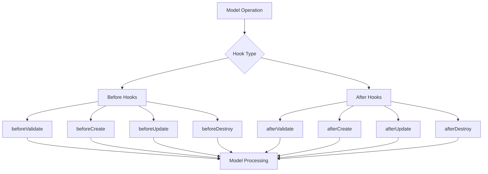

# Hooks & Lifecycle Events

## 🎯 Understanding Sequelize Hooks

Hooks are functions that run automatically during specific lifecycle events of your models. They enable you to implement automated behaviors, data transformations, and business logic triggers.



## 🔄 Hook Types and Execution Order

### 1. Complete Lifecycle Overview

```javascript
// Execution order for different operations

// CREATE Operation:
// 1. beforeBulkCreate (if bulk operation)
// 2. beforeValidate
// 3. afterValidate
// 4. beforeCreate
// 5. beforeSave
// 6. afterCreate
// 7. afterSave
// 8. afterBulkCreate (if bulk operation)

// UPDATE Operation:
// 1. beforeBulkUpdate (if bulk operation)
// 2. beforeValidate
// 3. afterValidate
// 4. beforeUpdate
// 5. beforeSave
// 6. afterUpdate
// 7. afterSave
// 8. afterBulkUpdate (if bulk operation)

// DELETE Operation:
// 1. beforeBulkDestroy (if bulk operation)
// 2. beforeDestroy
// 3. afterDestroy
// 4. afterBulkDestroy (if bulk operation)

// FIND Operation:
// 1. beforeFind
// 2. beforeFindAfterExpandIncludeAll
// 3. beforeFindAfterOptions
// 4. afterFind
```

### 2. Hook Implementation Examples

```javascript
// models/User.js - User model with comprehensive hooks
const { Model, DataTypes } = require('sequelize');
const bcrypt = require('bcrypt');
const { sendWelcomeEmail, sendAccountDeletedEmail } = require('../utils/email');
const { createUserProfile, deleteUserData } = require('../services/userService');

class User extends Model {
  static associate(models) {
    User.hasMany(models.Post, { foreignKey: 'userId' });
    User.hasMany(models.Comment, { foreignKey: 'userId' });
    User.hasOne(models.UserProfile, { foreignKey: 'userId' });
  }
}

User.init({
  id: {
    type: DataTypes.INTEGER,
    primaryKey: true,
    autoIncrement: true
  },
  firstName: {
    type: DataTypes.STRING(50),
    allowNull: false
  },
  lastName: {
    type: DataTypes.STRING(50),
    allowNull: false
  },
  email: {
    type: DataTypes.STRING(150),
    allowNull: false,
    unique: true
  },
  username: {
    type: DataTypes.STRING(30),
    allowNull: true,
    unique: true
  },
  passwordHash: {
    type: DataTypes.STRING(255),
    allowNull: false
  },
  password: {
    type: DataTypes.VIRTUAL,
    allowNull: false
  },
  isActive: {
    type: DataTypes.BOOLEAN,
    defaultValue: true
  },
  emailVerified: {
    type: DataTypes.BOOLEAN,
    defaultValue: false
  },
  lastLoginAt: {
    type: DataTypes.DATE,
    allowNull: true
  },
  loginCount: {
    type: DataTypes.INTEGER,
    defaultValue: 0
  }
}, {
  sequelize,
  modelName: 'User',
  tableName: 'users',
  underscored: true,
  timestamps: true,

  hooks: {
    // VALIDATION HOOKS
    beforeValidate: async (user, options) => {
      console.log('🔍 beforeValidate: Normalizing user data');
      
      // Normalize email and username
      if (user.email) {
        user.email = user.email.toLowerCase().trim();
      }
      
      if (user.username) {
        user.username = user.username.toLowerCase().trim();
      }
      
      // Normalize names
      if (user.firstName) {
        user.firstName = user.firstName.trim()
          .split(' ')
          .map(word => word.charAt(0).toUpperCase() + word.slice(1).toLowerCase())
          .join(' ');
      }
      
      if (user.lastName) {
        user.lastName = user.lastName.trim()
          .split(' ')
          .map(word => word.charAt(0).toUpperCase() + word.slice(1).toLowerCase())
          .join(' ');
      }
    },

    afterValidate: async (user, options) => {
      console.log('✅ afterValidate: User data validated successfully');
      
      // Generate username if not provided
      if (!user.username && user.firstName && user.lastName) {
        const baseUsername = `${user.firstName}${user.lastName}`.toLowerCase()
          .replace(/[^a-z0-9]/g, '');
        
        let username = baseUsername;
        let counter = 1;
        
        // Ensure username is unique
        while (await User.findOne({ where: { username } })) {
          username = `${baseUsername}${counter}`;
          counter++;
        }
        
        user.username = username;
      }
    },

    // CREATE HOOKS
    beforeCreate: async (user, options) => {
      console.log('🚀 beforeCreate: Preparing new user');
      
      // Hash password
      if (user.password) {
        const saltRounds = 12;
        user.passwordHash = await bcrypt.hash(user.password, saltRounds);
        console.log('🔐 Password hashed successfully');
      }
      
      // Set default values
      user.loginCount = 0;
      user.isActive = true;
      user.emailVerified = false;
    },

    afterCreate: async (user, options) => {
      console.log('🎉 afterCreate: User created successfully');
      
      // Create user profile
      try {
        await createUserProfile(user.id);
        console.log('👤 User profile created');
      } catch (error) {
        console.error('❌ Failed to create user profile:', error);
      }
      
      // Send welcome email (async, don't wait)
      sendWelcomeEmail(user.email, user.firstName)
        .then(() => console.log('📧 Welcome email sent'))
        .catch(error => console.error('❌ Failed to send welcome email:', error));
      
      // Log user creation
      console.log(`📝 New user registered: ${user.email} (ID: ${user.id})`);
    },

    // UPDATE HOOKS
    beforeUpdate: async (user, options) => {
      console.log('🔄 beforeUpdate: Preparing user update');
      
      // Hash password if changed
      if (user.changed('password') && user.password) {
        const saltRounds = 12;
        user.passwordHash = await bcrypt.hash(user.password, saltRounds);
        console.log('🔐 Password updated and hashed');
      }
      
      // Update login count and timestamp
      if (user.changed('lastLoginAt')) {
        user.loginCount = (user.loginCount || 0) + 1;
        console.log(`🔢 Login count updated: ${user.loginCount}`);
      }
      
      // Track email changes
      if (user.changed('email')) {
        user.emailVerified = false;
        console.log('📧 Email changed, verification reset');
      }
    },

    afterUpdate: async (user, options) => {
      console.log('✅ afterUpdate: User updated successfully');
      
      // Send email verification if email changed
      if (user.changed('email')) {
        // sendEmailVerification(user.email, user.id)
        //   .then(() => console.log('📧 Email verification sent'))
        //   .catch(error => console.error('❌ Failed to send verification:', error));
      }
      
      // Log significant changes
      const changedFields = user.changed();
      if (changedFields && changedFields.length > 0) {
        console.log(`📝 User ${user.id} updated fields: ${changedFields.join(', ')}`);
      }
    },

    // DELETE HOOKS
    beforeDestroy: async (user, options) => {
      console.log('🗑️ beforeDestroy: Preparing user deletion');
      
      // Backup user data before deletion
      const userData = {
        id: user.id,
        email: user.email,
        firstName: user.firstName,
        lastName: user.lastName,
        deletedAt: new Date()
      };
      
      // Store in audit table or external system
      // await backupUserData(userData);
      console.log('💾 User data backed up before deletion');
    },

    afterDestroy: async (user, options) => {
      console.log('🗑️ afterDestroy: User deleted successfully');
      
      // Clean up related data
      try {
        await deleteUserData(user.id);
        console.log('🧹 Related user data cleaned up');
      } catch (error) {
        console.error('❌ Failed to clean up user data:', error);
      }
      
      // Send account deletion confirmation
      sendAccountDeletedEmail(user.email, user.firstName)
        .then(() => console.log('📧 Account deletion email sent'))
        .catch(error => console.error('❌ Failed to send deletion email:', error));
      
      console.log(`📝 User account deleted: ${user.email} (ID: ${user.id})`);
    },

    // BULK OPERATION HOOKS
    beforeBulkCreate: async (users, options) => {
      console.log(`🚀 beforeBulkCreate: Processing ${users.length} users`);
      
      for (const user of users) {
        if (user.password) {
          const saltRounds = 12;
          user.passwordHash = await bcrypt.hash(user.password, saltRounds);
        }
      }
    },

    afterBulkCreate: async (users, options) => {
      console.log(`🎉 afterBulkCreate: ${users.length} users created`);
      
      // Batch create profiles
      const profilePromises = users.map(user => createUserProfile(user.id));
      await Promise.allSettled(profilePromises);
    },

    beforeBulkUpdate: async (options) => {
      console.log('🔄 beforeBulkUpdate: Bulk update starting');
      
      // Add timestamp for bulk updates
      if (options.attributes) {
        options.attributes.updatedAt = new Date();
      }
    },

    afterBulkUpdate: async (options) => {
      console.log('✅ afterBulkUpdate: Bulk update completed');
      
      // Log bulk update
      console.log(`📝 Bulk update affected rows: ${options.affectedRows || 'unknown'}`);
    },

    beforeBulkDestroy: async (options) => {
      console.log('🗑️ beforeBulkDestroy: Bulk deletion starting');
      
      // Find users that will be deleted for cleanup
      if (options.where) {
        const usersToDelete = await User.findAll({
          where: options.where,
          attributes: ['id', 'email']
        });
        
        // Store IDs for cleanup
        options.deletedUserIds = usersToDelete.map(user => user.id);
        console.log(`📝 Will delete ${usersToDelete.length} users`);
      }
    },

    afterBulkDestroy: async (options) => {
      console.log('🗑️ afterBulkDestroy: Bulk deletion completed');
      
      // Clean up related data for deleted users
      if (options.deletedUserIds && options.deletedUserIds.length > 0) {
        for (const userId of options.deletedUserIds) {
          try {
            await deleteUserData(userId);
          } catch (error) {
            console.error(`❌ Failed to cleanup data for user ${userId}:`, error);
          }
        }
      }
    }
  }
});

module.exports = User;
```

### 3. Post Model with Content Processing Hooks

```javascript
// models/Post.js - Post model with content processing hooks
const { Model, DataTypes } = require('sequelize');
const slugify = require('slugify');
const { generateExcerpt, extractTags, calculateReadingTime } = require('../utils/contentProcessing');
const { notifyFollowers, indexForSearch } = require('../services/postService');

class Post extends Model {
  static associate(models) {
    Post.belongsTo(models.User, { foreignKey: 'userId', as: 'author' });
    Post.hasMany(models.Comment, { foreignKey: 'postId' });
  }
}

Post.init({
  id: {
    type: DataTypes.INTEGER,
    primaryKey: true,
    autoIncrement: true
  },
  title: {
    type: DataTypes.STRING(200),
    allowNull: false
  },
  slug: {
    type: DataTypes.STRING(200),
    allowNull: false,
    unique: true
  },
  excerpt: {
    type: DataTypes.TEXT,
    allowNull: true
  },
  content: {
    type: DataTypes.TEXT,
    allowNull: true
  },
  status: {
    type: DataTypes.ENUM('draft', 'published', 'archived'),
    defaultValue: 'draft'
  },
  publishedAt: {
    type: DataTypes.DATE,
    allowNull: true
  },
  viewCount: {
    type: DataTypes.INTEGER,
    defaultValue: 0
  },
  readingTime: {
    type: DataTypes.INTEGER,
    allowNull: true
  },
  tags: {
    type: DataTypes.ARRAY(DataTypes.STRING),
    defaultValue: []
  }
}, {
  sequelize,
  modelName: 'Post',
  tableName: 'posts',
  underscored: true,
  timestamps: true,

  hooks: {
    beforeValidate: async (post, options) => {
      console.log('🔍 beforeValidate: Processing post content');
      
      // Generate slug from title
      if (post.title && (!post.slug || post.changed('title'))) {
        post.slug = slugify(post.title, {
          lower: true,
          strict: true,
          remove: /[*+~.()'"!:@]/g
        });
      }
      
      // Auto-generate excerpt if not provided
      if (post.content && !post.excerpt) {
        post.excerpt = generateExcerpt(post.content, 150);
      }
      
      // Calculate reading time
      if (post.content) {
        post.readingTime = calculateReadingTime(post.content);
      }
      
      // Extract tags from content if not manually set
      if (post.content && (!post.tags || post.tags.length === 0)) {
        post.tags = extractTags(post.content);
      }
    },

    beforeCreate: async (post, options) => {
      console.log('🚀 beforeCreate: Preparing new post');
      
      // Ensure unique slug
      if (post.slug) {
        let uniqueSlug = post.slug;
        let counter = 1;
        
        while (await Post.findOne({ where: { slug: uniqueSlug } })) {
          uniqueSlug = `${post.slug}-${counter}`;
          counter++;
        }
        
        post.slug = uniqueSlug;
      }
      
      // Set published date for published posts
      if (post.status === 'published' && !post.publishedAt) {
        post.publishedAt = new Date();
      }
    },

    afterCreate: async (post, options) => {
      console.log('🎉 afterCreate: Post created successfully');
      
      // Index for search if published
      if (post.status === 'published') {
        indexForSearch(post.id)
          .then(() => console.log('🔍 Post indexed for search'))
          .catch(error => console.error('❌ Failed to index post:', error));
      }
      
      console.log(`📝 New post created: "${post.title}" (ID: ${post.id})`);
    },

    beforeUpdate: async (post, options) => {
      console.log('🔄 beforeUpdate: Preparing post update');
      
      // Update published date when status changes to published
      if (post.changed('status') && post.status === 'published' && !post.publishedAt) {
        post.publishedAt = new Date();
        console.log('📅 Set published date');
      }
      
      // Clear published date when unpublishing
      if (post.changed('status') && post.status !== 'published' && post.publishedAt) {
        post.publishedAt = null;
        console.log('📅 Cleared published date');
      }
      
      // Update slug if title changed
      if (post.changed('title') && post.title) {
        const newSlug = slugify(post.title, {
          lower: true,
          strict: true,
          remove: /[*+~.()'"!:@]/g
        });
        
        // Ensure uniqueness
        let uniqueSlug = newSlug;
        let counter = 1;
        
        while (await Post.findOne({ 
          where: { 
            slug: uniqueSlug,
            id: { [sequelize.Op.ne]: post.id }
          } 
        })) {
          uniqueSlug = `${newSlug}-${counter}`;
          counter++;
        }
        
        post.slug = uniqueSlug;
      }
    },

    afterUpdate: async (post, options) => {
      console.log('✅ afterUpdate: Post updated successfully');
      
      // Handle publication
      if (post.changed('status') && post.status === 'published') {
        console.log('📢 Post published, notifying followers');
        
        // Notify followers
        notifyFollowers(post.userId, post.id)
          .then(() => console.log('📧 Followers notified'))
          .catch(error => console.error('❌ Failed to notify followers:', error));
        
        // Index for search
        indexForSearch(post.id)
          .then(() => console.log('🔍 Post indexed for search'))
          .catch(error => console.error('❌ Failed to index post:', error));
      }
      
      // Handle unpublication
      if (post.changed('status') && post.status !== 'published') {
        // Remove from search index
        // removeFromSearchIndex(post.id)
        //   .then(() => console.log('🔍 Post removed from search index'))
        //   .catch(error => console.error('❌ Failed to remove from index:', error));
      }
      
      // Log content changes
      const changedFields = post.changed();
      if (changedFields && changedFields.length > 0) {
        console.log(`📝 Post ${post.id} updated fields: ${changedFields.join(', ')}`);
      }
    },

    afterDestroy: async (post, options) => {
      console.log('🗑️ afterDestroy: Post deleted');
      
      // Remove from search index
      // removeFromSearchIndex(post.id)
      //   .then(() => console.log('🔍 Post removed from search index'))
      //   .catch(error => console.error('❌ Failed to remove from index:', error));
      
      console.log(`📝 Post deleted: "${post.title}" (ID: ${post.id})`);
    }
  }
});

module.exports = Post;
```

## 🎛️ Advanced Hook Patterns

### 1. Conditional Hooks

```javascript
// utils/conditional-hooks.js - Dynamic hook implementation
class ConditionalHooks {
  static createConditionalHook(condition, hookFunction) {
    return async (instance, options) => {
      if (await condition(instance, options)) {
        return await hookFunction(instance, options);
      }
    };
  }

  static createBusinessRuleHooks(model) {
    // Only process hooks for certain user roles
    const adminOnlyHook = this.createConditionalHook(
      async (instance, options) => {
        if (options.userId) {
          const user = await sequelize.models.User.findByPk(options.userId);
          return user && user.role === 'admin';
        }
        return false;
      },
      async (instance, options) => {
        console.log('Admin-only hook executed');
        // Admin-specific logic here
      }
    );

    // Only for production environment
    const productionOnlyHook = this.createConditionalHook(
      async (instance, options) => process.env.NODE_ENV === 'production',
      async (instance, options) => {
        console.log('Production-only hook executed');
        // Production-specific logic
      }
    );

    // Only for specific models
    const postSpecificHook = this.createConditionalHook(
      async (instance, options) => instance.constructor.name === 'Post',
      async (instance, options) => {
        console.log('Post-specific hook executed');
        // Post-specific logic
      }
    );

    return {
      adminOnlyHook,
      productionOnlyHook,
      postSpecificHook
    };
  }
}

// Usage in model
Post.addHook('afterCreate', 'adminNotification', 
  ConditionalHooks.createConditionalHook(
    async (post) => post.status === 'published',
    async (post) => {
      // Notify admins of new published post
      await notifyAdmins(post.id);
    }
  )
);
```

### 2. Async Hook Orchestration

```javascript
// utils/hook-orchestrator.js - Managing complex async operations
class HookOrchestrator {
  static async executeHooksInSeries(hooks, instance, options) {
    const results = [];
    
    for (const hook of hooks) {
      try {
        const result = await hook(instance, options);
        results.push(result);
      } catch (error) {
        console.error('Hook execution failed:', error);
        throw error;
      }
    }
    
    return results;
  }

  static async executeHooksInParallel(hooks, instance, options) {
    const promises = hooks.map(hook => hook(instance, options));
    return await Promise.allSettled(promises);
  }

  static createRetryableHook(hookFunction, maxRetries = 3, delay = 1000) {
    return async (instance, options) => {
      let attempts = 0;
      
      while (attempts < maxRetries) {
        try {
          return await hookFunction(instance, options);
        } catch (error) {
          attempts++;
          
          if (attempts === maxRetries) {
            console.error(`Hook failed after ${maxRetries} attempts:`, error);
            throw error;
          }
          
          console.warn(`Hook attempt ${attempts} failed, retrying in ${delay}ms:`, error.message);
          await new Promise(resolve => setTimeout(resolve, delay));
          delay *= 2; // Exponential backoff
        }
      }
    };
  }

  static createTimeoutHook(hookFunction, timeoutMs = 5000) {
    return async (instance, options) => {
      return Promise.race([
        hookFunction(instance, options),
        new Promise((_, reject) => 
          setTimeout(() => reject(new Error(`Hook timeout after ${timeoutMs}ms`)), timeoutMs)
        )
      ]);
    };
  }
}

// Example usage in User model
User.addHook('afterCreate', 'sendWelcomeEmail',
  HookOrchestrator.createRetryableHook(
    HookOrchestrator.createTimeoutHook(
      async (user) => {
        await sendWelcomeEmail(user.email, user.firstName);
      },
      10000 // 10 second timeout
    ),
    3, // 3 retries
    1000 // 1 second initial delay
  )
);
```

### 3. Cross-Model Hook Coordination

```javascript
// utils/cross-model-hooks.js - Coordinating hooks across models
class CrossModelHooks {
  static setupUserPostRelationshipHooks() {
    // When user is created, set up default categories
    User.addHook('afterCreate', 'setupDefaultCategories', async (user) => {
      const defaultCategories = await sequelize.models.Category.findAll({
        where: { isDefault: true }
      });
      
      if (defaultCategories.length > 0) {
        await user.addCategories(defaultCategories);
        console.log(`Default categories assigned to user ${user.id}`);
      }
    });

    // When post is published, update user statistics
    Post.addHook('afterUpdate', 'updateUserStats', async (post, options) => {
      if (post.changed('status') && post.status === 'published') {
        await sequelize.models.User.increment('publishedPostCount', {
          where: { id: post.userId }
        });
        
        console.log(`Updated post count for user ${post.userId}`);
      }
    });

    // When user is deleted, handle posts appropriately
    User.addHook('beforeDestroy', 'handleUserPosts', async (user, options) => {
      const userPosts = await sequelize.models.Post.findAll({
        where: { userId: user.id }
      });

      // Options: delete, archive, or transfer to admin user
      const postAction = options.postAction || 'archive';
      
      switch (postAction) {
        case 'delete':
          await sequelize.models.Post.destroy({
            where: { userId: user.id }
          });
          break;
          
        case 'transfer':
          const adminUser = await sequelize.models.User.findOne({
            where: { role: 'admin' }
          });
          
          if (adminUser) {
            await sequelize.models.Post.update(
              { userId: adminUser.id },
              { where: { userId: user.id } }
            );
          }
          break;
          
        case 'archive':
        default:
          await sequelize.models.Post.update(
            { status: 'archived' },
            { where: { userId: user.id } }
          );
          break;
      }
      
      console.log(`Handled ${userPosts.length} posts for deleted user ${user.id}`);
    });
  }

  static setupAuditTrail() {
    const auditableModels = ['User', 'Post', 'Comment'];
    
    auditableModels.forEach(modelName => {
      const model = sequelize.models[modelName];
      
      // Create audit log after any change
      ['afterCreate', 'afterUpdate', 'afterDestroy'].forEach(hookType => {
        model.addHook(hookType, `audit${hookType}`, async (instance, options) => {
          const action = hookType.replace('after', '').toLowerCase();
          
          await sequelize.models.AuditLog.create({
            modelName,
            modelId: instance.id,
            action,
            userId: options.userId || null,
            oldValues: action === 'update' ? instance._previousDataValues : null,
            newValues: action !== 'destroy' ? instance.dataValues : null,
            timestamp: new Date()
          });
        });
      });
    });
  }

  static setupCacheInvalidation() {
    const cacheInvalidationHook = async (instance, options) => {
      const { RedisClient } = require('../utils/redis');
      
      // Define cache patterns to invalidate
      const cachePatterns = {
        User: [`user:${instance.id}:*`, 'users:list:*'],
        Post: [`post:${instance.id}:*`, 'posts:list:*', `user:${instance.userId}:posts:*`],
        Comment: [`comment:${instance.id}:*`, `post:${instance.postId}:comments:*`]
      };
      
      const patterns = cachePatterns[instance.constructor.name] || [];
      
      for (const pattern of patterns) {
        try {
          await RedisClient.deletePattern(pattern);
          console.log(`Cache invalidated: ${pattern}`);
        } catch (error) {
          console.error(`Failed to invalidate cache ${pattern}:`, error);
        }
      }
    };

    // Apply to all models that need cache invalidation
    ['User', 'Post', 'Comment'].forEach(modelName => {
      const model = sequelize.models[modelName];
      
      ['afterCreate', 'afterUpdate', 'afterDestroy'].forEach(hookType => {
        model.addHook(hookType, 'cacheInvalidation', cacheInvalidationHook);
      });
    });
  }
}

module.exports = CrossModelHooks;
```

## 🔧 Hook Utilities and Helpers

### 1. Hook Testing Framework

```javascript
// tests/hooks.test.js - Testing hooks systematically
const { User, Post } = require('../models');
const { sendWelcomeEmail } = require('../utils/email');

// Mock external services
jest.mock('../utils/email');

describe('Model Hooks', () => {
  beforeEach(() => {
    jest.clearAllMocks();
  });

  describe('User Hooks', () => {
    test('should hash password before creating user', async () => {
      const userData = {
        firstName: 'Test',
        lastName: 'User',
        email: 'test@example.com',
        password: 'TestPassword123!'
      };

      const user = await User.create(userData);
      
      expect(user.passwordHash).toBeDefined();
      expect(user.passwordHash).not.toBe(userData.password);
      expect(user.passwordHash.length).toBeGreaterThan(50);
    });

    test('should normalize names before validation', async () => {
      const userData = {
        firstName: '  john  doe  ',
        lastName: '  SMITH  ',
        email: 'test@example.com',
        password: 'TestPassword123!'
      };

      const user = await User.create(userData);
      
      expect(user.firstName).toBe('John Doe');
      expect(user.lastName).toBe('Smith');
    });

    test('should send welcome email after user creation', async () => {
      const userData = {
        firstName: 'Test',
        lastName: 'User',
        email: 'test@example.com',
        password: 'TestPassword123!'
      };

      await User.create(userData);
      
      // Give async operations time to complete
      await new Promise(resolve => setTimeout(resolve, 100));
      
      expect(sendWelcomeEmail).toHaveBeenCalledWith(
        userData.email,
        userData.firstName
      );
    });

    test('should generate username if not provided', async () => {
      const userData = {
        firstName: 'Test',
        lastName: 'User',
        email: 'test@example.com',
        password: 'TestPassword123!'
      };

      const user = await User.create(userData);
      
      expect(user.username).toBe('testuser');
    });

    test('should handle duplicate username generation', async () => {
      const userData1 = {
        firstName: 'Test',
        lastName: 'User',
        email: 'test1@example.com',
        password: 'TestPassword123!'
      };

      const userData2 = {
        firstName: 'Test',
        lastName: 'User',
        email: 'test2@example.com',
        password: 'TestPassword123!'
      };

      const user1 = await User.create(userData1);
      const user2 = await User.create(userData2);
      
      expect(user1.username).toBe('testuser');
      expect(user2.username).toBe('testuser1');
    });
  });

  describe('Post Hooks', () => {
    let testUser;

    beforeEach(async () => {
      testUser = await User.create({
        firstName: 'Test',
        lastName: 'Author',
        email: 'author@example.com',
        password: 'TestPassword123!'
      });
    });

    test('should generate slug from title', async () => {
      const postData = {
        title: 'This is a Test Post Title!',
        content: 'Test content',
        userId: testUser.id
      };

      const post = await Post.create(postData);
      
      expect(post.slug).toBe('this-is-a-test-post-title');
    });

    test('should ensure unique slugs', async () => {
      const postData = {
        title: 'Duplicate Title',
        content: 'Test content',
        userId: testUser.id
      };

      const post1 = await Post.create(postData);
      const post2 = await Post.create(postData);
      
      expect(post1.slug).toBe('duplicate-title');
      expect(post2.slug).toMatch(/^duplicate-title-\d+$/);
    });

    test('should set published date when status changes to published', async () => {
      const post = await Post.create({
        title: 'Test Post',
        content: 'Test content',
        status: 'draft',
        userId: testUser.id
      });

      expect(post.publishedAt).toBeNull();

      await post.update({ status: 'published' });
      
      expect(post.publishedAt).toBeInstanceOf(Date);
    });

    test('should calculate reading time from content', async () => {
      const longContent = 'word '.repeat(200); // 200 words
      
      const post = await Post.create({
        title: 'Long Post',
        content: longContent,
        userId: testUser.id
      });

      expect(post.readingTime).toBe(1); // ~1 minute for 200 words
    });
  });

  describe('Hook Error Handling', () => {
    test('should handle email service failures gracefully', async () => {
      sendWelcomeEmail.mockRejectedValue(new Error('Email service down'));

      const userData = {
        firstName: 'Test',
        lastName: 'User',
        email: 'test@example.com',
        password: 'TestPassword123!'
      };

      // User creation should still succeed even if email fails
      await expect(User.create(userData)).resolves.toBeDefined();
    });

    test('should rollback on critical hook failures', async () => {
      // Mock a critical service that should prevent user creation
      const originalHook = User.options.hooks.beforeCreate.find(
        hook => hook.name === 'criticalValidation'
      );

      if (originalHook) {
        User.removeHook('beforeCreate', 'criticalValidation');
        
        User.addHook('beforeCreate', 'criticalValidation', async (user) => {
          if (user.email === 'critical-failure@example.com') {
            throw new Error('Critical validation failed');
          }
        });

        await expect(
          User.create({
            firstName: 'Test',
            lastName: 'User',
            email: 'critical-failure@example.com',
            password: 'TestPassword123!'
          })
        ).rejects.toThrow('Critical validation failed');
      }
    });
  });

  describe('Hook Performance', () => {
    test('should handle bulk operations efficiently', async () => {
      const users = Array.from({ length: 100 }, (_, i) => ({
        firstName: `User${i}`,
        lastName: 'Test',
        email: `user${i}@example.com`,
        password: 'TestPassword123!'
      }));

      const startTime = Date.now();
      await User.bulkCreate(users);
      const endTime = Date.now();

      const duration = endTime - startTime;
      expect(duration).toBeLessThan(5000); // Should complete in under 5 seconds
      
      console.log(`Bulk created 100 users with hooks in ${duration}ms`);
    });
  });
});
```

### 2. Hook Monitoring and Debugging

```javascript
// utils/hook-monitor.js - Monitor hook performance and errors
class HookMonitor {
  constructor() {
    this.metrics = new Map();
    this.errors = [];
  }

  wrapHook(originalHook, hookName, modelName) {
    return async (instance, options) => {
      const startTime = Date.now();
      const executionId = `${hookName}-${modelName}-${Date.now()}`;
      
      try {
        console.log(`🔄 Executing hook: ${hookName} on ${modelName}`);
        
        const result = await originalHook(instance, options);
        
        const duration = Date.now() - startTime;
        this.recordMetric(hookName, modelName, duration, 'success');
        
        if (duration > 1000) {
          console.warn(`⚠️ Slow hook detected: ${hookName} on ${modelName} took ${duration}ms`);
        }
        
        return result;
      } catch (error) {
        const duration = Date.now() - startTime;
        this.recordMetric(hookName, modelName, duration, 'error');
        this.recordError(hookName, modelName, error);
        
        console.error(`❌ Hook failed: ${hookName} on ${modelName}`, error);
        throw error;
      }
    };
  }

  recordMetric(hookName, modelName, duration, status) {
    const key = `${hookName}-${modelName}`;
    
    if (!this.metrics.has(key)) {
      this.metrics.set(key, {
        executions: 0,
        totalDuration: 0,
        avgDuration: 0,
        maxDuration: 0,
        minDuration: Infinity,
        successes: 0,
        errors: 0
      });
    }
    
    const metric = this.metrics.get(key);
    metric.executions++;
    metric.totalDuration += duration;
    metric.avgDuration = metric.totalDuration / metric.executions;
    metric.maxDuration = Math.max(metric.maxDuration, duration);
    metric.minDuration = Math.min(metric.minDuration, duration);
    
    if (status === 'success') {
      metric.successes++;
    } else {
      metric.errors++;
    }
  }

  recordError(hookName, modelName, error) {
    this.errors.push({
      hookName,
      modelName,
      error: error.message,
      stack: error.stack,
      timestamp: new Date()
    });
    
    // Keep only last 100 errors
    if (this.errors.length > 100) {
      this.errors.shift();
    }
  }

  getMetrics() {
    const result = {};
    
    for (const [key, metric] of this.metrics.entries()) {
      result[key] = {
        ...metric,
        errorRate: metric.executions > 0 ? (metric.errors / metric.executions) * 100 : 0,
        successRate: metric.executions > 0 ? (metric.successes / metric.executions) * 100 : 0
      };
    }
    
    return result;
  }

  getErrors() {
    return this.errors;
  }

  generateReport() {
    const metrics = this.getMetrics();
    const errors = this.getErrors();
    
    console.log('📊 Hook Performance Report');
    console.log('========================');
    
    for (const [key, metric] of Object.entries(metrics)) {
      console.log(`\n📈 ${key}:`);
      console.log(`  Executions: ${metric.executions}`);
      console.log(`  Avg Duration: ${metric.avgDuration.toFixed(2)}ms`);
      console.log(`  Max Duration: ${metric.maxDuration}ms`);
      console.log(`  Success Rate: ${metric.successRate.toFixed(2)}%`);
      
      if (metric.errorRate > 0) {
        console.log(`  ❌ Error Rate: ${metric.errorRate.toFixed(2)}%`);
      }
    }
    
    if (errors.length > 0) {
      console.log('\n❌ Recent Errors:');
      errors.slice(-5).forEach(error => {
        console.log(`  ${error.hookName}-${error.modelName}: ${error.error}`);
      });
    }
  }

  static setupMonitoring(sequelize) {
    const monitor = new HookMonitor();
    
    // Wrap all existing hooks
    Object.values(sequelize.models).forEach(model => {
      if (model.options.hooks) {
        Object.entries(model.options.hooks).forEach(([hookType, hooks]) => {
          if (Array.isArray(hooks)) {
            hooks.forEach((hook, index) => {
              const hookName = hook.name || `${hookType}-${index}`;
              model.options.hooks[hookType][index] = monitor.wrapHook(
                hook,
                hookName,
                model.name
              );
            });
          } else if (typeof hooks === 'function') {
            model.options.hooks[hookType] = monitor.wrapHook(
              hooks,
              hookType,
              model.name
            );
          }
        });
      }
    });
    
    // Generate report every 5 minutes
    setInterval(() => {
      monitor.generateReport();
    }, 5 * 60 * 1000);
    
    return monitor;
  }
}

module.exports = HookMonitor;
```

## 🎯 Key Takeaways

1. **Lifecycle Awareness**: Understand the complete hook execution order
2. **Automated Processing**: Use hooks for data transformations and validations
3. **Business Logic**: Implement complex business rules through hooks
4. **Error Handling**: Always handle async operations gracefully
5. **Performance Impact**: Monitor hook performance and optimize slow operations
6. **Testing**: Thoroughly test all hook behaviors and edge cases
7. **Cross-Model Coordination**: Use hooks to maintain data consistency across models

## 🚀 What's Next?

Now that you understand hooks and lifecycle events, let's explore [[14-Transactions|Transactions & Data Integrity]] to ensure your automated operations are safe and consistent!

---

## 🔗 Related Topics
- [[12-Validations|Validations & Constraints]]
- [[14-Transactions|Transactions & Data Integrity]]
- [[18-Testing|Testing Strategies]]
