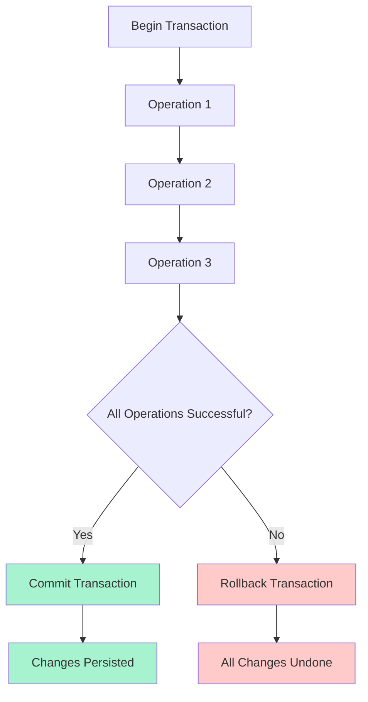

# Transactions & Data Integrity

## 🎯 Understanding Transactions

Transactions ensure data integrity by grouping multiple database operations into a single, atomic unit. Either all operations succeed, or all are rolled back.



## 💡 Transaction Fundamentals

### ACID Properties

```javascript
// Understanding ACID properties with examples

/**
 * ATOMICITY - All or Nothing
 * Either all operations in a transaction succeed, or none do
 */
const transferMoney = async (fromUserId, toUserId, amount) => {
  const transaction = await sequelize.transaction();
  
  try {
    // These operations either ALL succeed or ALL fail
    await User.decrement('balance', {
      by: amount,
      where: { id: fromUserId },
      transaction
    });
    
    await User.increment('balance', {
      by: amount,
      where: { id: toUserId },
      transaction
    });
    
    await TransactionLog.create({
      fromUserId,
      toUserId,
      amount,
      type: 'transfer'
    }, { transaction });
    
    await transaction.commit(); // All operations succeeded
    return { success: true };
    
  } catch (error) {
    await transaction.rollback(); // Undo ALL operations
    return { success: false, error: error.message };
  }
};

/**
 * CONSISTENCY - Database rules are always maintained
 * Business rules and constraints are enforced
 */
const createUserWithProfile = async (userData, profileData) => {
  const transaction = await sequelize.transaction();
  
  try {
    // User creation with validation
    const user = await User.create(userData, { 
      transaction,
      validate: true // Enforces all validation rules
    });
    
    // Profile creation with foreign key constraint
    const profile = await UserProfile.create({
      ...profileData,
      userId: user.id // This MUST reference a valid user
    }, { transaction });
    
    // Business rule: New users get welcome bonus
    await UserBalance.create({
      userId: user.id,
      balance: 1000, // Welcome bonus
      type: 'welcome_bonus'
    }, { transaction });
    
    await transaction.commit();
    return { user, profile };
    
  } catch (error) {
    await transaction.rollback();
    throw error;
  }
};

/**
 * ISOLATION - Concurrent transactions don't interfere
 * Different isolation levels control visibility of changes
 */
const handleConcurrentBooking = async (eventId, userId, seatNumber) => {
  const transaction = await sequelize.transaction({
    isolationLevel: sequelize.Transaction.ISOLATION_LEVELS.SERIALIZABLE
  });
  
  try {
    // Check seat availability with lock
    const seat = await Seat.findOne({
      where: { eventId, seatNumber, isAvailable: true },
      lock: transaction.LOCK.UPDATE, // Prevents other transactions from modifying
      transaction
    });
    
    if (!seat) {
      throw new Error('Seat not available');
    }
    
    // Reserve the seat
    await seat.update({ 
      isAvailable: false,
      reservedBy: userId,
      reservedAt: new Date()
    }, { transaction });
    
    // Create booking record
    await Booking.create({
      eventId,
      userId,
      seatNumber,
      status: 'confirmed'
    }, { transaction });
    
    await transaction.commit();
    return { success: true, seat };
    
  } catch (error) {
    await transaction.rollback();
    throw error;
  }
};

/**
 * DURABILITY - Committed changes persist even after system failure
 * Database ensures committed data survives crashes
 */
const createCriticalRecord = async (data) => {
  const transaction = await sequelize.transaction();
  
  try {
    // Create main record
    const record = await CriticalData.create(data, { transaction });
    
    // Create backup in separate table
    await CriticalDataBackup.create({
      originalId: record.id,
      data: JSON.stringify(record.dataValues),
      timestamp: new Date()
    }, { transaction });
    
    // Log the operation
    await SystemLog.create({
      operation: 'critical_data_created',
      recordId: record.id,
      userId: data.userId
    }, { transaction });
    
    // Once committed, this data will survive system crashes
    await transaction.commit();
    
    return record;
    
  } catch (error) {
    await transaction.rollback();
    throw error;
  }
};
```

## 🔧 Transaction Types in Sequelize

### 1. Managed Transactions (Recommended)

```javascript
// transactions/managed-transactions.js - Automatic transaction management

class ManagedTransactions {
  /**
   * Basic managed transaction
   * Sequelize automatically commits or rolls back
   */
  static async createBlogPost(userId, postData, tagNames) {
    return await sequelize.transaction(async (t) => {
      // All operations use the same transaction 't'
      
      // Create the post
      const post = await Post.create({
        ...postData,
        userId,
        status: 'draft'
      }, { transaction: t });

      // Find or create tags
      const tags = await Promise.all(
        tagNames.map(async (name) => {
          const [tag] = await Tag.findOrCreate({
            where: { name: name.toLowerCase() },
            defaults: { name: name.toLowerCase(), displayName: name },
            transaction: t
          });
          return tag;
        })
      );

      // Associate tags with post
      await post.setTags(tags, { transaction: t });

      // Update user's post count
      await User.increment('postCount', {
        where: { id: userId },
        transaction: t
      });

      // Create activity log
      await ActivityLog.create({
        userId,
        action: 'post_created',
        entityType: 'Post',
        entityId: post.id,
        details: { title: post.title, tagCount: tags.length }
      }, { transaction: t });

      return { post, tags };
      
      // Transaction automatically commits if no errors
      // or rolls back if any error occurs
    });
  }

  /**
   * Complex business operation with validation
   */
  static async publishPost(postId, userId) {
    return await sequelize.transaction(async (t) => {
      // Fetch post with lock to prevent concurrent modifications
      const post = await Post.findOne({
        where: { id: postId, userId },
        include: [
          { model: User, as: 'author' },
          { model: Tag, through: { attributes: [] } }
        ],
        lock: true,
        transaction: t
      });

      if (!post) {
        throw new Error('Post not found or access denied');
      }

      if (post.status === 'published') {
        throw new Error('Post is already published');
      }

      // Validate post content
      if (!post.title || post.title.trim().length < 5) {
        throw new Error('Post title must be at least 5 characters');
      }

      if (!post.content || post.content.trim().length < 100) {
        throw new Error('Post content must be at least 100 characters');
      }

      // Update post status
      await post.update({
        status: 'published',
        publishedAt: new Date()
      }, { transaction: t });

      // Increment published post count
      await User.increment('publishedPostCount', {
        where: { id: userId },
        transaction: t
      });

      // Notify followers (create notification records)
      const followers = await UserFollower.findAll({
        where: { followingId: userId },
        include: [{ model: User, as: 'follower' }],
        transaction: t
      });

      if (followers.length > 0) {
        const notifications = followers.map(follow => ({
          userId: follow.followerId,
          type: 'new_post',
          title: 'New post published',
          message: `${post.author.firstName} published "${post.title}"`,
          entityType: 'Post',
          entityId: post.id,
          createdAt: new Date()
        }));

        await Notification.bulkCreate(notifications, { transaction: t });
      }

      // Update search index (create indexing job)
      await SearchIndexJob.create({
        entityType: 'Post',
        entityId: post.id,
        action: 'index',
        priority: 'normal',
        status: 'pending'
      }, { transaction: t });

      return {
        post: await post.reload({ 
          include: [
            { model: User, as: 'author', attributes: ['firstName', 'lastName'] },
            { model: Tag, through: { attributes: [] } }
          ],
          transaction: t 
        }),
        notificationCount: followers.length
      };
    });
  }

  /**
   * Complex e-commerce order processing
   */
  static async createOrder(userId, items, shippingAddress, paymentMethod) {
    return await sequelize.transaction(async (t) => {
      // Validate user
      const user = await User.findByPk(userId, {
        include: [{ model: UserProfile }],
        transaction: t
      });

      if (!user || !user.isActive) {
        throw new Error('Invalid or inactive user');
      }

      // Validate and reserve inventory
      const orderItems = [];
      let totalAmount = 0;

      for (const item of items) {
        const product = await Product.findOne({
          where: { id: item.productId, isActive: true },
          lock: true, // Lock product record
          transaction: t
        });

        if (!product) {
          throw new Error(`Product ${item.productId} not found or inactive`);
        }

        if (product.stockQuantity < item.quantity) {
          throw new Error(`Insufficient stock for product ${product.name}`);
        }

        // Calculate item total
        const itemTotal = product.price * item.quantity;
        totalAmount += itemTotal;

        // Reserve inventory
        await product.decrement('stockQuantity', {
          by: item.quantity,
          transaction: t
        });

        orderItems.push({
          productId: product.id,
          productName: product.name,
          quantity: item.quantity,
          unitPrice: product.price,
          totalPrice: itemTotal
        });
      }

      // Apply discounts if any
      const discount = await calculateUserDiscount(user, totalAmount);
      const finalAmount = totalAmount - discount;

      // Create order
      const order = await Order.create({
        userId,
        status: 'pending',
        totalAmount,
        discountAmount: discount,
        finalAmount,
        shippingAddress: JSON.stringify(shippingAddress),
        paymentMethod,
        orderDate: new Date()
      }, { transaction: t });

      // Create order items
      const orderItemsWithOrderId = orderItems.map(item => ({
        ...item,
        orderId: order.id
      }));

      await OrderItem.bulkCreate(orderItemsWithOrderId, { transaction: t });

      // Create payment record
      const payment = await Payment.create({
        orderId: order.id,
        userId,
        amount: finalAmount,
        method: paymentMethod,
        status: 'pending',
        currency: 'USD'
      }, { transaction: t });

      // Update user order count
      await User.increment('orderCount', {
        where: { id: userId },
        transaction: t
      });

      // Create activity log
      await ActivityLog.create({
        userId,
        action: 'order_created',
        entityType: 'Order',
        entityId: order.id,
        details: {
          itemCount: orderItems.length,
          totalAmount: finalAmount,
          paymentMethod
        }
      }, { transaction: t });

      return {
        order: await order.reload({
          include: [
            { model: OrderItem },
            { model: Payment }
          ],
          transaction: t
        }),
        itemCount: orderItems.length,
        totalSaved: discount
      };
    });
  }
}

module.exports = ManagedTransactions;
```

### 2. Unmanaged Transactions (Manual Control)

```javascript
// transactions/unmanaged-transactions.js - Manual transaction control

class UnmanagedTransactions {
  /**
   * Manual transaction with explicit commit/rollback
   * Use when you need fine-grained control
   */
  static async createUserAccount(userData, initialDeposit) {
    const transaction = await sequelize.transaction();
    
    try {
      console.log('🚀 Starting user account creation transaction');
      
      // Step 1: Create user
      const user = await User.create(userData, { transaction });
      console.log(`✅ User created: ${user.id}`);
      
      // Step 2: Create user profile
      const profile = await UserProfile.create({
        userId: user.id,
        displayName: `${user.firstName} ${user.lastName}`,
        bio: 'New user',
        isPublic: true
      }, { transaction });
      console.log(`✅ Profile created: ${profile.id}`);
      
      // Step 3: Create account balance
      if (initialDeposit > 0) {
        const balance = await UserBalance.create({
          userId: user.id,
          balance: initialDeposit,
          type: 'initial_deposit'
        }, { transaction });
        console.log(`✅ Balance created: $${initialDeposit}`);
      }
      
      // Step 4: Send welcome email (external service)
      try {
        await sendWelcomeEmail(user.email, user.firstName);
        console.log('✅ Welcome email sent');
      } catch (emailError) {
        console.warn('⚠️ Welcome email failed, but continuing transaction');
        // Don't fail the transaction for email issues
      }
      
      // Step 5: Create user settings
      await UserSettings.create({
        userId: user.id,
        emailNotifications: true,
        pushNotifications: true,
        theme: 'light'
      }, { transaction });
      console.log('✅ User settings created');
      
      // Manual commit
      await transaction.commit();
      console.log('🎉 Transaction committed successfully');
      
      return {
        user: await user.reload({
          include: [
            { model: UserProfile },
            { model: UserBalance },
            { model: UserSettings }
          ]
        }),
        message: 'Account created successfully'
      };
      
    } catch (error) {
      console.error('❌ Transaction failed:', error.message);
      
      // Manual rollback
      await transaction.rollback();
      console.log('🔄 Transaction rolled back');
      
      throw new Error(`Account creation failed: ${error.message}`);
    }
  }

  /**
   * Complex data migration with progress tracking
   */
  static async migrateUserData(batchSize = 100) {
    let transaction;
    let processedCount = 0;
    let errorCount = 0;
    const errors = [];
    
    try {
      // Get total count
      const totalUsers = await User.count({ where: { migrationStatus: 'pending' } });
      console.log(`📊 Starting migration for ${totalUsers} users`);
      
      // Process in batches
      while (true) {
        transaction = await sequelize.transaction();
        
        try {
          // Get batch of users
          const users = await User.findAll({
            where: { migrationStatus: 'pending' },
            limit: batchSize,
            transaction
          });
          
          if (users.length === 0) {
            await transaction.rollback();
            break; // No more users to process
          }
          
          console.log(`🔄 Processing batch of ${users.length} users`);
          
          // Process each user in the batch
          for (const user of users) {
            try {
              // Migrate user data
              await migrateUserProfile(user, transaction);
              await migrateUserPosts(user, transaction);
              await migrateUserConnections(user, transaction);
              
              // Mark as migrated
              await user.update({
                migrationStatus: 'completed',
                migratedAt: new Date()
              }, { transaction });
              
              processedCount++;
              
            } catch (userError) {
              console.error(`❌ Failed to migrate user ${user.id}:`, userError.message);
              
              // Mark as failed
              await user.update({
                migrationStatus: 'failed',
                migrationError: userError.message
              }, { transaction });
              
              errors.push({
                userId: user.id,
                email: user.email,
                error: userError.message
              });
              
              errorCount++;
            }
          }
          
          // Commit batch
          await transaction.commit();
          console.log(`✅ Batch completed. Progress: ${processedCount}/${totalUsers}`);
          
          // Small delay between batches
          await new Promise(resolve => setTimeout(resolve, 100));
          
        } catch (batchError) {
          console.error('❌ Batch failed:', batchError.message);
          await transaction.rollback();
          
          // Wait longer before retrying
          await new Promise(resolve => setTimeout(resolve, 5000));
        }
      }
      
      console.log('🎉 Migration completed');
      console.log(`📊 Results: ${processedCount} successful, ${errorCount} failed`);
      
      return {
        success: true,
        processedCount,
        errorCount,
        errors: errors.slice(0, 10) // Return first 10 errors
      };
      
    } catch (error) {
      console.error('❌ Migration failed:', error.message);
      
      if (transaction) {
        await transaction.rollback();
      }
      
      return {
        success: false,
        processedCount,
        errorCount,
        error: error.message
      };
    }
  }

  /**
   * Transaction with savepoints (nested transactions)
   */
  static async complexBusinessOperation(data) {
    const transaction = await sequelize.transaction();
    
    try {
      // Main operation
      const result = await mainBusinessLogic(data, transaction);
      
      // Create savepoint for optional operations
      const savepoint = await transaction.createSavepoint('optional_operations');
      
      try {
        // Optional operations that might fail
        await optionalOperation1(result, transaction);
        await optionalOperation2(result, transaction);
        
        // Optional operations succeeded, release savepoint
        await transaction.releaseSavepoint(savepoint);
        
      } catch (optionalError) {
        console.warn('⚠️ Optional operations failed, rolling back to savepoint');
        
        // Rollback only the optional operations
        await transaction.rollbackToSavepoint(savepoint);
        
        // Continue with main operation
        result.optionalOperationsFailed = true;
        result.optionalOperationsError = optionalError.message;
      }
      
      // Critical final operation
      await criticalFinalOperation(result, transaction);
      
      // Commit everything
      await transaction.commit();
      
      return result;
      
    } catch (error) {
      await transaction.rollback();
      throw error;
    }
  }
}

// Helper functions for migration
async function migrateUserProfile(user, transaction) {
  // Complex profile migration logic
  const oldProfile = await OldUserProfile.findOne({
    where: { userId: user.id },
    transaction
  });
  
  if (oldProfile) {
    await UserProfile.upsert({
      userId: user.id,
      displayName: oldProfile.name,
      bio: oldProfile.description,
      avatar: oldProfile.profileImage,
      // ... other mappings
    }, { transaction });
  }
}

async function migrateUserPosts(user, transaction) {
  // Migrate posts in smaller batches
  const oldPosts = await OldPost.findAll({
    where: { authorId: user.id },
    transaction
  });
  
  for (const oldPost of oldPosts) {
    await Post.create({
      userId: user.id,
      title: oldPost.title,
      content: oldPost.body,
      status: oldPost.isPublished ? 'published' : 'draft',
      createdAt: oldPost.createDate,
      updatedAt: oldPost.updateDate
    }, { transaction });
  }
}

async function migrateUserConnections(user, transaction) {
  // Migrate user relationships
  const oldConnections = await OldConnection.findAll({
    where: { userId: user.id },
    transaction
  });
  
  for (const connection of oldConnections) {
    await UserFollower.findOrCreate({
      where: {
        followerId: user.id,
        followingId: connection.connectedUserId
      },
      defaults: {
        createdAt: connection.createDate
      },
      transaction
    });
  }
}

module.exports = UnmanagedTransactions;
```

## 🔒 Isolation Levels and Locking

### 1. Isolation Levels

```javascript
// transactions/isolation-levels.js - Understanding and using isolation levels

class IsolationLevels {
  /**
   * READ UNCOMMITTED - Allows dirty reads
   * Fastest but least safe
   */
  static async readUncommittedExample() {
    const transaction = await sequelize.transaction({
      isolationLevel: sequelize.Transaction.ISOLATION_LEVELS.READ_UNCOMMITTED
    });
    
    try {
      // Can see uncommitted changes from other transactions
      const users = await User.findAll({ transaction });
      
      // This might include data that other transactions haven't committed yet
      console.log('Users with potential uncommitted changes:', users.length);
      
      await transaction.commit();
      return users;
      
    } catch (error) {
      await transaction.rollback();
      throw error;
    }
  }

  /**
   * READ COMMITTED - Prevents dirty reads (PostgreSQL default)
   * Only sees committed data
   */
  static async readCommittedExample() {
    const transaction = await sequelize.transaction({
      isolationLevel: sequelize.Transaction.ISOLATION_LEVELS.READ_COMMITTED
    });
    
    try {
      // Only sees committed data
      const posts = await Post.findAll({
        where: { status: 'published' },
        transaction
      });
      
      // During this transaction, other transactions might commit changes
      // that would change this result if we queried again
      console.log('Published posts (committed data only):', posts.length);
      
      await transaction.commit();
      return posts;
      
    } catch (error) {
      await transaction.rollback();
      throw error;
    }
  }

  /**
   * REPEATABLE READ - Prevents dirty and non-repeatable reads
   * Same query returns same results throughout transaction
   */
  static async repeatableReadExample() {
    const transaction = await sequelize.transaction({
      isolationLevel: sequelize.Transaction.ISOLATION_LEVELS.REPEATABLE_READ
    });
    
    try {
      // First query
      const users1 = await User.findAll({
        where: { isActive: true },
        transaction
      });
      
      console.log('First query - Active users:', users1.length);
      
      // Simulate time passing and other transactions
      await new Promise(resolve => setTimeout(resolve, 100));
      
      // Second query - will return same results even if other
      // transactions have committed changes to user.isActive
      const users2 = await User.findAll({
        where: { isActive: true },
        transaction
      });
      
      console.log('Second query - Active users:', users2.length);
      console.log('Results identical:', users1.length === users2.length);
      
      await transaction.commit();
      return users2;
      
    } catch (error) {
      await transaction.rollback();
      throw error;
    }
  }

  /**
   * SERIALIZABLE - Strongest isolation
   * Transactions appear to run one after another
   */
  static async serializableExample() {
    const transaction = await sequelize.transaction({
      isolationLevel: sequelize.Transaction.ISOLATION_LEVELS.SERIALIZABLE
    });
    
    try {
      // This transaction will be completely isolated
      // Other transactions will wait or fail if they conflict
      
      const userCount = await User.count({ transaction });
      const postCount = await Post.count({ transaction });
      
      // Complex aggregation that must be consistent
      const stats = await sequelize.query(`
        SELECT 
          COUNT(DISTINCT u.id) as total_users,
          COUNT(DISTINCT p.id) as total_posts,
          COUNT(DISTINCT p.id) / COUNT(DISTINCT u.id)::float as posts_per_user
        FROM users u
        LEFT JOIN posts p ON u.id = p.user_id
      `, {
        type: sequelize.QueryTypes.SELECT,
        transaction
      });
      
      // These statistics are guaranteed to be consistent
      // with each other at this point in time
      
      await transaction.commit();
      
      return {
        userCount,
        postCount,
        detailedStats: stats[0]
      };
      
    } catch (error) {
      await transaction.rollback();
      throw error;
    }
  }
}
```

### 2. Locking Strategies

```javascript
// transactions/locking-strategies.js - Row and table locking

class LockingStrategies {
  /**
   * Optimistic Locking with Version Control
   * Uses version field to detect concurrent changes
   */
  static async optimisticLockingExample(postId, updateData, currentVersion) {
    const transaction = await sequelize.transaction();
    
    try {
      // Attempt to update with version check
      const [affectedRows] = await Post.update(
        {
          ...updateData,
          version: currentVersion + 1 // Increment version
        },
        {
          where: {
            id: postId,
            version: currentVersion // Only update if version matches
          },
          transaction
        }
      );
      
      if (affectedRows === 0) {
        throw new Error('Post was modified by another user. Please refresh and try again.');
      }
      
      await transaction.commit();
      
      return await Post.findByPk(postId, {
        include: [{ model: User, as: 'author' }]
      });
      
    } catch (error) {
      await transaction.rollback();
      throw error;
    }
  }

  /**
   * Pessimistic Locking - Lock rows for reading
   * Prevents other transactions from modifying locked rows
   */
  static async pessimisticLockExample(userId, amount) {
    const transaction = await sequelize.transaction();
    
    try {
      // Lock user record for update
      const user = await User.findOne({
        where: { id: userId },
        lock: transaction.LOCK.UPDATE, // FOR UPDATE lock
        transaction
      });
      
      if (!user) {
        throw new Error('User not found');
      }
      
      // Check balance
      if (user.balance < amount) {
        throw new Error('Insufficient balance');
      }
      
      // Deduct amount - no other transaction can modify this user's balance
      await user.update({
        balance: user.balance - amount
      }, { transaction });
      
      // Create transaction record
      await UserTransaction.create({
        userId,
        amount: -amount,
        type: 'withdrawal',
        balanceAfter: user.balance - amount
      }, { transaction });
      
      await transaction.commit();
      
      return {
        success: true,
        newBalance: user.balance - amount
      };
      
    } catch (error) {
      await transaction.rollback();
      throw error;
    }
  }

  /**
   * Share Lock - Multiple readers, no writers
   * Good for generating reports that need consistent data
   */
  static async shareLockExample(reportType) {
    const transaction = await sequelize.transaction();
    
    try {
      // Lock tables for reading - prevents writes but allows other reads
      const users = await User.findAll({
        lock: transaction.LOCK.SHARE, // FOR SHARE lock
        transaction
      });
      
      const posts = await Post.findAll({
        lock: transaction.LOCK.SHARE,
        transaction
      });
      
      // Generate report with consistent snapshot
      const report = {
        generatedAt: new Date(),
        type: reportType,
        totalUsers: users.length,
        activeUsers: users.filter(u => u.isActive).length,
        totalPosts: posts.length,
        publishedPosts: posts.filter(p => p.status === 'published').length,
        avgPostsPerUser: posts.length / users.length
      };
      
      // Save report
      await Report.create(report, { transaction });
      
      await transaction.commit();
      
      return report;
      
    } catch (error) {
      await transaction.rollback();
      throw error;
    }
  }

  /**
   * Custom Lock Wait Time
   * Control how long to wait for locks
   */
  static async lockWithTimeout(orderId, updates) {
    const transaction = await sequelize.transaction();
    
    try {
      // Set lock timeout
      await sequelize.query('SET lock_timeout = 5000', { transaction }); // 5 seconds
      
      const order = await Order.findOne({
        where: { id: orderId },
        lock: transaction.LOCK.UPDATE,
        transaction
      });
      
      if (!order) {
        throw new Error('Order not found');
      }
      
      // Update order
      await order.update(updates, { transaction });
      
      await transaction.commit();
      
      return order;
      
    } catch (error) {
      if (error.message.includes('lock timeout')) {
        console.error('Lock timeout - order is being modified by another process');
      }
      
      await transaction.rollback();
      throw error;
    }
  }

  /**
   * Advisory Locks - Application-level locking
   * Useful for coordinating between different parts of application
   */
  static async advisoryLockExample(resourceId, operation) {
    const lockId = 1000 + resourceId; // Generate unique lock ID
    
    const transaction = await sequelize.transaction();
    
    try {
      // Try to acquire advisory lock
      const [result] = await sequelize.query(
        'SELECT pg_try_advisory_xact_lock(:lockId) as acquired',
        {
          replacements: { lockId },
          type: sequelize.QueryTypes.SELECT,
          transaction
        }
      );
      
      if (!result.acquired) {
        throw new Error('Resource is currently being processed by another operation');
      }
      
      console.log(`✅ Acquired advisory lock for resource ${resourceId}`);
      
      // Perform the operation
      const operationResult = await operation(transaction);
      
      await transaction.commit();
      
      console.log(`✅ Released advisory lock for resource ${resourceId}`);
      
      return operationResult;
      
    } catch (error) {
      await transaction.rollback();
      throw error;
    }
  }
}

module.exports = LockingStrategies;
```

## 🎯 Best Practices and Patterns

### 1. Transaction Patterns

```javascript
// transactions/patterns.js - Common transaction patterns

class TransactionPatterns {
  /**
   * Saga Pattern - Distributed transactions across services
   * Each step has a compensating action for rollback
   */
  static async createOrderSaga(orderData) {
    const compensations = [];
    let result = {};
    
    try {
      // Step 1: Reserve inventory
      console.log('📦 Step 1: Reserving inventory');
      const reservation = await this.reserveInventory(orderData.items);
      compensations.push(() => this.releaseInventory(reservation.id));
      result.reservation = reservation;
      
      // Step 2: Process payment
      console.log('💳 Step 2: Processing payment');
      const payment = await this.processPayment(orderData.payment);
      compensations.push(() => this.refundPayment(payment.id));
      result.payment = payment;
      
      // Step 3: Create order
      console.log('📝 Step 3: Creating order');
      const order = await this.createOrderRecord(orderData, reservation.id, payment.id);
      compensations.push(() => this.cancelOrder(order.id));
      result.order = order;
      
      // Step 4: Send notifications
      console.log('📧 Step 4: Sending notifications');
      await this.sendOrderConfirmation(order.id);
      
      console.log('✅ Order saga completed successfully');
      return result;
      
    } catch (error) {
      console.error('❌ Order saga failed, executing compensations');
      
      // Execute compensations in reverse order
      for (let i = compensations.length - 1; i >= 0; i--) {
        try {
          await compensations[i]();
        } catch (compensationError) {
          console.error('Compensation failed:', compensationError);
        }
      }
      
      throw error;
    }
  }

  /**
   * Two-Phase Commit Pattern
   * Prepare phase followed by commit/abort phase
   */
  static async twoPhaseCommitExample(operations) {
    const transactions = [];
    const preparedOperations = [];
    
    try {
      // Phase 1: Prepare all operations
      console.log('🔄 Phase 1: Preparing all operations');
      
      for (const operation of operations) {
        const transaction = await sequelize.transaction();
        transactions.push(transaction);
        
        try {
          const result = await operation.prepare(transaction);
          preparedOperations.push({ operation, result, transaction });
          console.log(`✅ Prepared: ${operation.name}`);
        } catch (error) {
          console.error(`❌ Failed to prepare: ${operation.name}`);
          throw error;
        }
      }
      
      // Phase 2: Commit all operations
      console.log('🔄 Phase 2: Committing all operations');
      
      for (const { operation, result, transaction } of preparedOperations) {
        await operation.commit(result, transaction);
        await transaction.commit();
        console.log(`✅ Committed: ${operation.name}`);
      }
      
      console.log('✅ Two-phase commit completed successfully');
      return preparedOperations.map(p => p.result);
      
    } catch (error) {
      console.error('❌ Two-phase commit failed, rolling back all transactions');
      
      // Rollback all transactions
      for (const transaction of transactions) {
        try {
          await transaction.rollback();
        } catch (rollbackError) {
          console.error('Rollback failed:', rollbackError);
        }
      }
      
      throw error;
    }
  }

  /**
   * Retry Pattern with Exponential Backoff
   * Automatically retry failed transactions
   */
  static async retryTransaction(operation, maxRetries = 3) {
    let attempt = 0;
    let delay = 1000; // Start with 1 second
    
    while (attempt < maxRetries) {
      try {
        console.log(`🔄 Attempt ${attempt + 1}/${maxRetries}`);
        
        const result = await sequelize.transaction(async (t) => {
          return await operation(t);
        });
        
        console.log(`✅ Transaction succeeded on attempt ${attempt + 1}`);
        return result;
        
      } catch (error) {
        attempt++;
        
        if (attempt >= maxRetries) {
          console.error(`❌ Transaction failed after ${maxRetries} attempts`);
          throw error;
        }
        
        // Check if error is retryable
        if (!this.isRetryableError(error)) {
          console.error('❌ Non-retryable error:', error.message);
          throw error;
        }
        
        console.warn(`⚠️ Attempt ${attempt} failed, retrying in ${delay}ms:`, error.message);
        
        // Wait before retrying
        await new Promise(resolve => setTimeout(resolve, delay));
        
        // Exponential backoff
        delay *= 2;
      }
    }
  }

  static isRetryableError(error) {
    const retryableErrors = [
      'SequelizeConnectionError',
      'SequelizeTimeoutError',
      'SequelizeDeadlockError',
      'SequelizeDatabaseError'
    ];
    
    return retryableErrors.some(type => error.name.includes(type)) ||
           error.message.includes('deadlock') ||
           error.message.includes('timeout') ||
           error.message.includes('connection');
  }

  /**
   * Batch Processing Pattern
   * Process large datasets in manageable chunks
   */
  static async batchProcessUsers(processFunction, batchSize = 1000) {
    let offset = 0;
    let totalProcessed = 0;
    let errorCount = 0;
    const errors = [];
    
    console.log('🚀 Starting batch processing');
    
    while (true) {
      const transaction = await sequelize.transaction();
      
      try {
        // Get batch of users
        const users = await User.findAll({
          offset,
          limit: batchSize,
          order: [['id', 'ASC']],
          transaction
        });
        
        if (users.length === 0) {
          await transaction.rollback();
          break; // No more users to process
        }
        
        console.log(`🔄 Processing batch: ${offset + 1} to ${offset + users.length}`);
        
        // Process each user in the batch
        for (const user of users) {
          try {
            await processFunction(user, transaction);
            totalProcessed++;
          } catch (userError) {
            errorCount++;
            errors.push({
              userId: user.id,
              error: userError.message
            });
            
            console.error(`❌ Failed to process user ${user.id}:`, userError.message);
          }
        }
        
        await transaction.commit();
        
        offset += batchSize;
        
        // Progress report
        if (offset % (batchSize * 10) === 0) {
          console.log(`📊 Progress: ${totalProcessed} processed, ${errorCount} errors`);
        }
        
      } catch (batchError) {
        console.error('❌ Batch failed:', batchError.message);
        await transaction.rollback();
        
        // Skip this batch and continue
        offset += batchSize;
      }
    }
    
    console.log('✅ Batch processing completed');
    console.log(`📊 Final results: ${totalProcessed} processed, ${errorCount} errors`);
    
    return {
      totalProcessed,
      errorCount,
      errors: errors.slice(0, 100) // Return first 100 errors
    };
  }

  // Helper methods for saga pattern
  static async reserveInventory(items) {
    return await sequelize.transaction(async (t) => {
      const reservation = await InventoryReservation.create({
        status: 'active',
        expiresAt: new Date(Date.now() + 15 * 60 * 1000) // 15 minutes
      }, { transaction: t });
      
      for (const item of items) {
        const product = await Product.findByPk(item.productId, {
          lock: true,
          transaction: t
        });
        
        if (product.stockQuantity < item.quantity) {
          throw new Error(`Insufficient stock for product ${product.name}`);
        }
        
        await product.decrement('stockQuantity', {
          by: item.quantity,
          transaction: t
        });
        
        await ReservationItem.create({
          reservationId: reservation.id,
          productId: item.productId,
          quantity: item.quantity
        }, { transaction: t });
      }
      
      return reservation;
    });
  }

  static async releaseInventory(reservationId) {
    return await sequelize.transaction(async (t) => {
      const items = await ReservationItem.findAll({
        where: { reservationId },
        include: [{ model: Product }],
        transaction: t
      });
      
      for (const item of items) {
        await item.Product.increment('stockQuantity', {
          by: item.quantity,
          transaction: t
        });
      }
      
      await InventoryReservation.update(
        { status: 'released' },
        { where: { id: reservationId }, transaction: t }
      );
    });
  }

  static async processPayment(paymentData) {
    // Simulate payment processing
    return await Payment.create({
      ...paymentData,
      status: 'completed',
      processedAt: new Date()
    });
  }

  static async refundPayment(paymentId) {
    return await Payment.update(
      { status: 'refunded', refundedAt: new Date() },
      { where: { id: paymentId } }
    );
  }

  static async createOrderRecord(orderData, reservationId, paymentId) {
    return await Order.create({
      ...orderData,
      reservationId,
      paymentId,
      status: 'confirmed'
    });
  }

  static async cancelOrder(orderId) {
    return await Order.update(
      { status: 'cancelled', cancelledAt: new Date() },
      { where: { id: orderId } }
    );
  }

  static async sendOrderConfirmation(orderId) {
    // Simulate sending confirmation email
    console.log(`📧 Order confirmation sent for order ${orderId}`);
  }
}

module.exports = TransactionPatterns;
```

### 2. Error Handling and Recovery

```javascript
// transactions/error-handling.js - Comprehensive error handling

class TransactionErrorHandler {
  static async safeTransactionWrapper(operation, options = {}) {
    const {
      maxRetries = 3,
      retryDelay = 1000,
      isolationLevel = null,
      onError = null,
      onRetry = null,
      onSuccess = null
    } = options;
    
    let attempt = 0;
    let lastError;
    
    while (attempt < maxRetries) {
      let transaction;
      
      try {
        // Create transaction with specified isolation level
        transaction = await sequelize.transaction(
          isolationLevel ? { isolationLevel } : undefined
        );
        
        console.log(`🔄 Transaction attempt ${attempt + 1}/${maxRetries}`);
        
        // Execute the operation
        const result = await operation(transaction);
        
        // Commit the transaction
        await transaction.commit();
        
        console.log(`✅ Transaction succeeded on attempt ${attempt + 1}`);
        
        // Success callback
        if (onSuccess) {
          await onSuccess(result, attempt + 1);
        }
        
        return result;
        
      } catch (error) {
        attempt++;
        lastError = error;
        
        // Rollback transaction if it exists
        if (transaction) {
          try {
            await transaction.rollback();
            console.log('🔄 Transaction rolled back');
          } catch (rollbackError) {
            console.error('❌ Rollback failed:', rollbackError.message);
          }
        }
        
        console.error(`❌ Transaction attempt ${attempt} failed:`, error.message);
        
        // Error callback
        if (onError) {
          await onError(error, attempt);
        }
        
        // Check if we should retry
        if (attempt >= maxRetries) {
          console.error(`❌ Transaction failed after ${maxRetries} attempts`);
          break;
        }
        
        if (!this.isRetryableError(error)) {
          console.error('❌ Non-retryable error, stopping retries');
          break;
        }
        
        // Retry callback
        if (onRetry) {
          await onRetry(error, attempt, maxRetries);
        }
        
        // Wait before retrying
        const delay = retryDelay * Math.pow(2, attempt - 1); // Exponential backoff
        console.log(`⏳ Waiting ${delay}ms before retry...`);
        await new Promise(resolve => setTimeout(resolve, delay));
      }
    }
    
    // If we get here, all retries failed
    throw new Error(`Transaction failed after ${maxRetries} attempts. Last error: ${lastError.message}`);
  }

  static isRetryableError(error) {
    const retryablePatterns = [
      /deadlock/i,
      /timeout/i,
      /connection/i,
      /lock timeout/i,
      /could not serialize/i,
      /server closed the connection/i,
      /connection terminated/i
    ];
    
    const retryableTypes = [
      'SequelizeConnectionError',
      'SequelizeTimeoutError',
      'SequelizeDeadlockError',
      'SequelizeConnectionTimedOutError'
    ];
    
    return retryableTypes.includes(error.name) ||
           retryablePatterns.some(pattern => pattern.test(error.message));
  }

  static async handleConcurrencyConflict(operation, maxRetries = 5) {
    for (let attempt = 0; attempt < maxRetries; attempt++) {
      try {
        return await operation();
      } catch (error) {
        if (error.message.includes('could not serialize') || 
            error.message.includes('deadlock')) {
          
          console.warn(`🔄 Concurrency conflict on attempt ${attempt + 1}, retrying...`);
          
          // Random delay to avoid thundering herd
          const delay = Math.random() * 1000 + 500; // 500-1500ms
          await new Promise(resolve => setTimeout(resolve, delay));
          
          continue;
        }
        
        throw error; // Non-concurrency error, don't retry
      }
    }
    
    throw new Error('Operation failed due to persistent concurrency conflicts');
  }

  static async executeWithTimeout(operation, timeoutMs = 30000) {
    return Promise.race([
      operation(),
      new Promise((_, reject) => 
        setTimeout(() => reject(new Error(`Transaction timeout after ${timeoutMs}ms`)), timeoutMs)
      )
    ]);
  }

  static createTransactionMonitor() {
    const activeTransactions = new Map();
    
    return {
      startTransaction: (id, description) => {
        activeTransactions.set(id, {
          description,
          startTime: Date.now(),
          status: 'active'
        });
        
        console.log(`🚀 Transaction started: ${id} - ${description}`);
      },
      
      endTransaction: (id, status = 'completed') => {
        const transaction = activeTransactions.get(id);
        if (transaction) {
          const duration = Date.now() - transaction.startTime;
          transaction.status = status;
          transaction.duration = duration;
          
          console.log(`✅ Transaction ${status}: ${id} (${duration}ms)`);
          
          if (duration > 10000) {
            console.warn(`⚠️ Long-running transaction detected: ${id} took ${duration}ms`);
          }
          
          activeTransactions.delete(id);
        }
      },
      
      getActiveTransactions: () => {
        return Array.from(activeTransactions.entries()).map(([id, data]) => ({
          id,
          ...data,
          currentDuration: Date.now() - data.startTime
        }));
      },
      
      checkForStuckTransactions: () => {
        const stuck = [];
        const now = Date.now();
        
        for (const [id, transaction] of activeTransactions.entries()) {
          const duration = now - transaction.startTime;
          if (duration > 60000) { // 1 minute
            stuck.push({ id, duration, description: transaction.description });
          }
        }
        
        if (stuck.length > 0) {
          console.warn('⚠️ Stuck transactions detected:', stuck);
        }
        
        return stuck;
      }
    };
  }
}

module.exports = TransactionErrorHandler;
```

## 🎯 Key Takeaways

1. **Use Managed Transactions**: Prefer `sequelize.transaction(callback)` for automatic handling
2. **Choose Right Isolation Level**: Balance consistency needs with performance
3. **Handle Deadlocks**: Implement retry logic for concurrent operations
4. **Lock Appropriately**: Use pessimistic locking for critical operations
5. **Monitor Performance**: Track transaction duration and failure rates
6. **Plan for Failures**: Always have rollback and compensation strategies
7. **Test Concurrency**: Test your code under concurrent load conditions

## 🚀 What's Next?

Now that you understand transactions and data integrity, let's explore [[15-Indexes-Performance|Indexes & Performance Optimization]] to make your transactions faster and more efficient!

---

## 🔗 Related Topics
- [[13-Hooks-Lifecycle|Hooks & Lifecycle Events]]
- [[15-Indexes-Performance|Indexes & Performance Optimization]]
- [[18-Testing|Testing Strategies]]
