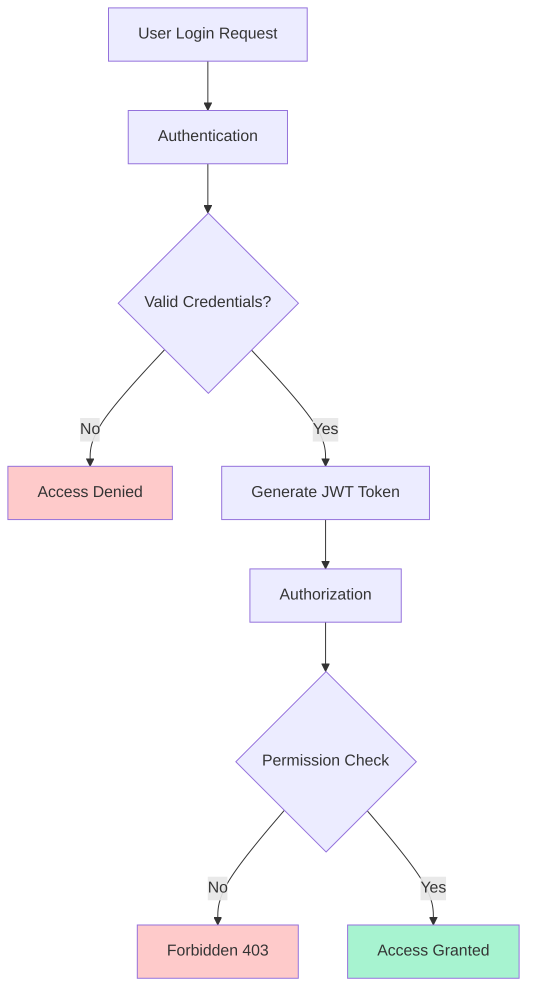

# Authentication & Authorization

## 🎯 Understanding Authentication vs Authorization

**Authentication** verifies who you are, while **Authorization** determines what you can do. Together, they form the security backbone of your application.



## 🔐 User Authentication System

### 1. User Model with Authentication

```javascript
// models/User.js - Enhanced user model for authentication
const { Model, DataTypes } = require('sequelize');
const bcrypt = require('bcrypt');
const crypto = require('crypto');
const jwt = require('jsonwebtoken');

class User extends Model {
  // Instance methods for authentication
  async validatePassword(password) {
    return await bcrypt.compare(password, this.passwordHash);
  }

  generateJWT() {
    const payload = {
      id: this.id,
      email: this.email,
      username: this.username,
      role: this.role,
      permissions: this.permissions
    };

    return jwt.sign(payload, process.env.JWT_SECRET, {
      expiresIn: process.env.JWT_EXPIRES_IN || '24h',
      issuer: 'blog-app',
      audience: 'blog-users'
    });
  }

  generateRefreshToken() {
    const refreshToken = crypto.randomBytes(64).toString('hex');
    this.refreshToken = refreshToken;
    this.refreshTokenExpiresAt = new Date(Date.now() + 7 * 24 * 60 * 60 * 1000); // 7 days
    return refreshToken;
  }

  generatePasswordResetToken() {
    const resetToken = crypto.randomBytes(32).toString('hex');
    this.passwordResetToken = crypto.createHash('sha256').update(resetToken).digest('hex');
    this.passwordResetExpiresAt = new Date(Date.now() + 10 * 60 * 1000); // 10 minutes
    return resetToken;
  }

  generateEmailVerificationToken() {
    const verificationToken = crypto.randomBytes(32).toString('hex');
    this.emailVerificationToken = crypto.createHash('sha256').update(verificationToken).digest('hex');
    this.emailVerificationExpiresAt = new Date(Date.now() + 24 * 60 * 60 * 1000); // 24 hours
    return verificationToken;
  }

  async hasPermission(permission) {
    if (this.role === 'admin') return true; // Admin has all permissions
    
    if (Array.isArray(this.permissions)) {
      return this.permissions.includes(permission);
    }
    
    // Check role-based permissions
    const rolePermissions = await this.getRolePermissions();
    return rolePermissions.includes(permission);
  }

  async getRolePermissions() {
    const rolePermissionMap = {
      'user': ['read:own_posts', 'create:posts', 'update:own_posts', 'delete:own_posts'],
      'moderator': ['read:all_posts', 'update:all_posts', 'delete:comments', 'moderate:content'],
      'admin': ['*'] // All permissions
    };

    return rolePermissionMap[this.role] || [];
  }

  static associate(models) {
    User.hasMany(models.Post, { foreignKey: 'userId' });
    User.hasMany(models.Comment, { foreignKey: 'userId' });
    User.hasMany(models.UserSession, { foreignKey: 'userId' });
    User.hasMany(models.LoginAttempt, { foreignKey: 'userId' });
  }
}

User.init({
  id: {
    type: DataTypes.INTEGER,
    primaryKey: true,
    autoIncrement: true
  },
  email: {
    type: DataTypes.STRING(255),
    allowNull: false,
    unique: true,
    validate: {
      isEmail: true
    }
  },
  username: {
    type: DataTypes.STRING(50),
    allowNull: false,
    unique: true,
    validate: {
      len: [3, 50],
      isAlphanumeric: true
    }
  },
  firstName: {
    type: DataTypes.STRING(50),
    allowNull: false,
    validate: {
      len: [1, 50]
    }
  },
  lastName: {
    type: DataTypes.STRING(50),
    allowNull: false,
    validate: {
      len: [1, 50]
    }
  },
  passwordHash: {
    type: DataTypes.STRING(255),
    allowNull: false
  },
  password: {
    type: DataTypes.VIRTUAL,
    allowNull: false,
    validate: {
      len: [8, 128],
      isStrongPassword(value) {
        if (!/(?=.*[a-z])(?=.*[A-Z])(?=.*\d)(?=.*[@$!%*?&])[A-Za-z\d@$!%*?&]/.test(value)) {
          throw new Error('Password must contain at least one lowercase letter, one uppercase letter, one number, and one special character');
        }
      }
    }
  },
  role: {
    type: DataTypes.ENUM('user', 'moderator', 'admin'),
    defaultValue: 'user',
    allowNull: false
  },
  permissions: {
    type: DataTypes.ARRAY(DataTypes.STRING),
    defaultValue: []
  },
  isActive: {
    type: DataTypes.BOOLEAN,
    defaultValue: true
  },
  isEmailVerified: {
    type: DataTypes.BOOLEAN,
    defaultValue: false
  },
  emailVerificationToken: {
    type: DataTypes.STRING(255),
    allowNull: true
  },
  emailVerificationExpiresAt: {
    type: DataTypes.DATE,
    allowNull: true
  },
  passwordResetToken: {
    type: DataTypes.STRING(255),
    allowNull: true
  },
  passwordResetExpiresAt: {
    type: DataTypes.DATE,
    allowNull: true
  },
  refreshToken: {
    type: DataTypes.STRING(255),
    allowNull: true
  },
  refreshTokenExpiresAt: {
    type: DataTypes.DATE,
    allowNull: true
  },
  lastLoginAt: {
    type: DataTypes.DATE,
    allowNull: true
  },
  loginCount: {
    type: DataTypes.INTEGER,
    defaultValue: 0
  },
  failedLoginAttempts: {
    type: DataTypes.INTEGER,
    defaultValue: 0
  },
  accountLockedUntil: {
    type: DataTypes.DATE,
    allowNull: true
  },
  twoFactorSecret: {
    type: DataTypes.STRING(255),
    allowNull: true
  },
  twoFactorEnabled: {
    type: DataTypes.BOOLEAN,
    defaultValue: false
  },
  backupCodes: {
    type: DataTypes.ARRAY(DataTypes.STRING),
    defaultValue: []
  }
}, {
  sequelize,
  modelName: 'User',
  tableName: 'users',
  underscored: true,
  timestamps: true,
  paranoid: true, // Soft delete
  
  hooks: {
    beforeCreate: async (user) => {
      if (user.password) {
        const saltRounds = 12;
        user.passwordHash = await bcrypt.hash(user.password, saltRounds);
      }
    },
    
    beforeUpdate: async (user) => {
      if (user.changed('password') && user.password) {
        const saltRounds = 12;
        user.passwordHash = await bcrypt.hash(user.password, saltRounds);
      }
    }
  },
  
  indexes: [
    {
      name: 'users_email_active_idx',
      fields: ['email', 'is_active']
    },
    {
      name: 'users_username_active_idx',
      fields: ['username', 'is_active']
    },
    {
      name: 'users_role_idx',
      fields: ['role']
    },
    {
      name: 'users_password_reset_token_idx',
      fields: ['password_reset_token'],
      where: {
        password_reset_token: { [DataTypes.Op.ne]: null }
      }
    }
  ]
});

module.exports = User;
```

### 2. Authentication Service

```javascript
// services/auth-service.js - Comprehensive authentication service
const jwt = require('jsonwebtoken');
const bcrypt = require('bcrypt');
const crypto = require('crypto');
const speakeasy = require('speakeasy');
const { User, UserSession, LoginAttempt } = require('../models');
const { sendPasswordResetEmail, sendEmailVerification, sendLoginAlert } = require('../utils/email');
const { rateLimiter } = require('../middleware/rate-limiter');

class AuthService {
  /**
   * Register a new user
   */
  static async register(userData) {
    const transaction = await sequelize.transaction();
    
    try {
      const { email, username, password, firstName, lastName } = userData;
      
      // Check if user already exists
      const existingUser = await User.findOne({
        where: {
          [sequelize.Op.or]: [
            { email: email.toLowerCase() },
            { username: username.toLowerCase() }
          ]
        },
        transaction
      });
      
      if (existingUser) {
        if (existingUser.email === email.toLowerCase()) {
          throw new Error('Email already registered');
        }
        if (existingUser.username === username.toLowerCase()) {
          throw new Error('Username already taken');
        }
      }
      
      // Create user
      const user = await User.create({
        email: email.toLowerCase(),
        username: username.toLowerCase(),
        firstName,
        lastName,
        password,
        role: 'user'
      }, { transaction });
      
      // Generate email verification token
      const verificationToken = user.generateEmailVerificationToken();
      await user.save({ transaction });
      
      // Send verification email
      await sendEmailVerification(user.email, verificationToken, user.firstName);
      
      await transaction.commit();
      
      return {
        user: {
          id: user.id,
          email: user.email,
          username: user.username,
          firstName: user.firstName,
          lastName: user.lastName,
          role: user.role,
          isEmailVerified: user.isEmailVerified
        },
        message: 'Registration successful. Please check your email to verify your account.'
      };
      
    } catch (error) {
      await transaction.rollback();
      throw error;
    }
  }

  /**
   * Authenticate user login
   */
  static async login(credentials, clientInfo = {}) {
    const { email, password, twoFactorCode } = credentials;
    const { ipAddress, userAgent } = clientInfo;
    
    // Rate limiting check
    await rateLimiter.checkLimit(`login:${ipAddress}`, 5, 300); // 5 attempts per 5 minutes
    
    const transaction = await sequelize.transaction();
    
    try {
      // Find user
      const user = await User.findOne({
        where: {
          [sequelize.Op.or]: [
            { email: email.toLowerCase() },
            { username: email.toLowerCase() }
          ],
          isActive: true
        },
        transaction
      });
      
      // Record login attempt
      await LoginAttempt.create({
        email: email.toLowerCase(),
        userId: user?.id || null,
        ipAddress,
        userAgent,
        success: false, // Will update if successful
        attemptedAt: new Date()
      }, { transaction });
      
      if (!user) {
        throw new Error('Invalid credentials');
      }
      
      // Check if account is locked
      if (user.accountLockedUntil && user.accountLockedUntil > new Date()) {
        const lockRemaining = Math.ceil((user.accountLockedUntil - new Date()) / 1000 / 60);
        throw new Error(`Account locked. Try again in ${lockRemaining} minutes.`);
      }
      
      // Validate password
      const isValidPassword = await user.validatePassword(password);
      if (!isValidPassword) {
        await this.handleFailedLogin(user, transaction);
        throw new Error('Invalid credentials');
      }
      
      // Check email verification
      if (!user.isEmailVerified) {
        throw new Error('Please verify your email before logging in');
      }
      
      // Two-factor authentication check
      if (user.twoFactorEnabled) {
        if (!twoFactorCode) {
          throw new Error('Two-factor authentication code required');
        }
        
        const isValidTwoFactor = speakeasy.totp.verify({
          secret: user.twoFactorSecret,
          encoding: 'base32',
          token: twoFactorCode,
          window: 2 // Allow 2 time steps (60 seconds)
        });
        
        if (!isValidTwoFactor) {
          // Check backup codes
          const backupCodeIndex = user.backupCodes.indexOf(twoFactorCode);
          if (backupCodeIndex === -1) {
            throw new Error('Invalid two-factor authentication code');
          }
          
          // Remove used backup code
          user.backupCodes.splice(backupCodeIndex, 1);
        }
      }
      
      // Successful login - reset failed attempts
      await user.update({
        failedLoginAttempts: 0,
        accountLockedUntil: null,
        lastLoginAt: new Date(),
        loginCount: user.loginCount + 1
      }, { transaction });
      
      // Generate tokens
      const accessToken = user.generateJWT();
      const refreshToken = user.generateRefreshToken();
      await user.save({ transaction });
      
      // Create session
      const session = await UserSession.create({
        userId: user.id,
        token: crypto.createHash('sha256').update(accessToken).digest('hex'),
        refreshToken: crypto.createHash('sha256').update(refreshToken).digest('hex'),
        ipAddress,
        userAgent,
        expiresAt: new Date(Date.now() + 24 * 60 * 60 * 1000), // 24 hours
        lastActivityAt: new Date()
      }, { transaction });
      
      // Update login attempt as successful
      await LoginAttempt.update(
        { success: true },
        { 
          where: { 
            email: email.toLowerCase(),
            success: false,
            attemptedAt: { [sequelize.Op.gte]: new Date(Date.now() - 60000) } // Last minute
          },
          transaction 
        }
      );
      
      await transaction.commit();
      
      // Send login alert if from new device/location
      await this.checkForSuspiciousLogin(user, clientInfo);
      
      return {
        user: {
          id: user.id,
          email: user.email,
          username: user.username,
          firstName: user.firstName,
          lastName: user.lastName,
          role: user.role,
          permissions: user.permissions,
          twoFactorEnabled: user.twoFactorEnabled
        },
        accessToken,
        refreshToken,
        sessionId: session.id,
        expiresIn: 24 * 60 * 60 // 24 hours in seconds
      };
      
    } catch (error) {
      await transaction.rollback();
      throw error;
    }
  }

  /**
   * Handle failed login attempts
   */
  static async handleFailedLogin(user, transaction) {
    const maxAttempts = 5;
    const lockDuration = 15 * 60 * 1000; // 15 minutes
    
    user.failedLoginAttempts = (user.failedLoginAttempts || 0) + 1;
    
    if (user.failedLoginAttempts >= maxAttempts) {
      user.accountLockedUntil = new Date(Date.now() + lockDuration);
      
      // Send account locked email
      await sendLoginAlert(user.email, {
        type: 'account_locked',
        lockDuration: 15,
        timestamp: new Date()
      });
    }
    
    await user.save({ transaction });
  }

  /**
   * Check for suspicious login activity
   */
  static async checkForSuspiciousLogin(user, clientInfo) {
    const { ipAddress, userAgent } = clientInfo;
    
    // Check if this is a new device/location
    const recentSessions = await UserSession.findAll({
      where: {
        userId: user.id,
        createdAt: { [sequelize.Op.gte]: new Date(Date.now() - 30 * 24 * 60 * 60 * 1000) } // Last 30 days
      },
      order: [['createdAt', 'DESC']]
    });
    
    const knownIPs = recentSessions.map(session => session.ipAddress);
    const knownUserAgents = recentSessions.map(session => session.userAgent);
    
    const isNewIP = !knownIPs.includes(ipAddress);
    const isNewDevice = !knownUserAgents.some(ua => 
      ua && userAgent && this.compareUserAgents(ua, userAgent)
    );
    
    if (isNewIP || isNewDevice) {
      await sendLoginAlert(user.email, {
        type: 'new_device_login',
        ipAddress,
        userAgent,
        timestamp: new Date(),
        location: await this.getLocationFromIP(ipAddress)
      });
    }
  }

  /**
   * Compare user agents to detect similar devices
   */
  static compareUserAgents(ua1, ua2) {
    // Simple comparison - in production, you might want more sophisticated logic
    const normalize = (ua) => ua.toLowerCase().replace(/\s+/g, ' ').trim();
    const normalized1 = normalize(ua1);
    const normalized2 = normalize(ua2);
    
    // Check if they share common browser and OS indicators
    const browserRegex = /(chrome|firefox|safari|edge|opera)/i;
    const osRegex = /(windows|macos|linux|android|ios)/i;
    
    const browser1 = normalized1.match(browserRegex)?.[0];
    const browser2 = normalized2.match(browserRegex)?.[0];
    const os1 = normalized1.match(osRegex)?.[0];
    const os2 = normalized2.match(osRegex)?.[0];
    
    return browser1 === browser2 && os1 === os2;
  }

  /**
   * Get approximate location from IP address
   */
  static async getLocationFromIP(ipAddress) {
    // In production, you'd use a service like MaxMind GeoIP
    // This is a simplified version
    try {
      const response = await fetch(`http://ip-api.com/json/${ipAddress}`);
      const data = await response.json();
      
      if (data.status === 'success') {
        return `${data.city}, ${data.regionName}, ${data.country}`;
      }
    } catch (error) {
      console.error('Failed to get location from IP:', error);
    }
    
    return 'Unknown location';
  }

  /**
   * Refresh access token
   */
  static async refreshToken(refreshToken) {
    const hashedRefreshToken = crypto.createHash('sha256').update(refreshToken).digest('hex');
    
    const session = await UserSession.findOne({
      where: {
        refreshToken: hashedRefreshToken,
        expiresAt: { [sequelize.Op.gt]: new Date() }
      },
      include: [{ model: User }]
    });
    
    if (!session || !session.User.isActive) {
      throw new Error('Invalid refresh token');
    }
    
    // Check if refresh token is expired
    if (session.User.refreshTokenExpiresAt < new Date()) {
      throw new Error('Refresh token expired');
    }
    
    // Generate new access token
    const newAccessToken = session.User.generateJWT();
    
    // Update session
    await session.update({
      token: crypto.createHash('sha256').update(newAccessToken).digest('hex'),
      lastActivityAt: new Date()
    });
    
    return {
      accessToken: newAccessToken,
      expiresIn: 24 * 60 * 60 // 24 hours in seconds
    };
  }

  /**
   * Logout user
   */
  static async logout(sessionId) {
    await UserSession.destroy({
      where: { id: sessionId }
    });
    
    return { message: 'Logged out successfully' };
  }

  /**
   * Logout from all devices
   */
  static async logoutAll(userId) {
    await UserSession.destroy({
      where: { userId }
    });
    
    // Invalidate refresh token
    await User.update(
      { 
        refreshToken: null,
        refreshTokenExpiresAt: null
      },
      { where: { id: userId } }
    );
    
    return { message: 'Logged out from all devices' };
  }

  /**
   * Send password reset email
   */
  static async forgotPassword(email) {
    const user = await User.findOne({
      where: { 
        email: email.toLowerCase(),
        isActive: true
      }
    });
    
    if (!user) {
      // Don't reveal whether email exists
      return { message: 'If an account with this email exists, a password reset link has been sent.' };
    }
    
    const resetToken = user.generatePasswordResetToken();
    await user.save();
    
    await sendPasswordResetEmail(user.email, resetToken, user.firstName);
    
    return { message: 'If an account with this email exists, a password reset link has been sent.' };
  }

  /**
   * Reset password with token
   */
  static async resetPassword(token, newPassword) {
    const hashedToken = crypto.createHash('sha256').update(token).digest('hex');
    
    const user = await User.findOne({
      where: {
        passwordResetToken: hashedToken,
        passwordResetExpiresAt: { [sequelize.Op.gt]: new Date() },
        isActive: true
      }
    });
    
    if (!user) {
      throw new Error('Invalid or expired reset token');
    }
    
    const transaction = await sequelize.transaction();
    
    try {
      // Update password and clear reset token
      await user.update({
        password: newPassword,
        passwordResetToken: null,
        passwordResetExpiresAt: null,
        failedLoginAttempts: 0,
        accountLockedUntil: null
      }, { transaction });
      
      // Invalidate all existing sessions
      await UserSession.destroy({
        where: { userId: user.id },
        transaction
      });
      
      await transaction.commit();
      
      return { message: 'Password reset successfully' };
      
    } catch (error) {
      await transaction.rollback();
      throw error;
    }
  }

  /**
   * Verify email address
   */
  static async verifyEmail(token) {
    const hashedToken = crypto.createHash('sha256').update(token).digest('hex');
    
    const user = await User.findOne({
      where: {
        emailVerificationToken: hashedToken,
        emailVerificationExpiresAt: { [sequelize.Op.gt]: new Date() }
      }
    });
    
    if (!user) {
      throw new Error('Invalid or expired verification token');
    }
    
    await user.update({
      isEmailVerified: true,
      emailVerificationToken: null,
      emailVerificationExpiresAt: null
    });
    
    return { message: 'Email verified successfully' };
  }

  /**
   * Setup Two-Factor Authentication
   */
  static async setupTwoFactor(userId) {
    const user = await User.findByPk(userId);
    if (!user) {
      throw new Error('User not found');
    }
    
    const secret = speakeasy.generateSecret({
      name: `Blog App (${user.email})`,
      issuer: 'Blog App'
    });
    
    // Generate backup codes
    const backupCodes = Array.from({ length: 8 }, () => 
      crypto.randomBytes(4).toString('hex').toUpperCase()
    );
    
    await user.update({
      twoFactorSecret: secret.base32,
      backupCodes: backupCodes
    });
    
    return {
      secret: secret.base32,
      qrCode: secret.otpauth_url,
      backupCodes: backupCodes
    };
  }

  /**
   * Enable Two-Factor Authentication
   */
  static async enableTwoFactor(userId, token) {
    const user = await User.findByPk(userId);
    if (!user || !user.twoFactorSecret) {
      throw new Error('Two-factor authentication not set up');
    }
    
    const isValid = speakeasy.totp.verify({
      secret: user.twoFactorSecret,
      encoding: 'base32',
      token: token,
      window: 2
    });
    
    if (!isValid) {
      throw new Error('Invalid verification code');
    }
    
    await user.update({ twoFactorEnabled: true });
    
    return { message: 'Two-factor authentication enabled successfully' };
  }

  /**
   * Disable Two-Factor Authentication
   */
  static async disableTwoFactor(userId, password) {
    const user = await User.findByPk(userId);
    if (!user) {
      throw new Error('User not found');
    }
    
    const isValidPassword = await user.validatePassword(password);
    if (!isValidPassword) {
      throw new Error('Invalid password');
    }
    
    await user.update({
      twoFactorEnabled: false,
      twoFactorSecret: null,
      backupCodes: []
    });
    
    return { message: 'Two-factor authentication disabled successfully' };
  }
}

module.exports = AuthService;
```

### 3. Authorization Middleware

```javascript
// middleware/auth.js - Authentication and authorization middleware
const jwt = require('jsonwebtoken');
const { User, UserSession } = require('../models');
const crypto = require('crypto');

/**
 * Authentication middleware - verifies JWT token
 */
const authenticate = async (req, res, next) => {
  try {
    const authHeader = req.headers.authorization;
    
    if (!authHeader || !authHeader.startsWith('Bearer ')) {
      return res.status(401).json({
        error: 'Access token required',
        code: 'TOKEN_MISSING'
      });
    }
    
    const token = authHeader.substring(7); // Remove 'Bearer ' prefix
    
    // Verify JWT token
    const decoded = jwt.verify(token, process.env.JWT_SECRET, {
      issuer: 'blog-app',
      audience: 'blog-users'
    });
    
    // Check if session exists and is valid
    const hashedToken = crypto.createHash('sha256').update(token).digest('hex');
    const session = await UserSession.findOne({
      where: {
        token: hashedToken,
        userId: decoded.id,
        expiresAt: { [sequelize.Op.gt]: new Date() }
      },
      include: [{ 
        model: User,
        where: { isActive: true }
      }]
    });
    
    if (!session) {
      return res.status(401).json({
        error: 'Invalid or expired session',
        code: 'SESSION_INVALID'
      });
    }
    
    // Update last activity
    await session.update({ lastActivityAt: new Date() });
    
    // Attach user to request
    req.user = session.User;
    req.session = session;
    
    next();
  } catch (error) {
    if (error.name === 'JsonWebTokenError') {
      return res.status(401).json({
        error: 'Invalid token',
        code: 'TOKEN_INVALID'
      });
    }
    
    if (error.name === 'TokenExpiredError') {
      return res.status(401).json({
        error: 'Token expired',
        code: 'TOKEN_EXPIRED'
      });
    }
    
    console.error('Authentication error:', error);
    return res.status(500).json({
      error: 'Authentication failed',
      code: 'AUTH_ERROR'
    });
  }
};

/**
 * Optional authentication - doesn't fail if no token provided
 */
const optionalAuth = async (req, res, next) => {
  const authHeader = req.headers.authorization;
  
  if (!authHeader || !authHeader.startsWith('Bearer ')) {
    return next(); // Continue without authentication
  }
  
  // Use the authenticate middleware but catch errors
  authenticate(req, res, (error) => {
    if (error) {
      // Log error but continue without authentication
      console.warn('Optional authentication failed:', error);
    }
    next();
  });
};

/**
 * Role-based authorization middleware
 */
const authorize = (...roles) => {
  return (req, res, next) => {
    if (!req.user) {
      return res.status(401).json({
        error: 'Authentication required',
        code: 'AUTH_REQUIRED'
      });
    }
    
    if (!roles.includes(req.user.role)) {
      return res.status(403).json({
        error: 'Insufficient permissions',
        code: 'INSUFFICIENT_PERMISSIONS',
        required: roles,
        current: req.user.role
      });
    }
    
    next();
  };
};

/**
 * Permission-based authorization middleware
 */
const requirePermission = (...permissions) => {
  return async (req, res, next) => {
    if (!req.user) {
      return res.status(401).json({
        error: 'Authentication required',
        code: 'AUTH_REQUIRED'
      });
    }
    
    try {
      // Check if user has any of the required permissions
      const hasPermission = await Promise.all(
        permissions.map(permission => req.user.hasPermission(permission))
      );
      
      if (!hasPermission.some(Boolean)) {
        return res.status(403).json({
          error: 'Insufficient permissions',
          code: 'INSUFFICIENT_PERMISSIONS',
          required: permissions,
          current: req.user.permissions
        });
      }
      
      next();
    } catch (error) {
      console.error('Permission check error:', error);
      return res.status(500).json({
        error: 'Permission check failed',
        code: 'PERMISSION_ERROR'
      });
    }
  };
};

/**
 * Resource ownership authorization
 */
const requireOwnership = (modelName, paramName = 'id', userField = 'userId') => {
  return async (req, res, next) => {
    if (!req.user) {
      return res.status(401).json({
        error: 'Authentication required',
        code: 'AUTH_REQUIRED'
      });
    }
    
    try {
      const Model = sequelize.models[modelName];
      if (!Model) {
        throw new Error(`Model ${modelName} not found`);
      }
      
      const resourceId = req.params[paramName];
      if (!resourceId) {
        return res.status(400).json({
          error: `${paramName} parameter required`,
          code: 'PARAM_MISSING'
        });
      }
      
      const resource = await Model.findByPk(resourceId);
      if (!resource) {
        return res.status(404).json({
          error: `${modelName} not found`,
          code: 'RESOURCE_NOT_FOUND'
        });
      }
      
      // Admin can access everything
      if (req.user.role === 'admin') {
        req.resource = resource;
        return next();
      }
      
      // Check ownership
      if (resource[userField] !== req.user.id) {
        return res.status(403).json({
          error: 'Access denied - not resource owner',
          code: 'NOT_OWNER'
        });
      }
      
      req.resource = resource;
      next();
    } catch (error) {
      console.error('Ownership check error:', error);
      return res.status(500).json({
        error: 'Ownership check failed',
        code: 'OWNERSHIP_ERROR'
      });
    }
  };
};

/**
 * Rate limiting middleware
 */
const rateLimit = (maxRequests = 100, windowMs = 15 * 60 * 1000) => {
  const requests = new Map();
  
  return (req, res, next) => {
    const key = req.user ? `user:${req.user.id}` : `ip:${req.ip}`;
    const now = Date.now();
    const windowStart = now - windowMs;
    
    // Get existing requests for this key
    let userRequests = requests.get(key) || [];
    
    // Filter out old requests
    userRequests = userRequests.filter(timestamp => timestamp > windowStart);
    
    // Check if limit exceeded
    if (userRequests.length >= maxRequests) {
      return res.status(429).json({
        error: 'Rate limit exceeded',
        code: 'RATE_LIMIT_EXCEEDED',
        retryAfter: Math.ceil((userRequests[0] + windowMs - now) / 1000)
      });
    }
    
    // Add current request
    userRequests.push(now);
    requests.set(key, userRequests);
    
    // Clean up old entries periodically
    if (Math.random() < 0.01) { // 1% chance
      for (const [k, timestamps] of requests.entries()) {
        const filtered = timestamps.filter(ts => ts > windowStart);
        if (filtered.length === 0) {
          requests.delete(k);
        } else {
          requests.set(k, filtered);
        }
      }
    }
    
    next();
  };
};

/**
 * Conditional authorization middleware
 */
const conditionalAuth = (condition) => {
  return async (req, res, next) => {
    try {
      const shouldAuth = await condition(req);
      
      if (shouldAuth) {
        return authenticate(req, res, next);
      }
      
      next();
    } catch (error) {
      console.error('Conditional auth error:', error);
      return res.status(500).json({
        error: 'Authorization check failed',
        code: 'CONDITIONAL_AUTH_ERROR'
      });
    }
  };
};

module.exports = {
  authenticate,
  optionalAuth,
  authorize,
  requirePermission,
  requireOwnership,
  rateLimit,
  conditionalAuth
};
```

### 4. Supporting Models

```javascript
// models/UserSession.js - User session tracking
const { Model, DataTypes } = require('sequelize');

class UserSession extends Model {
  static associate(models) {
    UserSession.belongsTo(models.User, { foreignKey: 'userId' });
  }
}

UserSession.init({
  id: {
    type: DataTypes.INTEGER,
    primaryKey: true,
    autoIncrement: true
  },
  userId: {
    type: DataTypes.INTEGER,
    allowNull: false,
    references: {
      model: 'users',
      key: 'id'
    }
  },
  token: {
    type: DataTypes.STRING(255),
    allowNull: false,
    unique: true
  },
  refreshToken: {
    type: DataTypes.STRING(255),
    allowNull: true
  },
  ipAddress: {
    type: DataTypes.INET,
    allowNull: true
  },
  userAgent: {
    type: DataTypes.TEXT,
    allowNull: true
  },
  expiresAt: {
    type: DataTypes.DATE,
    allowNull: false
  },
  lastActivityAt: {
    type: DataTypes.DATE,
    allowNull: false,
    defaultValue: DataTypes.NOW
  }
}, {
  sequelize,
  modelName: 'UserSession',
  tableName: 'user_sessions',
  underscored: true,
  timestamps: true,
  
  indexes: [
    {
      name: 'user_sessions_token_idx',
      fields: ['token'],
      unique: true
    },
    {
      name: 'user_sessions_user_id_idx',
      fields: ['user_id']
    },
    {
      name: 'user_sessions_expires_at_idx',
      fields: ['expires_at']
    }
  ]
});

module.exports = UserSession;
```

```javascript
// models/LoginAttempt.js - Login attempt tracking for security
const { Model, DataTypes } = require('sequelize');

class LoginAttempt extends Model {
  static associate(models) {
    LoginAttempt.belongsTo(models.User, { foreignKey: 'userId' });
  }
}

LoginAttempt.init({
  id: {
    type: DataTypes.INTEGER,
    primaryKey: true,
    autoIncrement: true
  },
  userId: {
    type: DataTypes.INTEGER,
    allowNull: true,
    references: {
      model: 'users',
      key: 'id'
    }
  },
  email: {
    type: DataTypes.STRING(255),
    allowNull: false
  },
  ipAddress: {
    type: DataTypes.INET,
    allowNull: true
  },
  userAgent: {
    type: DataTypes.TEXT,
    allowNull: true
  },
  success: {
    type: DataTypes.BOOLEAN,
    allowNull: false,
    defaultValue: false
  },
  failureReason: {
    type: DataTypes.STRING(255),
    allowNull: true
  },
  attemptedAt: {
    type: DataTypes.DATE,
    allowNull: false,
    defaultValue: DataTypes.NOW
  }
}, {
  sequelize,
  modelName: 'LoginAttempt',
  tableName: 'login_attempts',
  underscored: true,
  timestamps: false,
  
  indexes: [
    {
      name: 'login_attempts_email_attempted_at_idx',
      fields: ['email', 'attempted_at']
    },
    {
      name: 'login_attempts_ip_address_attempted_at_idx',
      fields: ['ip_address', 'attempted_at']
    },
    {
      name: 'login_attempts_user_id_idx',
      fields: ['user_id']
    }
  ]
});

module.exports = LoginAttempt;
```

## 🎯 Key Takeaways

1. **Multi-Layer Security**: Implement authentication, authorization, and rate limiting
2. **Secure Token Management**: Use JWTs with proper expiration and refresh tokens
3. **Account Security**: Implement account locking, 2FA, and suspicious activity detection
4. **Session Management**: Track and manage user sessions across devices
5. **Permission System**: Use role-based and permission-based access control
6. **Audit Trail**: Log all authentication and authorization events
7. **Security Headers**: Always use HTTPS and security headers in production

## 🚀 What's Next?

Now that you understand authentication and authorization, let's explore [[17-API-Development|API Development & Best Practices]] to build secure, well-structured APIs!

---

## 🔗 Related Topics
- [[15-Indexes-Performance|Indexes & Performance Optimization]]
- [[17-API-Development|API Development & Best Practices]]
- [[18-Testing|Testing Strategies]]
