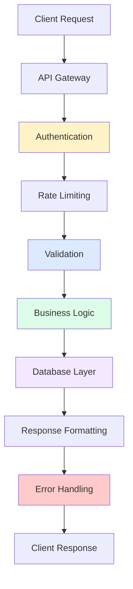

# API Development & Best Practices

## 🎯 RESTful API Design Principles

Building well-structured APIs with Express.js and Sequelize following REST conventions and industry best practices.



## 🏗️ Project Structure for APIs

### 1. Organized Directory Structure

```
src/
├── controllers/          # Request handlers
│   ├── auth.controller.js
│   ├── users.controller.js
│   ├── posts.controller.js
│   └── index.js
├── routes/               # Route definitions
│   ├── auth.routes.js
│   ├── users.routes.js
│   ├── posts.routes.js
│   └── index.js
├── middleware/           # Custom middleware
│   ├── auth.js
│   ├── validation.js
│   ├── rate-limiter.js
│   └── error-handler.js
├── services/             # Business logic
│   ├── auth.service.js
│   ├── user.service.js
│   ├── post.service.js
│   └── email.service.js
├── validators/           # Request validation schemas
│   ├── auth.validator.js
│   ├── user.validator.js
│   └── post.validator.js
├── utils/                # Utility functions
│   ├── response.js
│   ├── pagination.js
│   ├── upload.js
│   └── constants.js
├── config/               # Configuration files
│   ├── database.js
│   ├── redis.js
│   └── app.js
└── app.js               # Application entry point
```

### 2. Express Application Setup

```javascript
// app.js - Main application setup
const express = require('express');
const cors = require('cors');
const helmet = require('helmet');
const compression = require('compression');
const rateLimit = require('express-rate-limit');
const { sequelize } = require('./config/database');
const routes = require('./routes');
const { errorHandler, notFoundHandler } = require('./middleware/error-handler');
const { requestLogger } = require('./middleware/logger');

class Application {
  constructor() {
    this.app = express();
    this.setupMiddleware();
    this.setupRoutes();
    this.setupErrorHandling();
  }

  setupMiddleware() {
    // Security middleware
    this.app.use(helmet({
      contentSecurityPolicy: {
        directives: {
          defaultSrc: ["'self'"],
          styleSrc: ["'self'", "'unsafe-inline'"],
          scriptSrc: ["'self'"],
          imgSrc: ["'self'", "data:", "https:"],
        },
      },
      crossOriginEmbedderPolicy: false
    }));

    // CORS configuration
    this.app.use(cors({
      origin: process.env.ALLOWED_ORIGINS?.split(',') || ['http://localhost:3000'],
      credentials: true,
      methods: ['GET', 'POST', 'PUT', 'PATCH', 'DELETE', 'OPTIONS'],
      allowedHeaders: ['Content-Type', 'Authorization', 'X-Requested-With']
    }));

    // Compression
    this.app.use(compression());

    // Body parsing
    this.app.use(express.json({ 
      limit: '10mb',
      verify: (req, res, buf) => {
        req.rawBody = buf; // Store raw body for webhook verification
      }
    }));
    this.app.use(express.urlencoded({ extended: true, limit: '10mb' }));

    // Request logging
    this.app.use(requestLogger);

    // Global rate limiting
    const globalLimiter = rateLimit({
      windowMs: 15 * 60 * 1000, // 15 minutes
      max: 1000, // Limit each IP to 1000 requests per windowMs
      message: {
        error: 'Too many requests from this IP',
        code: 'RATE_LIMIT_EXCEEDED',
        retryAfter: 900 // 15 minutes in seconds
      },
      standardHeaders: true,
      legacyHeaders: false,
      keyGenerator: (req) => {
        // Use user ID if authenticated, otherwise IP
        return req.user ? `user:${req.user.id}` : `ip:${req.ip}`;
      }
    });
    this.app.use('/api', globalLimiter);

    // Health check endpoint (no auth required)
    this.app.get('/health', (req, res) => {
      res.json({
        status: 'healthy',
        timestamp: new Date().toISOString(),
        uptime: process.uptime(),
        version: process.env.APP_VERSION || '1.0.0'
      });
    });

    // API documentation
    this.app.get('/api', (req, res) => {
      res.json({
        name: 'Blog API',
        version: '1.0.0',
        description: 'RESTful API for blog management',
        endpoints: {
          auth: '/api/auth',
          users: '/api/users',
          posts: '/api/posts',
          comments: '/api/comments'
        },
        documentation: '/api/docs'
      });
    });
  }

  setupRoutes() {
    // API routes
    this.app.use('/api', routes);

    // 404 handler for API routes
    this.app.use('/api/*', notFoundHandler);
  }

  setupErrorHandling() {
    // Global error handler
    this.app.use(errorHandler);
  }

  async start(port = process.env.PORT || 3000) {
    try {
      // Test database connection
      await sequelize.authenticate();
      console.log('✅ Database connection established successfully');

      // Sync database (only in development)
      if (process.env.NODE_ENV === 'development') {
        await sequelize.sync({ alter: true });
        console.log('✅ Database synchronized');
      }

      // Start server
      this.server = this.app.listen(port, () => {
        console.log(`🚀 Server running on port ${port}`);
        console.log(`📚 API documentation: http://localhost:${port}/api`);
        console.log(`🏥 Health check: http://localhost:${port}/health`);
      });

      // Graceful shutdown
      this.setupGracefulShutdown();

    } catch (error) {
      console.error('❌ Failed to start server:', error);
      process.exit(1);
    }
  }

  setupGracefulShutdown() {
    const gracefulShutdown = async (signal) => {
      console.log(`\n📤 Received ${signal}. Starting graceful shutdown...`);

      if (this.server) {
        this.server.close(async () => {
          console.log('✅ HTTP server closed');

          try {
            await sequelize.close();
            console.log('✅ Database connections closed');
            process.exit(0);
          } catch (error) {
            console.error('❌ Error during shutdown:', error);
            process.exit(1);
          }
        });
      }
    };

    process.on('SIGTERM', () => gracefulShutdown('SIGTERM'));
    process.on('SIGINT', () => gracefulShutdown('SIGINT'));
  }
}

module.exports = Application;

// Start application if this file is run directly
if (require.main === module) {
  const app = new Application();
  app.start();
}
```

## 🛣️ Route Organization and Controllers

### 1. Route Definition

```javascript
// routes/index.js - Main route aggregator
const express = require('express');
const authRoutes = require('./auth.routes');
const userRoutes = require('./users.routes');
const postRoutes = require('./posts.routes');
const commentRoutes = require('./comments.routes');

const router = express.Router();

// Route modules
router.use('/auth', authRoutes);
router.use('/users', userRoutes);
router.use('/posts', postRoutes);
router.use('/comments', commentRoutes);

module.exports = router;
```

```javascript
// routes/posts.routes.js - Post-specific routes
const express = require('express');
const rateLimit = require('express-rate-limit');
const { PostController } = require('../controllers');
const { authenticate, authorize, requireOwnership } = require('../middleware/auth');
const { validateRequest } = require('../middleware/validation');
const { postValidators } = require('../validators/post.validator');
const { upload } = require('../middleware/upload');

const router = express.Router();

// Rate limiting for post operations
const postLimiter = rateLimit({
  windowMs: 15 * 60 * 1000, // 15 minutes
  max: 20, // Limit each user to 20 post operations per windowMs
  message: {
    error: 'Too many post operations',
    code: 'POST_RATE_LIMIT_EXCEEDED'
  }
});

// Public routes
router.get('/', PostController.getAllPosts);
router.get('/search', PostController.searchPosts);
router.get('/trending', PostController.getTrendingPosts);
router.get('/:id', PostController.getPostById);

// Protected routes
router.use(authenticate); // All routes below require authentication

router.post('/', 
  postLimiter,
  upload.single('featuredImage'),
  validateRequest(postValidators.createPost),
  PostController.createPost
);

router.get('/user/me', PostController.getCurrentUserPosts);

// Post-specific routes (require ownership or admin role)
router.put('/:id',
  requireOwnership('Post'),
  upload.single('featuredImage'),
  validateRequest(postValidators.updatePost),
  PostController.updatePost
);

router.patch('/:id/publish',
  requireOwnership('Post'),
  PostController.publishPost
);

router.patch('/:id/unpublish',
  requireOwnership('Post'),
  PostController.unpublishPost
);

router.delete('/:id',
  requireOwnership('Post'),
  PostController.deletePost
);

// Admin-only routes
router.patch('/:id/feature',
  authorize('admin'),
  PostController.featurePost
);

router.get('/:id/analytics',
  requireOwnership('Post'),
  PostController.getPostAnalytics
);

module.exports = router;
```

### 2. Controller Implementation

```javascript
// controllers/posts.controller.js - Post controller with comprehensive functionality
const { PostService } = require('../services');
const { ApiResponse } = require('../utils/response');
const { AppError } = require('../utils/errors');
const { paginate } = require('../utils/pagination');

class PostController {
  /**
   * Get all posts with filtering, sorting, and pagination
   */
  static async getAllPosts(req, res, next) {
    try {
      const {
        page = 1,
        limit = 10,
        sortBy = 'publishedAt',
        sortOrder = 'DESC',
        status = 'published',
        category,
        tags,
        author,
        search,
        dateFrom,
        dateTo
      } = req.query;

      const filters = {
        status,
        category,
        tags: tags ? tags.split(',') : undefined,
        author,
        search,
        dateRange: dateFrom && dateTo ? { from: dateFrom, to: dateTo } : undefined
      };

      const options = {
        page: parseInt(page),
        limit: parseInt(limit),
        sortBy,
        sortOrder: sortOrder.toUpperCase(),
        includeAuthor: true,
        includeTags: true,
        includeCommentCount: true
      };

      const result = await PostService.getAllPosts(filters, options);

      res.json(ApiResponse.success(result, 'Posts retrieved successfully'));
    } catch (error) {
      next(error);
    }
  }

  /**
   * Get post by ID with view count increment
   */
  static async getPostById(req, res, next) {
    try {
      const { id } = req.params;
      const { includeComments = 'false' } = req.query;

      const post = await PostService.getPostById(id, {
        includeComments: includeComments === 'true',
        incrementViews: true,
        includeRelated: true
      });

      if (!post) {
        throw new AppError('Post not found', 404, 'POST_NOT_FOUND');
      }

      res.json(ApiResponse.success(post, 'Post retrieved successfully'));
    } catch (error) {
      next(error);
    }
  }

  /**
   * Create new post
   */
  static async createPost(req, res, next) {
    try {
      const postData = req.body;
      const userId = req.user.id;
      const featuredImage = req.file;

      const post = await PostService.createPost({
        ...postData,
        userId,
        featuredImage
      });

      res.status(201).json(
        ApiResponse.success(post, 'Post created successfully')
      );
    } catch (error) {
      next(error);
    }
  }

  /**
   * Update existing post
   */
  static async updatePost(req, res, next) {
    try {
      const { id } = req.params;
      const updateData = req.body;
      const featuredImage = req.file;

      const post = await PostService.updatePost(id, {
        ...updateData,
        featuredImage
      });

      res.json(ApiResponse.success(post, 'Post updated successfully'));
    } catch (error) {
      next(error);
    }
  }

  /**
   * Publish post
   */
  static async publishPost(req, res, next) {
    try {
      const { id } = req.params;

      const post = await PostService.publishPost(id);

      res.json(ApiResponse.success(post, 'Post published successfully'));
    } catch (error) {
      next(error);
    }
  }

  /**
   * Unpublish post
   */
  static async unpublishPost(req, res, next) {
    try {
      const { id } = req.params;

      const post = await PostService.unpublishPost(id);

      res.json(ApiResponse.success(post, 'Post unpublished successfully'));
    } catch (error) {
      next(error);
    }
  }

  /**
   * Delete post
   */
  static async deletePost(req, res, next) {
    try {
      const { id } = req.params;

      await PostService.deletePost(id);

      res.json(ApiResponse.success(null, 'Post deleted successfully'));
    } catch (error) {
      next(error);
    }
  }

  /**
   * Search posts
   */
  static async searchPosts(req, res, next) {
    try {
      const {
        q: query,
        page = 1,
        limit = 10,
        filters = {}
      } = req.query;

      if (!query || query.trim().length < 2) {
        throw new AppError('Search query must be at least 2 characters', 400, 'INVALID_SEARCH_QUERY');
      }

      const result = await PostService.searchPosts(query, {
        page: parseInt(page),
        limit: parseInt(limit),
        filters: typeof filters === 'string' ? JSON.parse(filters) : filters
      });

      res.json(ApiResponse.success(result, 'Search completed successfully'));
    } catch (error) {
      next(error);
    }
  }

  /**
   * Get trending posts
   */
  static async getTrendingPosts(req, res, next) {
    try {
      const {
        timeframe = '7d',
        limit = 10
      } = req.query;

      const posts = await PostService.getTrendingPosts({
        timeframe,
        limit: parseInt(limit)
      });

      res.json(ApiResponse.success(posts, 'Trending posts retrieved successfully'));
    } catch (error) {
      next(error);
    }
  }

  /**
   * Get current user's posts
   */
  static async getCurrentUserPosts(req, res, next) {
    try {
      const userId = req.user.id;
      const {
        page = 1,
        limit = 10,
        status,
        sortBy = 'updatedAt',
        sortOrder = 'DESC'
      } = req.query;

      const result = await PostService.getUserPosts(userId, {
        page: parseInt(page),
        limit: parseInt(limit),
        status,
        sortBy,
        sortOrder: sortOrder.toUpperCase()
      });

      res.json(ApiResponse.success(result, 'User posts retrieved successfully'));
    } catch (error) {
      next(error);
    }
  }

  /**
   * Feature post (Admin only)
   */
  static async featurePost(req, res, next) {
    try {
      const { id } = req.params;
      const { featured = true } = req.body;

      const post = await PostService.featurePost(id, featured);

      res.json(ApiResponse.success(
        post, 
        `Post ${featured ? 'featured' : 'unfeatured'} successfully`
      ));
    } catch (error) {
      next(error);
    }
  }

  /**
   * Get post analytics
   */
  static async getPostAnalytics(req, res, next) {
    try {
      const { id } = req.params;
      const {
        timeframe = '30d',
        metrics = 'views,comments,shares'
      } = req.query;

      const analytics = await PostService.getPostAnalytics(id, {
        timeframe,
        metrics: metrics.split(',')
      });

      res.json(ApiResponse.success(analytics, 'Post analytics retrieved successfully'));
    } catch (error) {
      next(error);
    }
  }
}

module.exports = PostController;
```

### 3. Service Layer Implementation

```javascript
// services/post.service.js - Business logic for posts
const { Post, User, Comment, Tag, sequelize } = require('../models');
const { AppError } = require('../utils/errors');
const { uploadToCloudinary } = require('../utils/upload');
const { generateSlug } = require('../utils/text');
const { Op } = require('sequelize');

class PostService {
  /**
   * Get all posts with advanced filtering and pagination
   */
  static async getAllPosts(filters = {}, options = {}) {
    const {
      page = 1,
      limit = 10,
      sortBy = 'publishedAt',
      sortOrder = 'DESC',
      includeAuthor = true,
      includeTags = true,
      includeCommentCount = true
    } = options;

    // Build where clause
    const whereClause = { status: 'published' };

    if (filters.status && filters.status !== 'all') {
      whereClause.status = filters.status;
    }

    if (filters.category) {
      whereClause['$metadata.category$'] = filters.category;
    }

    if (filters.tags && filters.tags.length > 0) {
      whereClause.tags = { [Op.overlap]: filters.tags };
    }

    if (filters.search) {
      whereClause[Op.or] = [
        { title: { [Op.iLike]: `%${filters.search}%` } },
        { excerpt: { [Op.iLike]: `%${filters.search}%` } },
        { content: { [Op.iLike]: `%${filters.search}%` } }
      ];
    }

    if (filters.dateRange) {
      whereClause.publishedAt = {
        [Op.between]: [filters.dateRange.from, filters.dateRange.to]
      };
    }

    // Build include array
    const include = [];

    if (includeAuthor) {
      include.push({
        model: User,
        as: 'author',
        attributes: ['id', 'firstName', 'lastName', 'username']
      });
    }

    if (includeTags) {
      include.push({
        model: Tag,
        through: { attributes: [] },
        attributes: ['id', 'name', 'displayName']
      });
    }

    if (includeCommentCount) {
      include.push({
        model: Comment,
        attributes: [],
        required: false
      });
    }

    // Build attributes
    const attributes = [
      'id', 'title', 'slug', 'excerpt', 'featuredImage',
      'publishedAt', 'viewCount', 'readingTime', 'tags'
    ];

    if (includeCommentCount) {
      attributes.push([
        sequelize.fn('COUNT', sequelize.col('comments.id')),
        'commentCount'
      ]);
    }

    // Execute query
    const { count, rows } = await Post.findAndCountAll({
      where: whereClause,
      include,
      attributes,
      group: includeCommentCount ? ['Post.id', 'author.id'] : undefined,
      order: [[sortBy, sortOrder]],
      limit,
      offset: (page - 1) * limit,
      distinct: true,
      subQuery: false
    });

    return {
      posts: rows,
      pagination: {
        currentPage: page,
        totalPages: Math.ceil(count / limit),
        totalCount: count,
        limit,
        hasNext: page < Math.ceil(count / limit),
        hasPrev: page > 1
      }
    };
  }

  /**
   * Get post by ID with optional includes
   */
  static async getPostById(id, options = {}) {
    const {
      includeComments = false,
      incrementViews = false,
      includeRelated = false
    } = options;

    const include = [
      {
        model: User,
        as: 'author',
        attributes: ['id', 'firstName', 'lastName', 'username']
      },
      {
        model: Tag,
        through: { attributes: [] },
        attributes: ['id', 'name', 'displayName']
      }
    ];

    if (includeComments) {
      include.push({
        model: Comment,
        include: [{
          model: User,
          as: 'author',
          attributes: ['id', 'firstName', 'lastName', 'username']
        }],
        order: [['createdAt', 'DESC']],
        limit: 20 // Limit initial comments load
      });
    }

    const post = await Post.findByPk(id, {
      include,
      attributes: {
        include: [
          [sequelize.fn('COUNT', sequelize.col('comments.id')), 'commentCount']
        ]
      }
    });

    if (!post) {
      return null;
    }

    // Increment view count if requested
    if (incrementViews) {
      await post.increment('viewCount');
      post.viewCount += 1; // Update local instance
    }

    // Get related posts if requested
    if (includeRelated) {
      post.relatedPosts = await this.getRelatedPosts(post);
    }

    return post;
  }

  /**
   * Create new post
   */
  static async createPost(postData) {
    const transaction = await sequelize.transaction();

    try {
      const {
        title,
        content,
        excerpt,
        tags,
        category,
        status = 'draft',
        featuredImage,
        userId
      } = postData;

      // Generate slug
      const slug = await this.generateUniqueSlug(title);

      // Upload featured image if provided
      let featuredImageUrl = null;
      if (featuredImage) {
        featuredImageUrl = await uploadToCloudinary(featuredImage, 'posts');
      }

      // Calculate reading time
      const readingTime = this.calculateReadingTime(content);

      // Create post
      const post = await Post.create({
        title,
        slug,
        content,
        excerpt: excerpt || this.generateExcerpt(content),
        featuredImage: featuredImageUrl,
        status,
        userId,
        readingTime,
        metadata: { category },
        tags: Array.isArray(tags) ? tags : []
      }, { transaction });

      // Handle tags if provided
      if (tags && tags.length > 0) {
        await this.associateTags(post.id, tags, transaction);
      }

      await transaction.commit();

      // Return post with includes
      return await this.getPostById(post.id);

    } catch (error) {
      await transaction.rollback();
      throw error;
    }
  }

  /**
   * Update existing post
   */
  static async updatePost(id, updateData) {
    const transaction = await sequelize.transaction();

    try {
      const post = await Post.findByPk(id, { transaction });
      if (!post) {
        throw new AppError('Post not found', 404, 'POST_NOT_FOUND');
      }

      const {
        title,
        content,
        excerpt,
        tags,
        category,
        featuredImage
      } = updateData;

      const updates = {};

      if (title && title !== post.title) {
        updates.title = title;
        updates.slug = await this.generateUniqueSlug(title, id);
      }

      if (content) {
        updates.content = content;
        updates.readingTime = this.calculateReadingTime(content);
      }

      if (excerpt !== undefined) {
        updates.excerpt = excerpt || this.generateExcerpt(content || post.content);
      }

      if (category) {
        updates.metadata = { ...post.metadata, category };
      }

      if (featuredImage) {
        updates.featuredImage = await uploadToCloudinary(featuredImage, 'posts');
      }

      if (tags !== undefined) {
        updates.tags = Array.isArray(tags) ? tags : [];
        await this.associateTags(id, tags, transaction);
      }

      // Update post
      await post.update(updates, { transaction });

      await transaction.commit();

      // Return updated post
      return await this.getPostById(id);

    } catch (error) {
      await transaction.rollback();
      throw error;
    }
  }

  /**
   * Publish post
   */
  static async publishPost(id) {
    const post = await Post.findByPk(id);
    if (!post) {
      throw new AppError('Post not found', 404, 'POST_NOT_FOUND');
    }

    if (post.status === 'published') {
      throw new AppError('Post is already published', 400, 'ALREADY_PUBLISHED');
    }

    await post.update({
      status: 'published',
      publishedAt: new Date()
    });

    return await this.getPostById(id);
  }

  /**
   * Unpublish post
   */
  static async unpublishPost(id) {
    const post = await Post.findByPk(id);
    if (!post) {
      throw new AppError('Post not found', 404, 'POST_NOT_FOUND');
    }

    await post.update({
      status: 'draft',
      publishedAt: null
    });

    return await this.getPostById(id);
  }

  /**
   * Delete post
   */
  static async deletePost(id) {
    const post = await Post.findByPk(id);
    if (!post) {
      throw new AppError('Post not found', 404, 'POST_NOT_FOUND');
    }

    await post.destroy();
  }

  /**
   * Search posts using full-text search
   */
  static async searchPosts(query, options = {}) {
    const { page = 1, limit = 10, filters = {} } = options;

    const whereClause = {
      status: 'published',
      [Op.or]: [
        sequelize.where(
          sequelize.fn('to_tsvector', 'english',
            sequelize.fn('concat',
              sequelize.col('title'), ' ',
              sequelize.col('content')
            )
          ),
          Op.match,
          sequelize.fn('plainto_tsquery', 'english', query)
        ),
        { title: { [Op.iLike]: `%${query}%` } },
        { excerpt: { [Op.iLike]: `%${query}%` } }
      ]
    };

    // Apply additional filters
    Object.assign(whereClause, filters);

    const { count, rows } = await Post.findAndCountAll({
      where: whereClause,
      include: [
        {
          model: User,
          as: 'author',
          attributes: ['id', 'firstName', 'lastName', 'username']
        }
      ],
      attributes: [
        'id', 'title', 'slug', 'excerpt', 'featuredImage',
        'publishedAt', 'viewCount', 'readingTime'
      ],
      order: [['publishedAt', 'DESC']],
      limit,
      offset: (page - 1) * limit
    });

    return {
      posts: rows,
      pagination: {
        currentPage: page,
        totalPages: Math.ceil(count / limit),
        totalCount: count,
        limit,
        hasNext: page < Math.ceil(count / limit),
        hasPrev: page > 1
      },
      searchQuery: query
    };
  }

  /**
   * Get trending posts based on recent activity
   */
  static async getTrendingPosts(options = {}) {
    const { timeframe = '7d', limit = 10 } = options;

    const timeframeMap = {
      '1d': 1,
      '3d': 3,
      '7d': 7,
      '30d': 30
    };

    const days = timeframeMap[timeframe] || 7;
    const sinceDate = new Date(Date.now() - days * 24 * 60 * 60 * 1000);

    const posts = await Post.findAll({
      where: {
        status: 'published',
        publishedAt: { [Op.gte]: sinceDate }
      },
      include: [
        {
          model: User,
          as: 'author',
          attributes: ['id', 'firstName', 'lastName', 'username']
        },
        {
          model: Comment,
          attributes: [],
          where: { createdAt: { [Op.gte]: sinceDate } },
          required: false
        }
      ],
      attributes: [
        'id', 'title', 'slug', 'excerpt', 'featuredImage',
        'publishedAt', 'viewCount', 'readingTime',
        [sequelize.fn('COUNT', sequelize.col('comments.id')), 'recentComments']
      ],
      group: ['Post.id', 'author.id'],
      order: [
        [sequelize.literal('(view_count + COUNT(comments.id) * 2)'), 'DESC']
      ],
      limit
    });

    return posts;
  }

  // Helper methods
  static async generateUniqueSlug(title, excludeId = null) {
    let baseSlug = generateSlug(title);
    let slug = baseSlug;
    let counter = 1;

    while (true) {
      const whereClause = { slug };
      if (excludeId) {
        whereClause.id = { [Op.ne]: excludeId };
      }

      const existing = await Post.findOne({ where: whereClause });
      if (!existing) break;

      slug = `${baseSlug}-${counter}`;
      counter++;
    }

    return slug;
  }

  static generateExcerpt(content, maxLength = 150) {
    if (!content) return '';
    
    const plainText = content.replace(/<[^>]*>/g, ''); // Remove HTML tags
    return plainText.length > maxLength 
      ? plainText.substring(0, maxLength) + '...'
      : plainText;
  }

  static calculateReadingTime(content) {
    if (!content) return 0;
    
    const wordsPerMinute = 200;
    const wordCount = content.split(/\s+/).length;
    return Math.ceil(wordCount / wordsPerMinute);
  }

  static async associateTags(postId, tags, transaction) {
    if (!tags || tags.length === 0) return;

    const tagInstances = await Promise.all(
      tags.map(async (tagName) => {
        const [tag] = await Tag.findOrCreate({
          where: { name: tagName.toLowerCase() },
          defaults: {
            name: tagName.toLowerCase(),
            displayName: tagName
          },
          transaction
        });
        return tag;
      })
    );

    const post = await Post.findByPk(postId, { transaction });
    await post.setTags(tagInstances, { transaction });
  }

  static async getRelatedPosts(post, limit = 5) {
    // Find posts with similar tags
    const relatedPosts = await Post.findAll({
      where: {
        id: { [Op.ne]: post.id },
        status: 'published',
        tags: { [Op.overlap]: post.tags || [] }
      },
      include: [
        {
          model: User,
          as: 'author',
          attributes: ['id', 'firstName', 'lastName', 'username']
        }
      ],
      attributes: ['id', 'title', 'slug', 'excerpt', 'featuredImage', 'publishedAt'],
      order: [['publishedAt', 'DESC']],
      limit
    });

    return relatedPosts;
  }
}

module.exports = PostService;
```

## 🔍 Input Validation and Error Handling

### 1. Request Validation

```javascript
// validators/post.validator.js - Comprehensive validation schemas
const { body, query, param } = require('express-validator');

const postValidators = {
  createPost: [
    body('title')
      .notEmpty()
      .withMessage('Title is required')
      .isLength({ min: 5, max: 200 })
      .withMessage('Title must be between 5 and 200 characters')
      .trim(),
    
    body('content')
      .notEmpty()
      .withMessage('Content is required')
      .isLength({ min: 100 })
      .withMessage('Content must be at least 100 characters'),
    
    body('excerpt')
      .optional()
      .isLength({ max: 300 })
      .withMessage('Excerpt cannot exceed 300 characters')
      .trim(),
    
    body('tags')
      .optional()
      .isArray()
      .withMessage('Tags must be an array'),
    
    body('tags.*')
      .optional()
      .isString()
      .withMessage('Each tag must be a string')
      .isLength({ min: 2, max: 30 })
      .withMessage('Tag length must be between 2 and 30 characters')
      .matches(/^[a-zA-Z0-9\s-]+$/)
      .withMessage('Tags can only contain letters, numbers, spaces, and hyphens'),
    
    body('category')
      .optional()
      .isString()
      .withMessage('Category must be a string')
      .isLength({ min: 2, max: 50 })
      .withMessage('Category length must be between 2 and 50 characters'),
    
    body('status')
      .optional()
      .isIn(['draft', 'published'])
      .withMessage('Status must be either draft or published')
  ],

  updatePost: [
    param('id')
      .isInt({ min: 1 })
      .withMessage('Invalid post ID'),
    
    body('title')
      .optional()
      .isLength({ min: 5, max: 200 })
      .withMessage('Title must be between 5 and 200 characters')
      .trim(),
    
    body('content')
      .optional()
      .isLength({ min: 100 })
      .withMessage('Content must be at least 100 characters'),
    
    body('excerpt')
      .optional()
      .isLength({ max: 300 })
      .withMessage('Excerpt cannot exceed 300 characters')
      .trim(),
    
    body('tags')
      .optional()
      .isArray()
      .withMessage('Tags must be an array'),
    
    body('category')
      .optional()
      .isString()
      .withMessage('Category must be a string')
      .isLength({ min: 2, max: 50 })
      .withMessage('Category length must be between 2 and 50 characters')
  ],

  getPostById: [
    param('id')
      .isInt({ min: 1 })
      .withMessage('Invalid post ID'),
    
    query('includeComments')
      .optional()
      .isBoolean()
      .withMessage('includeComments must be a boolean')
  ],

  getAllPosts: [
    query('page')
      .optional()
      .isInt({ min: 1 })
      .withMessage('Page must be a positive integer'),
    
    query('limit')
      .optional()
      .isInt({ min: 1, max: 100 })
      .withMessage('Limit must be between 1 and 100'),
    
    query('sortBy')
      .optional()
      .isIn(['publishedAt', 'createdAt', 'updatedAt', 'title', 'viewCount'])
      .withMessage('Invalid sort field'),
    
    query('sortOrder')
      .optional()
      .isIn(['ASC', 'DESC', 'asc', 'desc'])
      .withMessage('Sort order must be ASC or DESC'),
    
    query('status')
      .optional()
      .isIn(['draft', 'published', 'archived', 'all'])
      .withMessage('Invalid status filter'),
    
    query('tags')
      .optional()
      .isString()
      .withMessage('Tags filter must be a comma-separated string'),
    
    query('search')
      .optional()
      .isLength({ min: 2, max: 100 })
      .withMessage('Search query must be between 2 and 100 characters')
      .trim()
  ],

  searchPosts: [
    query('q')
      .notEmpty()
      .withMessage('Search query is required')
      .isLength({ min: 2, max: 100 })
      .withMessage('Search query must be between 2 and 100 characters')
      .trim(),
    
    query('page')
      .optional()
      .isInt({ min: 1 })
      .withMessage('Page must be a positive integer'),
    
    query('limit')
      .optional()
      .isInt({ min: 1, max: 50 })
      .withMessage('Limit must be between 1 and 50')
  ]
};

module.exports = { postValidators };
```

### 2. Error Handling Middleware

```javascript
// middleware/error-handler.js - Comprehensive error handling
const { ValidationError } = require('sequelize');
const { validationResult } = require('express-validator');

/**
 * Custom application error class
 */
class AppError extends Error {
  constructor(message, statusCode = 500, code = 'INTERNAL_ERROR', details = null) {
    super(message);
    this.statusCode = statusCode;
    this.code = code;
    this.details = details;
    this.isOperational = true;
    
    Error.captureStackTrace(this, this.constructor);
  }
}

/**
 * Validation error handler for express-validator
 */
const validateRequest = (validations) => {
  return async (req, res, next) => {
    // Run validations
    await Promise.all(validations.map(validation => validation.run(req)));
    
    const errors = validationResult(req);
    if (!errors.isEmpty()) {
      const errorDetails = errors.array().map(error => ({
        field: error.param,
        message: error.msg,
        value: error.value,
        location: error.location
      }));
      
      return res.status(400).json({
        success: false,
        error: 'Validation failed',
        code: 'VALIDATION_ERROR',
        details: errorDetails,
        timestamp: new Date().toISOString()
      });
    }
    
    next();
  };
};

/**
 * Global error handler middleware
 */
const errorHandler = (error, req, res, next) => {
  console.error('Error occurred:', {
    message: error.message,
    stack: error.stack,
    url: req.url,
    method: req.method,
    body: req.body,
    user: req.user?.id
  });

  // Sequelize validation errors
  if (error instanceof ValidationError) {
    const errorDetails = error.errors.map(err => ({
      field: err.path,
      message: err.message,
      value: err.value,
      type: err.type
    }));

    return res.status(400).json({
      success: false,
      error: 'Database validation failed',
      code: 'DATABASE_VALIDATION_ERROR',
      details: errorDetails,
      timestamp: new Date().toISOString()
    });
  }

  // Sequelize database errors
  if (error.name === 'SequelizeDatabaseError') {
    return res.status(500).json({
      success: false,
      error: 'Database error occurred',
      code: 'DATABASE_ERROR',
      timestamp: new Date().toISOString()
    });
  }

  // Sequelize unique constraint errors
  if (error.name === 'SequelizeUniqueConstraintError') {
    const field = error.errors[0]?.path;
    return res.status(409).json({
      success: false,
      error: `${field} already exists`,
      code: 'DUPLICATE_ENTRY',
      field,
      timestamp: new Date().toISOString()
    });
  }

  // JWT errors
  if (error.name === 'JsonWebTokenError') {
    return res.status(401).json({
      success: false,
      error: 'Invalid token',
      code: 'INVALID_TOKEN',
      timestamp: new Date().toISOString()
    });
  }

  if (error.name === 'TokenExpiredError') {
    return res.status(401).json({
      success: false,
      error: 'Token expired',
      code: 'TOKEN_EXPIRED',
      timestamp: new Date().toISOString()
    });
  }

  // Multer errors (file upload)
  if (error.code === 'LIMIT_FILE_SIZE') {
    return res.status(413).json({
      success: false,
      error: 'File too large',
      code: 'FILE_TOO_LARGE',
      maxSize: error.limit,
      timestamp: new Date().toISOString()
    });
  }

  if (error.code === 'LIMIT_FILE_COUNT') {
    return res.status(413).json({
      success: false,
      error: 'Too many files',
      code: 'TOO_MANY_FILES',
      maxCount: error.limit,
      timestamp: new Date().toISOString()
    });
  }

  // Application errors
  if (error.isOperational) {
    return res.status(error.statusCode).json({
      success: false,
      error: error.message,
      code: error.code,
      details: error.details,
      timestamp: new Date().toISOString()
    });
  }

  // Default error response
  res.status(500).json({
    success: false,
    error: process.env.NODE_ENV === 'production' 
      ? 'Internal server error' 
      : error.message,
    code: 'INTERNAL_ERROR',
    timestamp: new Date().toISOString(),
    ...(process.env.NODE_ENV !== 'production' && { stack: error.stack })
  });
};

/**
 * 404 handler for unmatched routes
 */
const notFoundHandler = (req, res) => {
  res.status(404).json({
    success: false,
    error: `Route ${req.method} ${req.originalUrl} not found`,
    code: 'ROUTE_NOT_FOUND',
    timestamp: new Date().toISOString()
  });
};

/**
 * Async error wrapper
 */
const asyncHandler = (fn) => {
  return (req, res, next) => {
    Promise.resolve(fn(req, res, next)).catch(next);
  };
};

module.exports = {
  AppError,
  validateRequest,
  errorHandler,
  notFoundHandler,
  asyncHandler
};
```

### 3. Response Formatting

```javascript
// utils/response.js - Standardized API responses
class ApiResponse {
  /**
   * Success response
   */
  static success(data = null, message = 'Success', meta = {}) {
    return {
      success: true,
      message,
      data,
      meta: {
        timestamp: new Date().toISOString(),
        ...meta
      }
    };
  }

  /**
   * Error response
   */
  static error(message = 'Error', code = 'ERROR', details = null, statusCode = 500) {
    return {
      success: false,
      error: message,
      code,
      details,
      meta: {
        timestamp: new Date().toISOString(),
        statusCode
      }
    };
  }

  /**
   * Paginated response
   */
  static paginated(data, pagination, message = 'Success') {
    return {
      success: true,
      message,
      data,
      pagination,
      meta: {
        timestamp: new Date().toISOString()
      }
    };
  }

  /**
   * Created response (201)
   */
  static created(data, message = 'Resource created successfully') {
    return {
      success: true,
      message,
      data,
      meta: {
        timestamp: new Date().toISOString(),
        statusCode: 201
      }
    };
  }

  /**
   * No content response (204)
   */
  static noContent(message = 'Operation completed successfully') {
    return {
      success: true,
      message,
      meta: {
        timestamp: new Date().toISOString(),
        statusCode: 204
      }
    };
  }
}

module.exports = { ApiResponse };
```

## 🎯 Key Takeaways

1. **RESTful Design**: Follow REST conventions for predictable API structure
2. **Input Validation**: Validate all inputs thoroughly using express-validator
3. **Error Handling**: Implement comprehensive error handling with meaningful messages
4. **Response Format**: Use consistent response structure across all endpoints
5. **Security**: Implement authentication, authorization, and rate limiting
6. **Performance**: Use pagination, filtering, and efficient database queries
7. **Documentation**: Document all endpoints with clear examples

## 🚀 What's Next?

Now that you understand API development, let's explore [[18-Testing|Testing Strategies]] to ensure your APIs are reliable and bug-free!

---

## 🔗 Related Topics
- [[16-Authentication|Authentication & Authorization]]
- [[18-Testing|Testing Strategies]]
- [[19-Production-Deployment|Production Deployment]]
