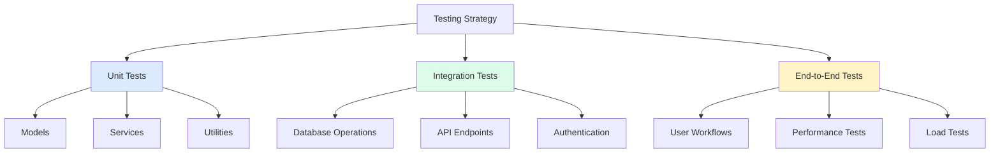

# Testing Strategies

## 🎯 Comprehensive Testing Approach

Testing ensures your Sequelize applications are reliable, maintainable, and bug-free. We'll cover unit tests, integration tests, and end-to-end testing strategies.



## 🧪 Testing Setup and Configuration

### 1. Test Environment Setup

```javascript
// config/test.js - Test configuration
const { Sequelize } = require('sequelize');

const testConfig = {
  database: {
    dialect: 'postgres',
    host: process.env.TEST_DB_HOST || 'localhost',
    port: process.env.TEST_DB_PORT || 5432,
    database: process.env.TEST_DB_NAME || 'blog_test',
    username: process.env.TEST_DB_USER || 'postgres',
    password: process.env.TEST_DB_PASSWORD || 'password',
    
    // Test-specific settings
    logging: false, // Disable SQL logging in tests
    pool: {
      max: 5,
      min: 1,
      acquire: 10000,
      idle: 5000
    },
    
    // Use memory database for faster tests (SQLite)
    // dialect: 'sqlite',
    // storage: ':memory:',
    
    // Disable automatic model synchronization
    sync: false
  },
  
  redis: {
    host: process.env.TEST_REDIS_HOST || 'localhost',
    port: process.env.TEST_REDIS_PORT || 6379,
    db: 1 // Use different database index for tests
  },
  
  jwt: {
    secret: 'test-jwt-secret',
    expiresIn: '1h'
  },
  
  email: {
    // Use test email service like Ethereal
    service: 'ethereal',
    disabled: true // Disable email sending in tests
  }
};

module.exports = testConfig;
```

```javascript
// tests/setup.js - Global test setup
const { sequelize } = require('../models');
const testConfig = require('../config/test');

// Set up test environment
process.env.NODE_ENV = 'test';
process.env.JWT_SECRET = testConfig.jwt.secret;

// Database setup helpers
class TestDatabase {
  static async setup() {
    try {
      // Create test database if it doesn't exist
      const tempSequelize = new Sequelize('postgres', {
        host: testConfig.database.host,
        port: testConfig.database.port,
        username: testConfig.database.username,
        password: testConfig.database.password,
        dialect: 'postgres',
        logging: false
      });
      
      await tempSequelize.query(
        `CREATE DATABASE IF NOT EXISTS "${testConfig.database.database}"`
      );
      await tempSequelize.close();
      
      // Connect to test database and sync models
      await sequelize.authenticate();
      await sequelize.sync({ force: true }); // Recreate all tables
      
      console.log('✅ Test database setup completed');
    } catch (error) {
      console.error('❌ Test database setup failed:', error);
      throw error;
    }
  }
  
  static async cleanup() {
    try {
      await sequelize.drop(); // Drop all tables
      await sequelize.close();
      console.log('✅ Test database cleanup completed');
    } catch (error) {
      console.error('❌ Test database cleanup failed:', error);
    }
  }
  
  static async truncate() {
    try {
      // Get all model names
      const models = Object.keys(sequelize.models);
      
      // Disable foreign key checks for truncation
      await sequelize.query('SET FOREIGN_KEY_CHECKS = 0');
      
      // Truncate all tables
      for (const modelName of models) {
        await sequelize.models[modelName].destroy({
          where: {},
          truncate: true,
          cascade: true
        });
      }
      
      // Re-enable foreign key checks
      await sequelize.query('SET FOREIGN_KEY_CHECKS = 1');
      
      console.log('✅ All tables truncated');
    } catch (error) {
      console.error('❌ Table truncation failed:', error);
      throw error;
    }
  }
}

// Global test hooks
beforeAll(async () => {
  await TestDatabase.setup();
});

afterAll(async () => {
  await TestDatabase.cleanup();
});

beforeEach(async () => {
  // Truncate tables before each test for clean state
  await TestDatabase.truncate();
});

module.exports = { TestDatabase };
```

### 2. Test Data Factories

```javascript
// tests/factories/user.factory.js - User test data factory
const { faker } = require('@faker-js/faker');
const { User } = require('../../models');
const bcrypt = require('bcrypt');

class UserFactory {
  static defaultAttributes() {
    return {
      firstName: faker.person.firstName(),
      lastName: faker.person.lastName(),
      email: faker.internet.email().toLowerCase(),
      username: faker.internet.userName().toLowerCase(),
      password: 'Password123!',
      role: 'user',
      isActive: true,
      isEmailVerified: true
    };
  }
  
  static async create(overrides = {}) {
    const attributes = { ...this.defaultAttributes(), ...overrides };
    return await User.create(attributes);
  }
  
  static async createMany(count = 5, overrides = {}) {
    const users = [];
    for (let i = 0; i < count; i++) {
      const user = await this.create({
        ...overrides,
        email: faker.internet.email().toLowerCase(),
        username: faker.internet.userName().toLowerCase()
      });
      users.push(user);
    }
    return users;
  }
  
  static async createAdmin(overrides = {}) {
    return await this.create({
      role: 'admin',
      permissions: ['*'],
      ...overrides
    });
  }
  
  static async createWithPosts(postCount = 3, overrides = {}) {
    const user = await this.create(overrides);
    const { PostFactory } = require('./post.factory');
    
    const posts = await PostFactory.createMany(postCount, {
      userId: user.id
    });
    
    return { user, posts };
  }
  
  static buildAttributes(overrides = {}) {
    return { ...this.defaultAttributes(), ...overrides };
  }
}

module.exports = UserFactory;
```

```javascript
// tests/factories/post.factory.js - Post test data factory
const { faker } = require('@faker-js/faker');
const { Post } = require('../../models');
const UserFactory = require('./user.factory');

class PostFactory {
  static defaultAttributes() {
    const title = faker.lorem.sentence(6);
    const content = faker.lorem.paragraphs(5, '\n\n');
    
    return {
      title,
      slug: title.toLowerCase().replace(/[^a-z0-9]+/g, '-').replace(/^-|-$/g, ''),
      content,
      excerpt: faker.lorem.paragraph(),
      status: 'published',
      publishedAt: faker.date.past(),
      viewCount: faker.number.int({ min: 0, max: 1000 }),
      readingTime: Math.ceil(content.split(' ').length / 200),
      tags: faker.lorem.words(3).split(' '),
      metadata: {
        category: faker.helpers.arrayElement(['Technology', 'Lifestyle', 'Travel', 'Food'])
      }
    };
  }
  
  static async create(overrides = {}) {
    let attributes = { ...this.defaultAttributes(), ...overrides };
    
    // Create user if not provided
    if (!attributes.userId) {
      const user = await UserFactory.create();
      attributes.userId = user.id;
    }
    
    return await Post.create(attributes);
  }
  
  static async createMany(count = 5, overrides = {}) {
    const posts = [];
    
    // Create a user for all posts if not provided
    let userId = overrides.userId;
    if (!userId) {
      const user = await UserFactory.create();
      userId = user.id;
    }
    
    for (let i = 0; i < count; i++) {
      const post = await this.create({
        ...overrides,
        userId,
        title: faker.lorem.sentence(6), // Unique title for each post
        slug: undefined // Let the factory generate unique slug
      });
      posts.push(post);
    }
    
    return posts;
  }
  
  static async createDraft(overrides = {}) {
    return await this.create({
      status: 'draft',
      publishedAt: null,
      ...overrides
    });
  }
  
  static async createPublished(overrides = {}) {
    return await this.create({
      status: 'published',
      publishedAt: faker.date.past(),
      ...overrides
    });
  }
  
  static async createWithComments(commentCount = 3, overrides = {}) {
    const post = await this.create(overrides);
    const { CommentFactory } = require('./comment.factory');
    
    const comments = await CommentFactory.createMany(commentCount, {
      postId: post.id
    });
    
    return { post, comments };
  }
  
  static buildAttributes(overrides = {}) {
    return { ...this.defaultAttributes(), ...overrides };
  }
}

module.exports = PostFactory;
```

## 🔧 Unit Testing

### 1. Model Testing

```javascript
// tests/unit/models/user.test.js - User model unit tests
const { User } = require('../../../models');
const UserFactory = require('../../factories/user.factory');
const bcrypt = require('bcrypt');

describe('User Model', () => {
  describe('Validations', () => {
    test('should create user with valid data', async () => {
      const userData = UserFactory.buildAttributes();
      const user = await User.create(userData);
      
      expect(user).toBeDefined();
      expect(user.email).toBe(userData.email);
      expect(user.username).toBe(userData.username);
      expect(user.passwordHash).toBeDefined();
      expect(user.passwordHash).not.toBe(userData.password);
    });
    
    test('should require email', async () => {
      const userData = UserFactory.buildAttributes({ email: null });
      
      await expect(User.create(userData)).rejects.toThrow(/email/i);
    });
    
    test('should require valid email format', async () => {
      const userData = UserFactory.buildAttributes({ email: 'invalid-email' });
      
      await expect(User.create(userData)).rejects.toThrow(/email/i);
    });
    
    test('should require unique email', async () => {
      const user1 = await UserFactory.create();
      const userData = UserFactory.buildAttributes({ email: user1.email });
      
      await expect(User.create(userData)).rejects.toThrow(/email/i);
    });
    
    test('should require unique username', async () => {
      const user1 = await UserFactory.create();
      const userData = UserFactory.buildAttributes({ username: user1.username });
      
      await expect(User.create(userData)).rejects.toThrow(/username/i);
    });
    
    test('should require strong password', async () => {
      const weakPasswords = ['123', 'password', 'Password', 'Password123'];
      
      for (const password of weakPasswords) {
        const userData = UserFactory.buildAttributes({ password });
        await expect(User.create(userData)).rejects.toThrow(/password/i);
      }
    });
    
    test('should accept valid strong password', async () => {
      const strongPassword = 'Password123!';
      const userData = UserFactory.buildAttributes({ password: strongPassword });
      
      const user = await User.create(userData);
      expect(user).toBeDefined();
    });
  });
  
  describe('Password Management', () => {
    test('should hash password before saving', async () => {
      const password = 'Password123!';
      const user = await UserFactory.create({ password });
      
      expect(user.passwordHash).toBeDefined();
      expect(user.passwordHash).not.toBe(password);
      expect(user.passwordHash.length).toBeGreaterThan(50);
    });
    
    test('should validate correct password', async () => {
      const password = 'Password123!';
      const user = await UserFactory.create({ password });
      
      const isValid = await user.validatePassword(password);
      expect(isValid).toBe(true);
    });
    
    test('should reject incorrect password', async () => {
      const password = 'Password123!';
      const user = await UserFactory.create({ password });
      
      const isValid = await user.validatePassword('WrongPassword123!');
      expect(isValid).toBe(false);
    });
    
    test('should rehash password when updated', async () => {
      const user = await UserFactory.create({ password: 'OldPassword123!' });
      const oldHash = user.passwordHash;
      
      await user.update({ password: 'NewPassword123!' });
      
      expect(user.passwordHash).not.toBe(oldHash);
      expect(await user.validatePassword('NewPassword123!')).toBe(true);
      expect(await user.validatePassword('OldPassword123!')).toBe(false);
    });
  });
  
  describe('Instance Methods', () => {
    test('should generate valid JWT token', async () => {
      const user = await UserFactory.create();
      const token = user.generateJWT();
      
      expect(token).toBeDefined();
      expect(typeof token).toBe('string');
      expect(token.split('.')).toHaveLength(3); // JWT has 3 parts
    });
    
    test('should generate refresh token', async () => {
      const user = await UserFactory.create();
      const refreshToken = user.generateRefreshToken();
      
      expect(refreshToken).toBeDefined();
      expect(typeof refreshToken).toBe('string');
      expect(refreshToken.length).toBeGreaterThan(50);
      expect(user.refreshToken).toBe(refreshToken);
    });
    
    test('should check user permissions', async () => {
      const user = await UserFactory.create({ 
        role: 'user',
        permissions: ['read:posts', 'create:posts']
      });
      
      expect(await user.hasPermission('read:posts')).toBe(true);
      expect(await user.hasPermission('create:posts')).toBe(true);
      expect(await user.hasPermission('delete:posts')).toBe(false);
    });
    
    test('should give admin all permissions', async () => {
      const admin = await UserFactory.createAdmin();
      
      expect(await admin.hasPermission('read:posts')).toBe(true);
      expect(await admin.hasPermission('delete:posts')).toBe(true);
      expect(await admin.hasPermission('any:permission')).toBe(true);
    });
  });
  
  describe('Associations', () => {
    test('should have posts association', async () => {
      const { user, posts } = await UserFactory.createWithPosts(3);
      
      const userPosts = await user.getPosts();
      expect(userPosts).toHaveLength(3);
      expect(userPosts[0].userId).toBe(user.id);
    });
    
    test('should cascade delete posts when user is deleted', async () => {
      const { user, posts } = await UserFactory.createWithPosts(2);
      const { Post } = require('../../../models');
      
      await user.destroy();
      
      const remainingPosts = await Post.findAll({
        where: { userId: user.id }
      });
      
      expect(remainingPosts).toHaveLength(0);
    });
  });
  
  describe('Scopes', () => {
    test('should filter active users', async () => {
      await UserFactory.create({ isActive: true });
      await UserFactory.create({ isActive: false });
      
      const activeUsers = await User.scope('active').findAll();
      
      expect(activeUsers).toHaveLength(1);
      expect(activeUsers[0].isActive).toBe(true);
    });
    
    test('should filter by role', async () => {
      await UserFactory.create({ role: 'user' });
      await UserFactory.create({ role: 'admin' });
      
      const admins = await User.scope('admins').findAll();
      
      expect(admins).toHaveLength(1);
      expect(admins[0].role).toBe('admin');
    });
  });
});
```

### 2. Service Testing

```javascript
// tests/unit/services/auth.service.test.js - Authentication service tests
const { AuthService } = require('../../../services');
const UserFactory = require('../../factories/user.factory');
const { User } = require('../../../models');

describe('AuthService', () => {
  describe('register', () => {
    test('should register new user successfully', async () => {
      const userData = {
        email: 'test@example.com',
        username: 'testuser',
        firstName: 'Test',
        lastName: 'User',
        password: 'Password123!'
      };
      
      const result = await AuthService.register(userData);
      
      expect(result.user).toBeDefined();
      expect(result.user.email).toBe(userData.email);
      expect(result.user.username).toBe(userData.username);
      expect(result.user.isEmailVerified).toBe(false);
      expect(result.message).toContain('verification');
    });
    
    test('should reject duplicate email', async () => {
      const existingUser = await UserFactory.create();
      const userData = UserFactory.buildAttributes({
        email: existingUser.email
      });
      
      await expect(AuthService.register(userData)).rejects.toThrow(/email/i);
    });
    
    test('should reject duplicate username', async () => {
      const existingUser = await UserFactory.create();
      const userData = UserFactory.buildAttributes({
        username: existingUser.username
      });
      
      await expect(AuthService.register(userData)).rejects.toThrow(/username/i);
    });
  });
  
  describe('login', () => {
    test('should login with valid credentials', async () => {
      const password = 'Password123!';
      const user = await UserFactory.create({ 
        password,
        isEmailVerified: true 
      });
      
      const result = await AuthService.login({
        email: user.email,
        password
      });
      
      expect(result.user).toBeDefined();
      expect(result.accessToken).toBeDefined();
      expect(result.refreshToken).toBeDefined();
      expect(result.user.id).toBe(user.id);
    });
    
    test('should reject invalid email', async () => {
      await expect(AuthService.login({
        email: 'nonexistent@example.com',
        password: 'Password123!'
      })).rejects.toThrow(/invalid credentials/i);
    });
    
    test('should reject invalid password', async () => {
      const user = await UserFactory.create({ isEmailVerified: true });
      
      await expect(AuthService.login({
        email: user.email,
        password: 'WrongPassword123!'
      })).rejects.toThrow(/invalid credentials/i);
    });
    
    test('should reject unverified email', async () => {
      const password = 'Password123!';
      const user = await UserFactory.create({ 
        password,
        isEmailVerified: false 
      });
      
      await expect(AuthService.login({
        email: user.email,
        password
      })).rejects.toThrow(/verify your email/i);
    });
    
    test('should handle account lockout', async () => {
      const password = 'Password123!';
      const user = await UserFactory.create({ 
        password,
        isEmailVerified: true,
        failedLoginAttempts: 5,
        accountLockedUntil: new Date(Date.now() + 15 * 60 * 1000) // 15 minutes
      });
      
      await expect(AuthService.login({
        email: user.email,
        password
      })).rejects.toThrow(/account locked/i);
    });
  });
  
  describe('refreshToken', () => {
    test('should refresh valid token', async () => {
      const user = await UserFactory.create({ isEmailVerified: true });
      const refreshToken = user.generateRefreshToken();
      await user.save();
      
      const result = await AuthService.refreshToken(refreshToken);
      
      expect(result.accessToken).toBeDefined();
      expect(typeof result.accessToken).toBe('string');
    });
    
    test('should reject invalid refresh token', async () => {
      await expect(AuthService.refreshToken('invalid-token'))
        .rejects.toThrow(/invalid refresh token/i);
    });
    
    test('should reject expired refresh token', async () => {
      const user = await UserFactory.create({
        refreshToken: 'valid-token',
        refreshTokenExpiresAt: new Date(Date.now() - 1000) // Expired
      });
      
      await expect(AuthService.refreshToken('valid-token'))
        .rejects.toThrow(/refresh token expired/i);
    });
  });
  
  describe('forgotPassword', () => {
    test('should handle valid email', async () => {
      const user = await UserFactory.create();
      
      const result = await AuthService.forgotPassword(user.email);
      
      expect(result.message).toContain('password reset link');
      
      // Check that reset token was set
      await user.reload();
      expect(user.passwordResetToken).toBeDefined();
      expect(user.passwordResetExpiresAt).toBeDefined();
    });
    
    test('should handle invalid email gracefully', async () => {
      const result = await AuthService.forgotPassword('nonexistent@example.com');
      
      // Should not reveal whether email exists
      expect(result.message).toContain('password reset link');
    });
  });
  
  describe('resetPassword', () => {
    test('should reset password with valid token', async () => {
      const user = await UserFactory.create();
      const resetToken = user.generatePasswordResetToken();
      await user.save();
      
      const newPassword = 'NewPassword123!';
      const result = await AuthService.resetPassword(resetToken, newPassword);
      
      expect(result.message).toContain('reset successfully');
      
      // Verify password was changed
      await user.reload();
      expect(await user.validatePassword(newPassword)).toBe(true);
      expect(user.passwordResetToken).toBeNull();
    });
    
    test('should reject invalid reset token', async () => {
      await expect(AuthService.resetPassword('invalid-token', 'NewPassword123!'))
        .rejects.toThrow(/invalid or expired/i);
    });
    
    test('should reject expired reset token', async () => {
      const user = await UserFactory.create({
        passwordResetToken: 'valid-token-hash',
        passwordResetExpiresAt: new Date(Date.now() - 1000) // Expired
      });
      
      await expect(AuthService.resetPassword('valid-token', 'NewPassword123!'))
        .rejects.toThrow(/invalid or expired/i);
    });
  });
});
```

## 🔗 Integration Testing

### 1. API Endpoint Testing

```javascript
// tests/integration/api/auth.test.js - Authentication API integration tests
const request = require('supertest');
const app = require('../../../app');
const UserFactory = require('../../factories/user.factory');
const { User } = require('../../../models');

describe('Authentication API', () => {
  describe('POST /api/auth/register', () => {
    test('should register new user', async () => {
      const userData = {
        email: 'test@example.com',
        username: 'testuser',
        firstName: 'Test',
        lastName: 'User',
        password: 'Password123!'
      };
      
      const response = await request(app)
        .post('/api/auth/register')
        .send(userData)
        .expect(201);
      
      expect(response.body.success).toBe(true);
      expect(response.body.data.user.email).toBe(userData.email);
      expect(response.body.data.user.username).toBe(userData.username);
      expect(response.body.data.message).toContain('verification');
      
      // Verify user was created in database
      const user = await User.findOne({ where: { email: userData.email } });
      expect(user).toBeDefined();
      expect(user.isEmailVerified).toBe(false);
    });
    
    test('should validate required fields', async () => {
      const response = await request(app)
        .post('/api/auth/register')
        .send({})
        .expect(400);
      
      expect(response.body.success).toBe(false);
      expect(response.body.code).toBe('VALIDATION_ERROR');
      expect(response.body.details).toBeInstanceOf(Array);
    });
    
    test('should reject duplicate email', async () => {
      const existingUser = await UserFactory.create();
      
      const response = await request(app)
        .post('/api/auth/register')
        .send(UserFactory.buildAttributes({ email: existingUser.email }))
        .expect(400);
      
      expect(response.body.success).toBe(false);
      expect(response.body.error).toContain('email');
    });
  });
  
  describe('POST /api/auth/login', () => {
    test('should login with valid credentials', async () => {
      const password = 'Password123!';
      const user = await UserFactory.create({ 
        password,
        isEmailVerified: true 
      });
      
      const response = await request(app)
        .post('/api/auth/login')
        .send({
          email: user.email,
          password
        })
        .expect(200);
      
      expect(response.body.success).toBe(true);
      expect(response.body.data.user.id).toBe(user.id);
      expect(response.body.data.accessToken).toBeDefined();
      expect(response.body.data.refreshToken).toBeDefined();
    });
    
    test('should reject invalid credentials', async () => {
      const user = await UserFactory.create({ isEmailVerified: true });
      
      const response = await request(app)
        .post('/api/auth/login')
        .send({
          email: user.email,
          password: 'WrongPassword123!'
        })
        .expect(401);
      
      expect(response.body.success).toBe(false);
      expect(response.body.error).toContain('invalid credentials');
    });
    
    test('should handle rate limiting', async () => {
      const user = await UserFactory.create({ isEmailVerified: true });
      
      // Make 6 failed login attempts (limit is 5)
      for (let i = 0; i < 6; i++) {
        await request(app)
          .post('/api/auth/login')
          .send({
            email: user.email,
            password: 'WrongPassword123!'
          });
      }
      
      const response = await request(app)
        .post('/api/auth/login')
        .send({
          email: user.email,
          password: 'WrongPassword123!'
        })
        .expect(429);
      
      expect(response.body.code).toBe('RATE_LIMIT_EXCEEDED');
    });
  });
  
  describe('POST /api/auth/refresh', () => {
    test('should refresh valid token', async () => {
      const user = await UserFactory.create({ isEmailVerified: true });
      
      // Login to get refresh token
      const loginResponse = await request(app)
        .post('/api/auth/login')
        .send({
          email: user.email,
          password: 'Password123!'
        });
      
      const refreshToken = loginResponse.body.data.refreshToken;
      
      const response = await request(app)
        .post('/api/auth/refresh')
        .send({ refreshToken })
        .expect(200);
      
      expect(response.body.success).toBe(true);
      expect(response.body.data.accessToken).toBeDefined();
    });
    
    test('should reject invalid refresh token', async () => {
      const response = await request(app)
        .post('/api/auth/refresh')
        .send({ refreshToken: 'invalid-token' })
        .expect(401);
      
      expect(response.body.success).toBe(false);
    });
  });
});
```

### 2. Database Integration Testing

```javascript
// tests/integration/database/associations.test.js - Test model associations
const UserFactory = require('../../factories/user.factory');
const PostFactory = require('../../factories/post.factory');
const CommentFactory = require('../../factories/comment.factory');
const { User, Post, Comment } = require('../../../models');

describe('Model Associations', () => {
  describe('User-Post Association', () => {
    test('should create posts for user', async () => {
      const user = await UserFactory.create();
      const posts = await PostFactory.createMany(3, { userId: user.id });
      
      const userPosts = await user.getPosts();
      
      expect(userPosts).toHaveLength(3);
      userPosts.forEach(post => {
        expect(post.userId).toBe(user.id);
      });
    });
    
    test('should include author in post query', async () => {
      const user = await UserFactory.create();
      const post = await PostFactory.create({ userId: user.id });
      
      const postWithAuthor = await Post.findByPk(post.id, {
        include: [{ model: User, as: 'author' }]
      });
      
      expect(postWithAuthor.author).toBeDefined();
      expect(postWithAuthor.author.id).toBe(user.id);
    });
    
    test('should handle cascade delete correctly', async () => {
      const user = await UserFactory.create();
      const posts = await PostFactory.createMany(2, { userId: user.id });
      
      await user.destroy();
      
      // Posts should be deleted when user is deleted
      const remainingPosts = await Post.findAll({
        where: { userId: user.id }
      });
      
      expect(remainingPosts).toHaveLength(0);
    });
  });
  
  describe('Post-Comment Association', () => {
    test('should create comments for post', async () => {
      const { post } = await PostFactory.createWithComments(3);
      
      const postComments = await post.getComments();
      
      expect(postComments).toHaveLength(3);
      postComments.forEach(comment => {
        expect(comment.postId).toBe(post.id);
      });
    });
    
    test('should include comments in post query', async () => {
      const { post } = await PostFactory.createWithComments(2);
      
      const postWithComments = await Post.findByPk(post.id, {
        include: [{ model: Comment }]
      });
      
      expect(postWithComments.Comments).toHaveLength(2);
    });
    
    test('should count comments correctly', async () => {
      const { post } = await PostFactory.createWithComments(5);
      
      const postWithCount = await Post.findByPk(post.id, {
        attributes: {
          include: [
            [sequelize.fn('COUNT', sequelize.col('Comments.id')), 'commentCount']
          ]
        },
        include: [{ model: Comment, attributes: [] }],
        group: ['Post.id']
      });
      
      expect(parseInt(postWithCount.dataValues.commentCount)).toBe(5);
    });
  });
  
  describe('Complex Queries with Associations', () => {
    test('should find posts with author and comment count', async () => {
      const user = await UserFactory.create();
      const { post } = await PostFactory.createWithComments(3, { userId: user.id });
      
      const result = await Post.findAll({
        include: [
          {
            model: User,
            as: 'author',
            attributes: ['id', 'firstName', 'lastName']
          },
          {
            model: Comment,
            attributes: []
          }
        ],
        attributes: {
          include: [
            [sequelize.fn('COUNT', sequelize.col('Comments.id')), 'commentCount']
          ]
        },
        group: ['Post.id', 'author.id']
      });
      
      expect(result).toHaveLength(1);
      expect(result[0].author.id).toBe(user.id);
      expect(parseInt(result[0].dataValues.commentCount)).toBe(3);
    });
    
    test('should filter posts by author role', async () => {
      const adminUser = await UserFactory.createAdmin();
      const regularUser = await UserFactory.create();
      
      await PostFactory.create({ userId: adminUser.id });
      await PostFactory.create({ userId: regularUser.id });
      
      const adminPosts = await Post.findAll({
        include: [{
          model: User,
          as: 'author',
          where: { role: 'admin' }
        }]
      });
      
      expect(adminPosts).toHaveLength(1);
      expect(adminPosts[0].author.role).toBe('admin');
    });
  });
});
```

## 🧪 End-to-End Testing

### 1. User Workflow Tests

```javascript
// tests/e2e/user-workflows.test.js - Complete user workflow tests
const request = require('supertest');
const app = require('../../app');
const UserFactory = require('../factories/user.factory');

describe('User Workflows', () => {
  describe('Complete Blog Post Creation Workflow', () => {
    test('should complete full post creation and publication workflow', async () => {
      // 1. Register new user
      const userData = {
        email: 'author@example.com',
        username: 'author',
        firstName: 'John',
        lastName: 'Doe',
        password: 'Password123!'
      };
      
      const registerResponse = await request(app)
        .post('/api/auth/register')
        .send(userData)
        .expect(201);
      
      expect(registerResponse.body.success).toBe(true);
      
      // 2. Verify email (simulate)
      const user = await User.findOne({ where: { email: userData.email } });
      await user.update({ isEmailVerified: true });
      
      // 3. Login
      const loginResponse = await request(app)
        .post('/api/auth/login')
        .send({
          email: userData.email,
          password: userData.password
        })
        .expect(200);
      
      const { accessToken } = loginResponse.body.data;
      
      // 4. Create draft post
      const postData = {
        title: 'My First Blog Post',
        content: 'This is the content of my first blog post. '.repeat(20),
        excerpt: 'This is an excerpt of my post',
        tags: ['technology', 'blogging'],
        category: 'Technology',
        status: 'draft'
      };
      
      const createPostResponse = await request(app)
        .post('/api/posts')
        .set('Authorization', `Bearer ${accessToken}`)
        .send(postData)
        .expect(201);
      
      const post = createPostResponse.body.data;
      expect(post.title).toBe(postData.title);
      expect(post.status).toBe('draft');
      
      // 5. Update post
      const updatedData = {
        title: 'My Updated Blog Post',
        content: postData.content + ' This is additional content.'
      };
      
      const updateResponse = await request(app)
        .put(`/api/posts/${post.id}`)
        .set('Authorization', `Bearer ${accessToken}`)
        .send(updatedData)
        .expect(200);
      
      expect(updateResponse.body.data.title).toBe(updatedData.title);
      
      // 6. Publish post
      const publishResponse = await request(app)
        .patch(`/api/posts/${post.id}/publish`)
        .set('Authorization', `Bearer ${accessToken}`)
        .expect(200);
      
      expect(publishResponse.body.data.status).toBe('published');
      expect(publishResponse.body.data.publishedAt).toBeDefined();
      
      // 7. Verify post appears in public listing
      const publicResponse = await request(app)
        .get('/api/posts')
        .expect(200);
      
      const publicPosts = publicResponse.body.data.posts;
      const publishedPost = publicPosts.find(p => p.id === post.id);
      expect(publishedPost).toBeDefined();
      expect(publishedPost.status).toBe('published');
      
      // 8. Get user's posts
      const userPostsResponse = await request(app)
        .get('/api/posts/user/me')
        .set('Authorization', `Bearer ${accessToken}`)
        .expect(200);
      
      expect(userPostsResponse.body.data.posts).toHaveLength(1);
      expect(userPostsResponse.body.data.posts[0].id).toBe(post.id);
    });
  });
  
  describe('Comment Interaction Workflow', () => {
    test('should handle complete comment workflow', async () => {
      // Setup: Create post and users
      const { post } = await PostFactory.createWithComments(0);
      const commenterPassword = 'Password123!';
      const commenter = await UserFactory.create({ 
        password: commenterPassword,
        isEmailVerified: true 
      });
      
      // Login as commenter
      const loginResponse = await request(app)
        .post('/api/auth/login')
        .send({
          email: commenter.email,
          password: commenterPassword
        });
      
      const { accessToken } = loginResponse.body.data;
      
      // 1. Add comment to post
      const commentData = {
        content: 'This is a great blog post! Thanks for sharing.',
        postId: post.id
      };
      
      const addCommentResponse = await request(app)
        .post('/api/comments')
        .set('Authorization', `Bearer ${accessToken}`)
        .send(commentData)
        .expect(201);
      
      const comment = addCommentResponse.body.data;
      expect(comment.content).toBe(commentData.content);
      expect(comment.postId).toBe(post.id);
      
      // 2. Get post with comments
      const postWithCommentsResponse = await request(app)
        .get(`/api/posts/${post.id}?includeComments=true`)
        .expect(200);
      
      const postWithComments = postWithCommentsResponse.body.data;
      expect(postWithComments.Comments).toHaveLength(1);
      expect(postWithComments.Comments[0].id).toBe(comment.id);
      
      // 3. Update comment
      const updatedCommentData = {
        content: 'This is an updated comment with more details.'
      };
      
      const updateCommentResponse = await request(app)
        .put(`/api/comments/${comment.id}`)
        .set('Authorization', `Bearer ${accessToken}`)
        .send(updatedCommentData)
        .expect(200);
      
      expect(updateCommentResponse.body.data.content).toBe(updatedCommentData.content);
      
      // 4. Delete comment
      await request(app)
        .delete(`/api/comments/${comment.id}`)
        .set('Authorization', `Bearer ${accessToken}`)
        .expect(200);
      
      // 5. Verify comment is deleted
      const postAfterDeleteResponse = await request(app)
        .get(`/api/posts/${post.id}?includeComments=true`)
        .expect(200);
      
      expect(postAfterDeleteResponse.body.data.Comments).toHaveLength(0);
    });
  });
  
  describe('Search and Discovery Workflow', () => {
    test('should handle search and filtering workflow', async () => {
      // Setup: Create posts with different attributes
      const user = await UserFactory.create();
      
      await PostFactory.create({
        userId: user.id,
        title: 'JavaScript Best Practices',
        content: 'This post covers JavaScript best practices for modern development.',
        tags: ['javascript', 'programming'],
        status: 'published'
      });
      
      await PostFactory.create({
        userId: user.id,
        title: 'Python Data Science Guide',
        content: 'A comprehensive guide to Python for data science applications.',
        tags: ['python', 'data-science'],
        status: 'published'
      });
      
      await PostFactory.create({
        userId: user.id,
        title: 'Web Development Trends',
        content: 'Latest trends in web development including JavaScript frameworks.',
        tags: ['web-development', 'javascript'],
        status: 'published'
      });
      
      // 1. Search by keyword
      const searchResponse = await request(app)
        .get('/api/posts/search?q=JavaScript')
        .expect(200);
      
      const searchResults = searchResponse.body.data.posts;
      expect(searchResults.length).toBeGreaterThanOrEqual(2);
      
      // 2. Filter by tags
      const tagFilterResponse = await request(app)
        .get('/api/posts?tags=python')
        .expect(200);
      
      const tagResults = tagFilterResponse.body.data.posts;
      expect(tagResults.length).toBeGreaterThanOrEqual(1);
      expect(tagResults[0].title).toContain('Python');
      
      // 3. Get trending posts
      const trendingResponse = await request(app)
        .get('/api/posts/trending?timeframe=7d')
        .expect(200);
      
      expect(trendingResponse.body.data).toBeInstanceOf(Array);
      
      // 4. Paginated results
      const paginatedResponse = await request(app)
        .get('/api/posts?page=1&limit=2')
        .expect(200);
      
      expect(paginatedResponse.body.data.posts).toHaveLength(2);
      expect(paginatedResponse.body.pagination).toBeDefined();
      expect(paginatedResponse.body.pagination.currentPage).toBe(1);
    });
  });
});
```

### 2. Performance and Load Testing

```javascript
// tests/e2e/performance.test.js - Performance testing
const request = require('supertest');
const app = require('../../app');
const UserFactory = require('../factories/user.factory');
const PostFactory = require('../factories/post.factory');

describe('Performance Tests', () => {
  describe('API Response Times', () => {
    test('should respond to post listing within acceptable time', async () => {
      // Create test data
      const users = await UserFactory.createMany(10);
      await Promise.all(
        users.map(user => PostFactory.createMany(5, { userId: user.id }))
      );
      
      const startTime = Date.now();
      
      const response = await request(app)
        .get('/api/posts?limit=20')
        .expect(200);
      
      const responseTime = Date.now() - startTime;
      
      expect(responseTime).toBeLessThan(500); // Should respond within 500ms
      expect(response.body.data.posts).toHaveLength(20);
    });
    
    test('should handle search queries efficiently', async () => {
      // Create test data with searchable content
      const user = await UserFactory.create();
      await Promise.all(
        Array.from({ length: 50 }, () => 
          PostFactory.create({
            userId: user.id,
            title: `Test post about ${Math.random() > 0.5 ? 'JavaScript' : 'Python'}`,
            content: 'This is test content for search performance testing.'
          })
        )
      );
      
      const startTime = Date.now();
      
      const response = await request(app)
        .get('/api/posts/search?q=JavaScript')
        .expect(200);
      
      const responseTime = Date.now() - startTime;
      
      expect(responseTime).toBeLessThan(1000); // Should respond within 1 second
      expect(response.body.data.posts.length).toBeGreaterThan(0);
    });
  });
  
  describe('Concurrent Request Handling', () => {
    test('should handle multiple concurrent requests', async () => {
      const user = await UserFactory.create({ isEmailVerified: true });
      
      // Login to get access token
      const loginResponse = await request(app)
        .post('/api/auth/login')
        .send({
          email: user.email,
          password: 'Password123!'
        });
      
      const { accessToken } = loginResponse.body.data;
      
      // Create multiple concurrent requests
      const concurrentRequests = Array.from({ length: 10 }, (_, index) => 
        request(app)
          .post('/api/posts')
          .set('Authorization', `Bearer ${accessToken}`)
          .send({
            title: `Concurrent Post ${index}`,
            content: 'This is content for concurrent testing. '.repeat(20),
            status: 'draft'
          })
      );
      
      const startTime = Date.now();
      const responses = await Promise.all(concurrentRequests);
      const totalTime = Date.now() - startTime;
      
      // All requests should succeed
      responses.forEach(response => {
        expect(response.status).toBe(201);
        expect(response.body.success).toBe(true);
      });
      
      // Should handle concurrent requests efficiently
      expect(totalTime).toBeLessThan(5000); // Within 5 seconds
      
      // Verify all posts were created
      const userPosts = await request(app)
        .get('/api/posts/user/me')
        .set('Authorization', `Bearer ${accessToken}`)
        .expect(200);
      
      expect(userPosts.body.data.posts).toHaveLength(10);
    });
  });
  
  describe('Database Query Performance', () => {
    test('should efficiently handle complex queries with joins', async () => {
      // Create test data with relationships
      const users = await UserFactory.createMany(5);
      
      for (const user of users) {
        const { post } = await PostFactory.createWithComments(10, { userId: user.id });
      }
      
      const startTime = Date.now();
      
      // Complex query with multiple joins
      const response = await request(app)
        .get('/api/posts?includeAuthor=true&includeComments=true&sortBy=publishedAt')
        .expect(200);
      
      const queryTime = Date.now() - startTime;
      
      expect(queryTime).toBeLessThan(2000); // Should complete within 2 seconds
      expect(response.body.data.posts.length).toBeGreaterThan(0);
      
      // Verify data includes relationships
      const firstPost = response.body.data.posts[0];
      expect(firstPost.author).toBeDefined();
    });
  });
});
```

## 🛠️ Test Utilities and Helpers

### 1. Test Helpers

```javascript
// tests/helpers/auth.helper.js - Authentication helpers for tests
const jwt = require('jsonwebtoken');
const UserFactory = require('../factories/user.factory');

class AuthTestHelper {
  /**
   * Create user and return authentication token
   */
  static async createAuthenticatedUser(userOverrides = {}) {
    const user = await UserFactory.create({
      isEmailVerified: true,
      ...userOverrides
    });
    
    const token = user.generateJWT();
    
    return { user, token };
  }
  
  /**
   * Create admin user with token
   */
  static async createAuthenticatedAdmin() {
    return await this.createAuthenticatedUser({ role: 'admin' });
  }
  
  /**
   * Create authorization header for requests
   */
  static createAuthHeader(token) {
    return { Authorization: `Bearer ${token}` };
  }
  
  /**
   * Login user and return token
   */
  static async loginUser(app, email, password) {
    const response = await request(app)
      .post('/api/auth/login')
      .send({ email, password });
    
    if (response.status !== 200) {
      throw new Error('Login failed');
    }
    
    return response.body.data.accessToken;
  }
  
  /**
   * Create expired token for testing
   */
  static createExpiredToken(userId) {
    return jwt.sign(
      { id: userId, email: 'test@example.com' },
      process.env.JWT_SECRET,
      { expiresIn: '-1h' } // Expired 1 hour ago
    );
  }
  
  /**
   * Create invalid token for testing
   */
  static createInvalidToken() {
    return jwt.sign(
      { id: 999, email: 'test@example.com' },
      'wrong-secret',
      { expiresIn: '1h' }
    );
  }
}

module.exports = AuthTestHelper;
```

### 2. Database Test Helpers

```javascript
// tests/helpers/database.helper.js - Database testing utilities
const { sequelize } = require('../../models');

class DatabaseTestHelper {
  /**
   * Execute raw SQL query
   */
  static async query(sql, replacements = {}) {
    return await sequelize.query(sql, {
      replacements,
      type: sequelize.QueryTypes.SELECT
    });
  }
  
  /**
   * Get table row count
   */
  static async getTableCount(tableName) {
    const result = await this.query(`SELECT COUNT(*) as count FROM ${tableName}`);
    return parseInt(result[0].count);
  }
  
  /**
   * Truncate specific tables
   */
  static async truncateTables(tableNames) {
    for (const tableName of tableNames) {
      await sequelize.query(`TRUNCATE TABLE ${tableName} RESTART IDENTITY CASCADE`);
    }
  }
  
  /**
   * Seed test data
   */
  static async seedTestData() {
    const UserFactory = require('../factories/user.factory');
    const PostFactory = require('../factories/post.factory');
    
    // Create test users
    const users = await UserFactory.createMany(5);
    
    // Create test posts
    for (const user of users) {
      await PostFactory.createMany(3, { userId: user.id });
    }
    
    return { users };
  }
  
  /**
   * Check if database is empty
   */
  static async isDatabaseEmpty() {
    const tableNames = ['users', 'posts', 'comments'];
    
    for (const tableName of tableNames) {
      const count = await this.getTableCount(tableName);
      if (count > 0) {
        return false;
      }
    }
    
    return true;
  }
  
  /**
   * Backup database state
   */
  static async backupState() {
    const models = Object.keys(sequelize.models);
    const backup = {};
    
    for (const modelName of models) {
      const Model = sequelize.models[modelName];
      backup[modelName] = await Model.findAll();
    }
    
    return backup;
  }
  
  /**
   * Restore database state
   */
  static async restoreState(backup) {
    await this.truncateTables(Object.keys(backup));
    
    for (const [modelName, records] of Object.entries(backup)) {
      if (records.length > 0) {
        const Model = sequelize.models[modelName];
        await Model.bulkCreate(records.map(record => record.dataValues));
      }
    }
  }
}

module.exports = DatabaseTestHelper;
```

## 🎯 Key Takeaways

1. **Test Pyramid**: Focus on unit tests, followed by integration tests, then E2E tests
2. **Test Data**: Use factories for consistent, realistic test data
3. **Database Isolation**: Ensure tests don't interfere with each other
4. **Mocking**: Mock external services and slow operations
5. **Performance Testing**: Include performance and load testing
6. **Error Scenarios**: Test error conditions and edge cases
7. **Continuous Testing**: Integrate tests into CI/CD pipeline

## 🚀 What's Next?

Now that you understand testing strategies, let's explore [[19-Production-Deployment|Production Deployment]] to safely deploy your well-tested application!

---

## 🔗 Related Topics
- [[17-API-Development|API Development & Best Practices]]
- [[19-Production-Deployment|Production Deployment]]
- [[21-Common-Patterns|Common Patterns & Best Practices]]
