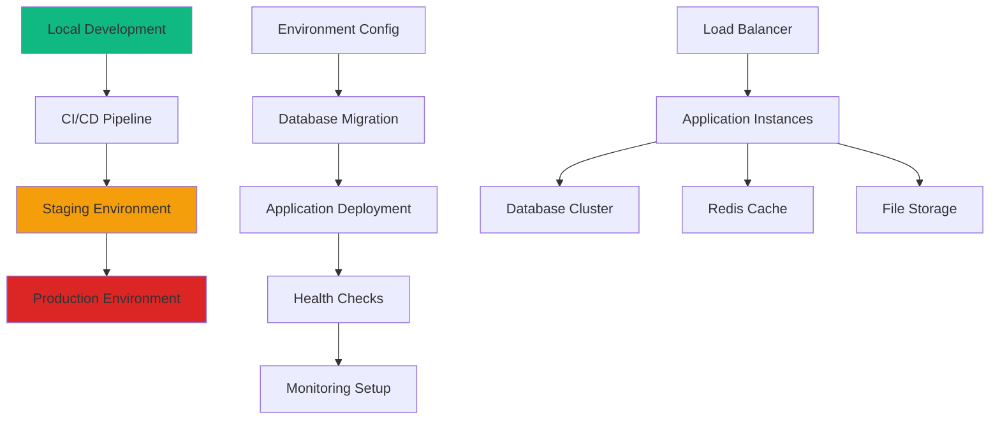

# Production Deployment

## 🚀 Deployment Strategy Overview

Deploying a Node.js application with PostgreSQL and Sequelize requires careful planning for environment configuration, database management, monitoring, and scalability.



## 🏗️ Environment Configuration

### 1. Environment Variables Management

```javascript
// config/production.js - Production configuration
require('dotenv').config();

const productionConfig = {
  // Database Configuration
  database: {
    dialect: 'postgres',
    host: process.env.DB_HOST,
    port: parseInt(process.env.DB_PORT) || 5432,
    database: process.env.DB_NAME,
    username: process.env.DB_USERNAME,
    password: process.env.DB_PASSWORD,
    
    // Production-specific settings
    pool: {
      max: parseInt(process.env.DB_POOL_MAX) || 20,
      min: parseInt(process.env.DB_POOL_MIN) || 5,
      acquire: 30000,
      idle: 10000
    },
    
    dialectOptions: {
      ssl: process.env.DB_SSL === 'true' ? {
        require: true,
        rejectUnauthorized: false
      } : false
    },
    
    logging: process.env.DB_LOGGING === 'true' ? console.log : false
  },
  
  // Application Settings
  app: {
    port: parseInt(process.env.PORT) || 3000,
    env: 'production',
    cors: {
      origin: process.env.CORS_ORIGINS?.split(',') || false,
      credentials: true
    }
  },
  
  // Security Settings
  security: {
    jwtSecret: process.env.JWT_SECRET,
    jwtExpiresIn: process.env.JWT_EXPIRES_IN || '15m',
    refreshTokenExpiresIn: process.env.REFRESH_TOKEN_EXPIRES_IN || '7d',
    bcryptRounds: parseInt(process.env.BCRYPT_ROUNDS) || 12,
    sessionSecret: process.env.SESSION_SECRET,
    rateLimitWindow: parseInt(process.env.RATE_LIMIT_WINDOW) || 900000, // 15 minutes
    rateLimitMax: parseInt(process.env.RATE_LIMIT_MAX) || 100
  },
  
  // Redis Configuration
  redis: {
    host: process.env.REDIS_HOST,
    port: parseInt(process.env.REDIS_PORT) || 6379,
    password: process.env.REDIS_PASSWORD,
    db: parseInt(process.env.REDIS_DB) || 0,
    tls: process.env.REDIS_TLS === 'true' ? {} : undefined
  },
  
  // Email Service
  email: {
    service: process.env.EMAIL_SERVICE,
    host: process.env.EMAIL_HOST,
    port: parseInt(process.env.EMAIL_PORT) || 587,
    secure: process.env.EMAIL_SECURE === 'true',
    auth: {
      user: process.env.EMAIL_USER,
      pass: process.env.EMAIL_PASSWORD
    }
  },
  
  // File Storage (AWS S3)
  storage: {
    bucket: process.env.AWS_S3_BUCKET,
    region: process.env.AWS_REGION,
    accessKeyId: process.env.AWS_ACCESS_KEY_ID,
    secretAccessKey: process.env.AWS_SECRET_ACCESS_KEY
  },
  
  // Monitoring and Logging
  monitoring: {
    enabled: process.env.MONITORING_ENABLED === 'true',
    sentryDsn: process.env.SENTRY_DSN,
    datadogApiKey: process.env.DATADOG_API_KEY,
    logLevel: process.env.LOG_LEVEL || 'info'
  }
};

module.exports = productionConfig;
```

```bash
# .env.production - Production environment variables template
# Database
DB_HOST=your-postgres-host
DB_PORT=5432
DB_NAME=blog_production
DB_USERNAME=your-db-username
DB_PASSWORD=your-secure-password
DB_SSL=true
DB_POOL_MAX=20
DB_POOL_MIN=5

# Application
PORT=3000
NODE_ENV=production
CORS_ORIGINS=https://yourdomain.com,https://api.yourdomain.com

# Security
JWT_SECRET=your-super-secure-jwt-secret-min-32-chars
JWT_EXPIRES_IN=15m
REFRESH_TOKEN_EXPIRES_IN=7d
BCRYPT_ROUNDS=12
SESSION_SECRET=your-session-secret
RATE_LIMIT_WINDOW=900000
RATE_LIMIT_MAX=100

# Redis
REDIS_HOST=your-redis-host
REDIS_PORT=6379
REDIS_PASSWORD=your-redis-password
REDIS_DB=0
REDIS_TLS=true

# Email
EMAIL_SERVICE=SendGrid
EMAIL_HOST=smtp.sendgrid.net
EMAIL_PORT=587
EMAIL_SECURE=true
EMAIL_USER=apikey
EMAIL_PASSWORD=your-sendgrid-api-key

# AWS
AWS_REGION=us-east-1
AWS_S3_BUCKET=your-s3-bucket
AWS_ACCESS_KEY_ID=your-access-key
AWS_SECRET_ACCESS_KEY=your-secret-key

# Monitoring
MONITORING_ENABLED=true
SENTRY_DSN=your-sentry-dsn
DATADOG_API_KEY=your-datadog-api-key
LOG_LEVEL=info
```

### 2. Configuration Validation

```javascript
// utils/config-validator.js - Configuration validation
const Joi = require('joi');

const configSchema = Joi.object({
  database: Joi.object({
    host: Joi.string().required(),
    port: Joi.number().port().required(),
    database: Joi.string().required(),
    username: Joi.string().required(),
    password: Joi.string().required(),
    pool: Joi.object({
      max: Joi.number().min(1).max(100).required(),
      min: Joi.number().min(0).required(),
      acquire: Joi.number().positive().required(),
      idle: Joi.number().positive().required()
    }).required()
  }).required(),
  
  security: Joi.object({
    jwtSecret: Joi.string().min(32).required(),
    jwtExpiresIn: Joi.string().required(),
    refreshTokenExpiresIn: Joi.string().required(),
    bcryptRounds: Joi.number().min(10).max(15).required(),
    sessionSecret: Joi.string().min(32).required()
  }).required(),
  
  redis: Joi.object({
    host: Joi.string().required(),
    port: Joi.number().port().required(),
    password: Joi.string().optional(),
    db: Joi.number().min(0).max(15).required()
  }).required(),
  
  monitoring: Joi.object({
    enabled: Joi.boolean().required(),
    sentryDsn: Joi.string().uri().when('enabled', {
      is: true,
      then: Joi.required()
    }),
    logLevel: Joi.string().valid('error', 'warn', 'info', 'debug').required()
  }).required()
});

function validateConfig(config) {
  const { error, value } = configSchema.validate(config, {
    allowUnknown: true,
    abortEarly: false
  });
  
  if (error) {
    const details = error.details.map(detail => detail.message).join(', ');
    throw new Error(`Configuration validation failed: ${details}`);
  }
  
  return value;
}

module.exports = { validateConfig };
```

## 🐳 Docker Configuration

### 1. Multi-stage Dockerfile

```dockerfile
# Dockerfile - Multi-stage production build
FROM node:18-alpine AS base

# Install system dependencies
RUN apk add --no-cache \
    dumb-init \
    postgresql-client \
    curl

# Set working directory
WORKDIR /app

# Copy package files
COPY package.json package-lock.json ./

# Development stage
FROM base AS development
ENV NODE_ENV=development
RUN npm ci --include=dev
COPY . .
CMD ["npm", "run", "dev"]

# Build stage
FROM base AS build
ENV NODE_ENV=production

# Install all dependencies (including dev for build)
RUN npm ci --include=dev

# Copy source code
COPY . .

# Build application (if you have build step)
RUN npm run build

# Remove dev dependencies
RUN npm ci --only=production && npm cache clean --force

# Production stage
FROM node:18-alpine AS production

# Install dumb-init for proper signal handling
RUN apk add --no-cache dumb-init postgresql-client

# Create non-root user
RUN addgroup -g 1001 -S nodejs
RUN adduser -S appuser -u 1001

# Set working directory
WORKDIR /app

# Copy built application from build stage
COPY --from=build --chown=appuser:nodejs /app/node_modules ./node_modules
COPY --from=build --chown=appuser:nodejs /app/package.json ./package.json
COPY --from=build --chown=appuser:nodejs /app/dist ./dist
COPY --from=build --chown=appuser:nodejs /app/migrations ./migrations
COPY --from=build --chown=appuser:nodejs /app/seeders ./seeders
COPY --from=build --chown=appuser:nodejs /app/config ./config
COPY --from=build --chown=appuser:nodejs /app/models ./models

# Copy health check script
COPY --chown=appuser:nodejs scripts/health-check.js ./scripts/

# Switch to non-root user
USER appuser

# Expose port
EXPOSE 3000

# Health check
HEALTHCHECK --interval=30s --timeout=10s --start-period=5s --retries=3 \
  CMD node scripts/health-check.js

# Use dumb-init to handle signals properly
ENTRYPOINT ["dumb-init", "--"]

# Start application
CMD ["npm", "start"]
```

### 2. Docker Compose for Production

```yaml
# docker-compose.prod.yml - Production Docker Compose
version: '3.8'

services:
  app:
    build:
      context: .
      target: production
      dockerfile: Dockerfile
    restart: unless-stopped
    environment:
      - NODE_ENV=production
    env_file:
      - .env.production
    ports:
      - "${APP_PORT:-3000}:3000"
    depends_on:
      postgres:
        condition: service_healthy
      redis:
        condition: service_healthy
    networks:
      - app-network
    volumes:
      - ./logs:/app/logs
    healthcheck:
      test: ["CMD", "node", "scripts/health-check.js"]
      interval: 30s
      timeout: 10s
      retries: 3
      start_period: 40s

  postgres:
    image: postgres:15-alpine
    restart: unless-stopped
    environment:
      POSTGRES_DB: ${DB_NAME}
      POSTGRES_USER: ${DB_USERNAME}
      POSTGRES_PASSWORD: ${DB_PASSWORD}
    ports:
      - "${DB_PORT:-5432}:5432"
    volumes:
      - postgres_data:/var/lib/postgresql/data
      - ./scripts/init-db.sql:/docker-entrypoint-initdb.d/init-db.sql:ro
    networks:
      - app-network
    healthcheck:
      test: ["CMD-SHELL", "pg_isready -U ${DB_USERNAME} -d ${DB_NAME}"]
      interval: 10s
      timeout: 5s
      retries: 5

  redis:
    image: redis:7-alpine
    restart: unless-stopped
    command: redis-server --requirepass ${REDIS_PASSWORD}
    environment:
      - REDIS_PASSWORD=${REDIS_PASSWORD}
    ports:
      - "${REDIS_PORT:-6379}:6379"
    volumes:
      - redis_data:/data
    networks:
      - app-network
    healthcheck:
      test: ["CMD", "redis-cli", "--raw", "incr", "ping"]
      interval: 10s
      timeout: 3s
      retries: 5

  nginx:
    image: nginx:alpine
    restart: unless-stopped
    ports:
      - "80:80"
      - "443:443"
    volumes:
      - ./nginx/nginx.conf:/etc/nginx/nginx.conf:ro
      - ./nginx/ssl:/etc/nginx/ssl:ro
      - ./logs/nginx:/var/log/nginx
    depends_on:
      - app
    networks:
      - app-network

volumes:
  postgres_data:
    driver: local
  redis_data:
    driver: local

networks:
  app-network:
    driver: bridge
```

## 🔄 CI/CD Pipeline

### 1. GitHub Actions Workflow

```yaml
# .github/workflows/deploy.yml - CI/CD Pipeline
name: Deploy to Production

on:
  push:
    branches: [main]
  pull_request:
    branches: [main]

env:
  NODE_VERSION: '18'
  REGISTRY: ghcr.io
  IMAGE_NAME: ${{ github.repository }}

jobs:
  test:
    runs-on: ubuntu-latest
    
    services:
      postgres:
        image: postgres:15
        env:
          POSTGRES_PASSWORD: postgres
          POSTGRES_DB: blog_test
        options: >-
          --health-cmd pg_isready
          --health-interval 10s
          --health-timeout 5s
          --health-retries 5
        ports:
          - 5432:5432
      
      redis:
        image: redis:7
        options: >-
          --health-cmd "redis-cli ping"
          --health-interval 10s
          --health-timeout 5s
          --health-retries 5
        ports:
          - 6379:6379
    
    steps:
      - name: Checkout code
        uses: actions/checkout@v4
      
      - name: Setup Node.js
        uses: actions/setup-node@v4
        with:
          node-version: ${{ env.NODE_VERSION }}
          cache: 'npm'
      
      - name: Install dependencies
        run: npm ci
      
      - name: Run linting
        run: npm run lint
      
      - name: Run type checking
        run: npm run type-check
      
      - name: Run tests
        run: npm test
        env:
          NODE_ENV: test
          DB_HOST: localhost
          DB_PORT: 5432
          DB_NAME: blog_test
          DB_USERNAME: postgres
          DB_PASSWORD: postgres
          REDIS_HOST: localhost
          REDIS_PORT: 6379
          JWT_SECRET: test-jwt-secret-for-ci-pipeline
      
      - name: Upload test coverage
        uses: codecov/codecov-action@v3
        with:
          token: ${{ secrets.CODECOV_TOKEN }}
          files: ./coverage/lcov.info

  security:
    runs-on: ubuntu-latest
    
    steps:
      - name: Checkout code
        uses: actions/checkout@v4
      
      - name: Setup Node.js
        uses: actions/setup-node@v4
        with:
          node-version: ${{ env.NODE_VERSION }}
          cache: 'npm'
      
      - name: Install dependencies
        run: npm ci
      
      - name: Run security audit
        run: npm audit --audit-level moderate
      
      - name: Run dependency check
        uses: snyk/actions/node@master
        env:
          SNYK_TOKEN: ${{ secrets.SNYK_TOKEN }}

  build:
    runs-on: ubuntu-latest
    needs: [test, security]
    if: github.ref == 'refs/heads/main'
    
    permissions:
      contents: read
      packages: write
    
    steps:
      - name: Checkout code
        uses: actions/checkout@v4
      
      - name: Log in to Container Registry
        uses: docker/login-action@v3
        with:
          registry: ${{ env.REGISTRY }}
          username: ${{ github.actor }}
          password: ${{ secrets.GITHUB_TOKEN }}
      
      - name: Extract metadata
        id: meta
        uses: docker/metadata-action@v5
        with:
          images: ${{ env.REGISTRY }}/${{ env.IMAGE_NAME }}
          tags: |
            type=ref,event=branch
            type=ref,event=pr
            type=sha
            type=raw,value=latest,enable={{is_default_branch}}
      
      - name: Build and push Docker image
        uses: docker/build-push-action@v5
        with:
          context: .
          target: production
          push: true
          tags: ${{ steps.meta.outputs.tags }}
          labels: ${{ steps.meta.outputs.labels }}
          cache-from: type=gha
          cache-to: type=gha,mode=max

  deploy:
    runs-on: ubuntu-latest
    needs: build
    if: github.ref == 'refs/heads/main'
    
    environment:
      name: production
      url: https://api.yourdomain.com
    
    steps:
      - name: Checkout code
        uses: actions/checkout@v4
      
      - name: Deploy to production
        uses: appleboy/ssh-action@v1.0.0
        with:
          host: ${{ secrets.PRODUCTION_HOST }}
          username: ${{ secrets.PRODUCTION_USER }}
          key: ${{ secrets.PRODUCTION_SSH_KEY }}
          script: |
            cd /opt/blog-api
            
            # Pull latest code
            git pull origin main
            
            # Update environment variables
            echo "${{ secrets.PRODUCTION_ENV }}" > .env.production
            
            # Pull latest Docker image
            docker-compose -f docker-compose.prod.yml pull app
            
            # Run database migrations
            docker-compose -f docker-compose.prod.yml run --rm app npm run migrate
            
            # Deploy with zero-downtime
            docker-compose -f docker-compose.prod.yml up -d --no-deps app
            
            # Health check
            sleep 30
            curl -f http://localhost:3000/health || exit 1
            
            # Clean up old images
            docker image prune -f
      
      - name: Notify deployment status
        uses: 8398a7/action-slack@v3
        with:
          status: ${{ job.status }}
          channel: '#deployments'
          webhook_url: ${{ secrets.SLACK_WEBHOOK_URL }}
        if: always()
```

### 2. Database Migration Strategy

```javascript
// scripts/migrate.js - Production migration script
const { sequelize } = require('../models');
const { Umzug, SequelizeStorage } = require('umzug');
const path = require('path');

class ProductionMigrator {
  constructor() {
    this.umzug = new Umzug({
      migrations: {
        glob: 'migrations/*.js',
        resolve: ({ name, path: migrationPath }) => {
          const migration = require(migrationPath);
          return {
            name,
            up: async () => migration.up(sequelize.getQueryInterface(), sequelize.Sequelize),
            down: async () => migration.down(sequelize.getQueryInterface(), sequelize.Sequelize),
          };
        },
      },
      context: sequelize.getQueryInterface(),
      storage: new SequelizeStorage({ sequelize }),
      logger: console,
    });
  }
  
  async runMigrations() {
    try {
      console.log('🚀 Starting database migrations...');
      
      // Check database connection
      await sequelize.authenticate();
      console.log('✅ Database connection established');
      
      // Get pending migrations
      const pending = await this.umzug.pending();
      console.log(`📋 Found ${pending.length} pending migrations`);
      
      if (pending.length === 0) {
        console.log('✅ No migrations to run');
        return;
      }
      
      // Create backup before migration (if enabled)
      if (process.env.BACKUP_BEFORE_MIGRATE === 'true') {
        await this.createBackup();
      }
      
      // Run migrations
      const executed = await this.umzug.up();
      
      console.log('✅ Migrations completed successfully:');
      executed.forEach(migration => {
        console.log(`  - ${migration.name}`);
      });
      
    } catch (error) {
      console.error('❌ Migration failed:', error);
      
      // Rollback on failure (if enabled)
      if (process.env.ROLLBACK_ON_FAILURE === 'true') {
        await this.rollbackLastMigration();
      }
      
      process.exit(1);
    }
  }
  
  async rollbackLastMigration() {
    try {
      console.log('🔄 Rolling back last migration...');
      await this.umzug.down();
      console.log('✅ Rollback completed');
    } catch (error) {
      console.error('❌ Rollback failed:', error);
    }
  }
  
  async createBackup() {
    const timestamp = new Date().toISOString().replace(/[:.]/g, '-');
    const backupFile = `backup-${timestamp}.sql`;
    
    console.log(`📦 Creating database backup: ${backupFile}`);
    
    // Create backup using pg_dump
    const { exec } = require('child_process');
    const command = `pg_dump ${process.env.DATABASE_URL} > backups/${backupFile}`;
    
    return new Promise((resolve, reject) => {
      exec(command, (error, stdout, stderr) => {
        if (error) {
          reject(error);
        } else {
          console.log(`✅ Backup created: ${backupFile}`);
          resolve();
        }
      });
    });
  }
}

// Run migrations if called directly
if (require.main === module) {
  const migrator = new ProductionMigrator();
  migrator.runMigrations();
}

module.exports = ProductionMigrator;
```

## 📊 Monitoring and Logging

### 1. Application Monitoring

```javascript
// middleware/monitoring.js - Application monitoring middleware
const prometheus = require('prom-client');
const responseTime = require('response-time');

// Create metrics
const httpRequestDuration = new prometheus.Histogram({
  name: 'http_request_duration_seconds',
  help: 'Duration of HTTP requests in seconds',
  labelNames: ['method', 'route', 'status_code'],
  buckets: [0.1, 0.3, 0.5, 0.7, 1, 3, 5, 7, 10]
});

const httpRequestTotal = new prometheus.Counter({
  name: 'http_requests_total',
  help: 'Total number of HTTP requests',
  labelNames: ['method', 'route', 'status_code']
});

const activeConnections = new prometheus.Gauge({
  name: 'active_connections',
  help: 'Number of active connections'
});

const databaseConnections = new prometheus.Gauge({
  name: 'database_connections',
  help: 'Number of active database connections'
});

const databaseQueryDuration = new prometheus.Histogram({
  name: 'database_query_duration_seconds',
  help: 'Duration of database queries in seconds',
  labelNames: ['operation', 'table'],
  buckets: [0.01, 0.05, 0.1, 0.3, 0.5, 1, 3, 5]
});

// Monitoring middleware
function setupMonitoring(app) {
  // Response time middleware
  app.use(responseTime((req, res, time) => {
    const route = req.route ? req.route.path : req.path;
    
    httpRequestDuration
      .labels(req.method, route, res.statusCode.toString())
      .observe(time / 1000);
    
    httpRequestTotal
      .labels(req.method, route, res.statusCode.toString())
      .inc();
  }));
  
  // Metrics endpoint
  app.get('/metrics', async (req, res) => {
    try {
      // Update database connection metrics
      const pool = require('../models').sequelize.connectionManager.pool;
      databaseConnections.set(pool.used + pool.pending);
      
      res.set('Content-Type', prometheus.register.contentType);
      const metrics = await prometheus.register.metrics();
      res.end(metrics);
    } catch (error) {
      res.status(500).end(error);
    }
  });
  
  // Health check endpoint
  app.get('/health', async (req, res) => {
    const health = await performHealthChecks();
    const status = health.overall === 'healthy' ? 200 : 503;
    res.status(status).json(health);
  });
}

async function performHealthChecks() {
  const checks = {
    timestamp: new Date().toISOString(),
    overall: 'healthy',
    services: {}
  };
  
  // Database health check
  try {
    const { sequelize } = require('../models');
    await sequelize.authenticate();
    checks.services.database = {
      status: 'healthy',
      responseTime: Date.now()
    };
  } catch (error) {
    checks.services.database = {
      status: 'unhealthy',
      error: error.message
    };
    checks.overall = 'unhealthy';
  }
  
  // Redis health check
  try {
    const redis = require('../utils/redis');
    await redis.ping();
    checks.services.redis = {
      status: 'healthy',
      responseTime: Date.now()
    };
  } catch (error) {
    checks.services.redis = {
      status: 'unhealthy',
      error: error.message
    };
    checks.overall = 'unhealthy';
  }
  
  // Memory usage
  const memUsage = process.memoryUsage();
  checks.services.memory = {
    status: memUsage.heapUsed < 500 * 1024 * 1024 ? 'healthy' : 'warning', // 500MB threshold
    heapUsed: `${Math.round(memUsage.heapUsed / 1024 / 1024)}MB`,
    heapTotal: `${Math.round(memUsage.heapTotal / 1024 / 1024)}MB`
  };
  
  return checks;
}

module.exports = { setupMonitoring, databaseQueryDuration };
```

### 2. Structured Logging

```javascript
// utils/logger.js - Structured logging utility
const winston = require('winston');
const path = require('path');

// Define log format
const logFormat = winston.format.combine(
  winston.format.timestamp(),
  winston.format.errors({ stack: true }),
  winston.format.json(),
  winston.format.prettyPrint()
);

// Create logger instance
const logger = winston.createLogger({
  level: process.env.LOG_LEVEL || 'info',
  format: logFormat,
  defaultMeta: {
    service: 'blog-api',
    environment: process.env.NODE_ENV || 'development'
  },
  transports: [
    // Console transport for development
    new winston.transports.Console({
      format: winston.format.combine(
        winston.format.colorize(),
        winston.format.simple()
      )
    }),
    
    // File transports for production
    new winston.transports.File({
      filename: path.join('logs', 'error.log'),
      level: 'error',
      maxsize: 10485760, // 10MB
      maxFiles: 5
    }),
    
    new winston.transports.File({
      filename: path.join('logs', 'combined.log'),
      maxsize: 10485760, // 10MB
      maxFiles: 10
    })
  ],
  
  // Handle uncaught exceptions
  exceptionHandlers: [
    new winston.transports.File({
      filename: path.join('logs', 'exceptions.log')
    })
  ],
  
  // Handle unhandled promise rejections
  rejectionHandlers: [
    new winston.transports.File({
      filename: path.join('logs', 'rejections.log')
    })
  ]
});

// Add external logging services in production
if (process.env.NODE_ENV === 'production') {
  // Add Datadog transport
  if (process.env.DATADOG_API_KEY) {
    const DatadogWinston = require('datadog-winston');
    logger.add(new DatadogWinston({
      apiKey: process.env.DATADOG_API_KEY,
      hostname: process.env.HOSTNAME || 'unknown',
      service: 'blog-api',
      ddsource: 'nodejs'
    }));
  }
  
  // Add Sentry transport for errors
  if (process.env.SENTRY_DSN) {
    const Sentry = require('@sentry/node');
    Sentry.init({
      dsn: process.env.SENTRY_DSN,
      environment: process.env.NODE_ENV
    });
    
    // Custom Sentry transport
    logger.add(new winston.transports.Console({
      level: 'error',
      format: winston.format.printf(info => {
        if (info.level === 'error') {
          Sentry.captureException(new Error(info.message), {
            extra: info
          });
        }
        return '';
      })
    }));
  }
}

// Request logging middleware
function requestLogger(req, res, next) {
  const start = Date.now();
  
  res.on('finish', () => {
    const duration = Date.now() - start;
    
    logger.info('HTTP Request', {
      method: req.method,
      url: req.originalUrl,
      statusCode: res.statusCode,
      duration: `${duration}ms`,
      userAgent: req.get('User-Agent'),
      ip: req.ip,
      userId: req.user?.id
    });
  });
  
  next();
}

// Database query logging
function logDatabaseQuery(sql, duration, options = {}) {
  logger.debug('Database Query', {
    sql: sql.substring(0, 1000), // Truncate long queries
    duration: `${duration}ms`,
    table: options.table,
    operation: options.operation
  });
}

module.exports = {
  logger,
  requestLogger,
  logDatabaseQuery
};
```

## 🛡️ Security Hardening

### 1. Security Middleware

```javascript
// middleware/security.js - Security hardening middleware
const helmet = require('helmet');
const rateLimit = require('express-rate-limit');
const slowDown = require('express-slow-down');
const hpp = require('hpp');
const mongoSanitize = require('express-mongo-sanitize');

function setupSecurity(app) {
  // Helmet for security headers
  app.use(helmet({
    contentSecurityPolicy: {
      directives: {
        defaultSrc: ["'self'"],
        styleSrc: ["'self'", "'unsafe-inline'"],
        scriptSrc: ["'self'"],
        imgSrc: ["'self'", "data:", "https:"],
        connectSrc: ["'self'"],
        fontSrc: ["'self'"],
        objectSrc: ["'none'"],
        mediaSrc: ["'self'"],
        frameSrc: ["'none'"]
      }
    },
    hsts: {
      maxAge: 31536000,
      includeSubDomains: true,
      preload: true
    }
  }));
  
  // Rate limiting
  const limiter = rateLimit({
    windowMs: parseInt(process.env.RATE_LIMIT_WINDOW) || 15 * 60 * 1000, // 15 minutes
    max: parseInt(process.env.RATE_LIMIT_MAX) || 100,
    message: {
      error: 'Too many requests, please try again later',
      code: 'RATE_LIMIT_EXCEEDED'
    },
    standardHeaders: true,
    legacyHeaders: false,
    handler: (req, res) => {
      logger.warn('Rate limit exceeded', {
        ip: req.ip,
        userAgent: req.get('User-Agent')
      });
      res.status(429).json({
        success: false,
        error: 'Too many requests, please try again later',
        code: 'RATE_LIMIT_EXCEEDED'
      });
    }
  });
  
  app.use('/api/', limiter);
  
  // Speed limiting for suspicious behavior
  const speedLimiter = slowDown({
    windowMs: 15 * 60 * 1000, // 15 minutes
    delayAfter: 50, // Allow 50 requests per windowMs without delay
    delayMs: 500 // Add 500ms delay per request after delayAfter
  });
  
  app.use('/api/', speedLimiter);
  
  // Prevent HTTP Parameter Pollution
  app.use(hpp());
  
  // Data sanitization against NoSQL injection (works for SQL too)
  app.use(mongoSanitize());
  
  // Request size limiting
  app.use(express.json({ limit: '10mb' }));
  app.use(express.urlencoded({ limit: '10mb', extended: true }));
}

module.exports = { setupSecurity };
```

### 2. SSL/TLS Configuration

```nginx
# nginx/nginx.conf - Nginx configuration with SSL
user nginx;
worker_processes auto;
error_log /var/log/nginx/error.log warn;
pid /var/run/nginx.pid;

events {
    worker_connections 1024;
    use epoll;
    multi_accept on;
}

http {
    include /etc/nginx/mime.types;
    default_type application/octet-stream;
    
    # Logging
    log_format main '$remote_addr - $remote_user [$time_local] "$request" '
                    '$status $body_bytes_sent "$http_referer" '
                    '"$http_user_agent" "$http_x_forwarded_for"';
    
    access_log /var/log/nginx/access.log main;
    
    # Performance optimizations
    sendfile on;
    tcp_nopush on;
    tcp_nodelay on;
    keepalive_timeout 65;
    types_hash_max_size 2048;
    client_max_body_size 10M;
    
    # Gzip compression
    gzip on;
    gzip_vary on;
    gzip_min_length 1024;
    gzip_proxied any;
    gzip_comp_level 6;
    gzip_types text/plain text/css text/xml text/javascript
               application/javascript application/xml+rss application/json;
    
    # Security headers
    add_header X-Frame-Options DENY;
    add_header X-Content-Type-Options nosniff;
    add_header X-XSS-Protection "1; mode=block";
    add_header Referrer-Policy "strict-origin-when-cross-origin";
    
    # Rate limiting
    limit_req_zone $binary_remote_addr zone=api:10m rate=10r/s;
    limit_req_zone $binary_remote_addr zone=login:10m rate=5r/m;
    
    # Upstream servers
    upstream app_servers {
        least_conn;
        server app:3000 max_fails=3 fail_timeout=30s;
        # Add more servers for scaling
        # server app2:3000 max_fails=3 fail_timeout=30s;
    }
    
    # HTTP redirect to HTTPS
    server {
        listen 80;
        server_name api.yourdomain.com;
        return 301 https://$server_name$request_uri;
    }
    
    # HTTPS server
    server {
        listen 443 ssl http2;
        server_name api.yourdomain.com;
        
        # SSL configuration
        ssl_certificate /etc/nginx/ssl/cert.pem;
        ssl_certificate_key /etc/nginx/ssl/key.pem;
        ssl_protocols TLSv1.2 TLSv1.3;
        ssl_ciphers ECDHE-RSA-AES256-GCM-SHA512:DHE-RSA-AES256-GCM-SHA512:ECDHE-RSA-AES256-GCM-SHA384:DHE-RSA-AES256-GCM-SHA384;
        ssl_prefer_server_ciphers off;
        ssl_session_cache shared:SSL:10m;
        ssl_session_timeout 10m;
        
        # HSTS
        add_header Strict-Transport-Security "max-age=31536000; includeSubDomains; preload";
        
        # API routes
        location /api/ {
            limit_req zone=api burst=20 nodelay;
            
            proxy_pass http://app_servers;
            proxy_http_version 1.1;
            proxy_set_header Upgrade $http_upgrade;
            proxy_set_header Connection 'upgrade';
            proxy_set_header Host $host;
            proxy_set_header X-Real-IP $remote_addr;
            proxy_set_header X-Forwarded-For $proxy_add_x_forwarded_for;
            proxy_set_header X-Forwarded-Proto $scheme;
            proxy_cache_bypass $http_upgrade;
            
            # Timeouts
            proxy_connect_timeout 30s;
            proxy_send_timeout 30s;
            proxy_read_timeout 30s;
        }
        
        # Login rate limiting
        location /api/auth/login {
            limit_req zone=login burst=5 nodelay;
            
            proxy_pass http://app_servers;
            proxy_http_version 1.1;
            proxy_set_header Host $host;
            proxy_set_header X-Real-IP $remote_addr;
            proxy_set_header X-Forwarded-For $proxy_add_x_forwarded_for;
            proxy_set_header X-Forwarded-Proto $scheme;
        }
        
        # Health check
        location /health {
            access_log off;
            proxy_pass http://app_servers;
        }
        
        # Metrics (restrict access)
        location /metrics {
            allow 10.0.0.0/8;     # Private networks only
            allow 172.16.0.0/12;
            allow 192.168.0.0/16;
            deny all;
            
            proxy_pass http://app_servers;
        }
    }
}
```

## 🚀 Deployment Scripts

### 1. Zero-Downtime Deployment

```bash
#!/bin/bash
# scripts/deploy.sh - Zero-downtime deployment script

set -e

# Configuration
APP_NAME="blog-api"
DOCKER_IMAGE="ghcr.io/yourorg/blog-api:latest"
COMPOSE_FILE="docker-compose.prod.yml"
HEALTH_CHECK_URL="http://localhost:3000/health"
MAX_WAIT_TIME=60

echo "🚀 Starting deployment of $APP_NAME..."

# Function to check health
check_health() {
    curl -f -s "$HEALTH_CHECK_URL" > /dev/null
}

# Function to wait for health check
wait_for_health() {
    local wait_time=0
    echo "⏳ Waiting for application to be healthy..."
    
    while [ $wait_time -lt $MAX_WAIT_TIME ]; do
        if check_health; then
            echo "✅ Application is healthy"
            return 0
        fi
        
        sleep 5
        wait_time=$((wait_time + 5))
        echo "⏳ Waiting... ($wait_time/${MAX_WAIT_TIME}s)"
    done
    
    echo "❌ Health check failed after ${MAX_WAIT_TIME}s"
    return 1
}

# Backup current environment
echo "📦 Creating backup..."
docker-compose -f $COMPOSE_FILE ps > deployment-backup-$(date +%Y%m%d-%H%M%S).txt

# Pull latest image
echo "📥 Pulling latest Docker image..."
docker pull $DOCKER_IMAGE

# Run database migrations
echo "🗄️ Running database migrations..."
docker-compose -f $COMPOSE_FILE run --rm app npm run migrate

# Deploy new version with zero downtime
echo "🔄 Deploying new version..."

# Scale up new instance
docker-compose -f $COMPOSE_FILE up -d --scale app=2 --no-recreate

# Wait for new instance to be healthy
sleep 15
if ! wait_for_health; then
    echo "❌ New instance failed health check, rolling back..."
    docker-compose -f $COMPOSE_FILE down
    exit 1
fi

# Scale down old instance
docker-compose -f $COMPOSE_FILE up -d --scale app=1 --no-recreate

# Final health check
if wait_for_health; then
    echo "✅ Deployment completed successfully"
else
    echo "❌ Final health check failed"
    exit 1
fi

# Cleanup old images
echo "🧹 Cleaning up old Docker images..."
docker image prune -f

echo "🎉 Deployment completed successfully!"
```

### 2. Rollback Script

```bash
#!/bin/bash
# scripts/rollback.sh - Rollback deployment script

set -e

# Configuration
COMPOSE_FILE="docker-compose.prod.yml"
BACKUP_TAG=${1:-"previous"}

echo "⏪ Starting rollback to $BACKUP_TAG..."

# Stop current containers
echo "🛑 Stopping current containers..."
docker-compose -f $COMPOSE_FILE down

# Pull backup image
echo "📥 Pulling backup image..."
docker pull "ghcr.io/yourorg/blog-api:$BACKUP_TAG"

# Update docker-compose to use backup tag
sed -i "s|image: ghcr.io/yourorg/blog-api:.*|image: ghcr.io/yourorg/blog-api:$BACKUP_TAG|" $COMPOSE_FILE

# Start with backup image
echo "🔄 Starting with backup image..."
docker-compose -f $COMPOSE_FILE up -d

# Wait for health check
sleep 30
if curl -f -s "http://localhost:3000/health" > /dev/null; then
    echo "✅ Rollback completed successfully"
else
    echo "❌ Rollback failed - manual intervention required"
    exit 1
fi
```

## 🎯 Key Takeaways

1. **Environment Management**: Secure configuration with validation
2. **Docker**: Multi-stage builds for optimized production images
3. **CI/CD**: Automated testing, security checks, and deployment
4. **Monitoring**: Comprehensive logging and metrics collection
5. **Security**: Multiple layers of protection and hardening
6. **Zero-Downtime**: Deployment strategies to maintain availability
7. **Disaster Recovery**: Backup and rollback procedures

## 🚀 What's Next?

You've successfully deployed your application! Now explore [[21-Common-Patterns|Common Patterns & Best Practices]] to optimize your production system!

---

## 🔗 Related Topics
- [[18-Testing|Testing Strategies]]
- [[21-Common-Patterns|Common Patterns & Best Practices]]
- [[22-Troubleshooting|Troubleshooting & Debugging]]
