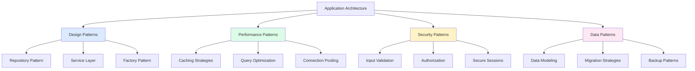

# Common Patterns & Best Practices

## 🏗️ Architectural Patterns Overview

This guide covers proven patterns and best practices for building robust, scalable applications with PostgreSQL, Sequelize, and Node.js.



## 🏛️ Repository Pattern

### 1. Base Repository Implementation

```javascript
// repositories/base.repository.js - Generic repository pattern
const { Op } = require('sequelize');

class BaseRepository {
  constructor(model) {
    this.model = model;
  }
  
  /**
   * Find entity by primary key
   */
  async findById(id, options = {}) {
    try {
      return await this.model.findByPk(id, {
        ...options,
        rejectOnEmpty: false
      });
    } catch (error) {
      throw new Error(`Failed to find ${this.model.name} by ID: ${error.message}`);
    }
  }
  
  /**
   * Find entity by ID or throw error
   */
  async findByIdOrFail(id, options = {}) {
    const entity = await this.findById(id, options);
    if (!entity) {
      throw new Error(`${this.model.name} with ID ${id} not found`);
    }
    return entity;
  }
  
  /**
   * Find all entities with pagination
   */
  async findAll(options = {}) {
    try {
      const {
        page = 1,
        limit = 10,
        sortBy = 'createdAt',
        sortOrder = 'DESC',
        filters = {},
        include = [],
        attributes,
        ...otherOptions
      } = options;
      
      const offset = (page - 1) * limit;
      const order = [[sortBy, sortOrder.toUpperCase()]];
      
      // Build where clause from filters
      const where = this.buildWhereClause(filters);
      
      const queryOptions = {
        where,
        include,
        order,
        limit: parseInt(limit),
        offset: parseInt(offset),
        distinct: true,
        ...otherOptions
      };
      
      if (attributes) {
        queryOptions.attributes = attributes;
      }
      
      const { rows: data, count: total } = await this.model.findAndCountAll(queryOptions);
      
      return {
        data,
        pagination: {
          currentPage: parseInt(page),
          totalPages: Math.ceil(total / limit),
          totalItems: total,
          itemsPerPage: parseInt(limit),
          hasNextPage: page * limit < total,
          hasPreviousPage: page > 1
        }
      };
    } catch (error) {
      throw new Error(`Failed to fetch ${this.model.name} list: ${error.message}`);
    }
  }
  
  /**
   * Find one entity by criteria
   */
  async findOne(criteria = {}, options = {}) {
    try {
      const where = this.buildWhereClause(criteria);
      return await this.model.findOne({
        where,
        ...options
      });
    } catch (error) {
      throw new Error(`Failed to find ${this.model.name}: ${error.message}`);
    }
  }
  
  /**
   * Create new entity
   */
  async create(data, options = {}) {
    try {
      return await this.model.create(data, options);
    } catch (error) {
      if (error.name === 'SequelizeValidationError') {
        throw new ValidationError('Validation failed', error.errors);
      }
      if (error.name === 'SequelizeUniqueConstraintError') {
        throw new ConflictError('Resource already exists', error.errors);
      }
      throw new Error(`Failed to create ${this.model.name}: ${error.message}`);
    }
  }
  
  /**
   * Update entity by ID
   */
  async updateById(id, data, options = {}) {
    try {
      const entity = await this.findByIdOrFail(id);
      return await entity.update(data, options);
    } catch (error) {
      if (error.name === 'SequelizeValidationError') {
        throw new ValidationError('Validation failed', error.errors);
      }
      throw new Error(`Failed to update ${this.model.name}: ${error.message}`);
    }
  }
  
  /**
   * Delete entity by ID
   */
  async deleteById(id, options = {}) {
    try {
      const entity = await this.findByIdOrFail(id);
      await entity.destroy(options);
      return entity;
    } catch (error) {
      throw new Error(`Failed to delete ${this.model.name}: ${error.message}`);
    }
  }
  
  /**
   * Bulk create entities
   */
  async bulkCreate(dataArray, options = {}) {
    try {
      return await this.model.bulkCreate(dataArray, {
        validate: true,
        returning: true,
        ...options
      });
    } catch (error) {
      throw new Error(`Failed to bulk create ${this.model.name}: ${error.message}`);
    }
  }
  
  /**
   * Count entities by criteria
   */
  async count(criteria = {}) {
    try {
      const where = this.buildWhereClause(criteria);
      return await this.model.count({ where });
    } catch (error) {
      throw new Error(`Failed to count ${this.model.name}: ${error.message}`);
    }
  }
  
  /**
   * Check if entity exists
   */
  async exists(criteria = {}) {
    const count = await this.count(criteria);
    return count > 0;
  }
  
  /**
   * Build where clause from filters
   */
  buildWhereClause(filters) {
    const where = {};
    
    Object.entries(filters).forEach(([key, value]) => {
      if (value === null || value === undefined) {
        return;
      }
      
      // Handle different filter types
      if (typeof value === 'object' && !Array.isArray(value)) {
        // Handle operators like { gt: 100 }, { in: [1, 2, 3] }
        where[key] = value;
      } else if (Array.isArray(value)) {
        // Handle array values as IN clause
        where[key] = { [Op.in]: value };
      } else if (typeof value === 'string' && value.includes('*')) {
        // Handle wildcard search
        where[key] = { [Op.like]: value.replace(/\*/g, '%') };
      } else {
        // Handle exact match
        where[key] = value;
      }
    });
    
    return where;
  }
  
  /**
   * Execute raw query
   */
  async executeQuery(sql, replacements = {}, options = {}) {
    try {
      const { sequelize } = this.model;
      return await sequelize.query(sql, {
        replacements,
        type: sequelize.QueryTypes.SELECT,
        ...options
      });
    } catch (error) {
      throw new Error(`Query execution failed: ${error.message}`);
    }
  }
}

module.exports = BaseRepository;
```

### 2. Specific Repository Implementation

```javascript
// repositories/user.repository.js - User-specific repository
const BaseRepository = require('./base.repository');
const { User, Post, Comment } = require('../models');
const { Op } = require('sequelize');

class UserRepository extends BaseRepository {
  constructor() {
    super(User);
  }
  
  /**
   * Find user by email
   */
  async findByEmail(email) {
    return await this.findOne({ email: email.toLowerCase() });
  }
  
  /**
   * Find user by username
   */
  async findByUsername(username) {
    return await this.findOne({ username: username.toLowerCase() });
  }
  
  /**
   * Find user with authentication data
   */
  async findForAuthentication(emailOrUsername) {
    const identifier = emailOrUsername.toLowerCase();
    
    return await this.model.findOne({
      where: {
        [Op.or]: [
          { email: identifier },
          { username: identifier }
        ],
        isActive: true
      },
      attributes: [
        'id', 'email', 'username', 'firstName', 'lastName',
        'passwordHash', 'role', 'permissions', 'isEmailVerified',
        'failedLoginAttempts', 'accountLockedUntil'
      ]
    });
  }
  
  /**
   * Find users with recent activity
   */
  async findActiveUsers(days = 30) {
    const since = new Date();
    since.setDate(since.getDate() - days);
    
    return await this.findAll({
      filters: {
        lastLoginAt: { [Op.gte]: since },
        isActive: true
      },
      include: [{
        model: Post,
        attributes: ['id', 'title', 'createdAt'],
        limit: 3,
        order: [['createdAt', 'DESC']]
      }],
      sortBy: 'lastLoginAt',
      sortOrder: 'DESC'
    });
  }
  
  /**
   * Find users by role with permissions
   */
  async findByRole(role, includePermissions = true) {
    const options = {
      filters: { role, isActive: true }
    };
    
    if (includePermissions) {
      options.attributes = [
        'id', 'email', 'username', 'firstName', 'lastName',
        'role', 'permissions', 'createdAt'
      ];
    }
    
    return await this.findAll(options);
  }
  
  /**
   * Search users by name or email
   */
  async searchUsers(query, options = {}) {
    const searchPattern = `%${query.toLowerCase()}%`;
    
    return await this.findAll({
      filters: {
        [Op.or]: [
          { firstName: { [Op.iLike]: searchPattern } },
          { lastName: { [Op.iLike]: searchPattern } },
          { email: { [Op.iLike]: searchPattern } },
          { username: { [Op.iLike]: searchPattern } }
        ],
        isActive: true
      },
      ...options
    });
  }
  
  /**
   * Get user statistics
   */
  async getUserStats(userId) {
    const user = await this.findByIdOrFail(userId, {
      include: [
        {
          model: Post,
          attributes: [],
          where: { status: 'published' },
          required: false
        },
        {
          model: Comment,
          attributes: [],
          required: false
        }
      ],
      attributes: [
        'id', 'username', 'firstName', 'lastName', 'createdAt',
        [this.model.sequelize.fn('COUNT', this.model.sequelize.col('Posts.id')), 'publishedPostsCount'],
        [this.model.sequelize.fn('COUNT', this.model.sequelize.col('Comments.id')), 'commentsCount']
      ],
      group: ['User.id']
    });
    
    return user;
  }
  
  /**
   * Update user last login
   */
  async updateLastLogin(userId) {
    return await this.updateById(userId, {
      lastLoginAt: new Date(),
      failedLoginAttempts: 0,
      accountLockedUntil: null
    });
  }
  
  /**
   * Increment failed login attempts
   */
  async incrementFailedLoginAttempts(userId) {
    const user = await this.findByIdOrFail(userId);
    const attempts = (user.failedLoginAttempts || 0) + 1;
    
    const updateData = { failedLoginAttempts: attempts };
    
    // Lock account after 5 failed attempts
    if (attempts >= 5) {
      const lockUntil = new Date();
      lockUntil.setMinutes(lockUntil.getMinutes() + 15); // Lock for 15 minutes
      updateData.accountLockedUntil = lockUntil;
    }
    
    return await this.updateById(userId, updateData);
  }
  
  /**
   * Get users created in date range
   */
  async findUsersInDateRange(startDate, endDate) {
    return await this.findAll({
      filters: {
        createdAt: {
          [Op.between]: [startDate, endDate]
        }
      },
      sortBy: 'createdAt',
      sortOrder: 'ASC'
    });
  }
}

module.exports = UserRepository;
```

## 🏗️ Service Layer Pattern

### 1. Base Service Implementation

```javascript
// services/base.service.js - Base service with common functionality
const { logger } = require('../utils/logger');
const { ValidationError, NotFoundError, ConflictError } = require('../utils/errors');

class BaseService {
  constructor(repository) {
    this.repository = repository;
    this.logger = logger;
  }
  
  /**
   * Find entity by ID with validation
   */
  async findById(id, options = {}) {
    try {
      if (!this.isValidId(id)) {
        throw new ValidationError('Invalid ID format');
      }
      
      const entity = await this.repository.findById(id, options);
      if (!entity) {
        throw new NotFoundError(`${this.getEntityName()} not found`);
      }
      
      return entity;
    } catch (error) {
      this.logger.error(`Failed to find ${this.getEntityName()} by ID`, {
        id,
        error: error.message
      });
      throw error;
    }
  }
  
  /**
   * Create entity with validation
   */
  async create(data, options = {}) {
    try {
      await this.validateCreateData(data);
      
      const entity = await this.repository.create(data, options);
      
      this.logger.info(`${this.getEntityName()} created`, {
        id: entity.id,
        data: this.sanitizeLogData(data)
      });
      
      return entity;
    } catch (error) {
      this.logger.error(`Failed to create ${this.getEntityName()}`, {
        data: this.sanitizeLogData(data),
        error: error.message
      });
      throw error;
    }
  }
  
  /**
   * Update entity with validation
   */
  async update(id, data, options = {}) {
    try {
      if (!this.isValidId(id)) {
        throw new ValidationError('Invalid ID format');
      }
      
      await this.validateUpdateData(data);
      
      const entity = await this.repository.updateById(id, data, options);
      
      this.logger.info(`${this.getEntityName()} updated`, {
        id,
        data: this.sanitizeLogData(data)
      });
      
      return entity;
    } catch (error) {
      this.logger.error(`Failed to update ${this.getEntityName()}`, {
        id,
        data: this.sanitizeLogData(data),
        error: error.message
      });
      throw error;
    }
  }
  
  /**
   * Delete entity
   */
  async delete(id, options = {}) {
    try {
      if (!this.isValidId(id)) {
        throw new ValidationError('Invalid ID format');
      }
      
      const entity = await this.repository.deleteById(id, options);
      
      this.logger.info(`${this.getEntityName()} deleted`, { id });
      
      return entity;
    } catch (error) {
      this.logger.error(`Failed to delete ${this.getEntityName()}`, {
        id,
        error: error.message
      });
      throw error;
    }
  }
  
  /**
   * List entities with filtering and pagination
   */
  async list(options = {}) {
    try {
      const result = await this.repository.findAll(options);
      
      this.logger.debug(`${this.getEntityName()} list retrieved`, {
        count: result.data.length,
        page: result.pagination.currentPage
      });
      
      return result;
    } catch (error) {
      this.logger.error(`Failed to list ${this.getEntityName()}`, {
        options,
        error: error.message
      });
      throw error;
    }
  }
  
  /**
   * Validate ID format
   */
  isValidId(id) {
    return id && (typeof id === 'number' || /^\d+$/.test(id));
  }
  
  /**
   * Get entity name for logging
   */
  getEntityName() {
    return this.repository.model.name || 'Entity';
  }
  
  /**
   * Sanitize data for logging (remove sensitive fields)
   */
  sanitizeLogData(data) {
    const sensitiveFields = ['password', 'passwordHash', 'token', 'secret'];
    const sanitized = { ...data };
    
    sensitiveFields.forEach(field => {
      if (sanitized[field]) {
        sanitized[field] = '[REDACTED]';
      }
    });
    
    return sanitized;
  }
  
  /**
   * Validate create data - override in child classes
   */
  async validateCreateData(data) {
    // Override in child classes
    return true;
  }
  
  /**
   * Validate update data - override in child classes
   */
  async validateUpdateData(data) {
    // Override in child classes
    return true;
  }
}

module.exports = BaseService;
```

### 2. Specific Service Implementation

```javascript
// services/post.service.js - Post service with business logic
const BaseService = require('./base.service');
const PostRepository = require('../repositories/post.repository');
const UserRepository = require('../repositories/user.repository');
const { ValidationError, ForbiddenError } = require('../utils/errors');
const slugify = require('slugify');

class PostService extends BaseService {
  constructor() {
    super(new PostRepository());
    this.userRepository = new UserRepository();
  }
  
  /**
   * Create post with slug generation
   */
  async createPost(data, userId) {
    try {
      // Verify user exists and is active
      const user = await this.userRepository.findByIdOrFail(userId);
      if (!user.isActive) {
        throw new ForbiddenError('Account is not active');
      }
      
      // Generate slug from title
      const slug = await this.generateUniqueSlug(data.title);
      
      // Calculate reading time
      const readingTime = this.calculateReadingTime(data.content);
      
      const postData = {
        ...data,
        userId,
        slug,
        readingTime,
        status: data.status || 'draft'
      };
      
      const post = await this.create(postData);
      
      // Load post with author information
      return await this.repository.findById(post.id, {
        include: [{
          model: this.userRepository.model,
          as: 'author',
          attributes: ['id', 'username', 'firstName', 'lastName']
        }]
      });
    } catch (error) {
      this.logger.error('Failed to create post', {
        userId,
        title: data.title,
        error: error.message
      });
      throw error;
    }
  }
  
  /**
   * Update post with authorization check
   */
  async updatePost(id, data, userId, userRole) {
    try {
      const post = await this.findById(id);
      
      // Check authorization
      if (post.userId !== userId && userRole !== 'admin') {
        throw new ForbiddenError('Not authorized to update this post');
      }
      
      // Regenerate slug if title changed
      if (data.title && data.title !== post.title) {
        data.slug = await this.generateUniqueSlug(data.title, id);
      }
      
      // Recalculate reading time if content changed
      if (data.content) {
        data.readingTime = this.calculateReadingTime(data.content);
      }
      
      // Set published date if status changed to published
      if (data.status === 'published' && post.status !== 'published') {
        data.publishedAt = new Date();
      }
      
      return await this.update(id, data);
    } catch (error) {
      this.logger.error('Failed to update post', {
        id,
        userId,
        error: error.message
      });
      throw error;
    }
  }
  
  /**
   * Publish post
   */
  async publishPost(id, userId, userRole) {
    return await this.updatePost(id, {
      status: 'published',
      publishedAt: new Date()
    }, userId, userRole);
  }
  
  /**
   * Unpublish post
   */
  async unpublishPost(id, userId, userRole) {
    return await this.updatePost(id, {
      status: 'draft',
      publishedAt: null
    }, userId, userRole);
  }
  
  /**
   * Get published posts with filtering
   */
  async getPublishedPosts(options = {}) {
    const queryOptions = {
      ...options,
      filters: {
        ...options.filters,
        status: 'published'
      },
      include: [{
        model: this.userRepository.model,
        as: 'author',
        attributes: ['id', 'username', 'firstName', 'lastName']
      }]
    };
    
    return await this.list(queryOptions);
  }
  
  /**
   * Get user's posts
   */
  async getUserPosts(userId, options = {}) {
    const queryOptions = {
      ...options,
      filters: {
        ...options.filters,
        userId
      },
      include: [{
        model: this.userRepository.model,
        as: 'author',
        attributes: ['id', 'username', 'firstName', 'lastName']
      }]
    };
    
    return await this.list(queryOptions);
  }
  
  /**
   * Search posts by title and content
   */
  async searchPosts(query, options = {}) {
    return await this.repository.searchPosts(query, options);
  }
  
  /**
   * Get trending posts
   */
  async getTrendingPosts(timeframe = '7d', limit = 10) {
    return await this.repository.findTrendingPosts(timeframe, limit);
  }
  
  /**
   * Increment view count
   */
  async incrementViewCount(id) {
    try {
      const post = await this.findById(id);
      await this.update(id, {
        viewCount: (post.viewCount || 0) + 1
      });
      
      return post;
    } catch (error) {
      // Log error but don't throw - view counting is not critical
      this.logger.error('Failed to increment view count', {
        id,
        error: error.message
      });
    }
  }
  
  /**
   * Generate unique slug
   */
  async generateUniqueSlug(title, excludeId = null) {
    let baseSlug = slugify(title, {
      lower: true,
      strict: true,
      remove: /[*+~.()'"!:@]/g
    });
    
    let slug = baseSlug;
    let counter = 1;
    
    while (await this.isSlugExists(slug, excludeId)) {
      slug = `${baseSlug}-${counter}`;
      counter++;
    }
    
    return slug;
  }
  
  /**
   * Check if slug exists
   */
  async isSlugExists(slug, excludeId = null) {
    const filters = { slug };
    if (excludeId) {
      filters.id = { [require('sequelize').Op.ne]: excludeId };
    }
    
    return await this.repository.exists(filters);
  }
  
  /**
   * Calculate reading time (words per minute)
   */
  calculateReadingTime(content, wordsPerMinute = 200) {
    const wordCount = content.trim().split(/\s+/).length;
    return Math.ceil(wordCount / wordsPerMinute);
  }
  
  /**
   * Validate create data
   */
  async validateCreateData(data) {
    if (!data.title || data.title.trim().length === 0) {
      throw new ValidationError('Title is required');
    }
    
    if (!data.content || data.content.trim().length === 0) {
      throw new ValidationError('Content is required');
    }
    
    if (data.title.length > 255) {
      throw new ValidationError('Title must be less than 255 characters');
    }
    
    if (data.excerpt && data.excerpt.length > 500) {
      throw new ValidationError('Excerpt must be less than 500 characters');
    }
    
    const validStatuses = ['draft', 'published', 'archived'];
    if (data.status && !validStatuses.includes(data.status)) {
      throw new ValidationError('Invalid status');
    }
  }
  
  /**
   * Validate update data
   */
  async validateUpdateData(data) {
    if (data.title !== undefined) {
      if (!data.title || data.title.trim().length === 0) {
        throw new ValidationError('Title cannot be empty');
      }
      if (data.title.length > 255) {
        throw new ValidationError('Title must be less than 255 characters');
      }
    }
    
    if (data.content !== undefined) {
      if (!data.content || data.content.trim().length === 0) {
        throw new ValidationError('Content cannot be empty');
      }
    }
    
    if (data.excerpt && data.excerpt.length > 500) {
      throw new ValidationError('Excerpt must be less than 500 characters');
    }
    
    const validStatuses = ['draft', 'published', 'archived'];
    if (data.status && !validStatuses.includes(data.status)) {
      throw new ValidationError('Invalid status');
    }
  }
}

module.exports = PostService;
```

## ⚡ Caching Strategies

### 1. Redis Cache Manager

```javascript
// utils/cache.js - Comprehensive cache management
const Redis = require('ioredis');
const { logger } = require('./logger');

class CacheManager {
  constructor() {
    this.redis = new Redis({
      host: process.env.REDIS_HOST,
      port: process.env.REDIS_PORT,
      password: process.env.REDIS_PASSWORD,
      db: process.env.REDIS_DB || 0,
      retryDelayOnFailover: 100,
      maxRetriesPerRequest: 3,
      lazyConnect: true
    });
    
    this.redis.on('error', (error) => {
      logger.error('Redis connection error', { error: error.message });
    });
    
    this.redis.on('connect', () => {
      logger.info('Redis connected successfully');
    });
    
    // Default TTL values (in seconds)
    this.defaultTTL = {
      short: 5 * 60,      // 5 minutes
      medium: 30 * 60,    // 30 minutes
      long: 60 * 60,      // 1 hour
      extraLong: 24 * 60 * 60  // 24 hours
    };
  }
  
  /**
   * Get cached value
   */
  async get(key) {
    try {
      const value = await this.redis.get(key);
      if (value === null) {
        return null;
      }
      
      try {
        return JSON.parse(value);
      } catch {
        return value; // Return as string if not JSON
      }
    } catch (error) {
      logger.error('Cache get error', { key, error: error.message });
      return null; // Fail gracefully
    }
  }
  
  /**
   * Set cached value
   */
  async set(key, value, ttl = this.defaultTTL.medium) {
    try {
      const serializedValue = typeof value === 'string' ? value : JSON.stringify(value);
      await this.redis.setex(key, ttl, serializedValue);
      
      logger.debug('Cache set', { key, ttl });
    } catch (error) {
      logger.error('Cache set error', { key, error: error.message });
    }
  }
  
  /**
   * Delete cached value
   */
  async del(key) {
    try {
      await this.redis.del(key);
      logger.debug('Cache deleted', { key });
    } catch (error) {
      logger.error('Cache delete error', { key, error: error.message });
    }
  }
  
  /**
   * Delete multiple keys by pattern
   */
  async delByPattern(pattern) {
    try {
      const keys = await this.redis.keys(pattern);
      if (keys.length > 0) {
        await this.redis.del(...keys);
        logger.debug('Cache pattern deleted', { pattern, count: keys.length });
      }
    } catch (error) {
      logger.error('Cache pattern delete error', { pattern, error: error.message });
    }
  }
  
  /**
   * Check if key exists
   */
  async exists(key) {
    try {
      return await this.redis.exists(key) === 1;
    } catch (error) {
      logger.error('Cache exists error', { key, error: error.message });
      return false;
    }
  }
  
  /**
   * Increment counter
   */
  async incr(key, ttl = this.defaultTTL.long) {
    try {
      const value = await this.redis.incr(key);
      if (value === 1) {
        // Set TTL only for new keys
        await this.redis.expire(key, ttl);
      }
      return value;
    } catch (error) {
      logger.error('Cache increment error', { key, error: error.message });
      return 0;
    }
  }
  
  /**
   * Get or set pattern (cache-aside)
   */
  async getOrSet(key, fetchFunction, ttl = this.defaultTTL.medium) {
    try {
      // Try to get from cache first
      let value = await this.get(key);
      
      if (value === null) {
        // Cache miss - fetch from source
        value = await fetchFunction();
        
        if (value !== null && value !== undefined) {
          await this.set(key, value, ttl);
        }
      }
      
      return value;
    } catch (error) {
      logger.error('Cache getOrSet error', { key, error: error.message });
      // Fall back to direct fetch
      return await fetchFunction();
    }
  }
  
  /**
   * Invalidate cache for specific entity
   */
  async invalidateEntity(entityType, entityId) {
    const patterns = [
      `${entityType}:${entityId}`,
      `${entityType}:${entityId}:*`,
      `${entityType}:list:*`,
      `search:${entityType}:*`
    ];
    
    for (const pattern of patterns) {
      await this.delByPattern(pattern);
    }
  }
  
  /**
   * Invalidate all caches for entity type
   */
  async invalidateEntityType(entityType) {
    await this.delByPattern(`${entityType}:*`);
    await this.delByPattern(`search:${entityType}:*`);
  }
  
  /**
   * Cache key builders
   */
  buildKey(...parts) {
    return parts.filter(Boolean).join(':');
  }
  
  buildEntityKey(entityType, entityId) {
    return this.buildKey(entityType, entityId);
  }
  
  buildListKey(entityType, filters = {}) {
    const filterString = Object.keys(filters)
      .sort()
      .map(key => `${key}=${filters[key]}`)
      .join('&');
    
    return this.buildKey(entityType, 'list', filterString || 'all');
  }
  
  buildSearchKey(entityType, query, filters = {}) {
    const filterString = Object.keys(filters)
      .sort()
      .map(key => `${key}=${filters[key]}`)
      .join('&');
    
    return this.buildKey('search', entityType, query, filterString);
  }
  
  /**
   * Close Redis connection
   */
  async close() {
    await this.redis.quit();
  }
}

// Singleton instance
const cacheManager = new CacheManager();

/**
 * Cache decorator for methods
 */
function cache(keyBuilder, ttl = 300) {
  return function(target, propertyName, descriptor) {
    const method = descriptor.value;
    
    descriptor.value = async function(...args) {
      const key = keyBuilder.apply(this, args);
      
      return await cacheManager.getOrSet(
        key,
        () => method.apply(this, args),
        ttl
      );
    };
    
    return descriptor;
  };
}

module.exports = {
  cacheManager,
  cache,
  CacheManager
};
```

### 2. Cache Implementation in Services

```javascript
// services/cached-post.service.js - Service with caching
const PostService = require('./post.service');
const { cacheManager } = require('../utils/cache');

class CachedPostService extends PostService {
  
  /**
   * Get post by ID with caching
   */
  async findById(id, options = {}) {
    const cacheKey = cacheManager.buildEntityKey('post', id);
    
    return await cacheManager.getOrSet(
      cacheKey,
      () => super.findById(id, options),
      cacheManager.defaultTTL.medium
    );
  }
  
  /**
   * Get published posts with caching
   */
  async getPublishedPosts(options = {}) {
    const cacheKey = cacheManager.buildListKey('post', {
      status: 'published',
      page: options.page || 1,
      limit: options.limit || 10,
      sortBy: options.sortBy || 'publishedAt'
    });
    
    return await cacheManager.getOrSet(
      cacheKey,
      () => super.getPublishedPosts(options),
      cacheManager.defaultTTL.short
    );
  }
  
  /**
   * Search posts with caching
   */
  async searchPosts(query, options = {}) {
    const cacheKey = cacheManager.buildSearchKey('post', query, {
      page: options.page || 1,
      limit: options.limit || 10
    });
    
    return await cacheManager.getOrSet(
      cacheKey,
      () => super.searchPosts(query, options),
      cacheManager.defaultTTL.short
    );
  }
  
  /**
   * Get trending posts with caching
   */
  async getTrendingPosts(timeframe = '7d', limit = 10) {
    const cacheKey = cacheManager.buildKey('post', 'trending', timeframe, limit);
    
    return await cacheManager.getOrSet(
      cacheKey,
      () => super.getTrendingPosts(timeframe, limit),
      cacheManager.defaultTTL.long
    );
  }
  
  /**
   * Create post and invalidate cache
   */
  async createPost(data, userId) {
    const post = await super.createPost(data, userId);
    
    // Invalidate related caches
    await this.invalidatePostCaches();
    
    return post;
  }
  
  /**
   * Update post and invalidate cache
   */
  async updatePost(id, data, userId, userRole) {
    const post = await super.updatePost(id, data, userId, userRole);
    
    // Invalidate specific post cache
    await cacheManager.invalidateEntity('post', id);
    
    // If status changed, invalidate list caches
    if (data.status) {
      await this.invalidatePostCaches();
    }
    
    return post;
  }
  
  /**
   * Delete post and invalidate cache
   */
  async delete(id, options = {}) {
    const post = await super.delete(id, options);
    
    // Invalidate all related caches
    await cacheManager.invalidateEntity('post', id);
    await this.invalidatePostCaches();
    
    return post;
  }
  
  /**
   * Increment view count (cached counter)
   */
  async incrementViewCount(id) {
    const counterKey = cacheManager.buildKey('post', id, 'views');
    const viewCount = await cacheManager.incr(counterKey, cacheManager.defaultTTL.extraLong);
    
    // Update database every 10 views to reduce DB writes
    if (viewCount % 10 === 0) {
      try {
        const post = await super.findById(id);
        await super.update(id, {
          viewCount: (post.viewCount || 0) + 10
        });
      } catch (error) {
        this.logger.error('Failed to sync view count to database', {
          id,
          error: error.message
        });
      }
    }
    
    return viewCount;
  }
  
  /**
   * Invalidate post-related caches
   */
  async invalidatePostCaches() {
    await cacheManager.delByPattern('post:list:*');
    await cacheManager.delByPattern('search:post:*');
    await cacheManager.delByPattern('post:trending:*');
  }
}

module.exports = CachedPostService;
```

## 🔒 Security Patterns

### 1. Input Validation Middleware

```javascript
// middleware/validation.js - Comprehensive input validation
const Joi = require('joi');
const { ValidationError } = require('../utils/errors');

// Custom Joi extensions
const customJoi = Joi.extend({
  type: 'password',
  base: Joi.string(),
  messages: {
    'password.tooWeak': 'Password must contain at least one uppercase letter, one lowercase letter, one number, and one special character'
  },
  rules: {
    strong: {
      validate(value, helpers) {
        const strongPasswordRegex = /^(?=.*[a-z])(?=.*[A-Z])(?=.*\d)(?=.*[@$!%*?&])[A-Za-z\d@$!%*?&]+$/;
        if (!strongPasswordRegex.test(value)) {
          return helpers.error('password.tooWeak');
        }
        return value;
      }
    }
  }
});

// Common validation schemas
const commonSchemas = {
  id: Joi.number().integer().positive().required(),
  email: Joi.string().email().max(255).lowercase().required(),
  username: Joi.string().alphanum().min(3).max(30).lowercase().required(),
  password: customJoi.password().min(8).max(128).strong().required(),
  pagination: Joi.object({
    page: Joi.number().integer().min(1).default(1),
    limit: Joi.number().integer().min(1).max(100).default(10)
  }),
  sorting: Joi.object({
    sortBy: Joi.string().max(50).default('createdAt'),
    sortOrder: Joi.string().valid('ASC', 'DESC', 'asc', 'desc').default('DESC')
  }),
  dateRange: Joi.object({
    startDate: Joi.date().iso(),
    endDate: Joi.date().iso().min(Joi.ref('startDate'))
  })
};

// Schema definitions
const schemas = {
  // User schemas
  userRegistration: Joi.object({
    firstName: Joi.string().trim().min(1).max(50).required(),
    lastName: Joi.string().trim().min(1).max(50).required(),
    email: commonSchemas.email,
    username: commonSchemas.username,
    password: commonSchemas.password
  }),
  
  userLogin: Joi.object({
    email: Joi.string().trim().required(), // Allow username or email
    password: Joi.string().required()
  }),
  
  userUpdate: Joi.object({
    firstName: Joi.string().trim().min(1).max(50),
    lastName: Joi.string().trim().min(1).max(50),
    email: commonSchemas.email.optional(),
    username: commonSchemas.username.optional()
  }),
  
  changePassword: Joi.object({
    currentPassword: Joi.string().required(),
    newPassword: commonSchemas.password
  }),
  
  // Post schemas
  postCreation: Joi.object({
    title: Joi.string().trim().min(1).max(255).required(),
    content: Joi.string().trim().min(1).required(),
    excerpt: Joi.string().trim().max(500),
    tags: Joi.array().items(Joi.string().trim().max(50)).max(10),
    category: Joi.string().trim().max(100),
    status: Joi.string().valid('draft', 'published').default('draft'),
    metadata: Joi.object().max(10) // Limit metadata keys
  }),
  
  postUpdate: Joi.object({
    title: Joi.string().trim().min(1).max(255),
    content: Joi.string().trim().min(1),
    excerpt: Joi.string().trim().max(500).allow(''),
    tags: Joi.array().items(Joi.string().trim().max(50)).max(10),
    category: Joi.string().trim().max(100),
    status: Joi.string().valid('draft', 'published', 'archived'),
    metadata: Joi.object().max(10)
  }),
  
  // Comment schemas
  commentCreation: Joi.object({
    content: Joi.string().trim().min(1).max(1000).required(),
    postId: commonSchemas.id
  }),
  
  commentUpdate: Joi.object({
    content: Joi.string().trim().min(1).max(1000).required()
  }),
  
  // Query schemas
  postQuery: Joi.object({
    ...commonSchemas.pagination,
    ...commonSchemas.sorting,
    status: Joi.string().valid('draft', 'published', 'archived'),
    tags: Joi.string().pattern(/^[\w,]+$/), // Comma-separated tags
    category: Joi.string().max(100),
    authorId: Joi.number().integer().positive(),
    search: Joi.string().max(255)
  }),
  
  userQuery: Joi.object({
    ...commonSchemas.pagination,
    ...commonSchemas.sorting,
    role: Joi.string().valid('user', 'admin', 'moderator'),
    isActive: Joi.boolean(),
    search: Joi.string().max(255),
    ...commonSchemas.dateRange
  })
};

// Validation middleware factory
function validate(schemaName, source = 'body') {
  return (req, res, next) => {
    const schema = schemas[schemaName];
    if (!schema) {
      return next(new Error(`Validation schema '${schemaName}' not found`));
    }
    
    const data = source === 'query' ? req.query : 
                  source === 'params' ? req.params : req.body;
    
    const { error, value } = schema.validate(data, {
      abortEarly: false,
      stripUnknown: true,
      convert: true
    });
    
    if (error) {
      const details = error.details.map(detail => ({
        field: detail.path.join('.'),
        message: detail.message,
        code: detail.type
      }));
      
      return next(new ValidationError('Validation failed', details));
    }
    
    // Replace the original data with validated/sanitized data
    if (source === 'query') {
      req.query = value;
    } else if (source === 'params') {
      req.params = value;
    } else {
      req.body = value;
    }
    
    next();
  };
}

// Sanitization helpers
function sanitizeHtml(text) {
  // Remove HTML tags and potential XSS
  return text
    .replace(/<script\b[^<]*(?:(?!<\/script>)<[^<]*)*<\/script>/gi, '')
    .replace(/<[^>]*>/g, '')
    .trim();
}

function sanitizeFileName(filename) {
  // Remove dangerous characters from filenames
  return filename
    .replace(/[^a-zA-Z0-9._-]/g, '')
    .substring(0, 255);
}

// Rate limiting validation
function validateRateLimit(windowMs, maxRequests) {
  return (req, res, next) => {
    const key = `rate_limit:${req.ip}:${req.route.path}`;
    // Implementation would use Redis for distributed rate limiting
    next();
  };
}

module.exports = {
  validate,
  schemas,
  commonSchemas,
  sanitizeHtml,
  sanitizeFileName,
  validateRateLimit,
  customJoi
};
```

### 2. Authorization Middleware

```javascript
// middleware/authorization.js - Role-based access control
const { ForbiddenError, UnauthorizedError } = require('../utils/errors');
const jwt = require('jsonwebtoken');
const UserRepository = require('../repositories/user.repository');

class AuthorizationManager {
  constructor() {
    this.userRepository = new UserRepository();
  }
  
  /**
   * Authenticate JWT token
   */
  authenticate() {
    return async (req, res, next) => {
      try {
        const authHeader = req.headers.authorization;
        if (!authHeader || !authHeader.startsWith('Bearer ')) {
          throw new UnauthorizedError('Access token required');
        }
        
        const token = authHeader.substring(7);
        const decoded = jwt.verify(token, process.env.JWT_SECRET);
        
        // Get user from database to ensure account is still active
        const user = await this.userRepository.findById(decoded.id);
        if (!user || !user.isActive) {
          throw new UnauthorizedError('Account not found or inactive');
        }
        
        // Check if account is locked
        if (user.accountLockedUntil && user.accountLockedUntil > new Date()) {
          throw new UnauthorizedError('Account is locked');
        }
        
        req.user = user;
        next();
      } catch (error) {
        if (error.name === 'JsonWebTokenError') {
          next(new UnauthorizedError('Invalid token'));
        } else if (error.name === 'TokenExpiredError') {
          next(new UnauthorizedError('Token expired'));
        } else {
          next(error);
        }
      }
    };
  }
  
  /**
   * Check if user has required role
   */
  requireRole(requiredRoles) {
    return (req, res, next) => {
      if (!req.user) {
        return next(new UnauthorizedError('Authentication required'));
      }
      
      const userRoles = Array.isArray(req.user.role) ? req.user.role : [req.user.role];
      const roles = Array.isArray(requiredRoles) ? requiredRoles : [requiredRoles];
      
      const hasRole = roles.some(role => userRoles.includes(role));
      
      if (!hasRole) {
        return next(new ForbiddenError('Insufficient permissions'));
      }
      
      next();
    };
  }
  
  /**
   * Check if user has specific permission
   */
  requirePermission(requiredPermissions) {
    return (req, res, next) => {
      if (!req.user) {
        return next(new UnauthorizedError('Authentication required'));
      }
      
      // Admin has all permissions
      if (req.user.role === 'admin') {
        return next();
      }
      
      const userPermissions = req.user.permissions || [];
      const permissions = Array.isArray(requiredPermissions) ? requiredPermissions : [requiredPermissions];
      
      const hasPermission = permissions.some(permission => 
        userPermissions.includes(permission) || userPermissions.includes('*')
      );
      
      if (!hasPermission) {
        return next(new ForbiddenError('Insufficient permissions'));
      }
      
      next();
    };
  }
  
  /**
   * Check if user owns the resource
   */
  requireOwnership(resourceService, idParam = 'id') {
    return async (req, res, next) => {
      try {
        if (!req.user) {
          return next(new UnauthorizedError('Authentication required'));
        }
        
        // Admin can access all resources
        if (req.user.role === 'admin') {
          return next();
        }
        
        const resourceId = req.params[idParam];
        const resource = await resourceService.findById(resourceId);
        
        if (!resource) {
          return next(new NotFoundError('Resource not found'));
        }
        
        if (resource.userId !== req.user.id) {
          return next(new ForbiddenError('You can only access your own resources'));
        }
        
        req.resource = resource;
        next();
      } catch (error) {
        next(error);
      }
    };
  }
  
  /**
   * Optional authentication (doesn't fail if no token)
   */
  optionalAuthenticate() {
    return async (req, res, next) => {
      try {
        const authHeader = req.headers.authorization;
        if (!authHeader || !authHeader.startsWith('Bearer ')) {
          return next(); // No token provided, continue without user
        }
        
        const token = authHeader.substring(7);
        const decoded = jwt.verify(token, process.env.JWT_SECRET);
        
        const user = await this.userRepository.findById(decoded.id);
        if (user && user.isActive) {
          req.user = user;
        }
        
        next();
      } catch (error) {
        // Ignore token errors for optional authentication
        next();
      }
    };
  }
  
  /**
   * Rate limiting by user
   */
  rateLimitByUser(maxRequests = 100, windowMs = 15 * 60 * 1000) {
    return async (req, res, next) => {
      if (!req.user) {
        return next();
      }
      
      const key = `rate_limit:user:${req.user.id}`;
      // Implementation would use Redis for rate limiting
      // For now, just pass through
      next();
    };
  }
  
  /**
   * Check if user can perform action on resource
   */
  can(action, resourceType) {
    return async (req, res, next) => {
      try {
        if (!req.user) {
          return next(new UnauthorizedError('Authentication required'));
        }
        
        const canPerform = await this.checkPermission(req.user, action, resourceType, req.resource);
        
        if (!canPerform) {
          return next(new ForbiddenError(`Cannot ${action} ${resourceType}`));
        }
        
        next();
      } catch (error) {
        next(error);
      }
    };
  }
  
  /**
   * Check permission logic
   */
  async checkPermission(user, action, resourceType, resource = null) {
    // Admin can do everything
    if (user.role === 'admin') {
      return true;
    }
    
    // Check specific permissions
    const permission = `${action}:${resourceType}`;
    if (user.permissions && user.permissions.includes(permission)) {
      return true;
    }
    
    // Check ownership for user's own resources
    if (resource && resource.userId === user.id) {
      const ownPermissions = ['read', 'update', 'delete'];
      return ownPermissions.includes(action);
    }
    
    // Check role-based permissions
    const rolePermissions = this.getRolePermissions(user.role);
    return rolePermissions.includes(permission);
  }
  
  /**
   * Get permissions for role
   */
  getRolePermissions(role) {
    const permissions = {
      user: [
        'read:posts',
        'create:posts',
        'read:comments',
        'create:comments'
      ],
      moderator: [
        'read:posts',
        'create:posts',
        'update:posts',
        'read:comments',
        'create:comments',
        'update:comments',
        'delete:comments'
      ],
      admin: ['*'] // All permissions
    };
    
    return permissions[role] || [];
  }
}

// Create singleton instance
const authManager = new AuthorizationManager();

module.exports = {
  authenticate: authManager.authenticate.bind(authManager),
  requireRole: authManager.requireRole.bind(authManager),
  requirePermission: authManager.requirePermission.bind(authManager),
  requireOwnership: authManager.requireOwnership.bind(authManager),
  optionalAuthenticate: authManager.optionalAuthenticate.bind(authManager),
  rateLimitByUser: authManager.rateLimitByUser.bind(authManager),
  can: authManager.can.bind(authManager),
  AuthorizationManager
};
```

## 🎯 Key Takeaways

1. **Repository Pattern**: Centralize data access logic and make it testable
2. **Service Layer**: Implement business logic separate from data access
3. **Caching Strategy**: Use Redis for performance optimization
4. **Input Validation**: Validate and sanitize all user inputs
5. **Authorization**: Implement role-based access control
6. **Error Handling**: Create consistent error responses
7. **Code Organization**: Structure code for maintainability and scalability

## 🚀 What's Next?

You've learned essential patterns for building robust applications! Finally, explore [[22-Troubleshooting|Troubleshooting & Debugging]] to handle issues in production!

---

## 🔗 Related Topics
- [[19-Production-Deployment|Production Deployment]]
- [[22-Troubleshooting|Troubleshooting & Debugging]]
- [[README|Complete Learning Guide]]
